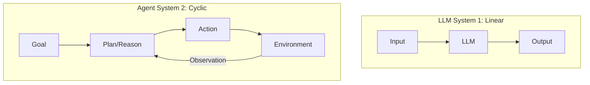

## 1.1 从大模型到智能体：范式转移

### 1.1.1 从生成式 AI 到智能体 AI

在人工智能的发展长河中，我们正经历着从“生成式 AI (Generative AI)”向“智能体 AI (Agentic AI)”的深刻转型。如果说 2023 年是 ChatGPT 惊艳世界的“对话元年”，那么 2025 年及以后将属于能够独立完成任务的 **工作助手（Work Assistant）** 和 **智能体（Agent）**。

传统的大语言模型（LLM）像是一个博学的思想家。它阅尽了互联网上的海量文本，拥有关于莎士比亚、量子物理和计算机编程的广博知识。即便是多模态模型，能够理解图像、生成语音，它们依然被困在"输入-输出"的牢笼里——无法点击鼠标、无法发送邮件、更无法感知时间的流逝。它们能"看"能"说"，却不能"做"。

**智能体 AI** 的出现打破了这一僵局。通过赋予 LLM “手”（工具）、“眼”（感知）和“记忆”，我们将这个思想家变成了一个能够与物理和数字世界互动的实干家。这种范式转移（Paradigm Shift）不仅是技术的升级，更是人机交互模式的根本性变革——我们不再是命令机器“生成一段文字”，而是授权机器“帮我达成一个目标”。

### 1.1.2 核心差异：从“下一个 Token 预测”到“目标达成”

要理解 Agent，首先要剖析它与 LLM 的本质区别。

#### 目标导向 vs. 概率预测
LLM 的训练目标是极其单一的：根据上文预测下一个 Token 的概率分布。当你问它“这种药怎么吃？”时，它并不是为了治好你的病而回答，仅仅是因为在训练数据中，这样的问题通常伴随着说明书式的回答。
相反，**智能体（Agent）** 是**目标导向**的。它内置了一个核心指令（System Prompt）："你是一个能够解决问题的助手"。当面对任务时，它不急于输出 Token，而是先思考“为了达成这个目标，我需要获取什么信息？需要执行什么步骤？”。

#### 有状态 vs. 无状态
原生的 LLM 是无状态的函数。你的每一次请求对它来说都是全新的，它不记得上一秒发生了什么（除非你把历史对话作为 Context 传给它）。
Agent 维护着持久化的**状态**。这包括：
*   **长期记忆**：记得你上周提到的过敏源。
*   **任务状态**：知道“订机票”的任务目前停留在“已搜索航班，等待用户确认”的阶段。
*   **环境状态**：知道当前目录下有哪些文件被创建了。

#### 主动循环（The Loop） vs. 单次推理
这是最显著的架构差异。
*   **LLM**：Input A -> Output B。线性，一次性。
*   **Agent**：Process(Goal) -> Thought -> Action -> Observation -> Thought -> ... -> Final Result。这是一个**循环（Loop）**。Agent 会在一个 `while` 循环中不断运行，直到它认为任务完成或达到最大尝试次数。这种“试错-修正”的能力，赋予了 Agent 解决复杂非线性问题的可能。

### 1.1.3 认知升级：系统 1 与系统 2

诺贝尔奖得主丹尼尔·卡尼曼在《思考，快与慢》中提出的双系统理论，完美地映射了 AI 的进化路径。

*   **系统 1 (System 1)**：人类的直觉思维，快速、无意识、自动化。
    *   *AI 映射*：**LLM 的直接生成**。当你问“1+1等于几”或“写一首诗”时，模型不需要深思熟虑，依赖训练数据的统计相关性瞬间生成答案。这既快又充满创造力，但也容易产生幻觉（Hallucination）。

*   **系统 2 (System 2)**：人类的逻辑思维，慢速、有意识、费力。
    *   *AI 映射*：**Agent 的规划与反思**。当要求 AI “分析这家上市公司过去五年的财报并预测股价”时，直觉（系统 1）是行不通的。AI 需要进入慢思考模式：
        1.  先拆解任务（Decomposition）。
        2.  一步步执行（Reasoning & Acting）。
        3.  检查每一步的结果是否合理（Self-Reflection）。
        4.  如果有误，回退并重试（Error Recovery）。

Agent 架构实际上是在 LLM 这个强大的“系统 1”外层，用工程手段（提示工程 Prompt Engineering, RAG, 工具使用 Tool Use）包裹了一层“系统 2”的逻辑外壳。

#### 为什么现在爆发？

Agent 的概念在几十年前的 AI 教科书（如 AIMA）中就是核心，为何直到 2023-2024 年才爆发，并在 2025-2026 年进入规模化落地？这源于三大要素的"涌现"：

1.  **推理能力的临界点**：
    早期的 AI（如 BERT, GPT-2）缺乏逻辑推理能力，无法进行有效的任务拆解。直到 GPT-3.5/GPT-4 的出现，模型展现出了强大的 **In-context Learning** 和逻辑推演能力，使得“让模型自己写计划”成为可能。

2.  **标准化的交互协议**：
    **函数调用（Function Calling / Tool Use）** 的出现是决定性的。OpenAI 将“调用外部工具”这一行为标准化为 JSON 格式的结构化数据。这让模型与现实世界的软件系统（Calculator, Search API, Database）打通了最后一公里。

3.  **记忆与上下文的扩展**：
    随着 RAG 技术和长上下文（128k, 1M+ Context Window）模型的发展，Agent 能够处理海量信息，记住复杂的规则和用户偏好，从而胜任真实场景下的工作。

> **关键论文参考**
> *   [**Language Models are Few-Shot Learners**](https://arxiv.org/abs/2005.14165) (GPT-3): 展示了 LLM 的通用潜力。
> *   [**ReAct: Synergizing Reasoning and Acting in Language Models**](https://arxiv.org/abs/2210.03629): 奠定了现代 Agent "推理-再行动" 的基础模式。

#### 2026 年行业采用数据

Agentic AI 已从概念验证进入规模化部署阶段。根据 Anthropic 2026 年企业调研（500+ 技术领袖）：

| 指标 | 数值 |
|------|------|
| 使用 AI 辅助开发的企业 | **90%** |
| 部署 Agent 生成生产代码 | **86%** |
| 报告可衡量经济回报 | **80%** |
| 部署跨阶段工作流 Agent | **57%** |

开发全周期效率提升均超过 **58%**（规划、编码、文档、测试）。

#### 本节小结

从 LLM 到 Agent，我们不仅是在优化一个模型，而是在创造一种新的**数字物种**。它们不再是被动的工具，而是具备感知、思考和行动能力的数字员工。这种转变将重塑软件开发的格局——未来的软件，可能不再是由代码写死的逻辑，而是由 Agent 动态编排的任务流。

---

**下一节**: [1.2 智能体理论基础：感知-规划-行动循环](1.2_theory.md)