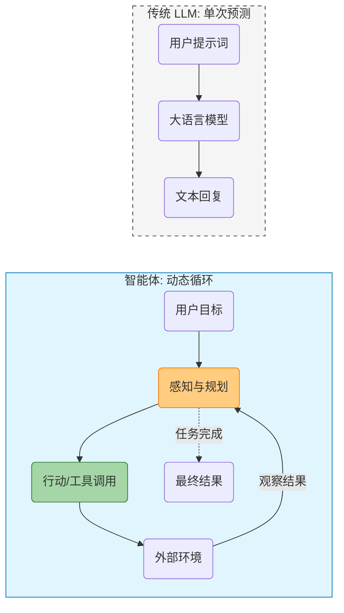

## 1.1 从大模型到智能体

### 1.1.1 从生成式 AI 到智能体 AI

在人工智能的发展长河中，我们正经历着从“生成式 AI (Generative AI)”向“智能体 AI (Agentic AI)”的深刻转型。如果说 2023 年是 ChatGPT 惊艳世界的“聊天机器人（Chatbot）元年”，那么 2025 年及以后将属于能够独立完成任务的 **工作助手（Work Assistant）** 和 **智能体**。

传统的大语言模型（LLM）像是一个博学的思想家。它阅尽了互联网上的海量文本，拥有关于莎士比亚、量子物理和计算机编程的广博知识。即便是多模态模型，能够理解图像、生成语音，它们依然被困在"输入-输出"的牢笼里——无法点击鼠标、无法发送邮件、更无法感知时间的流逝。它们能"看"能"说"，却不能"做"。

**智能体 AI** 的出现打破了这一僵局。通过赋予 LLM “手”（工具）、“眼”（感知）和“记忆”，我们将这个思想家变成了一个能够与物理和数字世界互动的实干家。这种范式转移（Paradigm Shift）不仅是技术的升级，更是人机交互模式的根本性变革——我们不再是命令机器“生成一段文字”，而是授权机器“帮我达成一个目标”。

> **图示说明**：上图展示 LLM 单次输入输出流程，下图展示智能体的目标→规划→行动→观察循环。

### 1.1.2 核心差异：从“下一个 Token 预测”到“目标达成”

要理解智能体，首先要剖析它与 LLM 的本质区别。

#### 目标导向 vs. 概率预测
LLM 的训练目标是极其单一的：根据上文预测下一个词元（Token）的概率分布。当你问它“这种药怎么吃？”时，它并不是为了治好你的病而回答，仅仅是因为在训练数据中，这样的问题通常伴随着说明书式的回答。

相反，**智能体** 是**目标导向**的。它内置了一个核心指令（系统提示词）："你是一个能够解决问题的助手"。当面对任务时，它不急于输出词元 (Token)，而是先思考“为了达成这个目标，我需要获取什么信息？需要执行什么步骤？”。

#### 有状态 vs. 无状态
原生的 LLM 是无状态的函数。你的每一次请求对它来说都是全新的，它不记得上一秒发生了什么（除非你把历史对话作为上下文传给它）。

智能体（Agent）维护着持久化的**状态**。这包括：

*   **长期记忆**：记得你上周提到的过敏源。
*   **任务状态**：知道“订机票”的任务目前停留在“已搜索航班，等待用户确认”的阶段。
*   **环境状态**：知道当前目录下有哪些文件被创建了。

#### 主动循环 vs. 单次推理
这是最显著的架构差异。
*   **LLM**：输入 A -> 输出 B。线性，一次性。
*   **智能体**：处理(目标) -> 思考 -> 行动 -> 观察 -> 思考 -> ... -> 最终结果。这是一个**循环（Loop）**。智能体会在一个 `while` 循环中不断运行，直到它认为任务完成或达到最大尝试次数。这种“试错-修正”的能力，赋予了智能体解决复杂非线性问题的可能。

### 1.1.3 认知升级：系统 1 与系统 2

诺贝尔奖得主丹尼尔·卡尼曼在《思考，快与慢》中提出的双系统理论，完美地映射了 AI 的进化路径。

*   **系统 1 (System 1)**：人类的直觉思维，快速、无意识、自动化。
    *   *AI 映射*：**LLM 的直接生成**。当你问“1+1等于几”或“写一首诗”时，模型不需要深思熟虑，依赖训练数据的统计相关性瞬间生成答案。这既快又充满创造力，但也容易产生幻觉（Hallucination）。

*   **系统 2 (System 2)**：人类的逻辑思维，慢速、有意识、费力。
    *   *AI 映射*：**智能体的规划与反思**。当要求 AI “分析这家上市公司过去五年的财报并预测股价”时，直觉（系统 1）是行不通的。AI 需要进入慢思考模式：
        1.  先拆解任务（Decomposition）。
        2.  一步步执行（Reasoning & Acting）。
        3.  检查每一步的结果是否合理（Self-Reflection）。
        4.  如果有误，回退并重试（Error Recovery）。

智能体架构实际上是在 LLM 这个强大的“系统 1”外层，用工程手段（上下文工程, 记忆系统, 工具系统）包裹了一层“系统 2”的逻辑外壳。

#### 为什么现在爆发？

智能体的概念在几十年前的 AI 教科书中就已出现，为何直到 2023-2024 年才爆发，并在 2025-2026 年进入规模化落地？这源于三大要素的"涌现"：

1.  **推理能力的临界点**：
    早期的 AI（如 BERT, GPT-2）缺乏逻辑推理能力，无法进行有效的任务拆解。直到 GPT-3.5/GPT-4 的出现，模型展现出了强大的 **上下文学习（In-context Learning）** 和逻辑推演能力，使得“让模型自己写计划”成为可能。

2.  **标准化的交互协议**：
    **函数调用（Function Calling / Tool Use）** 的出现是决定性的。2023 年，OpenAI 将“调用外部工具”这一行为标准化。随后在 2024 年底至 2025 年，**MCP (Model Context Protocol)** 的发布与普及进一步统一了智能体与数据系统的连接标准，让模型与现实世界的软件系统（计算器、搜索引擎、数据库）打通了最后一公里。

3.  **记忆与上下文的扩展**：
    随着 RAG 技术和长上下文 (128k, 1M+ Context Window) 模型的发展，智能体能够处理海量信息，记住复杂的规则和用户偏好，从而胜任真实场景下的工作。

#### 行业现状：从“玩具”到“生产力基石”

到了 2026 年，智能体 AI 已经不再是实验室里的概念验证，而是成为了企业软件开发的标准配置。根据 **Anthropic 2025 年内部技术调研** 及 **2026 Agentic Coding Trends Report** [^1] 对 500 多位技术领袖的调研数据，我们看到了从"尝试"到"依赖"的质变：

*   **普及率极高**：**90%** 的企业已在辅助开发中常态化使用 AI。
*   **深入生产环境**：不仅是写一次性脚本，**86%** 的企业已部署智能体生成**生产级代码**。
*   **真实的 ROI**：**80%** 的企业报告了可衡量的经济回报，证明了其商业价值。
*   **企业级落地**：**2026 年 Q1**，超过 **35%** 的 Fortune 500 企业已将“规划→执行→复盘”全链条 Agent 引入核心软件交付流程。
*   **驾驭高复杂度**：**57%** 的企业成功部署了**跨阶段工作流**（如自动完成“需求分析 -> 代码实现 -> 测试覆盖”的全流程）。

这意味着，软件开发全周期的效率提升已超过 **58%**。智能体正在重塑我们构建软件的方式。

[^1]: 数据来源综合自 Anthropic Internal Survey (Aug 2025) 及 2026 Agentic Coding Trends Report。

### 1.1.4 关键里程碑

回顾过去几年，我们可以清晰地看到智能体进化的加速度：

*   **2023 年：Chatbot 元年**
    *   ChatGPT 爆发，Plugin 系统初探工具使用。
    *   AutoGPT 等开源项目展示了由 LLM 自主循环的可能性。

*   **2024 年：架构成型与推理提升**
    *   **OpenAI o1 Preview (Sep)**: 引入强化学习驱动的思维链 (CoT)，极大提升了复杂规划能力。
    *   **Anthropic Computer Use Beta (Oct)**: Claude 3.5 Sonnet 获得直接操作计算机 GUI 的能力，无需 API 即可使用任意软件。
    *   **MCP (Model Context Protocol) (Nov)**: Anthropic 发布 MCP 标准，试图统一 AI 与数据源的连接协议。

*   **2025 年：标准化与生产化**
    *   **OpenAI o1 Pro / o3 & DeepSeek-R1**: 推理增强模型推动 L2-L4 智能体自我规划能力进一步提升。
    *   **MCP v1.0 / v1.1**: Agentic AI Foundation 在 2025.11 发布 MCP v1.1 草案，统一规划器、记忆、工具的接口定义，成为跨平台连接的标准。
    *   **多智能体协作框架成熟**: 自动化营销、软件工程等垂直领域的多智能体系统开始在企业内规模化部署。

*   **2026 年：生态互操作与标准化**
    *   **Claude Opus 4.6 (Feb)**: 引入 1M Token 上下文窗口与 Agentic Coding 专用能力，在 Terminal-Bench 2.0 上刷新 SOTA。
    *   **GPT-5.3 Codex (Feb)**: OpenAI 发布新一代代码模型，进一步强化了端到端的复杂系统构建能力。
    *   **统一工具调用协议**: 不同模型厂商之间的工具定义格式已趋于统一。
    *   **Agent-to-Agent (A2A) 网络**: 异构智能体之间开始能够通过标准协议进行互相发现与协作，形成了初步的"智能体互联网"。

---

**下一节**: [1.2 智能体理论基础：感知-规划-行动循环](1.2_theory.md)
