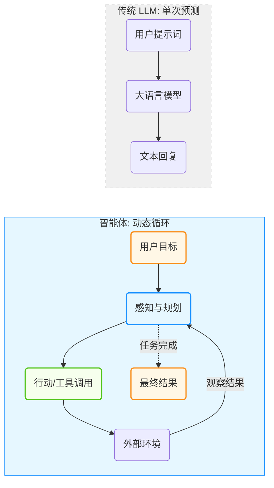

## 1.1 从大模型到智能体

本节将深入探讨从 **生成式 AI** 向 **智能体 AI** 的演进过程，并剖析二者的核心差异——即从单纯的“下一个 Token 预测”转向以“目标达成”为导向的能力跃迁。

### 1.1.1 从生成式 AI 到智能体 AI

在人工智能的发展长河中，正经历着从“生成式 AI (Generative AI)”向“智能体 AI (Agentic AI)”的深刻转型。如果说“聊天机器人”让大众看到大模型的对话能力，那么“智能体”强调的是能够独立完成任务的 **工作助手**。

传统的大语言模型（LLM）像是一个博学的思想家。它阅尽了互联网上的海量文本，拥有关于莎士比亚、量子物理和计算机编程的广博知识。即便是多模态模型，能够理解图像、生成语音，它们依然被困在"输入-输出"的牢笼里——无法点击鼠标、无法发送邮件、更无法感知时间的流逝。它们能"看"能"说"，却不能"做"。

**智能体 AI** 的出现打破了这一僵局。通过赋予 LLM “手”（工具）、“眼”（感知）和“记忆”，将这个思想家变成了一个能够与物理和数字世界互动的实干家。这种范式转移（Paradigm Shift）不仅是技术的升级，更是人机交互模式的根本性变革——不再是命令机器“生成一段文字”，而是授权机器“帮我达成一个目标”。

图 1-1：传统 LLM 与智能体架构对比

### 1.1.2 核心差异：从“下一个 Token 预测”到“目标达成”

要理解智能体，首先要剖析它与 LLM 的本质区别。

#### 目标导向与概率预测

LLM 的训练目标是极其单一的：根据上文预测下一个词元（Token）的概率分布。当你问它“这种药怎么吃？”时，它并不是为了治好你的病而回答，仅仅是因为在训练数据中，这样的问题通常伴随着说明书式的回答。

相反，**智能体**是**目标导向** 的。它内置了一个核心指令（系统提示词）："你是一个能够解决问题的助手"。当面对任务时，它不急于输出词元 (Token)，而是先思考“为了达成这个目标，我需要获取什么信息？需要执行什么步骤？”。

#### 有状态与无状态

原生的 LLM 是无状态的函数。你的每一次请求对它来说都是全新的，它不记得上一秒发生了什么（除非你把历史对话作为上下文传给它）。

智能体（Agent）维护着持久化的 **状态**。这包括：

* **长期记忆**：记得你上周提到的过敏源。
* **任务状态**：知道“订机票”的任务目前停留在“已搜索航班，等待用户确认”的阶段。
* **环境状态**：知道当前目录下有哪些文件被创建了。

#### 主动循环与单次推理

这是最显著的架构差异。
* **LLM**：输入 A -> 输出 B。线性，一次性。
* **智能体**：处理(目标) -> 思考 -> 行动 -> 观察 -> 思考 -> ... -> 最终结果。这是一个 **循环（Loop）**。智能体会在一个 `while` 循环中不断运行，直到它认为任务完成或达到最大尝试次数。这种“试错-修正”的能力，赋予了智能体解决复杂非线性问题的可能。

### 1.1.3 认知升级：系统 1 与系统 2

诺贝尔奖得主丹尼尔·卡尼曼在《思考，快与慢》中提出的双系统理论，完美地映射了 AI 的进化路径。

* **系统 1 (System 1)**：人类的直觉思维，快速、无意识、自动化。
    *   *AI 映射*：**LLM 的直接生成**。当你问“1+1等于几”或“写一首诗”时，模型不需要深思熟虑，依赖训练数据的统计相关性瞬间生成答案。这既快又充满创造力，但也容易产生幻觉（Hallucination）。

* **系统 2 (System 2)**：人类的逻辑思维，慢速、有意识、费力。
    *   *AI 映射*：**智能体的规划与反思**。当要求 AI “分析这家上市公司过去五年的财报并预测股价”时，直觉（系统 1）是行不通的。AI 需要进入慢思考模式：
        1.  先拆解任务（Decomposition）。
        2.  一步步执行（Reasoning & Acting）。
        3.  检查每一步的结果是否合理（Self-Reflection）。
        4.  如果有误，回退并重试（Error Recovery）。

智能体架构实际上是在 LLM 这个强大的“系统 1”外层，用工程手段（上下文工程, 记忆系统, 工具系统）包裹了一层“系统 2”的逻辑外壳。

#### 为什么现在爆发？

智能体的概念在几十年前的 AI 教科书中就已出现，为何直到近几年才爆发，并进入规模化落地？这源于三大要素的“涌现”：

1. **推理能力的临界点**：
    早期的模型推理与规划能力有限，难以进行有效的任务拆解；随着模型能力提升，**上下文学习（In-context Learning）** 与多步推演变得更可靠，使得“让模型自己写计划”成为可能。

2. **标准化的交互协议**：
    **函数调用（Function Calling / Tool Use）** 的出现是决定性的。工具调用机制逐步标准化；随后也出现了用于统一“模型—工具/数据源”连接方式的协议实践，让模型与现实世界的软件系统（计算器、搜索引擎、数据库）更容易打通。

3. **记忆与上下文的扩展**：
    随着 RAG 技术与更长上下文窗口的发展，智能体能够处理海量信息，记住复杂的规则和用户偏好，从而胜任真实场景下的工作。

#### 行业现状：从“玩具”到“生产力基石”

智能体 AI 已经不再只是实验室里的概念验证，而是在许多团队中逐步进入生产。从行业实践来看，企业对智能体的使用正在从“尝试”走向“依赖”。下面的描述仅用于说明趋势：

* **从辅助到端到端**：从写脚本、生成代码片段，逐步走向可在约束下执行"规划→执行→复盘"的闭环任务。
* **从单点提效到流程再造**：价值不只在"写得更快"，还在把需求、实现、测试、发布的工作流连起来。
* **从个人工具到组织能力**：当团队开始统一提示词、工具权限、评审与可观测性，智能体才可能稳定进入生产。
* **ROI 取决于治理**：收益通常与安全策略、权限边界、失败兜底、成本监控等工程化投入强相关。
这意味着，软件开发全周期的效率提升正在从“点状提效”走向“系统性提效”。智能体正在重塑我们构建软件的方式。

### 1.1.4 关键里程碑

回顾过去几年，可以清晰地看到智能体进化的加速度：

* **早期阶段：Chatbot 元年**
    *   对话式大模型广泛普及，工具使用开始进入大众视野。
    *   AutoGPT 等开源项目展示了由 LLM 自主循环的可能性。

* **架构成型与推理提升**
    * **推理增强模型的出现**：更强的推理与规划能力让复杂任务拆解与多步执行更可靠。
    * **计算机使用能力（Computer Use）**：模型开始能在受控环境下操作 GUI，提高端到端任务闭环能力。
    * **统一的工具/上下文协议探索**：业界出现了将模型与外部数据源、工具连接标准化的协议尝试。

* **标准化与生产化**
    * **推理增强模型**：推理增强模型推动更强的自我规划与多步执行能力。
    * **协议逐步走向工程化**：工具、资源、提示模板等接口开始被规范化，降低跨系统集成成本。
    * **多智能体协作框架成熟**: 自动化营销、软件工程等垂直领域的多智能体系统开始在企业内规模化部署。

* **生态互操作与标准化**
    * **长上下文与计算机使用能力**：更多模型开始提供更长上下文与更强的工具/计算机操作能力，推动端到端任务成功率提升。
    * **代码专用模型持续演进**：代码能力更强的模型推动"从需求到可运行系统"的自动化程度提升。
    * **互操作性增强**：不同平台的工具定义与调用方式逐渐趋同，生态更易迁移与复用。

### 1.1.5 核心演进总结

从早期的实验性 Demo 到成熟的企业级基础设施，智能体 AI 在连接方式、决策逻辑、安全控制和协作模式四个维度上经历了根本性的重构。以下是这一演进路径的详细对比：

#### 1. 连接方式：从“自定义 API”到“工具连接协议”

* **传统 (2024以前)**： 开发者需要为每个工具手动编写调用代码（如 `get_weather_api()`）。每增加一个工具，都要写一遍描述、参数格式和错误处理。这种硬编码方式就像在家里每买一个电器，都要重新拉一条专线。
* **最新进展**：工具连接协议逐步形成一套更标准化的接口形态。
    * **标准化**：工具提供方以更统一的方式暴露资源、工具与提示模板，降低二次开发成本。
    * **动态发现**：智能体不再死记硬背每个 API，而是在运行时发现“你能提供什么数据？格式是什么？权限边界在哪里？”。

#### 2. 决策逻辑：从“简单路由”到“认知架构”

* **传统 (2024以前)**： 核心逻辑是 **Router (分发器)**。模型根据用户的一句话，在 A、B、C 三个工具中选一个。如果任务涉及多个步骤，模型很容易在中间步骤“断片”，因为它没有长期的记忆和自我修正能力。
* **最新进展**： **认知架构 (Cognitive Architecture)** 借鉴了人类大脑的分工。
    * **慢思考 (System 2)**： 引入了类似“推理增强”的强化学习/蒸馏路线。智能体在调用技能前会先进行“思维链 (CoT)”规划，预演可能的后果。
    * **分层规划**： 顶层负责设定目标（Goal），中层负责拆解策略（Strategy），底层才去触发具体的原子技能。
    * **自我进化**： 智能体拥有“反思内存”，它会记录：“上次用 SQL 技能查表失败是因为没加引号”，下次它会自动规避这个错误。

#### 3. 安全控制：从“Prompt 约束”到“独立策略引擎”

* **传统 (2024以前)**： 靠 System Prompt 叮嘱智能体：“你千万不能删除数据库”。这种“嘴控”防御极易被指令注入 (Prompt Injection) 攻破。
* **最新进展**：引入独立的策略引擎与权限系统。
    * **硬拦截**： 安全规则不在模型里，而在运行环境（Sandbox）里。即便模型“发疯”想删库，策略层会因为其身份（Agent ID）权限不足而直接拦截 API 请求。
    * **零信任架构**： 智能体的每一次技能调用都被视为潜在风险，需要实时校验上下文。例如：智能体只能在“处理财务报表”的上下文中访问财务接口，平时则会被物理隔离。

#### 4. 协作模式：从“单体多技能”到“MAS + 编排工作流”

* **传统 (2024以前)**： 试图创造一个“全能智能体”。这导致 Context Window（上下文窗口）被上百个技能描述塞满，模型变得极其迟钝且容易产生幻觉。
* **最新进展**： **多智能体协作 (MAS, Multi-Agent Systems)** 成为主流。
    * **社会化分工**： 任务被分配给“经理智能体”、“文案智能体”和“代码审核智能体”。每个智能体只掌握 3-5 个核心技能，精度极高。
    * **编排工作流**：开发者通过图式工作流等方式定义智能体之间的互动流（如：如果 A 审核不通过，强制退回 B 重写）。这种模式结合了程序的确定性和智能体系统的灵活性。

#### 核心演进总结表

| 维度 | 痛点| 解决方案 | 关键技术词 |
| :--- | :--- | :--- | :--- |
| **集成** | 烟囱式开发，扩展难 | 工业级协议实践，趋向即插即用 | Tool-aware |
| **智商** | 走一步看一步，易出错 | 三思而后行，分层思考 | Reasoning LLM, Reflection |
| **安全** | 容易被“忽悠”，防不住 | 权限隔离，硬性审计 | Policy as Code, Zero Trust |
| **效率** | 臃肿、思维混乱 | 小而美，协同作战 | MAS, State-sharing |

---

**下一节**: [1.2 智能体理论基础](1.2_theory.md)
