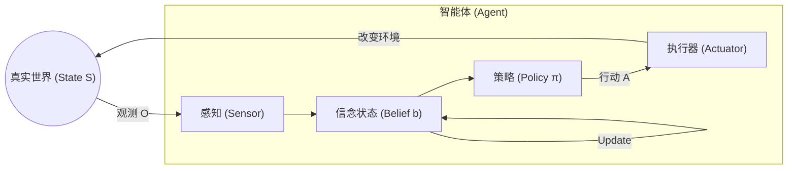

## 1.2 智能体理论基础

在动手写代码之前，我们需要构建坚实的理论地基。为什么给大模型加上“所有格”和“循环”就能变成智能体？其背后的数学和逻辑基础是什么？

本节将从人工智能宏观理论出发，推导出智能体的核心运行机制，并解释这些枯燥的理论是如何映射到现代智能体架构设计中的。

### 1.2.1 智能体的第一性原理：理性与效用

Stuart Russell 和 Peter Norvig 在 1995 年出版的经典教材《人工智能：一种现代方法》(AIMA) 中定义了 AI 的核心目标：构建 **理性智能体 (Rational Agent)**。

#### 什么是“理性”？

在 AI 理论中，“理性”并不等同于人类的情感理智或全知全能，而是有着严格的数学定义。一个理性智能体是指：**“对于每一个可能的感知序列，根据已知的感知序列和内置的知识，选择能使其预期效用 (Expected Utility) 最大化的行动。”**

这可以用一个简化的决策公式来表示：

$$ a^* = \arg\max_{a \in A} \mathbb{E}[U(s') | s, a] $$

其中：
*   $a^*$ 是最优行动。
*   $s$ 是当前状态，$a$ 是候选行动。
*   $s'$ 是执行行动后可能到达的新状态。
*   $U(s')$ 是新状态的**效用值 (Utility)**。

#### 从强化学习到大模型智能体

在传统的强化学习 (RL) 中，我们需要显式地定义**奖励函数 (Reward Function)** 来计算效用（例如：赢了得 1 分，输了扣 1 分）。

而在 **LLM 智能体** 中，这个“效用函数”发生了有趣的演变：
*   **隐式效用**：经过 RLHF（基于人类反馈的强化学习）训练的模型，其内部已经内化了符合人类价值观的效用函数。
*   **指令即目标**：系统提示词 (System Prompt)“你是一个帮助用户写代码的助手”定义了**当前任务的效用边界**。智能体生成的行动如果符合该人设和目标，就被视为“高效用”。

> **设计启示**：设计智能体的提示词 (Prompt) 时，本质上是在定义 $U(s)$。如果你的提示词模糊不清，智能体就无法计算出哪个行动 $a$ 能带来最大效用，从而导致行为混乱。

### 1.2.2 核心循环：从 MDP 到 POMDP

智能体与其环境的交互，在数学上通常被建模为 **马尔可夫决策过程 (MDP)**。但在真实世界应用中，它更准确地是一个 **部分可观测马尔可夫决策过程 (POMDP)**。

#### 1. 为什么是“部分可观测”？

*   **MDP (上帝视角)**：智能体能看到世界的**全部**状态。例如下围棋，棋盘上的一切都是公开透明的。
*   **POMDP (真实世界)**：智能体只能看到世界的**一部分**。
    *   **例子**：一个编码智能体只能读取它打开的那几个文件，看不到其它文件，也看不到运行时的内存状态。它只能通过 `ls` 或 `read_file` 等工具获得局部观测 (Observation)。

#### 2. “记忆”的理论本质：状态估算 (State Estimation)

在 POMDP 中，仅凭当前的观测 $O_t$ 是无法决策的。根据观测，智能体可以构建和维护对世界的猜测（即“我认为现在的世界是什么样的”），即 **信念状态 (Belief State)**。

$$ b_t = f(b_{t-1}, a_{t-1}, o_t) $$

*   $b_t$：当前的信念状态。
*   $o_t$：最新的观测。

**具体示例**：假设一个编程智能体正在分析项目依赖：
- **$b_0$（初始信念）**："我不知道这个项目用什么框架。"
- **$a_0$（行动）**：执行 `read_file("requirements.txt")`
- **$o_1$（观测）**：文件内容显示 `flask==2.0.1, sqlalchemy>=1.4`
- **$b_1$（更新后的信念）**："这是一个使用 Flask 和 SQLAlchemy 的 Python Web 项目。"

这解释了为什么 **上下文 (Context)** 在智能体系统中如此重要。上下文不仅仅是聊天记录，它是 **信念状态 $b_t$ 的文本化表示**。
*   当智能体把“运行报错信息”加入上下文时，它就在更新它的信念状态（从“代码是完美的”更新为“代码第 5 行有 Bug”）。
*   **记忆即状态**：RAG 和长上下文窗口的本质，就是为了让智能体在部分可观测的世界中，尽可能构建出完整的状态全貌，从而把 POMDP 问题近似成简单的 MDP 问题来处理。

### 1.2.3 决策架构：从反应式到认知式

根据丹尼尔·卡尼曼的《思考，快与慢》，人类思维分为系统 1（快）和系统 2（慢）。智能体设计也经历了类似的进化。

#### 1. 反应式架构 (Reflex Agent) —— 系统 1
*   **原理**：感知 -> 行动。
*   **公式**：$Action = Policy(State)$
*   **表现**：你问一句，LLM 答一句。没有内部独白，没有思考过程。这是标准 LLM 的默认行为（预测下个 Token）。
*   **局限**：无法解决需要多步推理的复杂问题。

#### 2. 认知式/审慎架构 (Deliberative Agent) —— 系统 2
*   **原理**：感知 -> **构建模型 -> 规划/推理** -> 行动。
*   **引入“思考时间”**：在输出行动之前，先进行内部的计算。
*   **思维链 (CoT) 的理论意义**：思维链不仅仅是一种提示词技巧，它在理论上通过生成中间 Token，增加了模型用于计算当前问题的**测试时计算量 (Test-Time Compute)**。
    *   它将 $P(y|x)$ 拆解为 $P(z|x) P(y|x, z)$，其中 $z$ 是中间推理步骤。
    *   通过这种方式，非结构化的推理过程被显式化、结构化了。

### 1.2.4 环境建模：PEAS 框架的现代演绎

在设计 Agent 之前，必须先分析它所处的**环境**。PEAS (Performance, Environment, Actuators, Sensors) 是经典的分析框架，在 LLM 时代依然适用且必要。

| 维度 | 定义 | 现代 Agent 设计考量 |
| :--- | :--- | :--- |
| **P**erformance | **性能度量** | 也就是“目标函数”。不仅是提示词中的指令，还包括**评估指标**（如代码通过率、对话轮数、API 消耗成本）。**没有量化指标，就无法优化 Agent。** |
| **E**nvironment | **环境** | 决定了架构复杂度。 • **完全/部分可观测**：是否需要强记忆模块？ • **确定/随机**：工具调用失败是否需要重试机制？ • **静态/动态**：智能体思考时环境会变吗（如股票市场）？ |
| **A**ctuators | **执行器** | 智能体的“手”。在 LLM 时代，这就是 **Tools / Function Calling**。所有的输出（文本、JSON、API 请求）都是行动。 |
| **S**ensors | **传感器** | 智能体的“眼”。提示词 (Prompt) 的输入部分。除了用户文字，还可以是图像（Vision）、LSP 报错信息、网页 DOM 树等。 |

### 1.2.5 理论到设计的映射

最后，我们将上述理论概念与现代智能体的工程组件做一一映射，以此打通理论与实践的任督二脉。

| 经典 AI 理论概念 | 现代 LLM Agent组件 | 说明 |
| :--- | :--- | :--- |
| **策略函数 Policy $\pi(a\|s)$** | **LLM (Transformer)** | 给定上下文 $s$，预测下一个最优 Token (行动 $a$)。 |
| **信念状态 Belief State $b_t$** | **Context Window / Memory** | 维护当前对话历史、变量状态、环境观测的文本快照。 |
| **规划 Planning / Search** | **Chain-of-Thought (CoT)** | 通过生成自然语言的推理步骤，模拟搜索和规划过程。 |
| **感知 Perception $o_t$** | **Prompts (System + User)** | 将多模态信号（视觉、代码、日志）编码为 Token 序列。 |
| **行动 Action $a_t$** | **Function Calling** | 也就是工具调用。输出特定的 Token 序列来触发外部代码执行。 |
| **环境反馈 Reward $r_t$** | **Tool Outputs / Feedback** | 工具执行的结果、编译器报错、用户点赞/批评。 |

### 本节小结

智能体并非 LLM 的简单应用，而是将 LLM 作为核心计算单元（大脑/策略网络），置入经典的 **“感知-认知-行动”** 闭环中。
*   **理论上**，它是一个在部分可观测环境中追求效用最大化的 POMDP 求解器。
*   **架构上**，它通过 Context 构建状态，通过 CoT 实现系统 2 思考，通过 Tool 扩展行动边界。

理解了这些，你就会明白为什么 Agent 总是容易“死循环”或“幻觉”——这往往不仅是模型不够聪明，更是因为我们在 **状态观测 (S)** 或 **反馈机制 (R)** 的设计上出现了缺失，导致 POMDP 无法收敛。

---

**下一节**: [1.3 核心组件：感知、大脑与行动](1.3_components.md)