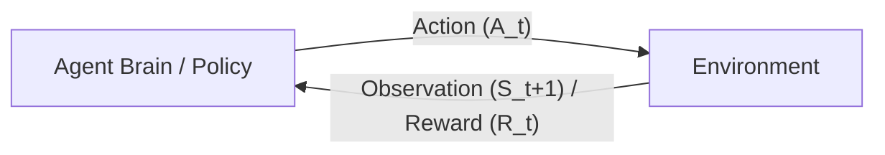
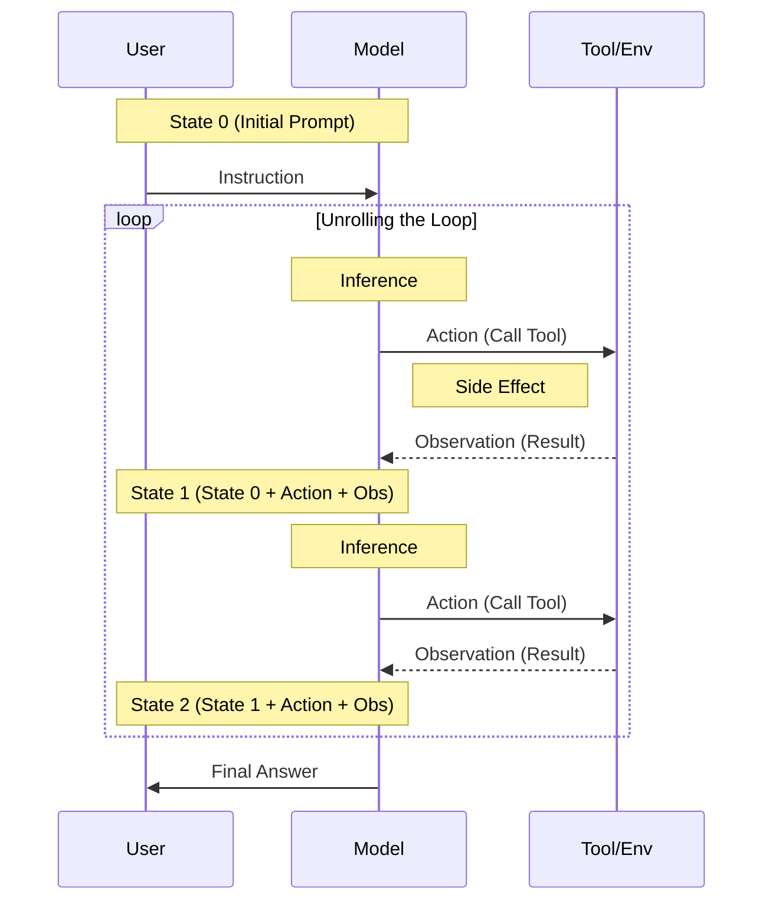

## 1.2 理论模型：理性智能体与环境交互

### 1.2.1 回归本源：理性智能体

在深入 Python 代码和各种 Agent 框架之前，我们需要回到人工智能的理论源头。Stuart Russell 和 Peter Norvig 在其被誉为 AI 圣经的教材《人工智能：一种现代方法》(AIMA) 中，构建了整个 AI 学科的基石——**理性智能体**的概念。

**什么是理性？**
在 AI 语境下，“理性”并不等同于人类的情感理智或全知全能。理性被严格定义为：**“对于每一个可能的感知序列，根据已知的感知序列和内置的知识，智能体应该选择能使其性能度量（Performance Measure）最大化的行动。”**

这个定义包含四个关键要素：
1.  **性能度量 (Performance Measure)**：这是 Agent 的 KPI。比如对于扫地机器人，KPI 是“吸入灰尘的数量”减去“消耗的电量”。对于金融 Agent，KPI 是“投资回报率”。
2.  **先验知识 (Prior Knowledge)**：Agent 出厂时自带的知识（如预训练模型中的世界知识）。
3.  **感知序列 (Percept Sequence)**：Agent 从出生到现在看到的所有东西的历史记录。
4.  **行动 (Actions)**：Agent 能做出的选择。

在 LLM Agent 中，我们通常通过 **系统提示词（System Prompt）** 来定义性能度量（“你是一个乐于助人的助手”），通过 **RAG** 和 **上下文（Context）** 提供感知序列，而 **LLM 的推理能力** 则负责计算出最优行动。

*(图示：基于强化学习框架的 Agent 交互闭坏)*

### 1.2.2 状态-动作-奖励循环

现代 Agent 的运行机制本质上是一个**马尔可夫决策过程 (MDP)** 的变体。每一轮交互都可以用一个元组 $(S_t, A_t, R_t, S_{t+1})$ 来描述：

1.  **状态观测 ($S_t$, State)**：
    Agent 看到的当前时刻的“世界切片”。在 LLM Agent 中，这通常是 Context Window 中的内容，包括：
    *   System Prompt（身份定义）
    *   Chat History（对话历史）
    *   Tool Outputs（上一轮工具执行的结果）
    
2.  **策略决策 ($A_t$, Action)**：
    Agent 根据状态 $S_t$，依据策略 $\pi(A_t|S_t)$ 选择一个动作。
    *   在传统 RL 中，$\pi$ 是一个神经网络 **策略网络（Policy Network）**。
    *   在 Agentic AI 中，$\pi$ 就是 LLM 本身。它计算 Token 的概率，决定是输出一段文本，还是调用一个 **工具函数（Function）**。

3.  **环境反馈 ($R_t$, Reward & $S_{t+1}$, Next State)**：
    环境接收动作并发生改变。
    *   **状态转移**：文件被删除了，数据库多了一条记录。Agent 观测到新的结果（工具输出 Tool Output）。
    *   **奖励信号**：环境可能给 Agent 一个显式的打分（如代码运行报错，Reward = -1；用户点赞，Reward = +1）。

这个循环（Loop）无限进行，直到任务完成。理解这个循环至关重要，因为 **Agent 的本质就是通过不断与环境交互，试图最大化累积奖励的过程**。

#### 工程视角：展开的循环 (The Unrolled Loop)

在理论上，这是一个闭环；但在工程实现（尤其是基于 LLM 的实现）中，这是一个**线性展开的时间轴**。

我们将 User (用户)、Model (模型)、Tool (工具) 视为三个交互节点。整个 Agent 的运行过程，就是 **上下文窗口（Context Window）** 随着时间推移不断“吞噬”新状态的过程：

OpenAI 在 *Unrolling the Codex Agent Loop* 中指出：**"The Agent IS the Loop."**
*   **停止序列 (Stop Sequence)**：这是控制权的“交接棒”。模型生成 `FunctionCall(...)` 后必须立即停止，将控制权交还给运行时环境（Runtime），环境执行工具并将结果追加到 Context，再唤醒模型。
*   **文件系统即记忆**：对于 **编程智能体（Coding Agent）**，文件系统的当前状态就是最大的“外部记忆”。每一次 `write_file` 都是对外部记忆的写入。

### 1.2.3 LLM 的第一性原理

理解 Agent 的行为模式，首先要理解其大脑——LLM 的工作原理。基于 First Principles（第一性原理），我们不仅要看它能做什么，更要看它**如何思考**。

#### 1. 推理即生成 (Reasoning is Generation)

LLM 没有独立于输出之外的“思考”过程。它不能先在脑海中构思好完整的谋略，然后再开口说话。它只能**边说边想**。

*   **自回归 (Autoregressive)**：模型每次只预测下一个 Token。每一个新生成的词，都立刻成为生成下一个词的“上文”。
*   **思维链（Chain-of-Thought, CoT）的本质**：为什么让模型“一步步思考”能提升效果？因为你实际上是给了它更多的**计算步骤**（即更多的 Token 生成机会）来辅助推理。CoT 只是通过生成中间步骤，展开了推理过程。

这解释了为什么 Coding Agent 容易出现“局部最优”：它是一步步续写的。如果一开始方向偏了，它会试图在错误的路径上自洽，而不是停下来全局重构（除非你显式要求它反思）。

#### 2. 上下文即全部记忆 (Context is All Memory)

对于 LLM 而言，**上下文窗口之外的内容是不存在的**。

*   它没有长期记忆（除非你通过 RAG 喂给它）。
*   它对项目的理解完全取决于你当前塞入 Context 的内容。
*   **每次会话都是“初恋 50 次”**：Agent 每次醒来（新 Session），都完全不记得昨天发生了什么。

#### 3. 概率性生成

Agent 的每一步决策都是基于概率分布采样的。这意味着：
*   **不确定性**：同样的输入可能导致不同的输出（除非 Temperature=0）。
*   **创造力与幻觉同源**：能够写出意想不到的代码，也意味着可能编造不存在的 API。

### 1.2.4 环境建模：PEAS 分析框架

在设计任何 Agent 之前，作为架构师，你必须填写一张 **PEAS** 卡片。不仅要关注 Agent 内部，更要关注它生存的外部环境。

| 维度 | 解释 (PEAS) | 示例 A：自动驾驶 Agent | 示例 B：GitHub Copilot Agent |
| :--- | :--- | :--- | :--- |
| **P**erformance | 性能度量 | 安全性、舒适度、到达时间、燃油经济性 | 代码通过率、生成速度、代码可读性、用户采用率 |
| **E**nvironment | 环境特性 | 城市道路、行人、天气、交通信号 | IDE 编辑器、Git 仓库、CI/CD 流水线、StackOverflow |
| **A**ctuators | 执行器 | 方向盘、油门、刹车、转向灯 | 插入代码 API、运行 Terminal 命令、创建文件 |
| **S**ensors | 传感器 | 摄像头、激光雷达 (LiDAR)、GPS、速度计 | 读取打开的文件、LSP (语言服务) 诊断信息、用户光标位置 |

#### 环境的复杂性维度
设计 Agent 时，环境的属性决定了算法的复杂度：
1.  **完全可观测 vs. 部分可观测**：
    国际象棋 AI 能看到整个棋盘（完全）。但大多数现实任务是**部分可观测**的。例如，Agent 无法一次性读取整个互联网，它只能通过搜索引擎“管中窥豹”。因此，Agent 需要**记忆**来拼凑世界的全貌。
    
2.  **确定性 vs. 随机性**：
    执行 `print("Hello")` 永远得到同样结果（确定性）。但调用 `fetch_url(url)` 可能超时、404 或内容变了（随机性）。Agent 必须具备**容错**和**重试**机制。

3.  **静态 vs. 动态**：
    当 Agent 思考时，世界是否在变？在回合制游戏（静态）中，Agent 可以想很久。但在自动驾驶或实时股票交易（动态）中，Agent 必须实时反应，否则环境状态就会过期。

### 1.2.5 世界模型的重要性

一个初级 Agent 是**反应式 (Reactive)** 的：看见 A，执行 B。
一个高级 Agent 拥有**世界模型 (World Model)**：它理解世界的运行规律。

*   **预测能力**：“如果我删除了这个文件，可能会导致那个编译脚本失败。” Agent 会在内心模拟行动的后果，而不是真的试一试再说。
*   **反事实推理**：“如果我刚才没有拒绝用户的请求，他现在通过了吗？”

目前的 LLM 虽然在预训练中隐式地通过海量文本学习到了物理和逻辑常识（隐式世界模型 Implicit World Model），但它们仍然缺乏对特定垂直领域的精确建模。未来的趋势是 **神经符号主义（Neuro-symbolic AI）**，将 LLM 的模糊直觉与知识图谱（Knowledge Graph）或物理引擎的精确逻辑结合，构建更强大的世界模型。

#### 本节小结
理论看似枯燥，却是区分“脚本小子”和“AI 架构师”的分水岭。当我们谈论调试 Agent 时，往往不是在调试代码语法，而是在调试它的 **PEAS 设计**是否合理，它的 **State-Action 循环**是否闭环，以及它的 **世界模型** 是否出现了偏差。

---

**下一节**: [1.3 核心组件：感知、大脑与行动](1.3_components.md)