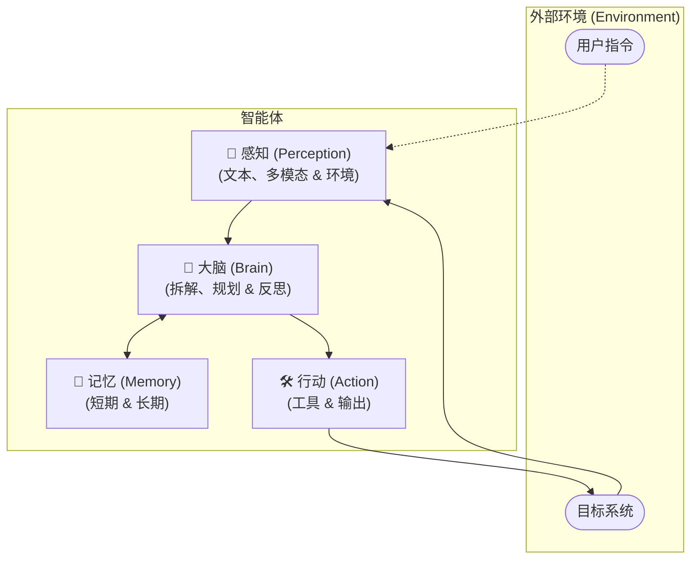

## 1.3 核心组件：大脑、感知、行动与记忆

为了构建一个功能完备的智能体，需要像做外科手术一样，将其拆解为几个相互协作的模块。Lilian Weng 在 [**LLM Powered Autonomous Agents**](https://lilianweng.github.io/posts/2023-06-23-agent/) 中提出了一个经典的架构图。

本节在此基础上，结合最新的工程实践，提出智能体的现代架构。一个现代 AI 智能体主要由四个部分组成：
1.  **大脑 (Brain)**：负责规划与决策的核心。
2.  **感知 (Perception)**：信息的输入与处理。
3.  **行动 (Action/Tools)**：与世界交互的接口。
4.  **记忆 (Memory)**：经验和知识的存储。

图 1-3：智能体核心组件架构 (Agent Core Components)

### 1.3.1 大脑：核心控制器

**大脑** 由大语言模型（LLM）扮演。它是整个系统的 CPU，所有的逻辑推理、指令遵循和决策都在这里发生。

大脑的效能主要取决于两个维度：**静态的角色设定** 决定了它的思维底色，**动态的推理能力** 决定了它的智力上限。

#### 静态维度：角色设定

角色设定可以为一个智能体提供背景信息和行为准则。

*   **身份锚定**：“你是一个拥有 10 年经验的资深 Python 架构师，性格严谨，甚至有点强迫症。” 这种设定不仅影响说话语气，甚至能提高代码质量。
*   **少样本示例（Few-shot Examples）**：大脑通过 **上下文学习（In-context Learning）** 学习。提供 3-5 个“完美互动的样本”，能让大脑迅速领悟当前的某种特定任务模式。

#### 动态维度：推理能力

推理能力是智能体区别于传统软件的关键。主要包括：

*   **任务拆解（Decomposition）**：大脑需要将用户的模糊指令（“做个贪吃蛇游戏”）拆解为原子任务列表（UI设计、逻辑实现、输入监听）。
*   **规划（Planning）**：大脑需要预判步骤的依赖关系。是先查天气还是先订酒店？
*   **反思（Reflection）**：这是一个高级功能。大脑会在输出结果前进行自我审视：“我生成的这段代码真的符合 PEP8 规范吗？是不是太复杂了？”

> **选型提示**：
> *   **GPT-5 / Claude 4 Opus**：适合充当"主脑"，处理复杂的逻辑和规划。
> *   **GPT-5-mini / Claude 4 Haiku**：适合充当"小脑"或"脊髓"，处理简单的分类、摘要或快速响应任务，成本更低。

### 1.3.2 感知：智能体的感官

感知模块负责将环境中的 **非结构化信息** 转化为大脑可以理解的 **结构化信号**（通常是文本或嵌入）。

#### 基础感知：文本输入

这是最基础的。包括用户的指令、API 返回的 JSON 数据、错误日志。

#### 高级感知：多模态

现代智能体正在长出眼睛和耳朵。

*   **视觉 (Vision)**：利用 GPT-5 或 Claude 4 的视觉能力，智能体可以"看"懂网页的 DOM 结构，识别屏幕上的按钮坐标，甚至通过看监控摄像头来判断是否有行人。
*   **听觉 (Audio)**：通过 Whisper 模型，智能体可以接入电话系统，实时转录语音并做出回应。

#### 深度感知：环境状态

对于编程智能体，感知不仅仅是看，还包括对环境的深度读取：

*   读取 IDE 当前打开的文件路径。
*   通过 `git diff` 感知代码变更。
*   通过 LSP (Language Server Protocol) 感知代码中的语法错误红线。

### 1.3.3 行动：手与工具

没有工具的智能体只是一个只会聊天的缸中之脑。**行动空间（Action Space）** 定义了智能体的能力边界。

#### 核心机制：函数调用

这是智能体与世界交互的桥梁。
1.  **定义**：开发者通过 JSON Schema 告诉 LLM 有哪些工具可用（如 `google_search`, `calculator`）。
2.  **决策**：LLM 决定调用哪个工具，并填充参数（如 `{"tool": "calculator", "args": {"expression": "50 * 12"}}`）。
3.  **执行**：智能体框架拦截这个决策，在本地执行函数，获得结果。
4.  **反馈**：将结果（"600"）填回给 LLM。

#### 能力边界：常见工具集

*   **信息检索**：Google Search, Bing Search, **向量数据库检索**。
*   **代码解释器**：Python REPL（Read-Eval-Print Loop）。这是最强大的工具，智能体可以写一段 Python 代码来画图、处理 Excel 或解复杂方程。
*   **文件操作**：Read/Write File, List Directory。
*   **系统操作**：Shell Command, Git Operations。

> **安全警示**：给智能体配备 `execute_shell` 这样的工具时要遵循 **最小权限原则**。务必在 Docker 容器或沙箱环境中运行，防止智能体误删系统文件 (`sudo rm -rf /`)。

### 1.3.4 记忆：经验的载体

LLM 本身是无状态的，**上下文窗口 (Context Window)** 是昂贵且有限的。**记忆模块** 旨在解决“健忘”问题。

#### 感觉记忆

即原始的输入流。所有的用户提示词、系统消息最开始都存储在这里。

#### 短期记忆

映射为 LLM 的 **上下文窗口**。
*   它存放当前正在进行的对话历史。
*   它就像计算机的 **RAM**，存取速度快，但断电（会话结束）即失。
*   **受限**：虽然现在的模型支持 128k 甚至 1M token，但塞入太多无关信息会降低推理精度（**中间丢失 Lost in the Middle** 现象）。

#### 长期记忆

长期记忆通常可以映射为 **向量数据库 (Vector DB)** 或外部存储。
*   它就像计算机的 **硬盘**。
*   **检索增强生成 (RAG)**：当记忆太多放不下 **上下文** 时，智能体会先在向量库中检索与当前问题最相关的几条片段，只把这几条“回忆”加载到短期记忆中。
*   **经验积累**：智能体可以将成功的案例总结成经验存入长期记忆，下次遇到类似问题时，表现会更好。

---

**下一节**: [智能体的认知层级](1.4_cognitive_levels.md)
