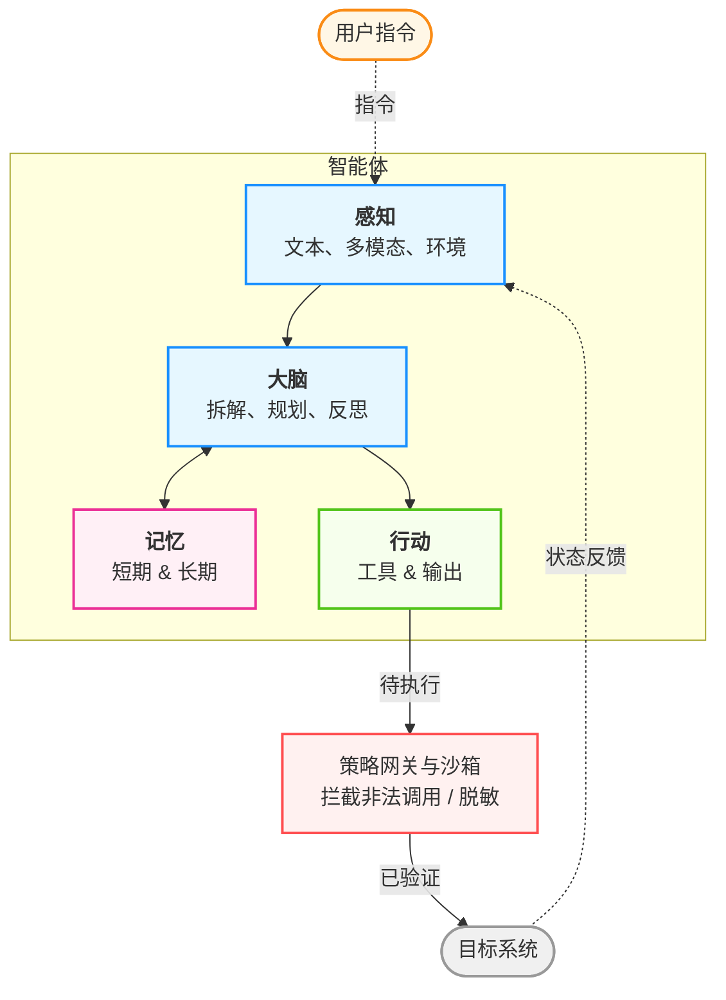

## 1.3 核心组件：大脑、感知、行动与记忆

一个功能完备的智能体，往往需要感知、规划、记忆、行动等相互协作的功能模块。

本书结合最新的工程实践，提出现代智能体的核心架构，主要包括四个部分：
1. **大脑 (Brain)**：负责规划与决策的核心。
2. **感知 (Perception)**：信息的输入与处理。
3. **行动 (Action/Tools)**：与世界交互的接口。
4. **记忆 (Memory)**：经验和知识的存储。

```mermaid
graph TD
    classDef user fill:#fff7e6,stroke:#fa8c16,stroke-width:2px;
    classDef agent fill:#e6f7ff,stroke:#1890ff,stroke-width:2px;
    classDef memory fill:#fff0f6,stroke:#eb2f96,stroke-width:2px;
    classDef tool fill:#f6ffed,stroke:#52c41a,stroke-width:2px;
    classDef tcb fill:#fff1f0,stroke:#ff4d4f,stroke-width:2px;
    classDef sys fill:#f0f0f0,stroke:#999,stroke-width:2px;

    UserNode(["用户指令"]):::user

    subgraph Core["智能体"]
        Perception["<b>感知</b><br/>文本、多模态、环境"]:::agent
        Brain["<b>大脑</b><br/>拆解、规划、反思"]:::agent
        MemoryNode["<b>记忆</b><br/>短期 & 长期"]:::memory
        Action["<b>行动</b><br/>工具 & 输出"]:::tool
    end

    Sandbox["策略网关与沙箱<br/>拦截非法调用 / 脱敏"]:::tcb
    SystemNode(["目标系统"]):::sys

    UserNode -.->|"指令"| Perception
    Perception --> Brain
    Brain <--> MemoryNode
    Brain --> Action
    Action -->|"待执行"| Sandbox
    Sandbox -->|"已验证"| SystemNode
    SystemNode -.->|"状态反馈"| Perception
```

图 1-3：智能体核心组件架构（含可信计算基）

> **注：可信计算基 (Trusted Computing Base, TCB)**
> 这是生产级智能体的必备措施。智能体虽然聪明，但也最容易被攻击和产生幻觉（非完全可信）。因此，在将行动下发至目标系统前，必须经过一层包含硬编码策略引擎、权限校验和沙箱隔离的 TCB 拦截层。

### 1.3.1 四大核心组件与思考三维框架

#### 智能体时代的思考三维框架

本书第 2–4 章详细拆解了上述四个核心组件的工程实现。但从更宏观的层面看，**Agent 时代**需要一个新的思考框架来统一目标、上下文和安全约束的工作。

黄东旭在 QCon 2026 提出，任何 Agent 相关的工作都可以归入以下三个维度：

1. **Goal（目标工程）**
   - Skill：如何定义和表达 Agent 应当掌握的工作流和领域知识
   - 人机交互：如何让用户高效地向 Agent 表达目标意图

2. **Context（上下文工程）**
   - Harness Engineering / Memory：Agent 执行时看到什么
   - RAG（检索增强生成）：如何动态获取相关信息
   - 信息环境：让 Agent 能够准确建立对任务状态的认知

3. **Constraints（约束）**
   - Sandbox：Agent 的执行边界
   - CICD/Lint：确定性检查和自动化验证
   - Agent Infra：运行时的安全、权限和可观测性

这个框架的核心洞察是：**Agent 的能力不只取决于模型的智力，更取决于这三个维度的设计完整性和平衡**。一个初创 Agent 系统可能只需关注目标和基础上下文；但要进入生产环节，约束层的成熟度往往成为瓶颈。

### 1.3.2 大脑：核心控制器

**大脑** 由大语言模型（LLM）扮演。它是整个系统的 CPU，所有的逻辑推理、指令遵循和决策都在这里发生。

大脑的效能主要取决于两个维度：**静态的角色设定** 决定了它的思维底色，**动态的推理能力** 决定了它的智力上限。

#### 静态维度：角色设定

角色设定可以为一个智能体提供背景信息和行为准则。

* **身份锚定**：“你是一个拥有 10 年经验的资深 Python 架构师，性格严谨，甚至有点强迫症。” 这种设定不仅影响说话语气，甚至能提高代码质量。
* **少样本示例（Few-shot Examples）**：大脑通过 **上下文学习（In-context Learning）** 学习。提供 3-5 个“完美互动的样本”，能让大脑迅速领悟当前的某种特定任务模式。

#### 动态维度：推理能力

推理能力是智能体区别于传统软件的关键。主要包括：

* **任务拆解（Decomposition）**：大脑需要将用户的模糊指令（“做个贪吃蛇游戏”）拆解为原子任务列表（UI设计、逻辑实现、输入监听）。
* **规划（Planning）**：大脑需要预判步骤的依赖关系。是先查天气还是先订酒店？
* **反思（Reflection）**：这是一个高级功能。大脑会在输出结果前进行自我审视：“我生成的这段代码符合最佳实践吗？”

> **选型提示**：
> * **高能力模型**：适合充当“主脑”，处理复杂的逻辑、规划与反思。
> * **轻量模型**：适合充当“小脑”或“脊髓”，处理分类、摘要、路由等轻任务，成本更低。

### 1.3.3 感知：智能体的感官

感知模块负责将环境中的 **非结构化信息** 转化为大脑可以理解的 **结构化信号**（通常是文本或嵌入）。

#### 基础感知：文本输入

这是最基础的。包括用户的指令、API 返回的 JSON 数据、错误日志。

#### 高级感知：多模态

现代智能体正在长出眼睛和耳朵。

* **视觉 (Vision)**：利用具备视觉能力的多模态模型，智能体可以“看”懂网页内容与界面元素，甚至从截图中定位按钮与表单。
* **听觉 (Audio)**：通过语音识别模型，智能体可以接入电话或会议系统，实时转录语音并做出回应。

#### 深度感知：环境状态

对于编程智能体，感知不仅仅是看，还包括对环境的深度读取：

*   读取 IDE 当前打开的文件路径。
*   通过 `git diff` 感知代码变更。
*   通过 LSP (Language Server Protocol) 感知代码中的语法错误红线。

### 1.3.4 行动：手与工具

没有工具的智能体只是一个只会聊天的缸中之脑。**行动空间（Action Space）** 定义了智能体的能力边界。智能体通过工具与外部系统交互，包括信息检索、代码执行、文件操作、系统命令等。这些工具让模型能够突破知识截止、获取实时数据、执行可靠的计算，并对真实世界产生影响。

工具使用的完整机制、类型分类与实现细节详见[第四章：工具使用与环境交互](../04_tools/README.md)。

### 1.3.5 记忆：经验的载体

LLM 本身是无状态的，**上下文窗口 (Context Window)** 是昂贵且有限的。**记忆模块** 旨在解决“健忘”问题。

#### 感觉记忆

即原始的输入流。所有的用户提示词、系统消息最开始都存储在这里。

#### 短期记忆

映射为 LLM 的 **上下文窗口**。
*   它存放当前正在进行的对话历史。
*   它就像计算机的 **RAM**，存取速度快，但断电（会话结束）即失。
* **受限**：即便一些模型支持更长的上下文窗口，塞入太多无关信息仍会降低推理精度（**中间丢失 Lost in the Middle** 现象）。

#### 长期记忆

长期记忆通常可以映射为 **向量数据库 (Vector DB)** 或外部存储。
*   它就像计算机的 **硬盘**。
* **检索增强生成 (RAG)**：当记忆太多放不下 **上下文** 时，智能体会先在向量库中检索与当前问题最相关的几条片段，只把这几条“回忆”加载到短期记忆中。
* **经验积累**：智能体可以将成功的案例总结成经验存入长期记忆，下次遇到类似问题时，表现会更好。

详见[第三章：记忆系统架构](../03_memory/README.md)。

---

**下一节**: [1.4 智能体的认知层级](1.4_cognitive_levels.md)
