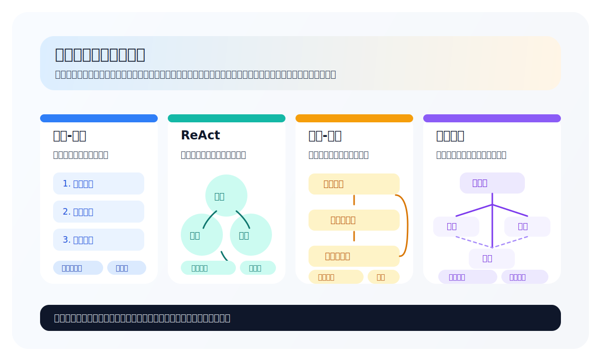
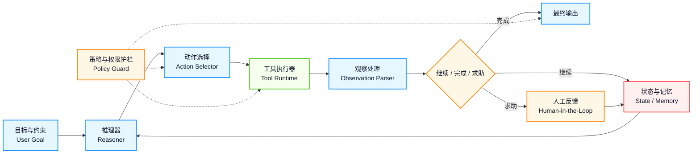

## 1.5 智能体工作流

智能体工作流（Agentic Workflow）是一类重要的 AI 应用范式。与传统的单次推理不同，它强调将 AI 能力组织成可控、可观测、可迭代的工作流程。

### 1.5.1 什么是智能体工作流

智能体工作流是一种让 AI 系统以 **迭代、自主、目标导向** 的方式完成复杂任务的工作模式。**核心特征**：

- **迭代式执行**：不是一次生成最终答案，而是多步骤逐渐逼近目标
- **自主决策**：AI 自主决定下一步行动，而非完全由用户控制
- **工具集成**：无缝调用外部工具和服务
- **状态管理**：维护执行过程中的中间状态

### 1.5.2 与传统提示词模式的区别

| 维度 | **传统提示词**|**智能体工作流** |
|------|-------------|------------------|
| 交互模式 | 单次请求-响应 | 多轮迭代执行 |
| 控制权 | 用户完全控制 | AI 自主决策 |
| 执行时间 | 毫秒～秒级 | 秒级～分钟级 |
| 能力边界 | 模型内在知识 | 工具扩展后的能力 |
| 结果质量 | 依赖 **提示词** 质量 | 可通过迭代改进 |

### 1.5.3 典型的智能体工作流模式

根据所处理任务的特点，典型的智能体工作流模式包括：`规划-执行模式`、`ReAct 模式`、`反思-改进模式`、`层级协作模式` 等。

先看一个总览图，可以把这四类模式放在同一坐标系里理解：它们的差异不在“会不会调用模型”，而在“如何组织决策、反馈与角色分工”。



图 1-4：典型智能体工作流模式总览

#### 规划-执行模式

智能体会先制定完整计划，然后逐步执行，直到达到目标。这个模式通常用于结构化任务、可预测的工作流程。

```text
用户目标
    ↓
[规划阶段] 生成任务步骤列表
    ↓
[执行阶段] 逐步执行每个步骤
    ↓
最终结果
```

**适用场景**：结构化任务、可预测的工作流程

#### ReAct 模式

ReAct（Reasoning + Acting）是推理和行动交替进行的模式。智能体在“思考”和“行动”之间交替，根据观察结果动态调整策略，直到达到目标。这种循环使智能体能够在不确定的环境中逐步逼近解决方案。

ReAct 模式的完整理论、代码示例与提示词模板详见[第 2.3 节：ReAct：推理与行动的统一](../02_reasoning/2.3_react.md)。

**适用场景**：探索性任务、需要动态调整的场景

#### 反思-改进模式

智能体会在执行后进行自我评估和改进，这个模式通常用于需要质量把控的任务。

```text
初始方案 → 执行 → 评估结果 → 反思问题 → 改进方案 → 重新执行
```

**适用场景**：代码编写、内容创作等需要质量把控的任务

#### 多智能体协作模式

多个专业化智能体分别担任不同角色，协同完成任务。这个模式通常用于复杂项目、需要多种专业技能的任务。

```text
用户需求
    ↓
[协调者智能体] 分配任务
    ↓
[研究智能体] ←→ [写作智能体] ←→ [审核智能体]
    ↓
整合输出
```

**适用场景**：复杂项目、需要多种专业技能的任务

### 1.5.4 实践案例

以下是几个典型的智能体工作流应用案例，展示了上述模式在实际产品中的落地。前 3 个案例用于说明“产品形态如何对应工作流模式”，后 2 个案例则用于说明企业实践中常见的治理与落地权衡。除非特别注明来源，下面的企业案例都只作为示意性场景，不应理解为可审计的行业统计。

#### 案例一：交互式产物视图

一些交互式界面会将“产物”与“对话”并列呈现，常见地采用 **反思-改进模式**：先生成一个可见的中间结果，再围绕这个结果反复修订。

- **即时预览**：生成代码后立即渲染展示
- **迭代改进**：用户可以要求修改，智能体理解上下文逐步完善
- **工具集成**：支持 HTML/CSS/JS、React、Mermaid 图表等

#### 案例二：AI 原生 IDE

现代 AI IDE 的代码编辑工作流常结合 **规划-执行模式** 与 **反思-改进模式**：先理解代码库和修改范围，再逐步编辑并在验证失败时回退或修正。

```text
1. 用户描述需求
2. 智能体分析代码库
3. 生成修改计划
4. 逐文件编辑
5. 自动验证（运行测试、检查类型）
6. 必要时自动修复问题
```

#### 案例三：自主软件开发智能体

自主软件开发智能体常综合运用 **ReAct** 模式和 **多智能体协作** 模式：既要在不确定环境中动态决策，也要把计划、实现、测试拆给不同角色。

- 完整的开发环境访问
- 自主执行 git 操作
- 运行测试并修复问题
- 与用户进行异步协作

#### 案例四：企业级智能体生产流程

一个更可信的企业级示意场景是：金融科技团队采用 **层级协作模式** 自动化研报生成与审查。规划智能体拆解结构，多个撰写智能体并行编写，审查智能体基于 RAG 验证合规性。其核心经验通常不是“速度提升了多少”这类脱离上下文的统一数字，而是两点：第一，防止模型幻觉需要强制工具验证；第二，通过分层智能体可以更清楚地切换成本、质量与审核强度的权衡。

#### 案例五：跨国软件团队的协作案例

另一个常见示意场景是：SaaS 团队用多智能体工作流（计划→执行→测试）加速跨时区的需求→代码→测试流程。通过 RAG 检索内部知识库确保方案合规，并在关键节点保留人工审批。它真正改善的往往是“等待成本”和“交接摩擦”，而不是某个可以脱离组织背景单独比较的统一 ROI 数字。

### 1.5.5 实现智能体工作流的关键要素

无论采用哪一种工作流模式，真正决定系统是否能稳定落地的，通常不是“提示词是否聪明”，而是状态、控制流与人机交互点有没有被显式设计出来。下面按这三个要素展开。

从工程视角看，这些要素通常会收敛到一个标准的 agent loop：推理器根据目标与状态选择动作，工具执行器与观察处理器持续更新记忆，策略护栏和人工反馈则在关键节点把循环拉回可控边界。



图 1-5：标准智能体循环的核心组件

#### 状态管理

以下示例展示一个可跟踪目标、计划、记忆和工具结果的最小状态结构：

```python
class AgentState:
    goal: str                    # 最终目标
    current_step: int            # 当前步骤
    plan: List[str]              # 执行计划
    memory: List[Message]        # 对话历史
    tool_results: Dict           # 工具调用结果
    errors: List[str]            # 错误记录
```

#### 控制流

- **循环机制**：直到达成目标或超时
- **分支判断**：根据中间结果调整路径
- **错误处理**：失败时的重试或回退策略
- **终止条件**：明确的完成标准

#### 人机交互点

- **审批节点**：关键操作前询问用户
- **信息补充**：缺少必要信息时请求输入
- **进度反馈**：实时展示执行状态

### 1.5.6 最佳实践

把工作流真正搬进生产环境时，需要同时考虑“应当鼓励什么”与“必须限制什么”。下面的建议和禁止项可以看作工作流设计的最小护栏。

#### 建议 ✅

- **设置明确的终止条件**：避免无限循环
- **实现渐进式披露**：先执行低风险操作
- **提供取消机制**：用户可随时中断
- **记录完整轨迹**：便于调试和审计

#### 禁止 ❌

- **不要过度自主**：重大决策应询问用户
- **不要忽略错误**：每个失败都应该被处理
- **不要无限重试**：设置最大尝试次数
- **不要隐藏过程**：透明度建立信任

---

**下一节**: [本章小结](summary.md)
