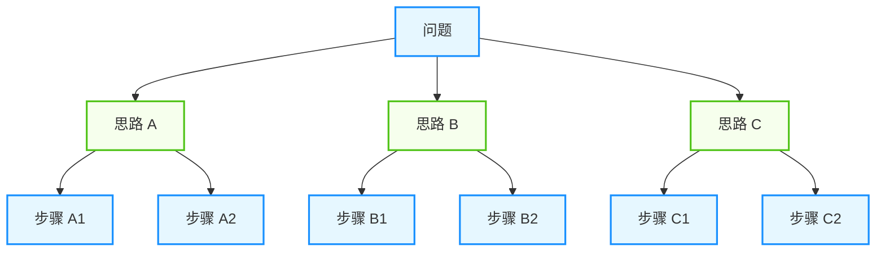

## 2.1 思维链与复杂推理

思维链（CoT）是让大语言模型展现复杂推理能力的关键技术。它通过引导模型"逐步思考"，显著提升了 AI 在数学、逻辑、编程等任务上的表现。

### 2.1.1 什么是思维链

本节将依次介绍“核心思想”与“为什么有效”等内容。

#### 核心思想

思维链的本质是让模型 **在给出最终答案之前，先输出中间推理步骤**。

**传统提示词**：
```
Q: 一个农场有 15 只羊，卖掉 6 只后又买了 4 只，现在有多少只羊？
A: 13 只
```

**使用思维链**：
```
Q: 一个农场有 15 只羊，卖掉 6 只后又买了 4 只，现在有多少只羊？
A: 让我一步步来思考：
   1. 初始羊的数量：15 只
   2. 卖掉 6 只后：15 - 6 = 9 只
   3. 又买了 4 只：9 + 4 = 13 只
   因此，现在有 13 只羊。
```

#### 为什么有效

1. **降低认知负荷**：大模型的工作记忆（Attention）有限。将复杂问题（如“234 * 567”）拆解为单步计算，避免了模型在一步生成中承担过大的计算压力，防止逻辑崩塌。
2. **错误可追溯**：如果模型直接给出错误答案，无法调试。但如果它展示了“先算 15-6=9，再算 9+4=13”，就能精确定位是哪一步逻辑出错，从而针对性优化提示词。
3. **上下文引导**：模型是基于概率预测的。生成中间步骤（如“不仅要考虑成本，还要考虑时间”）产生的文字，会作为高质量的上下文，提高模型在后续生成中检索到正确知识的概率。
4. **对齐人类思维**：人类在解决难题时会进行“内心独白”。思维链强迫模型模仿这种“慢思考”（系统 2），而非仅依赖“直觉”（系统 1）。

### 2.1.2 核心应用场景

本节将依次介绍“任务规划”与“工具选择”等内容。

#### 任务规划

在面对复杂目标时，直接生成行动指令往往容易出错。通过思维链，可以让模型先进行"脑内演练"，将大目标拆解为子步骤。

**应用场景**：不仅生成步骤，还解释步骤之间的依赖关系。

```python
def plan_task(goal: str) -> List[str]:
    prompt = f"""
    我需要完成以下目标：{goal}
    
    让我思考需要哪些步骤：
    1. 首先，我需要理解任务的核心要求...
    2. 然后，我应该确定所需的资源...
    3. 接下来，我需要...
    ...
    
    基于以上分析，具体的执行步骤是：
    """
    return model.generate(prompt)
```

#### 工具选择

智能体在决定使用哪个工具时，经常面临歧义。强制模型在调用工具前输出推理过程，可以显著提高工具调用的准确率。

**核心逻辑**：意图 (Intent) -> 理由 (Reason) -> 工具 (Tool)。

```python
def select_tool(task: str, available_tools: List[Tool]) -> Tool:
    prompt = f"""
    任务：{task}
    
    可用工具：
    {format_tools(available_tools)}
    
    让我分析应该使用哪个工具：
    1. 任务需要获取实时数据，所以需要联网能力
    2. 数据格式是 JSON，需要解析能力
    3. web_search 工具可以联网且返回结构化数据
    
    因此，最合适的工具是：web_search
    """
    return parse_tool_selection(model.generate(prompt))
```

#### 错误诊断

当工具调用失败或代码报错时，直接重试通常无效。思维链可以让模型像人类程序员一样，先阅读错误信息，分析原因，再提出修复方案。

**流程**：观察 (Observe) -> 分析 (Analyze) -> 修复 (Fix)。

```python
def diagnose_error(error: Exception, context: str) -> str:
    prompt = f"""
    执行过程中出现错误：{error}
    
    上下文信息：{context}
    
    让我分析可能的原因：
    1. 错误类型是 KeyError，说明访问了不存在的键
    2. 查看上下文，数据来自 API 响应
    3. API 可能返回了不同于预期的结构
    
    可能的解决方案：
    1. 添加键存在性检查
    2. 打印实际的 API 响应查看结构
    3. 使用 .get() 方法提供默认值
    """
    return model.generate(prompt)
```

### 2.1.3 思维链的主要变体

本节将依次介绍“零样本思维链”与“少样本思维链”等内容。

#### 零样本思维链

最简单的形式，只需添加 **"Let's think step by step" (让我们一步步思考)**：

```python
prompt = f"""
{question}

Let's think step by step.
"""
```

**优点**：无需示例，通用性强

**缺点**：质量不如 Few-Shot 稳定

#### 少样本思维链

提供包含推理过程的示例 (Few-Shot Prompting)：

```python
prompt = """
Q: 小明有 5 个苹果，小红给了他 3 个，他吃了 2 个。现在有几个？
A: 让我一步步分析：
   - 初始：5 个
   - 收到：5 + 3 = 8 个
   - 吃掉：8 - 2 = 6 个
   答案：6 个苹果

Q: 一筐橘子有 24 个，平均分给 6 个人，每人得几个？
A: 让我一步步分析：
   - 总数：24 个
   - 人数：6 人
   - 每人：24 ÷ 6 = 4 个
   答案：每人 4 个橘子

Q: {new_question}
A:
"""
```

**优点**：质量更高，格式可控

**缺点**：需要精心设计示例

#### 自洽性思维链

多次采样，取最一致的答案：

```python
answers = []
for _ in range(5):
    response = model.generate(prompt, temperature=0.7)
    answers.append(extract_answer(response))

# 投票选出最常见的答案

final_answer = most_common(answers)
```

**原理**：正确的推理路径更可能被多次发现

**适用场景**：高风险决策、追求高准确率

#### 思维树

将推理过程组织成 **树形结构**（详见下一节）：



图 2-1：思维树结构示意

#### 内在思维链 / 系统 2 推理

随着推理模型（Reasoning Models）的成熟，思维链已经从“提示词技巧”演变为“模型能力 + 提示策略”的结合。

- **原理**：模型在输出最终答案前，会先在内部生成并未对用户展示的隐式思维链。
- **变化**：对于这类模型，用户 **不再需要** 手动编写 "Let's think step by step"，模型会自动进行长链路推理。
- **最佳实践**：对 o3 类模型，提示词应保持简单直接，过多的少样本（Few-Shot）指导反而可能干扰其内在推理逻辑。

### 2.1.4 最佳实践

本节将依次介绍“结构化提示词设计”与“分隔符与答案提取”等内容。

#### 结构化提示词设计

不要只是简单地说 "Let's think step by step"，更好的做法是 **明确推理框架**：

```python
# ✅ 优秀的结构化思维链提示词

prompt = """
请解决这个问题：{question}

请严格按照以下步骤进行思考，并以 JSON 格式输出：
1. **Analyze**: 提取问题的关键信息和数值。
2. **Plan**: 制定解决步骤和方法。
3. **Reasoning**: 执行每一步的计算或逻辑推导。
4. **Conclusion**: 验证答案，给出最终结论。
"""
```

#### 分隔符与答案提取

在工程落地中，不仅要让模型"想得对"，还要能"代码好解析"。使用特殊的分隔符包裹思维过程和最终答案至关重要。

```python
prompt = """
请按以下 XML 格式输出你的回答：

<thinking>
[在这里展示详尽的推理过程]
</thinking>

<answer>
[这里仅输出最终的简短结论，不要包含解释]
</answer>
"""

# 💡 工程技巧：使用正则提取答案

import re
match = re.search(r"<answer>(.*?)</answer>", response, re.DOTALL)
final_answer = match.group(1).strip() if match else response
```

#### 参数调节

- **单路推理**：如果只运行一次 CoT，建议设置 `temperature = 0`。不仅能提高结果的确定性，往往还能获得逻辑最严密的推理路径。
- **自洽性投票**：如果使用投票机制，必须设置 `temperature > 0.5`（推荐 0.7），以确保生成的多样性，防止所有路径都坍缩到同一个错误答案。

### 2.1.5 与其他技术结合

思维链不仅可以单独使用，更能作为核心组件与其他 AI 技术产生强大的化学反应。

#### 思维链 + RAG：检索增强生成

传统 RAG 直接将检索到的片段喂给模型生成答案，容易导致"断章取义"或拼接错误。加入思维链后，模型可以先评估检索内容的关联性，再进行综合推理。

- **模式**：检索 (Retrieve) -> **评估与推理** -> 生成 (Generate)
- **优势**：
    - **去噪**：通过推理步骤，模型可以识别并忽略检索结果中的无关信息。
    - **知识融合**：将检索到的静态知识与模型内在的逻辑能力结合。
- **提示词示例**：
  > "基于以下检索到的 3 个文档片段，请先一步步分析它们之间的逻辑联系，排除矛盾信息，然后再回答用户的问题。"

#### 思维链 + 工具：ReAct 模式

这是构建智能体的基石。ReAct (Reason + Act) 本质上就是 **显式思维链在工具调用场景的应用**。

- **原理**：模型在行动（调用工具）之前，必须先进行显式推理（思考意图），行动后再次推理（分析结果）。
- **流程**：
    1. **Thought**: "用户问天气，我需要调用天气 API"
    2. **Action**: `get_weather("Beijing")`
    3. **Observation**: "25°C, Sunny"
    4. **Thought**: "天气不错，适合出行"
    5. **Final Answer**: "北京今天晴，25度，很适合出去玩。"

### 2.1.6 思维链的局限性

1. **延迟与成本翻倍**：
   - 思维链通常需要生成数百个额外的 Token 用于推理。对于短任务，开启 CoT 可能导致 **API 成本显著增加**，且首字延迟显著增加，不适合对实时性要求高的应用。

2. **错误传播**：
   - 推理链路是串行的。如果第一步逻辑（如“提取数值”）出错，后续哪怕所有步骤的逻辑都正确，最终答案也会错误。这种脆弱性使得 CoT 在长链路推理中表现不稳定。

3. **简单任务的"过度思考"**：
   - 对于 `2 + 2` 或 `中国的首都是哪里` 这类直觉性问题，强制使用 CoT 不仅浪费资源，甚至可能诱导模型将简单问题复杂化，产生"过度解读"的错误。

4. **结论的不可靠性**：
   - **推理与答案不一致**：模型有时会产生完美的推理过程，却输出一个完全无关的错误答案；或者推理逻辑混乱，却碰巧输出了正确答案。这种"表里不一"使得不能盲目信任模型的解释。

### 2.1.7 生产环境的可见性与合规

在生产环境中，思维链既是调试利器，也可能成为风险来源：它可能泄露敏感信息、暴露可被利用的策略细节，或者把“未验证的猜测”包装成看似严谨的解释。

#### 为什么不直接暴露完整推理

常见风险包括：

- **隐私与合规**：推理过程可能包含用户原始输入的细节、内部系统信息、甚至被检索到的敏感片段。
- **可攻击面**：攻击者可以通过观察推理模式，反向构造更有效的提示词注入或绕过策略。
- **误导性解释**：模型可能在事后“编造”一条听起来合理的推理链，降低用户警觉。

#### 用“可解释性摘要”替代“完整思维链”

更推荐把可见输出设计为“对人类有用、对攻击者不增益”的摘要：

- **结论与置信度**：明确答案的确定程度与适用范围。
- **关键依据**：列出决定性证据（工具返回、引用片段、计算结果），而不是完整推演过程。
- **假设与限制**：标注哪些信息来自外部证据，哪些是模型推断。
- **可追溯标识**：返回 `trace_id`，需要时由有权限的人员在日志系统中回放细节。

例如，可以用结构化输出来承载“可解释性摘要”：

```json
{
  "answer": "……",
  "rationale_summary": [
    "使用了订单查询工具确认状态为已发货",
    "根据物流时效规则估算到达时间区间"
  ],
  "assumptions": ["物流规则基于最近一次配置快照"],
  "uncertainties": ["当前地区天气可能导致延迟"],
  "trace_id": "trace_abc123"
}
```

#### 工程落地建议

- **权限分级**：将“完整轨迹”只写入受控日志；对终端用户仅展示摘要。
- **最小化与脱敏**：对日志与记忆做 PII 脱敏、敏感字段掩码，并配置保留期与删除机制。
- **证据优先**：优先记录“工具调用与返回结果”，并把它作为评估与审计的主依据。

---

**下一节**: [2.2 任务分解与规划算法](2.2_decomposition.md)
