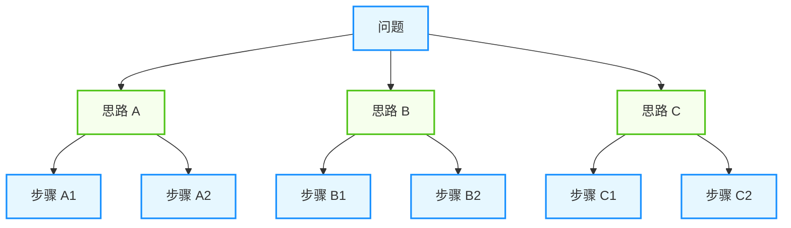

## 2.1 思维链与线性推理

思维链（CoT）是让大语言模型展现复杂推理能力的关键技术。它通过引导模型“逐步思考”，显著提升了 AI 在数学、逻辑、编程等任务上的表现。

在本节里，“思维链”特指 **沿单条推理轨迹展开的线性推理**：模型先写出中间步骤，再给出答案。它解决的是“如何把一个复杂问题按顺序想清楚”；而当任务进一步需要先拆分子问题、比较多条路线、回溯修正，或把推理与外部行动交织起来时，就会自然过渡到 [2.2 节](2.2_decomposition.md) 的任务分解算法，以及 [2.3 节](2.3_react.md) 的闭环式 ReAct。

### 2.1.1 什么是思维链

#### 核心思想

思维链的本质是让模型 **在给出最终答案之前，先输出中间推理步骤**。

**传统提示词**：
```text
Q: 一个农场有 15 只羊，卖掉 6 只后又买了 4 只，现在有多少只羊？
A: 13 只
```

**使用思维链**：
```text
Q: 一个农场有 15 只羊，卖掉 6 只后又买了 4 只，现在有多少只羊？
A: 让我一步步来思考：
   1. 初始羊的数量：15 只
   2. 卖掉 6 只后：15 - 6 = 9 只
   3. 又买了 4 只：9 + 4 = 13 只
   因此，现在有 13 只羊。
```

#### 为什么有效

1. **降低认知负荷**：大模型的工作记忆（Attention）有限。将复杂问题（如“234 * 567”）拆解为单步计算，避免了模型在一步生成中承担过大的计算压力，防止逻辑崩塌。
2. **错误可追溯**：如果模型直接给出错误答案，无法调试。但如果它展示了“先算 15-6=9，再算 9+4=13”，就能精确定位是哪一步逻辑出错，从而针对性优化提示词。
3. **上下文引导**：模型是基于概率预测的。生成中间步骤（如“不仅要考虑成本，还要考虑时间”）产生的文字，会作为高质量的上下文，提高模型在后续生成中检索到正确知识的概率。
4. **对齐人类思维**：人类在解决难题时会进行“内心独白”。思维链强迫模型模仿这种“慢思考”（系统 2），而非仅依赖“直觉”（系统 1）。如 [1.1 节](../01_paradigm/1.1_shift.md#113-认知升级系统-1-与系统-2) 所述的双系统理论一样，这一对偶性贯穿整个智能体设计。

### 2.1.2 核心应用场景

#### 任务规划

在面对复杂目标时，直接生成行动指令往往容易出错。通过思维链，可以让模型先进行“脑内演练”，将大目标拆解为子步骤。

**应用场景**：不仅生成步骤，还解释步骤之间的依赖关系。

```python
def plan_task(goal: str) -> List[str]:
    prompt = f"""
    我需要完成以下目标：{goal}

    让我思考需要哪些步骤：
    1. 首先，我需要理解任务的核心要求...
    2. 然后，我应该确定所需的资源...
    3. 接下来，我需要...
    ...

    基于以上分析，具体的执行步骤是：
    """
    return model.generate(prompt)
```

#### 工具选择

智能体在决定使用哪个工具时，经常面临歧义。强制模型在调用工具前输出推理过程，可以显著提高工具调用的准确率。

**核心逻辑**：意图 (Intent) -> 理由 (Reason) -> 工具 (Tool)。

```python
def select_tool(task: str, available_tools: List[Tool]) -> Tool:
    prompt = f"""
    任务：{task}

    可用工具：
    {format_tools(available_tools)}

    让我分析应该使用哪个工具：
    1. 任务需要获取实时数据，所以需要联网能力
    2. 数据格式是 JSON，需要解析能力
    3. web_search 工具可以联网且返回结构化数据

    因此，最合适的工具是：web_search
    """
    return parse_tool_selection(model.generate(prompt))
```

#### 错误诊断

当工具调用失败或代码报错时，直接重试通常无效。思维链可以让模型像人类程序员一样，先阅读错误信息，分析原因，再提出修复方案。

**流程**：观察 (Observe) -> 分析 (Analyze) -> 修复 (Fix)。

```python
def diagnose_error(error: Exception, context: str) -> str:
    prompt = f"""
    执行过程中出现错误：{error}

    上下文信息：{context}

    让我分析可能的原因：
    1. 错误类型是 KeyError，说明访问了不存在的键
    2. 查看上下文，数据来自 API 响应
    3. API 可能返回了不同于预期的结构

    可能的解决方案：
    1. 添加键存在性检查
    2. 打印实际的 API 响应查看结构
    3. 使用 .get() 方法提供默认值
    """
    return model.generate(prompt)
```

### 2.1.3 思维链的主要变体

从历史脉络看，今天常说的 CoT 并不是一次性完整出现的单一方法。通常所说的经典 CoT，指的是 Wei 等人在 2022 年论文 [Chain-of-Thought Prompting Elicits Reasoning in Large Language Models](https://arxiv.org/abs/2201.11903) 中系统展示的 **少样本 CoT**；围绕这一路线，Kojima 等人在 2022 年论文 [Large Language Models are Zero-Shot Reasoners](https://arxiv.org/abs/2205.11916) 中提出了 **Zero-shot CoT**，而 Wang 等人在 [Self-Consistency Improves Chain of Thought Reasoning in Language Models](https://arxiv.org/abs/2203.11171) 中提出 **Self-Consistency**，把单条链路扩展为“采样多条链路后投票”的解码策略。

#### 零样本思维链

零样本思维链（Zero-shot CoT）由 Kojima 等人在 2022 年提出，核心思想是在 **不给示例** 的前提下，仅用一句触发语把普通零样本提示切换到推理模式。最经典的形式是添加 **“Let's think step by step” (让我们一步步思考)**：

```python
prompt = f"""
{question}

Let's think step by step.
"""
```

**优点**：无需示例，通用性强

**缺点**：质量不如 Few-Shot 稳定

#### 少样本思维链

少样本思维链（Few-shot CoT）是 CoT 最早被系统化展示的形式。Wei 等人在 2022 年的工作中表明：与只给输入输出示例相比，**把中间推理步骤一并写进示例**，可以显著提升大模型在多步推理任务上的表现。其基本形式是在 Few-Shot Prompting 中提供包含推理过程的示例：

```python
prompt = """
Q: 小明有 5 个苹果，小红给了他 3 个，他吃了 2 个。现在有几个？
A: 让我一步步分析：
   - 初始：5 个
   - 收到：5 + 3 = 8 个
   - 吃掉：8 - 2 = 6 个
   答案：6 个苹果

Q: 一筐橘子有 24 个，平均分给 6 个人，每人得几个？
A: 让我一步步分析：
   - 总数：24 个
   - 人数：6 人
   - 每人：24 ÷ 6 = 4 个
   答案：每人 4 个橘子

Q: {new_question}
A:
"""
```

**优点**：质量更高，格式可控

**缺点**：需要精心设计示例

#### 自洽性思维链

自洽性思维链（Self-Consistency）由 Wang 等人在 2022 年提出。它不是重新定义 CoT 的提示模板，而是对 CoT 的 **解码阶段** 做增强：让模型以较高温度采样多条不同推理路径，再对最终答案做多数投票。实现方式如下：

```python
answers = []
for _ in range(5):
    response = model.generate(prompt, temperature=0.7)
    answers.append(extract_answer(response))

# 投票选出最常见的答案

final_answer = most_common(answers)
```

**原理**：正确的推理路径更可能被多次发现

**适用场景**：高风险决策、追求高准确率

#### 思维树

当单条 CoT 已经不够，需要显式地保留多个候选分支、比较中间状态并做搜索时，线性链路就会自然过渡到 **树形结构**。这正是下一节要展开的任务分解视角：


```mermaid
graph TD
    %% Agentic Design System
    classDef agent fill:#e6f7ff,stroke:#1890ff,stroke-width:2px;
    classDef tool fill:#f6ffed,stroke:#52c41a,stroke-width:2px;
    classDef error fill:#fff1f0,stroke:#ff4d4f,stroke-width:2px,stroke-dasharray: 5 5;

    Root["问题"] --> A["思路 A"]
    Root --> B["思路 B"]
    Root --> C["思路 C"]

    A --> StepA1["步骤 A1"]
    A --> StepA2["步骤 A2"]
    B --> StepB1["步骤 B1"]
    B --> StepB2["步骤 B2"]
    C --> StepC1["步骤 C1"]
    C --> StepC2["步骤 C2"]

    class Root agent;
    class A,B,C tool;
    class StepA1,StepA2,StepB1,StepB2,StepC1,StepC2 agent;
```

图 2-1：思维树结构示意

#### 内在思维链 / 系统 2 推理

随着推理模型（Reasoning Models）的成熟，思维链已经从“提示词技巧”演变为“模型能力 + 提示策略”的结合。当前存在两种主流实现方式：

**可见推理链**：模型在输出最终答案前，先向用户展示完整的推理过程。这类模型（如 Claude 3.7 Sonnet 的混合推理、OpenAI o1 系列）通过在生成最终答案前进行扩展思考，显著提升了复杂任务的准确性。用户可通过 API 参数（如“思维预算”token 数量）控制推理深度。

**隐式内部推理**：模型在内部进行推理但不对用户展示中间步骤。虽然这能降低输出 token 消耗，但用户无法观察或调试推理过程，可追溯性较弱。

- **最佳实践**：是否使用推理增强、是否展示推理过程、以及最佳提示策略高度依赖具体模型版本与任务类型。
  - 对于高价值决策（代码审查、财务分析），建议启用可见推理以提升可信度。
  - 对于低延迟需求的场景，可考虑关闭或限制推理深度。
  - 通过 A/B 测试验证：保持提示词简洁 vs 加入结构化推理框架，并以成功率、成本与延迟作为综合决策依据。

### 2.1.4 最佳实践

不要只是简单地说 “Let's think step by step”，更好的做法是 **明确推理框架**：

```python

# ✅ 优秀的结构化思维链提示词

prompt = """
请解决这个问题：{question}

请严格按照以下步骤进行思考，并以 JSON 格式输出：
1. **Analyze**: 提取问题的关键信息和数值。
2. **Plan**: 制定解决步骤和方法。
3. **Reasoning**: 执行每一步的计算或逻辑推导。
4. **Conclusion**: 验证答案，给出最终结论。
"""
```

#### 分隔符与答案提取

在工程落地中，不仅要让模型“想得对”，还要能“代码好解析”。使用特殊的分隔符包裹思维过程和最终答案至关重要。

```python
prompt = """
请按以下 XML 格式输出你的回答：

<thinking>
[在这里展示详尽的推理过程]
</thinking>

<answer>
[这里仅输出最终的简短结论，不要包含解释]
</answer>
"""

# 💡 工程技巧：明确 tag + 明确 pattern + 单元测试

import re

def extract_answer(response: str) -> str:
    """提取最终答案的健壮解析器"""
    # 明确的 Pattern 匹配 <answer> 标签内部，允许忽略大小写并匹配多行
    pattern = re.compile(r"<answer>\s*(.*?)\s*</answer>", re.DOTALL | re.IGNORECASE)
    match = pattern.search(response)
    if not match:
        raise ValueError("模型输出未包含正确的 <answer> 标签结构")
    return match.group(1).strip()

# 测试用例

assert extract_answer("<answer> 42 </answer>") == "42"

# ⚠️ 迁移建议：

# 尽管正则提取能解决早期的解析痛点，但它本质上仍然脆弱。

# 对于生产系统，强烈建议向"结构化输出 (Structured Outputs) / 约束解码"迁移，

# 将解析可靠性转化为模型内生的格式保证（详见 4.2 节结构化输出）。

```

#### 参数调节

- **单路推理**：如果只运行一次 CoT，建议设置 `temperature = 0`。不仅能提高结果的确定性，往往还能获得逻辑最严密的推理路径。
- **自洽性投票**：如果使用投票机制，必须设置 `temperature > 0.5`（推荐 0.7），以确保生成的多样性，防止所有路径都坍缩到同一个错误答案。

### 2.1.5 与其他技术结合

思维链不仅可以单独使用，更能作为核心组件与其他 AI 技术产生强大的化学反应。

#### 思维链 + RAG：检索增强生成

传统 RAG 直接将检索到的片段喂给模型生成答案，容易导致“断章取义”或拼接错误。加入思维链后，模型可以先评估检索内容的关联性，再进行综合推理。

- **模式**：检索 (Retrieve) -> **评估与推理** -> 生成 (Generate)
- **优势**：
    - **去噪**：通过推理步骤，模型可以识别并忽略检索结果中的无关信息。
    - **知识融合**：将检索到的静态知识与模型内在的逻辑能力结合。
- **提示词示例**：
  > “基于以下检索到的 3 个文档片段，请先一步步分析它们之间的逻辑联系，排除矛盾信息，然后再回答用户的问题。”

#### 思维链 + 工具：ReAct 模式

ReAct（由 Yao 等在 2022 年提出，ICLR 2023 发表）可以看作 **把显式推理嵌入“思考-行动-观察”闭环** 的方法：模型不再只沿一条文字链路推到答案，而是在每次行动前后都更新推理状态。这里先把它理解为“CoT 进入工具使用与环境交互后的闭环版本”即可；其轨迹结构、提示格式与工程注意事项将在 [2.3 节](2.3_react.md) 单独展开，以避免与本节的线性 CoT 重复。

### 2.1.6 思维链的局限性

1. **延迟与成本翻倍**：
   - 思维链通常需要生成数百个额外的 Token 用于推理。对于短任务，开启 CoT 可能导致 **API 成本显著增加**，且首字延迟显著增加，不适合对实时性要求高的应用。

2. **前序错误的级联影响**：
   - 推理链路是串行的。CoT 虽然增强了错误的可追溯性，但如果第一步逻辑（如“提取数值”）出错，后续步骤再严密也无法救回，可能导致最终答案错误。这要求在使用 CoT 时格外关注早期步骤的准确性，尤其是在对数据敏感的任务中。

3. **简单任务的“过度思考”**：
   - 对于 `2 + 2` 或 `中国的首都是哪里` 这类直觉性问题，无差别强制使用 CoT 不仅浪费资源，甚至可能诱导模型将简单问题复杂化，产生“过度解读”的错误。应根据任务复杂度选择性应用结构化推理框架，而非盲目启用。

4. **结论的不可靠性**：
   - **推理与答案不一致**：模型有时会产生完美的推理过程，却输出一个完全无关的错误答案；或者推理逻辑混乱，却碰巧输出了正确答案。这种“表里不一”使得不能盲目信任模型的解释。

### 2.1.7 生产环境的可见性与合规

生产部署思维链时需注意可见性与合规问题：推理过程可能泄露敏感信息（PII、内部系统细节）、扩大攻击面或误导用户。应采用权限分级（用户仅见摘要、完整轨迹入受控日志）、PII 脱敏和可追溯标识（trace_id）。详见《AI 安全指南》相关章节。

---

**下一节**: [2.2 任务分解与规划算法](2.2_decomposition.md)
