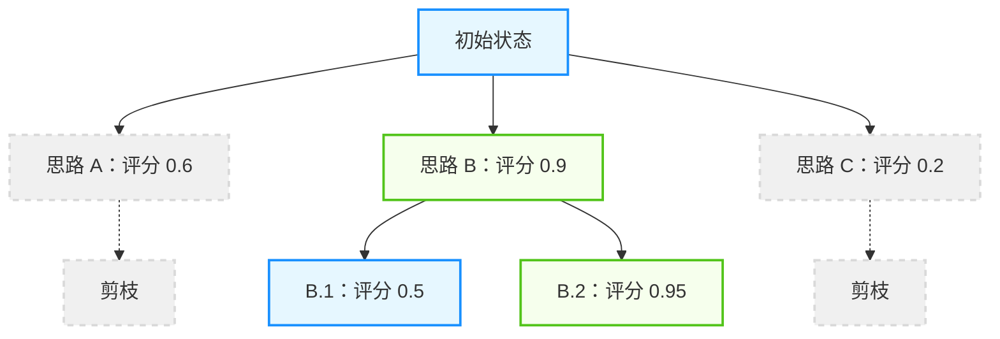

## 2.2 任务分解与规划算法

在 [2.1 节](2.1_cot.md) 中，介绍了思维链如何通过线性推理解决问题。然而，面对极其复杂的任务，单向的线性思维往往不够用。需要更强的结构化思考能力，这就是复杂任务分解算法的用武之地。

如果说思维链是“一条路走到黑”，那么本节介绍的算法则是“在迷宫中寻找最优解”。

### 2.2.1 为什么线性推理不够

当人类面对难题（如“如何将一家初创公司从0做到1”）时，思维过程从来不是线性的：
- **发散**：提出多个方案 A、B、C。
- **评估**：觉得 B 方案风险太大，排除掉。
- **回溯**：试了 A 方案发现行不通，退回来尝试 C 方案。
- **合并**：发现 A 的优点和 C 的优点可以结合。

标准的思维链只能进行“流式生成”，缺乏这种回溯、评估和整合的能力。因此，研究人员提出了更高级的拓扑结构来组织模型的思维。

### 2.2.2 思维树: 引入搜索算法

**思维树 (ToT)** 由 Princeton 和 Google DeepMind 在论文 [Tree of Thoughts: Deliberate Problem Solving with Large Language Models](https://arxiv.org/abs/2305.10601) 中提出（参考 [官方实现库](https://github.com/princeton-nlp/tree-of-thought-llm)），它将推理过程建模为一棵树。**核心机制**：ToT 的运行类似下棋，每一步都有多种走法。它包含四个核心要素：

1. **思维分解**：将大问题拆解为中间步骤（思维节点）。
2. **思维生成**：在当前步骤，让 LLM 生成 $k$ 个可能的后续想法。
3. **状态评估**：让 LLM 充当“裁判”，给每个新想法打分（Value）或分类（Sure/Likely/Impossible）。
    - *示例提示词*：“分析以上 3 个方案的可行性，给出 0-1 的评分。”
4. **搜索算法**：
    - **BFS (广度优先)**：每一步都看所有可能性，保留最好的 $b$ 个（集束搜索）。适合步骤较少但每一步都很关键的任务（如创意写作）。
    - **DFS (深度优先)**：顺着一条路推到底，不行就回溯。适合有明确终点的逻辑解谜（如 24 点游戏、代码生成）。

**最小实现伪代码与关键超参**：
```python
def tree_of_thoughts(state, depth, max_depth, branch_factor, beam_width):
    if depth == max_depth:
        return evaluate_state(state)
    
    # 1. 思维生成 (生成 branch_factor 个可能的下一步)
    next_states = generate_thoughts(state, k=branch_factor)
    
    # 2. 状态评估 (让模型打分，0-1)
    scored_states = [(s, evaluate_prompt(s)) for s in next_states]
    
    # 3. 搜索与剪枝 (保留高分节点继续搜索)
    best_states = select_top_b(scored_states, b=beam_width)
    
    results = []
    for s, score in best_states:
        results.append(tree_of_thoughts(s, depth+1, max_depth, branch_factor, beam_width))
    return max(results, key=lambda x: x['score'])
```

**工程化考量与成本极限**：
- **关键超参**：树的深度 (`depth`)、分支因子 (`branch_factor`)、评估提示词 (`evaluate_prompt`)、集束宽度 (`beam_width`)。
- **成本上界估算**：如果深度为 $D$，分支因子为 $B$，最坏情况下需要生成 $O(B^D)$ 个节点。每个节点都需进行 LLM 推理和评估，API 成本极高。
- **适用场景**：适合具有明确可客观评价中间状态的复杂任务（如 24 点游戏、创意填字、特定逻辑解谜），不适合简单问答。



图 2-2：思维树搜索过程可视化

### 2.2.3 思维图: 任意拓扑结构

**思维图 (GoT)** 在论文 [Graph of Thoughts: Solving Elaborate Problems with Large Language Models](https://arxiv.org/abs/2308.09687) 中提出，认为树结构仍然是一个限制。在某些场景下，思维需要**聚合**和**循环**。

**核心操作**：GoT 将 LLM 的推理单元作为图的节点，并通过边连接。相比 ToT，它增加了以下能力：

1. **聚合**：将多个思维节点的输出合并。
    - *场景*：写一篇文章，先生成 3 个段落（3 个独立节点），然后总结这 3 段生成结论（聚合节点）。
2. **细化**：对同一个节点进行循环迭代优化。
    - *场景*：写一段代码，运行报错，将错误信息反馈回当前节点重新生成（自我循环）。

GoT 的灵活性使得它可以模拟各种人类思维模式，如头脑风暴（发散）、归纳总结（聚合）和迭代修改（循环）。

**工程要点**：
- **调度复杂度**：由于图允许循环和任意聚合，执行时的节点调度比 ToT 更加复杂，需要专门的状态机或数据流框架支持。
- **状态一致性**：在聚合多个分支时容易出现信息冲突（例如两个分支对同一个变量做出了不同的假设），需要专门的冲突解决机制或总结提示词。
- **可重放性**：由于图的执行路径非线性，必须记录每个节点完整的 `trace_id` 与父子依赖关系，否则发生错误时无法追踪和重试。

### 2.2.4 骨架思维: 并行推理加速

前两种算法旨在提升 **质量**，而 **骨架思维 (SoT)** 旨在提升**速度**。

传统的 CoT 是串行的：想完第一步，才能想第二步。这导致长文本生成的延迟极高。SoT 模仿人类写大纲的习惯：

1. **骨架阶段**：先让 LLM 生成任务的简要大纲（骨架）。
2. **逐点扩展阶段**：**并行**地让 LLM 同时扩写大纲中的每一个点。**优势**：通过并行生成，SoT 可以将长文生成的端到端延迟显著降低，且逻辑结构往往更加清晰。

### 2.2.5 算法选择指南

在设计智能体时，如何选择任务分解算法？

| 算法 | 核心特征 | 优点 | 缺点 | 适用场景 |
| :--- | :--- | :--- | :--- | :--- |
| **CoT** ([2.1节](2.1_cot.md)) | 线性链 | 简单、低成本 | 无法纠错，易跑偏 | 通用简单指令 |
| **ToT** | 树状搜索 | 准确率高，能回溯 | Token 消耗极大，慢 | 复杂逻辑、数学证明、代码生成 |
| **GoT** | 图状网络 | 极其灵活，支持聚合 | 实现复杂，调度难 | 创意写作、多文档摘要 |
| **SoT**| 并行扩展 |**速度极快** | 细节一致性稍弱 | 文章撰写、报告生成 |

---

**下一节**: [2.3 ReAct：推理与行动的统一](2.3_react.md)
