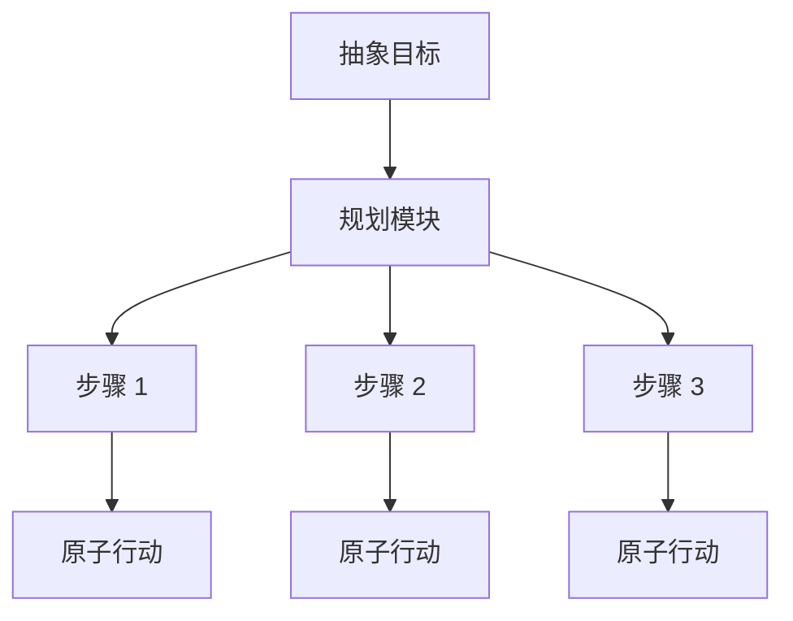
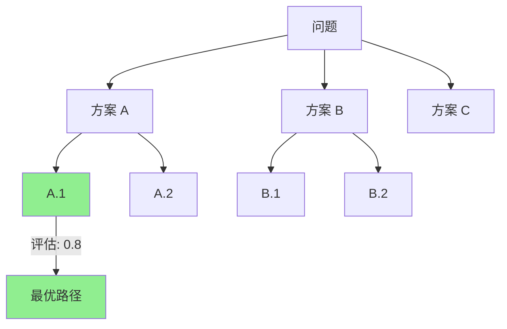

## 2.2 任务分解算法：ToT 与 GoT

### 2.2.1 规划：智能体的前额叶皮层

在人类大脑中，前额叶皮层负责高级认知功能，如规划、决策和执行控制。而在智能体架构中，**规划模块（Planner）** 扮演着同样的角色。面对简单的问候，智能体可以依靠直觉（LLM 的训练权重）直接回答；但面对"开发一个贪吃蛇游戏并部署到数据中心"这样的复杂目标，没有规划的智能体就像无头苍蝇，走一步看一步，最终迷失在细节中。

规划的核心目标是**将抽象的、复杂的长期目标转化为具体的、可执行的原子行动序列**。



---

### 2.2.2 任务分解技术

这是规划的第一步。智能体需要利用 LLM 的逻辑推理能力，将大任务拆解为小任务。

#### 思维链

**思维链（Chain of Thought, CoT）** 是最基础的拆解技术。通过 `让我们一步步思考（Let's think step by step）` 的提示，诱导模型将推理过程显式化。

| 类型 | 方法 | 适用场景 |
|------|------|----------|
| **零样本思维链（Zero-shot CoT）** | 直接添加"让我们一步步思考"咒语 | 简单推理任务 |
| **少样本思维链（Few-shot CoT）** | 提供"问题 → 思考过程 → 答案"示例 | 复杂推理任务 |
| **自动思维链（Auto-CoT）** | 自动生成推理链示例 | 批量任务处理 |

**示例**：
```
问题：一个商店有25个苹果，卖掉了8个，又进货了12个，现在有多少个？

思维链：
1. 初始苹果数：25个
2. 卖掉后：25 - 8 = 17个
3. 进货后：17 + 12 = 29个
答案：29个
```

#### 思维树

对于创意写作或复杂解谜，线性的 CoT 往往不够。**思维树（Tree of Thoughts, ToT）** 允许智能体在思维的每一步探索多个分支。

**核心机制**：
1. **分支生成**：智能体生成多个可能的下一步计划（Node A, Node B, Node C）
2. **状态评估**：智能体自我评估每个计划的可行性（State Evaluator）
3. **搜索策略**：使用 BFS（广度优先）或 DFS（深度优先）搜索最优路径
4. **回溯机制**：如果发现 Node A 走不通，回溯并尝试 Node B



**ToT vs CoT 对比**：

| 维度 | Chain of Thought | Tree of Thoughts |
|------|-----------------|------------------|
| 结构 | 线性序列 | 树状分支 |
| 探索性 | 单一路径 | 多路径并行 |
| 回溯能力 | 无 | 支持回溯 |
| 词元 (Token) 消耗 | 低 | 高 |
| 适用场景 | 简单推理 | 创意/解谜 |

#### 思维图

**思维图（Graph of Thoughts, GoT）** 进一步扩展了 ToT，允许节点之间形成图结构而非树结构。这意味着：
- 不同分支可以**合并**（如两个想法结合产生新方案）
- 节点可以**循环引用**（如迭代优化）
- 支持更复杂的推理模式

#### LLM+P

对于极度依赖逻辑的场景（如机器人搬箱子），LLM 可能不如传统的符号规划器准确。**LLM+P** 方法将自然语言问题转化为 **规划领域定义语言（PDDL）**，交给外部的经典规划求解器算出最优步数，再翻译回自然语言。

**工作流程**：
1. LLM 理解自然语言任务描述
2. 转化为 PDDL 格式的形式化表示
3. 调用求解器（如 FastDownward）计算最优路径
4. 将结果翻译回自然语言执行计划

---

### 2.2.3 主流规划模式详解

#### ReAct 模式

**ReAct** 是 **Re**asoning（推理）和 **Act**ing（行动）的组合词，源自 Yao et al. 于 2022 年发表的里程碑式论文。其核心思想是**将推理与行动交织进行**——智能体不再是"先想完再做"，而是"边想边做、边做边想"。

**传统模式的问题**：

- 纯推理（CoT）：只思考不行动，无法获取外部信息
- 纯行动：盲目执行，缺乏策略调整

**ReAct 循环**：

```
Thought: 用户想查某人的年龄，我应该先去搜维基百科
Action: Search_Wikipedia("Barack Obama")
Observation: 搜索结果返回了 Obama 的生平，出生于1961年
Thought: 我找到了出生日期，现在计算年龄
Action: Calculator(2025 - 1961)
Observation: 64
Answer: 他今年 64 岁
```

**优缺点分析**：

- ✅ 鲁棒性强，每一步都能根据最新观察调整策略
- ✅ 可解释性好，推理过程透明
- ❌ 词元 (Token) 消耗大
- ❌ 容易陷入局部最优或死循环

#### 计划与求解模式

对于步骤清晰的长任务，ReAct 的逐步推理显得过于冗长。**计划与求解（Plan-and-Solve）** 模式将过程分为两个阶段：

1. **规划智能体 (Planner Agent)**：不执行任何操作，只负责列出详细的步骤清单
2. **执行智能体 (Executor Agent)**：拿着清单，逐条执行

**变体——Replanning**：
如果 Executor 在第 3 步执行失败，会停下来，把当前情况反馈给 Planner，要求基于现状更新剩余的计划。这种动态调整能力显著提升了复杂任务的成功率。

---

### 2.2.4 反思与自我修正

没有完美的计划。高级智能体必须具备**元认知**能力，即"思考自己的思考"。

#### 反思（Reflexion）框架

这是一个通过语言反馈强化智能体的框架。

**触发条件**：

- 智能体的回答被验证器驳回
- 代码运行报错
- 任务执行失败

**反思机制**：
智能体不会通过梯度下降更新权重，而是更新**短期记忆**。它会生成一段文本：

```
反思：我上次失败是因为没有导入 numpy 库。
教训：在使用任何外部库之前，必须先检查导入语句。
改进：这次我将在代码开头添加所有必要的 import 语句。
```

**效果**：这种"口头教训"被加入到下一次尝试的上下文中，显著提升成功率。研究表明，Reflexion 能让 GPT-4 在 HumanEval 编程测试中的分数大幅提升。

### 2.2.5 本节小结

规划模块决定了智能体的上限。从简单的线性 CoT 到复杂的 ToT/GoT 搜索，再到具备自我修复能力的 Reflexion 框架，我们正在一步步逼近人类解决问题的核心思维模式。

| 技术 | 复杂度 | 适用场景 |
|------|--------|----------|
| CoT | 低 | 简单推理 |
| ToT | 中 | 创意/解谜 |
| GoT | 高 | 复杂优化 |
| ReAct | 中 | 工具调用 |
| Reflexion | 中 | 迭代改进 |

未来的规划器将更加模块化，甚至可能出现专门负责"挑刺"的 评论智能体 (Critic Agent)，与负责"干活"的 行动智能体 (Actor Agent) 形成对抗进化。

---

**下一节**: [ReAct：推理与行动的统一](2.3_react.md)