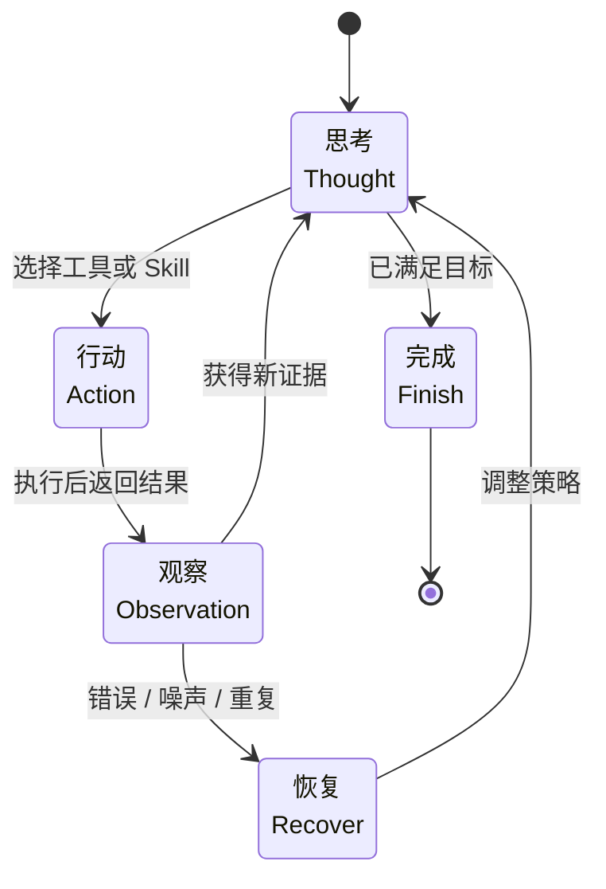

## 2.3 ReAct：推理与行动的统一

如果说 2.1 的思维链解决的是“在脑中如何一步步想”，那么 ReAct 解决的是“想完之后如何去查、去做，并根据环境反馈继续调整”。它把推理与行动交织成一个闭环，是现代智能体系统最常见的执行骨架之一。

### 2.3.1 什么是 ReAct

上一节已经讨论了思维链如何显式展开中间推理。ReAct 在此基础上再前进一步：不仅让模型“说出下一步怎么想”，还让它“真的去执行下一步动作”，并把返回结果重新纳入推理。ReAct（Reasoning + Acting）由 Shunyu Yao 等人在 Princeton University 与 Google Research 合作的论文 [ReAct: Synergizing Reasoning and Acting in Language Models](https://arxiv.org/abs/2210.03629) 中提出。它的核心不是重复定义思维链，而是给思维链接上行动与观察：模型先形成 Thought，再执行 Action，并根据 Observation 更新后续决策。ReAct 循环由三要素组成：**思考**（分析当前状态和下一步计划）、**行动**（执行具体操作，通常是工具调用）、**观察**（行动结果和环境反馈）。

```text
示例任务: 根据一次假设的天气工具返回，判断是否建议带伞
思考: 我需要先查看天气工具返回的结果
行动: search_weather(location="北京")
观察: 【示例返回】天气服务显示：晴，15-25°C，无降水预警
思考: 既然这是一次无降水预警的示例返回，可以给出“不需要带伞”的建议
行动: respond(message='根据这次示例返回，可将“不需要带伞”作为回答示例')
```

### 2.3.2 与纯思维链的区别

2.1 已经解释了 CoT 如何支持封闭上下文中的线性推理；这里强调的是新增部分：ReAct 不是替代 CoT，而是把 CoT 放进“推理 - 行动 - 观察”的外部闭环。

| 维度 | 纯 CoT | ReAct |
|------|--------|-------|
| 信息来源 | 仅模型内部知识 | 可获取外部信息 |
| 执行能力 | 只能推理 | 可以执行操作 |
| 反馈机制 | 无 | 通过观察 (Observation) 获得反馈 |
| 适用场景 | 封闭域推理 | 开放域任务 |

### 2.3.3 基本循环与提示词模板

ReAct 循环包括三个核心步骤：(1) 根据历史和工具描述生成推理与行动；(2) 检查是否完成；(3) 执行行动获取观察结果，然后反复迭代。以下提示词模板展示了标准的 ReAct 交互格式：

````python
REACT_PROMPT = """
你是一个智能助手，可以使用以下工具来完成任务：

{tool_descriptions}

请按照以下格式回答：

```text
Thought: [分析当前情况，思考下一步应该做什么]
Action: 工具名称(参数)
Observation: [工具返回的结果，这部分由系统填充]
... (重复 Thought/Action/Observation 直到完成)
Thought: 我现在知道最终答案了
Action: finish(answer="[最终答案]")
```

任务：{task}

{history}
"""
````

看到模板后，可以把 ReAct 理解为一种运行时循环，而不只是单条提示词技巧。下面分别从工程组件和案例两层展开。

如果把这个循环抽象成状态机，它的关键不只是 `Thought → Action → Observation` 三态本身，而是每次观察后都可能触发“继续、恢复、结束”三种不同分支。



图 2-3：ReAct 的运行时状态机

### 2.3.4 核心实现组件

如果把 ReAct 当作一个可上线的工程系统，它通常由五个组件协同驱动：**历史上下文**（保存 Thought/Action/Observation 轨迹），**实时环境输入**（告警、用户补充信息、系统状态），**推理模块**（LLM + ReAct Prompt），**工具与技能**（API、函数调用、复合 Skill），**反馈观察**（工具输出、错误码、执行日志）。

其中，**Skill 可以视为 Tool 的高阶封装**。例如“故障诊断”内部自动编排“查监控 + 查慢 SQL + 生成摘要”三个动作，对上层循环表现为一个更稳定、更高复用的工具接口。

一个典型的 ReAct Prompt 组装示例：

```text
已知：
当前历史上下文：{history}
实时环境输入：{environment_input}
用户目标：“排查 user-service 变慢原因并通知负责人”

请做出下一步决策：
1. 你可以调用一个工具或 Skill
2. 如果任务已完成，可以直接输出最终结果
3. 必须基于最新 Observation 调整下一步，而不是重复之前的无效动作
```


ReAct 相较于纯推理或固定工作流，具有三方面核心优势。**可追溯性**：每一步推理都被记录，便于调试、审计和合规。**错误恢复**：当行动失败时，可以通过观察错误信息调整策略（如遇到速率限制时重试或使用备用方案）。**灵活性**：可根据观察结果动态调整策略，而非机械执行预设流程。

### 2.3.5 实际应用案例

下面的案例都以教学为目的；其中价格、监控指标、联系人和工具返回均为示例或假设数据，用来说明 ReAct 轨迹结构，不应理解为实时事实或真实生产数据。

#### 案例一：信息查询

> **展示重点**：如何通过 ReAct 循环将一个复合问题（查股价 + 计算）拆解为线性的“工具调用链”。

```text
Task: 假设报价工具返回 TSLA 的示例价格，请计算买入 100 股的成本

Thought: 我需要先查询示例中的 TSLA 报价
Action: stock_price(symbol="TSLA")
Observation: 【示例返回】TSLA 报价: $248.50

Thought: 现在我知道股价是 $248.50，需要计算 100 股的总价
Action: calculator(expression="248.50 * 100")
Observation: 24850.0

Thought: 我已经得到了所需的信息
Action: finish(answer="按该示例价格计算，购买 100 股需要 $24,850.00")
```

#### 案例二：代码调试

```text
Task: 帮我分析这个 Python 文件的 bug

Thought: 我需要先读取文件内容
Action: read_file(path="app.py")
Observation: [文件内容...]

Thought: 我看到第 15 行有一个潜在的空指针问题，需要执行代码验证
Action: run_code(code="python app.py")
Observation: TypeError: 'NoneType' object is not subscriptable at line 15

Thought: 确认了 bug 位置，问题是 data 可能为 None。我来修复它
Action: edit_file(path="app.py", line=15, content="if data: result = data['key']")
Observation: 文件已更新

Thought: 重新运行验证修复是否成功
Action: run_code(code="python app.py")
Observation: 程序运行成功，输出: "Hello World"

Thought: Bug 已修复
Action: finish(answer="已修复 app.py 第 15 行的空指针 bug，添加了 None 检查")
```

#### 案例三：故障排查型智能客服

> **展示重点**：ReAct 真正的价值不在于“能调工具”，而在于 **根据观察结果动态改变排查方向**。

任务：`排查一次示例性的 user-service 延迟告警，并把排查结果发给该服务的负责人。`

```text
Thought: 我需要先看这次告警时间窗内的监控指标。
Action: query_monitor(service="user-service", time_window="09:00-09:30")
Observation: 【示例返回】09:00-09:30 CPU 利用率升到 98%，同时出现大量慢 SQL 告警。

Thought: 既然有慢 SQL 告警，我应该进一步查询慢 SQL 日志，而不是盲目检查应用代码。
Action: query_slow_sql(service="user-service", time="09:00-09:30")
Observation: 【示例返回】发现语句 SELECT * FROM users WHERE age > 20 ORDER BY created_at DESC 未命中索引，导致全表扫描。

Thought: 根因已经比较明确。下一步需要查询该服务负责人，以便发送排查结果。
Action: query_service_owner(service="user-service")
Observation: 【示例返回】服务负责人为王建国，邮箱 wang.jianguo@example.com。

Thought: 我已经具备了原因和联系人信息，可以组织报告并发送通知。
Action: send_email(to="wang.jianguo@example.com", subject="user-service 故障排查", body="【示例报告】发现由于缺少索引导致慢查询和 CPU 飙升...")
Observation: 【示例返回】邮件发送成功。

Thought: 任务闭环完成，可以向用户汇报最终结果。
Action: finish(answer="在这个示例中，user-service 延迟升高是因为慢 SQL 未命中索引导致全表扫描，并已向负责人发送排查邮件。")
```

这个例子说明：如果上一步观察到的是 OOM、线程池耗尽或网络超时，那么下一步动作就会完全不同。**ReAct 的本质是“基于证据持续修正计划”**，而不是机械执行预先写死的脚本。

### 2.3.6 最佳实践

工具的名称和描述直接影响模型的调用准确率。好的工具设计应当职责单一、命名清晰、参数描述完整。

```python
# ✅ 好的工具设计：名称明确，描述完整，参数有说明
tools = [
    Tool(
        name="search",
        description="搜索网页内容，返回摘要信息",
        parameters={"query": "搜索关键词"}
    ),
    Tool(
        name="calculator",
        description="执行数学计算",
        parameters={"expression": "数学表达式"}
    )
]

# ❌ 不好的工具设计：名称模糊，缺少描述和参数说明
tools = [
    Tool(name="do_stuff")
]
```

关于工具定义、执行机制与安全防护的详细讨论，参见[第四章：工具使用与环境交互](../04_tools/README.md)。

#### 观察处理

Observation 是模型决策的唯一外部信息源。过长的原始输出会浪费上下文窗口、干扰推理，因此需要结构化清洗。

```python
def format_observation(result) -> str:
    # 截断过长的结果
    if len(str(result)) > 1000:
        return str(result)[:1000] + "...[截断]"

    # 结构化格式
    if isinstance(result, dict):
        return json.dumps(result, indent=2, ensure_ascii=False)

    return str(result)
```

#### 错误处理

工具执行失败是常态而非异常。将错误信息结构化后回灌给模型，使其能据此调整策略，是 ReAct 错误恢复能力的基础。

```python
def execute_with_error_handling(action, tools):
    try:
        result = execute_tool(action, tools)
        return f"Success: {result}"
    except ToolNotFoundError:
        return f"Error: 工具 '{action.tool}' 不存在"
    except Exception as e:
        return f"Error: {type(e).__name__}: {str(e)}"
```

### 2.3.7 常见问题与防护

#### 无限循环与观察污染

**问题**：智能体在相同的状态间循环，通常是因为“观察污染”导致的。工具返回噪声或被注入的误导指令，使模型无法提取有效信息，只能重复调用相同的动作。

**解决**：为防止此类情况拖垮系统，必须配置强制的运行时护栏：最大步数（如 10 步）、状态去重（检测和干预重复动作）、预算熔断（Token 累积消耗或执行时间硬阈值）、幂等设计与清洗（结构化的 Observation）。

**实现参考：带护栏的 ReAct 循环**：

```python
import hashlib
from typing import List, Optional
from dataclasses import dataclass, field

@dataclass
class ReactConfig:
    """ReAct 循环的运行时配置"""
    max_steps: int = 10                  # 绝对上限
    max_consecutive_duplicates: int = 2  # 连续相同动作的容忍次数
    max_total_tokens: int = 50_000       # Token 预算熔断阈值
    observation_max_length: int = 2000   # Observation 截断长度

@dataclass
class ActionRecord:
    """记录一次 Action 的指纹，用于去重"""
    tool_name: str
    parameters: dict

    @property
    def fingerprint(self) -> str:
        """生成 Action 的唯一指纹"""
        raw = f"{self.tool_name}:{sorted(self.parameters.items())}"
        return hashlib.md5(raw.encode()).hexdigest()

def react_loop_with_guardrails(
    goal: str,
    tools: List,
    model,
    config: ReactConfig = ReactConfig()
) -> dict:
    """
    带完整护栏的 ReAct 循环实现。

    护栏包括：
    1. max_steps 硬上限
    2. 连续重复动作检测与干预
    3. Token 预算熔断
    4. Observation 结构化清洗
    """
    history = []
    total_tokens = 0
    consecutive_duplicate_count = 0
    last_action_fingerprint: Optional[str] = None

    for step in range(config.max_steps):
        # ── 1. 构造 Prompt 并生成 ──
        prompt = format_prompt(goal, history, tools)
        response = model.generate(prompt)

        # ── 2. Token 预算熔断 ──
        total_tokens += response.usage.total_tokens
        if total_tokens > config.max_total_tokens:
            return {
                "status": "budget_exceeded",
                "steps_completed": step,
                "total_tokens": total_tokens,
                "message": f"Token 预算已耗尽 ({total_tokens}/{config.max_total_tokens})"
            }

        thought, action = parse_response(response)
        history.append({"step": step, "thought": thought, "action": action})

        # ── 3. 完成检测 ──
        if action.type == "finish":
            return {
                "status": "success",
                "result": action.result,
                "steps_completed": step + 1,
                "total_tokens": total_tokens
            }

        # ── 4. 状态去重检测 ──
        current_record = ActionRecord(
            tool_name=action.tool,
            parameters=action.parameters
        )
        current_fingerprint = current_record.fingerprint

        if current_fingerprint == last_action_fingerprint:
            consecutive_duplicate_count += 1
        else:
            consecutive_duplicate_count = 0
        last_action_fingerprint = current_fingerprint

        if consecutive_duplicate_count >= config.max_consecutive_duplicates:
            # 注入干预 Prompt，强制模型切换策略
            intervention = (
                f"[系统干预] 你已经连续 {consecutive_duplicate_count + 1} 次"
                f"执行相同的操作 `{action.tool}({action.parameters})`，"
                f"但未获得新信息。请更换策略、尝试其他工具，或向用户求助。"
            )
            history.append({"observation": intervention, "is_intervention": True})
            consecutive_duplicate_count = 0  # 重置计数器
            continue

        # ── 5. 执行 Action，清洗 Observation ──
        raw_observation = execute_tool(action, tools)
        cleaned_observation = sanitize_observation(
            raw_observation,
            max_length=config.observation_max_length
        )
        history.append({"observation": cleaned_observation})

    # 达到最大步数
    return {
        "status": "max_steps_reached",
        "steps_completed": config.max_steps,
        "total_tokens": total_tokens,
        "message": f"已达到最大步数限制 ({config.max_steps})"
    }


def sanitize_observation(raw: str, max_length: int = 2000) -> str:
    """
    Observation 结构化清洗：
    - 截断过长内容，保留头尾
    - 移除可能干扰模型的注入指令模式
    - 标准化错误格式
    """
    text = str(raw)

    # 截断策略：保留头部和尾部，中间用省略号
    if len(text) > max_length:
        head = text[:max_length // 2]
        tail = text[-(max_length // 2):]
        text = f"{head}\n...[已截断 {len(raw) - max_length} 字符]...\n{tail}"

    return text
```

> **工程要点**：上述 `ReactConfig` 的各项阈值应根据具体业务场景调优。例如，涉及多轮数据库查询的分析任务可能需要将 `max_steps` 提高到 20-30，但同时应收紧 `max_consecutive_duplicates` 至 1，防止对数据库的重复无效查询。关于更完整的运行时护栏体系，参见[第 9 章：AgentOps](../09_agentops/README.md)。

#### 过度使用工具

**问题**：模型对简单问题也发起多次工具调用，例如用户问“1+1 等于几”时仍调用 `calculator`，或者对已在上下文中的信息重复搜索。根本原因是模型缺乏“何时不需要工具”的判断力。

**解决**：

- **在系统提示词中明确“可以直接回答”的边界**：例如添加规则“如果答案已在对话历史或你的知识中，直接回答，无需调用工具”。
- **设置工具调用预算**：对简单任务限制最大工具调用次数（如 3 次），超出后强制要求给出最终回答。
- **添加 `direct_answer` 作为一种“工具”**：让模型在 Action 选择中显式决定“不调工具，直接回答”，而非隐式跳过。

```python
tools.append(Tool(
    name="direct_answer",
    description="当答案已经明确、无需额外查询时，直接给出最终回答",
    parameters={"answer": "最终答案"}
))
```

#### 忽略观察

**问题**：模型不根据观察结果调整策略，出现“盲走”现象。例如工具返回了 `403 Forbidden` 错误，但模型仍然继续用相同的凭证重试，而非切换认证方式或请求权限。

**解决**：

- **在提示词中用 Few-shot 示范“观察驱动的策略转向”**：给出具体的正面示例——观察到错误码后改变行动方向，而非简单重试。
- **结构化 Observation 输出**：将工具返回值格式化为 `{status, data, error_code, suggestion}` 结构，降低模型遗漏关键信号的概率。
- **添加观察摘要步骤**：在 ReAct 模板中增加显式的“Observation Analysis”环节，强制模型在下一步行动前先总结观察到的关键信息。

```text
Thought: 分析上一步的观察结果——API 返回 403，说明当前 token 没有该接口的权限。
Thought: 我需要先获取新的访问凭证，而非重复调用。
Action: refresh_token(scope="admin")
```

---

**下一节**: [2.4 反思与自我修正](2.4_reflexion.md)
