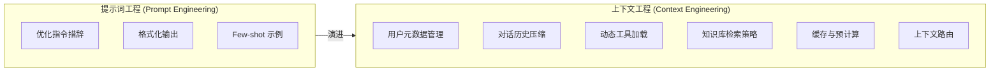

## 2.6 上下文工程：从提示词到系统级优化

2025 年，随着智能体系统复杂度的提升，业界逐渐意识到：仅仅优化提示词已经不够了。一个全新的工程学科正在兴起——**上下文工程 (Context Engineering)**。

> [!IMPORTANT]
> **行业信号**：LangChain CEO Harrison Chase 在 2025 年 Interrupt 大会上指出："Context Engineering 是构建可靠智能体的核心技能。我们需要的不仅仅是 Prompt Engineer，而是智能体工程师（Agent Engineer）——一个融合提示、工程、产品设计和机器学习的新角色。"

### 2.6.1 什么是上下文工程 (Context Engineering)

**上下文工程（Context Engineering）** 是系统性地管理、优化和编排输入给 AI 模型的所有信息的工程学科。

#### 与提示词工程 (Prompt Engineering) 的区别

| 维度 | **提示词工程 (Prompt Engineering)** | **上下文工程 (Context Engineering)** |
|------|-------------------|---------------------|
| 优化对象 | 单个提示词 | 整个信息生态系统 |
| 关注范围 | 指令措辞、格式 | 用户元数据、历史、Schema、工具、缓存 |
| 复杂度 | 相对简单 | 系统工程级别 |
| 动态性 | 通常静态 | 高度动态、上下文感知 |
| 角色 | Prompt Engineer | 智能体工程师 (Agent Engineer) |



### 2.6.2 四大核心策略

LangChain 定义了上下文工程 (Context Engineering) 的四大策略，对应不同的上下文管理场景：

#### Writing Context（写入上下文）

将信息持久化存储，超越即时上下文窗口的限制。

```python
class ContextWriter:
    """将重要信息写入持久化存储"""
    
    def __init__(self, memory_store):
        self.memory = memory_store
    
    def persist_user_preference(self, user_id: str, preference: dict):
        """保存用户偏好，供后续会话使用"""
        self.memory.write(
            key=f"user:{user_id}:preferences",
            value=preference,
            ttl=86400 * 30  # 保留30天
        )
    
    def persist_task_context(self, task_id: str, context: dict):
        """保存任务上下文，支持跨会话恢复"""
        self.memory.write(
            key=f"task:{task_id}:context",
            value={
                "state": context,
                "timestamp": datetime.now().isoformat(),
                "checksum": self._compute_checksum(context)
            }
        )
```

**应用场景**：

- 用户偏好和个性化设置
- 长期任务的进度保存
- 跨会话的知识积累

#### Selecting Context（选择上下文）

从海量信息中检索最相关的内容，只加载必要的上下文。

```python
class ContextSelector:
    """智能选择相关上下文"""
    
    def __init__(self, retriever, reranker):
        self.retriever = retriever
        self.reranker = reranker
    
    def select_relevant_context(
        self, 
        query: str, 
        max_tokens: int = 4000
    ) -> List[str]:
        """选择与查询最相关的上下文片段"""
        
        # 1. 粗筛：向量检索
        candidates = self.retriever.search(query, k=20)
        
        # 2. 精排：重排序模型
        ranked = self.reranker.rank(query, candidates)
        
        # 3. 裁剪：控制 Token 预算
        selected = []
        current_tokens = 0
        for doc in ranked:
            doc_tokens = count_tokens(doc)
            if current_tokens + doc_tokens > max_tokens:
                break
            selected.append(doc)
            current_tokens += doc_tokens
        
        return selected
```

**关键技术**：

- RAG（检索增强生成）
- 多阶段检索（粗筛 + 精排）
- Token 预算管理

#### Compressing Context（压缩上下文）

在保留关键信息的前提下，减少上下文体积。

```python
class ContextCompressor:
    """压缩上下文，保留关键信息"""
    
    def compress_conversation_history(
        self, 
        messages: List[dict],
        max_tokens: int = 2000
    ) -> List[dict]:
        """压缩对话历史"""
        
        total_tokens = sum(count_tokens(m['content']) for m in messages)
        
        if total_tokens <= max_tokens:
            return messages
        
        # 策略1：保留最近N轮 + 摘要早期对话
        recent_messages = messages[-6:]  # 保留最近3轮
        early_messages = messages[:-6]
        
        if early_messages:
            summary = self.llm.generate(f"""
            请用一段话总结以下对话的关键信息：
            {self._format_messages(early_messages)}
            """)
            
            return [
                {"role": "system", "content": f"[早期对话摘要] {summary}"}
            ] + recent_messages
        
        return recent_messages
    
    def compress_document(self, doc: str, query: str) -> str:
        """基于查询压缩文档，只保留相关部分"""
        return self.llm.generate(f"""
        提取以下文档中与问题「{query}」相关的关键信息：
        
        文档：{doc}
        
        只输出相关的关键信息，删除无关内容。
        """)
```

**压缩策略**：

- 对话摘要（Summarization）
- 关键信息提取
- 渐进式遗忘（保留最近，压缩历史）

#### Isolating Context（隔离上下文）

将信息策略性地分配到不同的系统或智能体中。

```python
class ContextIsolator:
    """上下文隔离与路由"""
    
    def route_to_specialist(self, query: str, context: dict) -> str:
        """根据任务类型，路由到专业子 Agent"""
        
        task_type = self.classify_task(query)
        
        # 不同任务类型只接收相关上下文
        if task_type == "code":
            specialist_context = {
                "codebase": context.get("codebase"),
                "lsp_errors": context.get("lsp_errors"),
                "git_diff": context.get("git_diff")
                # 不包含：用户偏好、对话历史等无关信息
            }
            return self.code_agent.run(query, specialist_context)
        
        elif task_type == "research":
            specialist_context = {
                "search_results": context.get("search_results"),
                "knowledge_base": context.get("knowledge_base")
                # 不包含：代码相关上下文
            }
            return self.research_agent.run(query, specialist_context)
```

**隔离原则**：

- 最小知识原则：智能体只获取完成任务所需的信息
- 减少干扰：无关上下文会降低推理精度（Lost in the Middle）
- 安全边界：敏感信息隔离

### 2.6.3 智能体工程师 (Agent Engineer)：新角色的诞生

Harrison Chase 提出，构建可靠智能体需要一种新的复合型人才——**智能体工程师（Agent Engineer）**：

```
┌─────────────────────────────────────────────────────────┐
│               智能体工程师 (Agent Engineer)              │
│  ┌─────────────┐  ┌─────────────┐  ┌─────────────┐     │
│  │  Prompting  │  │ Engineering │  │   Product   │     │
│  │   专家       │  │   工程能力   │  │   设计思维   │     │
│  └─────────────┘  └─────────────┘  └─────────────┘     │
│         │               │               │               │
│         └───────────────┼───────────────┘               │
│                         ▼                               │
│              ┌──────────────────┐                       │
│              │ Context Engineer │                       │
│              │  上下文工程能力   │                       │
│              └──────────────────┘                       │
└─────────────────────────────────────────────────────────┘
```

**核心技能**：

- **Prompting**：精确的指令设计，理解 LLM 行为
2. **Engineering**：系统架构、状态管理、错误处理
3. **Product**：用户体验、边界情况、反馈循环
4. **ML 理解**：模型能力边界、评估方法

### 2.6.4 实战：构建上下文管理系统

```python
class ContextManager:
    """统一的上下文管理器"""
    
    def __init__(self):
        self.writer = ContextWriter(memory_store)
        self.selector = ContextSelector(retriever, reranker)
        self.compressor = ContextCompressor(llm)
        self.isolator = ContextIsolator()
    
    def prepare_context(
        self,
        query: str,
        user_id: str,
        conversation_history: List[dict],
        available_tools: List[dict]
    ) -> dict:
        """为智能体调用准备优化后的上下文"""
        
        # 1. 加载持久化的用户上下文
        user_preferences = self.writer.memory.read(
            f"user:{user_id}:preferences"
        )
        
        # 2. 选择相关知识
        relevant_knowledge = self.selector.select_relevant_context(
            query, max_tokens=4000
        )
        
        # 3. 压缩对话历史
        compressed_history = self.compressor.compress_conversation_history(
            conversation_history, max_tokens=2000
        )
        
        # 4. 过滤相关工具
        relevant_tools = self._filter_relevant_tools(query, available_tools)
        
        return {
            "user_context": user_preferences,
            "knowledge": relevant_knowledge,
            "history": compressed_history,
            "tools": relevant_tools,
            "token_budget": {
                "used": self._count_total_tokens(...),
                "remaining": 8000 - self._count_total_tokens(...)
            }
        }
```

### 2.6.5 核心约束：名义上下文 vs 有效上下文

在进行上下文工程时，必须面对两个物理规律限制：

#### 1. 有效上下文远小于标称值
虽然模型宣称支持 200K 甚至 1M Token，但这不意味着在满载时仍能保持智能。

*   **稀疏注意力**：当上下文过长时，注意力权重被稀释。
*   **经验法则**：编程智能体（Coding Agent）通常只能有效利用 **10-15%** 的上下文窗口。超过 20% 后，性能（推理准确性、指令遵循）开始急剧恶化。

#### 2. 智能陷没区 (The Dumb Zone)
研究发现，上下文窗口的 **中间 40-60% 区域** 存在“Dumb Zone”。

*   **首尾偏好**：Model 倾向于关注开头（System Prompt）和结尾（最新对话）。
*   **中间丢失（Lost in the Middle）**：关键信息如果被淹没在中间的日志海中，很容易被忽略。

> [!TIP]
> **氧气瓶理论**：上下文窗口就像潜水员的氧气瓶。给你一个更大的氧气瓶（2M Token），不代表你能一直潜水直到用完。在深度（复杂度）增加时，耗氧量剧增，你必须在“氧气耗尽”前浮出水面（重启会话）。

### 2.6.6 实战：上下文腐烂与卸载策略

> [!WARNING]
> **上下文腐烂（Context Rot）**：当智能体调用工具次数增多，消息列表不断膨胀，推理性能会出现断崖式下跌——推理变慢、质量下降、甚至开始无意义地重复。

#### 为什么会发生上下文腐烂

```
智能体执行过程：
├── 工具调用 #1 → 返回结果追加到历史
├── 工具调用 #2 → 返回结果追加到历史
├── ...
├── 工具调用 #50 → 历史已膨胀到数万 Token
└── 模型开始"迷失"，输出质量急剧下降
```

**Manus 观察**：典型的智能体任务大约需要调用 50 次工具。Anthropic 报告生产环境中的智能体可能进行数百轮对话。

**关键阈值**：虽然现代模型支持 100万+ Token 的上下文窗口，但**性能衰减往往在 12.8万~20万 Token 时就开始**。这个"腐烂前阈值"（Pre-rot Threshold）是触发上下文缩减的信号。

#### 上下文卸载（Context Offloading）

核心思路：**不要把所有东西都硬塞进智能体的短期记忆里，而是卸载到外部存储，需要时再检索回来**。

```python
class ContextOffloader:
    """上下文卸载管理器"""
    
    def offload_tool_result(self, tool_name: str, result: str) -> str:
        """将冗长的工具结果卸载到文件"""
        if len(result) > 2000:  # 超过阈值
            # 写入文件
            file_path = f"/workspace/outputs/{tool_name}_{uuid4()}.log"
            with open(file_path, 'w') as f:
                f.write(result)
            
            # 返回引用而非完整内容
            return f"[结果已保存至 {file_path}，可用 tail/grep 查看]"
        
        return result
    
    def offload_conversation_history(self, messages: List[dict]) -> str:
        """将完整对话历史卸载到文件"""
        file_path = f"/workspace/history/session_{self.session_id}.json"
        with open(file_path, 'w') as f:
            json.dump(messages, f, ensure_ascii=False)
        
        return file_path
```

### 2.6.7 Manus 两阶段缩减策略

Manus 设计了一套结构化的、有明确触发机制的两阶段缩减流程。

#### 第一阶段：紧凑化（Compaction）— 无损可逆

剥离任何能从外部状态重建的信息：

```python
class ContextCompactor:
    """无损、可逆的上下文紧凑化"""
    
    def compact_tool_calls(self, history: List[dict]) -> List[dict]:
        """紧凑化工具调用记录"""
        compacted = []
        
        for msg in history:
            if msg.get("tool_call"):
                # 例：文件写入操作，只保留 path，移除 content
                if msg["tool_call"]["name"] == "write_file":
                    compacted_call = {
                        "tool_call": {
                            "name": "write_file",
                            "args": {
                                "path": msg["tool_call"]["args"]["path"]
                                # content 已写入文件系统，可随时重建
                            }
                        },
                        "result": "[内容已写入文件]"
                    }
                    compacted.append(compacted_call)
                else:
                    compacted.append(msg)
            else:
                compacted.append(msg)
        
        return compacted
```

**关键原则**：

- 只紧凑化**最早的 50%** 历史记录
- 保留最新的完整工具调用作为 Few-shot 示例
- **可逆性**：任何被剥离的信息都能通过文件路径重建

#### 第二阶段：摘要化（Summarization）— 有损带保险

当紧凑化收益不再明显时，启动摘要化，但需要极其谨慎：

```python
class ContextSummarizer:
    """有损但带保险的摘要化"""
    
    def summarize_with_backup(self, history: List[dict]) -> Tuple[str, str]:
        """摘要化前先创建完整快照"""
        
        # 1. 保险：转储完整上下文到日志文件
        backup_path = f"/workspace/backups/context_{datetime.now()}.json"
        with open(backup_path, 'w') as f:
            json.dump(history, f, ensure_ascii=False)
        
        # 2. 使用完整版本（非紧凑版本）生成摘要
        full_context = self._reconstruct_full_context(history)
        summary = self.llm.generate(f"""
        请总结以下智能体执行历史的关键信息：
        - 完成了哪些任务
        - 关键发现和结论
        - 当前状态
        
        历史记录：
        {full_context}
        """)
        
        # 3. 保留最后几次完整的工具调用（保持连贯性）
        recent_calls = history[-6:]
        
        return summary, backup_path, recent_calls
```

**Manus 经验**：
> "紧凑化是可逆的，而摘要化不是。两者都减少了上下文长度，但行为方式非常不同。" — 季逸超

### 2.6.8 Cursor 动态上下文发现

Cursor 的核心理念：**少即是多**——在开始时提供给模型的细节越少，效果反而越好。

#### 万物皆文件

Cursor 将所有可能的上下文都转化为文件，让智能体按需检索：

```
Cursor 的文件化策略：
├── 工具结果 → 写入 .log 文件
├── 对话历史 → 写入 history.json
├── 终端输出 → 自动同步到本地文件
├── MCP 工具定义 → 同步到文件夹
└── 智能体技能 (Agent Skills) → 同步到文件夹
```

```python
class DynamicContextDiscovery:
    """Cursor 风格的动态上下文发现"""
    
    def __init__(self):
        self.tool_index = {}  # 工具名称 -> 文件路径
        self.sync_tools_to_files()
    
    def sync_tools_to_files(self):
        """将工具定义同步到文件"""
        for tool in self.available_tools:
            file_path = f"/workspace/.tools/{tool['name']}.md"
            with open(file_path, 'w') as f:
                f.write(f"# {tool['name']}\n\n")
                f.write(f"{tool['description']}\n\n")
                f.write(f"## 参数\n```json\n{json.dumps(tool['schema'])}\n```")
            self.tool_index[tool['name']] = file_path
    
    def get_minimal_system_prompt(self) -> str:
        """返回最小化的系统提示词"""
        tool_names = list(self.tool_index.keys())
        return f"""
        你是一个智能助手。
        
        可用工具列表：{', '.join(tool_names)}
        
        工具详情在 /workspace/.tools/ 目录下。
        需要使用某个工具时，先用 cat 或 grep 查看其详细定义。
        """
```

**A/B 测试结果**：对于调用了 MCP 工具的任务，Cursor 的动态发现策略将 Token 消耗降低了 **46.9%**。

### 2.6.9 分层行动空间：解决工具过载

当智能体配备的工具越来越多，会出现**上下文混淆**——模型可能调用错误的工具，甚至幻觉出不存在的工具。

Manus 的解决方案：**分层行动空间**。

```
┌─────────────────────────────────────────────────────────────┐
│                      分层行动空间                            │
│                                                              │
│  ┌────────────────────────────────────────────────────────┐ │
│  │ L1: 原子函数调用 (固定、KV 缓存友好)                     │ │
│  │     read_file, write_file, shell, search                │ │
│  └────────────────────────────────────────────────────────┘ │
│                           │ 通过 shell 访问                  │
│                           ▼                                  │
│  ┌────────────────────────────────────────────────────────┐ │
│  │ L2: 沙箱工具 (预装在 VM 中)                              │ │
│  │     格式转换器、语音识别、mcp_cli...                     │ │
│  │     Agent 用 `ls /bin` 发现，用 `--help` 学习            │ │
│  └────────────────────────────────────────────────────────┘ │
│                           │ 通过代码调用                     │
│                           ▼                                  │
│  ┌────────────────────────────────────────────────────────┐ │
│  │ L3: 软件包与 API (代码层)                                │ │
│  │     Python 库、预授权的第三方 API                        │ │
│  │     适合大量计算、不塞入上下文的任务                     │ │
│  └────────────────────────────────────────────────────────┘ │
└─────────────────────────────────────────────────────────────┘
```

**为什么这样设计**：

1. **L1 固定不变**：原子级函数定义稳定，不会频繁变化，对 KV 缓存友好
2. **L2 按需发现**：工具在沙箱中，Agent 像开发者一样用 `ls`、`--help` 自行探索
3. **L3 代码执行**：复杂计算写 Python 脚本，只返回摘要结果

> "从模型的角度看，无论想使用 L2 还是 L3 的复杂工具，最终都通过 L1 的那几个原子函数执行。这种接口设计，对模型极度简洁，且缓存稳定。" — 季逸超

### 2.6.10 设计哲学：避免过度工程化

Manus 和 Cursor 的核心理念惊人一致：

| 原则 | Cursor | Manus |
|------|--------|-------|
| 核心思路 | "少即是多" | "少构建，多理解" |
| 上下文策略 | 动态发现，按需加载 | 卸载到外部，需要时检索 |
| 工具管理 | 文件化定义，智能体自行查阅 | 分层行动空间，L1 固定 |
| 迭代方向 | 简化架构 | 移除不必要的技巧 |

> "回顾 Manus 发布以来的六七个月，我们见过的最大的飞跃，不是来自增加了更多花哨的上下文管理层或巧妙的检索技巧，它们都来自于简化，来自于移除不必要的技巧，以及对模型多一点的信任。" — 季逸超

**上下文工程的目标是让模型的工作变得更简单，而不是更难。**

> [!IMPORTANT]
> **智能体工程的核心定律**
> 
> *"中等模型 + 精心设计的流程"，远胜于"顶级模型 + 混乱的架构"。*
> 
> 模型能力是地基，但流程设计才是上层建筑。一个经过深思熟虑的上下文管理策略、清晰的工具编排、合理的记忆架构，能够让普通模型发挥出超越其"纸面参数"的表现。反之，即使使用最强大的模型，如果塞入杂乱无章的上下文、缺乏结构化的工具定义，也会让模型"迷失"在信息噪音中。
>
> **这是智能体工程师最重要的认知升级：把精力从"追逐更大的模型"转向"设计更优的系统"。**

### 2.6.11 小结

Context Engineering 代表了 AI 应用开发的范式升级：

| 阶段 | 关注点 | 复杂度 |
|------|--------|--------|
| Prompt Engineering | 优化单次调用 | 低 |
| Context Engineering | 管理信息生态 | 高 |
| 智能体工程 (Agent Engineering) | 构建自主系统 | 最高 |

**核心原则**：

1. **精确控制**：智能体的输出质量取决于输入上下文的质量
2. **动态适应**：上下文应根据任务、用户、环境动态调整
3. **资源意识**：Token 是昂贵的，必须高效利用
4. **系统思维**：将上下文管理视为独立的工程子系统
5. **少即是多**：避免过度工程化，信任模型能力

> [!TIP]
> **延伸阅读**：
> - Cursor: [Dynamic Context Discovery](https://cursor.com/cn/blog/dynamic-context-discovery)
> - Manus: [Context Engineering for AI Agents](https://manus.im/blog/context-engineering-for-ai-agents) (英文原版)

---

**下一节**: [本章小结](summary.md)
