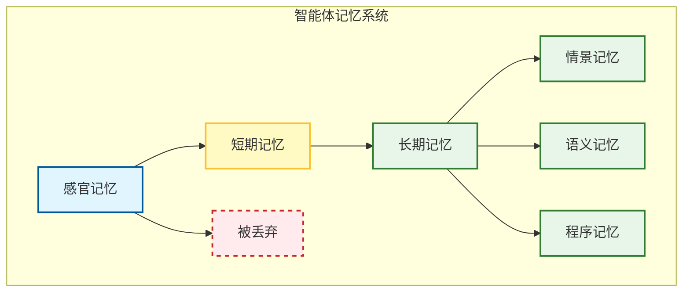
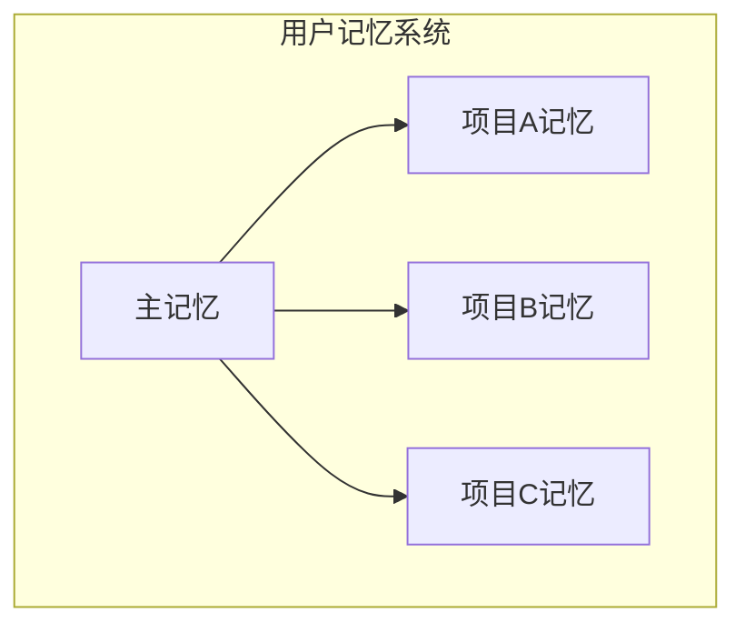

## 3.1 记忆的认知模型：工作记忆 vs 长期记忆

### 3.1.1 为什么智能体需要记忆

大语言模型的本质是无状态的函数。虽然最新的 Gemini 2.0 支持 2M+ 的**上下文窗口**，但在实际工程中，完全依赖上下文窗口面临三个核心挑战：

| 挑战 | 问题描述 | 影响 |
|------|----------|------|
| **成本** | 每次都把整本书塞进提示词，Token 费用极其高昂 | 运营成本激增 |
| **延迟** | 处理长文本会导致首字生成延迟显著增加 | 用户体验下降 |
| **注意力稀释** | 当上下文过长时，模型容易忽略中间的信息 | 回答质量不稳定 |

> **中间丢失（Lost in the Middle）现象**：研究表明，LLM 对上下文开头和结尾的信息记忆最好，中间部分容易被"遗忘"。这意味着简单地堆砌更多上下文并不能保证更好的结果。

因此，我们需要构建一个类似于人类大脑的记忆系统，让智能体能够**高效地存储**和**精准地检索**信息。

---

### 3.1.2 记忆的解剖学分类

受人类认知科学启发，智能体的记忆通常被划分为以下几类：



#### 感官记忆

这是最瞬时的记忆，对应智能体接收到的原始输入：

- 用户发来的文字
- API 返回的 JSON
- 图片的像素数据
- 音频的波形信号

感官记忆通常只在处理当前请求 (Request) 的瞬间存在，随后转化为短期记忆或被丢弃。

#### 短期记忆

**定义**：当前对话的**上下文**。

**技术载体**：运行时为 LLM 的上下文窗口；物理存储通常使用内存、缓存、数据库或本地文件。

**容量限制**：受限于模型的上下文窗口（如 8k - 200k tokens）。

**管理策略**：

| 策略 | 方法 | 适用场景 |
|------|------|----------|
| **FIFO** | 先进先出，删掉最早的对话 | 简单场景 |
| **Summarization** | 定期让 LLM 摘要前 N 轮对话 | 长对话 |
| **Sliding Window** | 保留最近 K 轮对话 | 实时交互 |
| **重要性加权** | 根据相关性保留关键信息 | 复杂任务 |

**摘要压缩示例**：

```python
def compress_context(history: List[Message], max_tokens: int) -> str:
    """当历史对话过长时，进行摘要压缩"""
    if count_tokens(history) <= max_tokens:
        return format_history(history)
    
    # 将旧对话压缩为摘要
    old_messages = history[:-5]  # 保留最近5轮
    summary = llm.summarize(old_messages)
    
    return f"[历史摘要]: {summary}\n\n" + format_history(history[-5:])
```

#### 长期记忆

**定义**：跨越**会话 (Session)** 存在的持久化知识。

**技术载体**：向量数据库、知识图谱、文件系统（如 Markdown/JSON 归档）或传统数据库 (SQL/NoSQL)。

**细分类型**：

| 类型 | 说明 | 存储方式 |
|------|------|----------|
| **情景记忆** | 具体事件（"用户上周说他对花生过敏"） | 向量数据库 |
| **语义记忆** | 世界知识（"北京是中国首都"） | RAG 知识库 |
| **程序记忆** | 技能（"如何调用支付 API"） | 工具描述/技能 (Skills) |

---

### 3.1.3 核心技术：RAG 与向量检索

**RAG（Retrieval-Augmented Generation）** 是构建长期记忆的事实标准。其核心流程如下：

#### Step 1: 索引阶段


1. **加载**：读取 PDF、Markdown、Notion 等源文件
2. **切片**：将长文切成小块（如每块 500 tokens）

   - 切太碎会丢失语义
   - 切太大包含噪声
   - 高级技巧：**父文档检索器（Parent Document Retriever）** —— 索引时用小切片（精准），返回时给大父文档（上下文完整）
3. **嵌入**：使用 Embedding 模型将文本转化为高维向量

   - 常用模型：OpenAI `text-embedding-3`, Cohere, BGE
   - 相似意思的句子，在向量空间中距离更近
4. **存储**：存入向量数据库

   - Pinecone, Milvus, Qdrant, Weaviate, pgvector 等

#### Step 2: 检索与生成阶段

1. **查询嵌入**：将用户的问题转化为向量
2. **相似度搜索**：使用余弦相似度找出 Top-K 最相关的切片
3. **重排序**：使用 Re-rank 模型对 Top-K 结果进行精排

   - 向量搜索只能看语义相似，未必看逻辑相关
   - Cohere Rerank, BGE Reranker 等可剔除不相关结果
4. **生成**：将筛选后的切片填入提示词

```python
def rag_query(question: str, top_k: int = 5) -> str:
    """RAG 检索增强生成"""
    # 1. 查询嵌入
    query_vector = embed(question)
    
    # 2. 向量检索
    candidates = vector_db.search(query_vector, top_k=top_k * 2)
    
    # 3. 重排序
    reranked = reranker.rank(question, candidates)[:top_k]
    
    # 4. 构造 Prompt
    context = "\n\n".join([doc.content for doc in reranked])
    prompt = f"""请根据以下背景知识回答用户问题。

背景知识：
{context}

用户问题：{question}

回答："""
    
    return llm.generate(prompt)
```

---

### 3.1.4 进阶：知识图谱与混合检索

向量检索并非万能。它擅长模糊匹配，但不擅长处理精确的关系查询。

**问题示例**：用户问"马斯克的第二任妻子的母亲是谁？"

**向量检索的缺陷**：可能搜到很多八卦新闻，但很难通过多跳推理找到确切的人名。

#### 知识图谱解决方案

**知识图谱**存储的是结构化三元组：

```
(Elon Musk, married_to, Talulah Riley)
(Talulah Riley, mother, Una Riley)
```

#### GraphRAG：混合检索

结合**知识图谱 (Knowledge Graph)** 和**向量数据库** 的 **GraphRAG** 技术正在兴起：

1. 先通过图谱找到实体链接关系
2. 再通过向量补充非结构化描述
3. 让智能体书写 Cypher/SPARQL 查询语句来查询图谱

```cypher
// 查询示例
MATCH (elon:Person {name: "Elon Musk"})-[:MARRIED_TO]->(wife:Person)
MATCH (wife)-[:HAS_MOTHER]->(mother:Person)
RETURN mother.name
```

#### 记忆管理的未来：MemGPT

**MemGPT** 是一种将记忆管理封装为类似操作系统页面管理（Paging）的方法。核心思想：

- 智能体自主决定记什么、忘什么
- 像 OS 的虚拟内存一样，在主存和磁盘之间调度数据
- 支持无限上下文长度

---

### 3.1.4 产品级实现：Claude Memory

Anthropic 在 2025 年为 Claude 引入了原生记忆功能，展示了产品级记忆系统的最佳实践。

#### 项目范围隔离

Claude 为每个 **Project** 创建独立的记忆空间：



**设计原则**：

- **隔离性**：产品发布规划与客户工作分开；机密讨论与日常运营隔离
- **并行支持**：多个复杂项目可同时进行而不混淆细节
- **安全边界**：敏感对话被限制在其项目范围内

#### 记忆摘要机制

Claude 使用记忆摘要（Memory Summary）在一个地方捕获所有记忆：

```python
# 记忆摘要示例结构
memory_summary = {
    "user_preferences": {
        "communication_style": "简洁、技术性",
        "output_format": "Markdown 为主",
    },
    "project_context": {
        "current_sprint": "Sprint 23",
        "tech_stack": ["Python", "React", "PostgreSQL"],
    },
    "learned_patterns": {
        "code_style": "函数式优先，避免类",
        "review_focus": ["安全", "性能"],
    }
}
```

用户可以在设置中查看 Claude 记住的内容，并随时通过对话更新摘要。

#### 隐身聊天模式

有时你需要 Claude 的帮助，但不想使用或添加记忆。**Incognito Chat** 提供了一个干净的起点：

| 场景 | 使用隐身模式的原因 |
|------|-------------------|
| 敏感头脑风暴 | 不留记录的创意探索 |
| 机密战略讨论 | 保护商业机密 |
| 临时对话 | 不想污染正式记忆 |

> **用户控制**：Claude Memory 完全可选。用户可以：
> - 随时启用/禁用记忆功能
> - 查看和编辑记忆内容
> - 告诉 Claude 关注或忽略特定信息
> - 通过隐身模式进行不保存的对话

#### 企业部署考量

对于 Team 和 Enterprise 计划：

- **管理员控制**：管理员可以选择为整个组织禁用记忆功能
- **数据保留**：遵循组织的标准数据保留设置
- **安全审计**：所有记忆操作可被审计跟踪

> 这种设计体现了记忆系统的核心权衡：**能力 vs 控制**。记忆让 AI 变得更有用，但用户必须始终保持对数据的完全控制权。

### 3.1.5 本节小结

记忆是 Agent 积累经验的基础。没有记忆，Agent 永远只是一个初出茅庐的新手；有了记忆，它才能成为懂你习惯、知识渊博的专家。

| 记忆类型 | 载体 | 生命周期 | 检索方式 |
|----------|------|----------|----------|
| 感官记忆 | 原始输入 | 毫秒级 | 即时处理 |
| 短期记忆 | 上下文窗口 | 单次会话 | 直接访问 |
| 长期记忆 | 向量/图数据库 | 永久 | RAG/GraphRAG |

关键技术选型：

- **简单场景**：纯向量 RAG
- **关系查询**：GraphRAG
- **超长上下文**：MemGPT 架构

---

**下一节**: [向量数据库选型：Pinecone、Weaviate、Chroma](3.2_vector_databases.md)