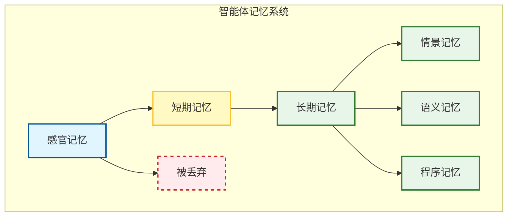
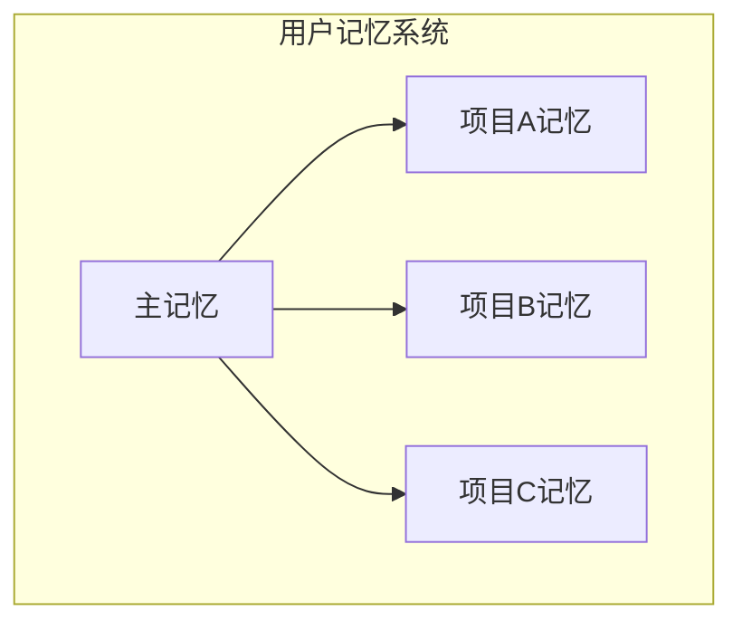

## 3.1 记忆的认知模型

### 3.1.1 为什么智能体需要记忆

大语言模型的本质是无状态的函数。虽然最新的 Gemini 2.0 支持 2M+ 的 **上下文窗口**，但在实际工程中，完全依赖上下文窗口面临三个核心挑战：

| 挑战 | 问题描述 | 影响 |
|------|----------|------|
| **成本** | 每次都把整本书塞进提示词，Token 费用极其高昂 | 运营成本激增 |
| **延迟** | 处理长文本会导致首字生成延迟显著增加 | 用户体验下降 |
| **注意力稀释** | 当上下文过长时，模型容易忽略中间的信息 | 回答质量不稳定 |

> **中间丢失（Lost in the Middle）现象**：研究表明，LLM 对上下文开头和结尾的信息记忆最好，中间部分容易被"遗忘"。这意味着简单地堆砌更多上下文并不能保证更好的结果。

因此，我们需要构建一个类似于人类大脑的记忆系统，让智能体能够 **高效地存储** 和 **精准地检索** 信息。

---

### 3.1.2 记忆的解剖学分类

受人类认知科学启发，智能体的记忆通常被划分为以下几类：感官记忆、短期记忆、长期记忆。



图 3-1：智能体记忆系统分类 (Classification of Agent Memory Systems)

> 上图展示了记忆从感官输入到长期存储的流转过程：感官记忆是最短暂的，大部分信息会被丢弃；少量重要信息进入短期记忆（上下文窗口），经过筛选后才会持久化到长期记忆。

#### 感官记忆

这是最瞬时的记忆，对应智能体接收到的原始输入：

- 用户发来的文字
- API 返回的 JSON
- 图片的像素数据
- 音频的波形信号

感官记忆通常只在处理当前请求的瞬间存在，随后转化为短期记忆或被丢弃。

#### 短期记忆

短期记忆是指当前对话的 **上下文**。在运行时，它对应 LLM 的上下文窗口；物理存储通常使用内存、缓存、数据库或本地文件。其容量受限于模型的上下文窗口（如 8k - 200k tokens）。

**管理策略**：

| 策略 | 方法 | 适用场景 |
|------|------|----------|
| **先进先出** | 先进先出，删掉最早的对话 | 简单场景 |
| **摘要** | 定期让 LLM 摘要前 N 轮对话 | 长对话 |
| **滑动窗口** | 保留最近 K 轮对话 | 实时交互 |
| **重要性加权** | 根据相关性保留关键信息 | 复杂任务 |

**摘要压缩示例**：

```python
def compress_context(history: List[Message], max_tokens: int) -> str:
    """当历史对话过长时，进行摘要压缩"""
    if count_tokens(history) <= max_tokens:
        return format_history(history)
    
    # 将旧对话压缩为摘要

    old_messages = history[:-5]  # 保留最近5轮
    summary = llm.summarize(old_messages)
    
    return f"[历史摘要]: {summary}\n\n" + format_history(history[-5:])
```

#### 长期记忆

长期记忆是跨越 **会话** 存在的持久化知识。技术载体包括向量数据库、知识图谱、文件系统（如 Markdown/JSON 归档）或传统数据库 (SQL/NoSQL)。长期记忆可细分为以下类型：

| 类型 | 说明 | 存储方式 |
|------|------|----------|
| **情景记忆** | 具体事件（"用户上周说他对花生过敏"） | 向量数据库 |
| **语义记忆** | 世界知识（"北京是中国首都"） | RAG 知识库 |
| **程序记忆** | 技能（"如何调用支付 API"） | 工具描述/技能 (Skills) |

---

### 3.1.3 记忆的工程映射

我们将认知科学中的记忆模型映射到具体的工程实现中：

| 认知模型 | 对应工程组件 | 详细章节 |
|----------|--------------|----------|
| **短期记忆 (Short-term Memory)** | 上下文窗口, KV Cache | [3.2 短期记忆管理](3.2_short_term_memory.md) |
| **长期记忆 (Long-term Memory)** | 向量数据库, RAG | [3.3 长期记忆与向量数据库](3.3_vector_databases.md) <br> [3.4 RAG 系统设计与优化](3.4_rag_advanced.md) |
| **关联/结构化记忆** | 知识图谱 | [3.5 图记忆与知识图谱](3.5_graph_memory.md) |
| **记忆系统架构** | 系统设计, 上下文策略 | [3.6 上下文工程](3.6_context_engineering.md) |

在后续章节中，我们将深入探讨这些组件的具体选型与实现。

---

### 3.1.4 记忆管理的未来：MemGPT

**MemGPT** 是一种将记忆管理封装为类似操作系统页面管理（Paging）的方法。核心思想：

- 智能体自主决定记什么、忘什么
- 像 OS 的虚拟内存一样，在主存和磁盘之间调度数据
- 支持无限上下文长度

---

### 3.1.5 案例：Claude Memory

Anthropic 在 2025 年为 Claude 引入了原生记忆功能，展示了产品级记忆系统的最佳实践。

#### 项目范围隔离

Claude 为每个 **Project** 创建独立的记忆空间：



图 3-2：Claude 项目级记忆空间 (Claude Project-Level Memory Space)

**设计原则**：

- **隔离性**：产品发布规划与客户工作分开；机密讨论与日常运营隔离
- **并行支持**：多个复杂项目可同时进行而不混淆细节
- **安全边界**：敏感对话被限制在其项目范围内

#### 记忆摘要机制

Claude 使用记忆摘要（Memory Summary）在一个地方捕获所有记忆：

```python
# 记忆摘要示例结构

memory_summary = {
    "user_preferences": {
        "communication_style": "简洁、技术性",
        "output_format": "Markdown 为主",
    },
    "project_context": {
        "current_sprint": "Sprint 23",
        "tech_stack": ["Python", "React", "PostgreSQL"],
    },
    "learned_patterns": {
        "code_style": "函数式优先，避免类",
        "review_focus": ["安全", "性能"],
    }
}
```

用户可以在设置中查看 Claude 记住的内容，并随时通过对话更新摘要。

#### 隐身模式

有时你需要 Claude 的帮助，但不想使用或添加记忆。**隐身模式** 提供了一个干净的起点：

| 场景 | 使用隐身模式的原因 |
|------|-------------------|
| 敏感头脑风暴 | 不留记录的创意探索 |
| 机密战略讨论 | 保护商业机密 |
| 临时对话 | 不想污染正式记忆 |

> **用户控制**：Claude Memory 完全可选。用户可以：
> - 随时启用/禁用记忆功能
> - 查看和编辑记忆内容
> - 告诉 Claude 关注或忽略特定信息
> - 通过隐身模式进行不保存的对话

#### 企业部署考量

对于企业部署，要重点考虑以下几点：

- **管理员控制**：管理员可以选择为整个组织禁用记忆功能
- **数据保留**：遵循组织的标准数据保留设置
- **安全审计**：所有记忆操作可被审计跟踪

> 这种设计体现了记忆系统的核心权衡：**能力 vs 控制**。记忆让 AI 变得更有用，但用户必须始终保持对数据的完全控制权。

---

**下一节**: [3.2 短期记忆算法](3.2_short_term_memory.md)
