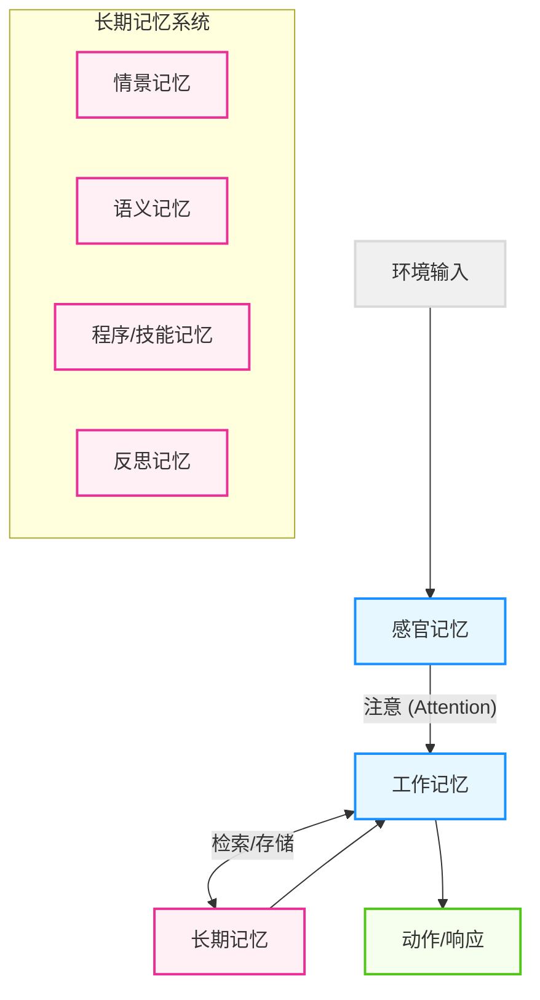

## 3.1 记忆的认知模型

在设计智能体（Agent）之前，需要先回答一个根本性问题：**智能体的"记忆"到底是什么？**

如果不理解记忆的本质，很容易陷入"把所有东西都塞进把向量数据库"的误区。本节将从认知科学和计算机工程的双重视角，重新解构智能体的记忆系统。

### 3.1.1 参数记忆 vs 非参数记忆

首先，需要区分两种最基础的记忆形态：

#### 1. 参数记忆
这是模型 **内部** 的记忆，存储在神经网络的权重（Weights）中。
*   **类比**：人类的**本能**与**潜意识知识**。
*   **特点**：
    *   **难以修改**：需要昂贵的训练（Training）或微调（Fine-tuning）才能更新。
    *   **模糊**：信息被压缩为概率分布，容易产生"幻觉"（Hallucination）。
    *   **静态**：截止于训练结束的那一刻（Knowledge Cutoff）。

#### 2. 非参数记忆
这是模型 **外部** 的记忆，通常以文本、向量或结构化数据的形式存在。
*   **类比**：人类的**笔记**、**书本**或**外脑**。
*   **特点**：
    *   **易通过检索获取**：通过 RAG（检索增强生成）或工具调用即时读取。
    *   **精确**：可以逐字逐句地引用原始记录。
    *   **动态**：可以随时插入、更新或删除。

> **Agent 的核心**：智能体系统的本质，就是构建一个强大的 **非参数记忆系统**，以弥补大模型参数记忆的滞后性和不准确性。

---

### 3.1.2 认知架构：从 Atkinson-Shiffrin 到现代 Agent

受 1968 年 Atkinson-Shiffrin 的多重存储模型（Multi-Store Model）启发，现代智能体的记忆架构通常被划分为三个层级：感官记忆、工作记忆、长期记忆。



图 3-1：Atkinson-Shiffrin 多重存储模型

#### 1. 感官记忆
*   **定义**：原始输入的瞬时缓冲区。
*   **Agent 映射**：
    *   用户输入的原始提示词。
    *   多模态输入（图片像素、音频波形）。
    *   API 返回的原始 JSON 数据。
*   **特点**：容量大但衰减极快。如果不被"注意"（写入上下文窗口），就会立即消失。

#### 2. 工作记忆
*   **定义**：当前正在**活跃处理**的信息及其推理过程。这不仅仅是"短期记忆"，更强调**加工**（Processing）能力。
*   **Agent 映射**：**上下文窗口 (Context Window)**。
*   **关键组件**：
    *   **语音回路 (Phonological Loop)**：对应的对话历史（Chat History）。
    *   **视觉空间画板 (Visuo-Spatial Sketchpad)**：对应的多模态输入处理。
    *   **中央执行系统 (Central Executive)**：对应的 **CoT (Chain of Thought)** 推理过程。
*   **限制**：虽然现代模型早已支持百万级上下文，但"注意力稀释"（Lost in the Middle）现象依然存在——窗口越大，推理精度越低。

#### 3. 长期记忆
这是 Agent 区别于普通 Chatbot 的关键。它分为四类：

| 类型 | 定义 | 人类例子 | Agent 映射 | 存储介质 |
| :--- | :--- | :--- | :--- | :--- |
| **情景记忆** | 个人经历的序列纪录 | "我昨天吃了寿司" | 对话日志、交互历史 | 向量数据库 (Vector DB) |
| **语义记忆** | 事实与世界知识 | "寿司是日本食物" | 领域文档、百科知识 | 知识图谱 (Knowledge Graph) / RAG |
| **程序记忆** | 执行任务的技能 | "如何骑自行车" | 工具 (Tools)、代码解释器 | 函数定义 (Function Schemas) |
| **反思记忆** | 元认知与经验教训 | "我不该空腹吃生鲜" | 优化后的 Prompt、SOP 改进 (e.g., `.cursor/rules`) | 提示词库 / 元数据存储 |

> **补充：反思记忆**
> 许多架构忽略了这一点。反思记忆是智能体**自我进化**的关键。当 Agent 犯错并修正后，它应该将"教训"存储下来（例如："查询 SQL 时对于日期字段必须加引号"）。下次遇到类似任务时，先检索"经验教训"，而非重蹈覆辙。

---

### 3.1.3 记忆的工程映射

下文将上述认知模型映射到具体的工程组件：

| 认知组件 | 工程实现 | 数据结构示例 |
| :--- | :--- | :--- |
| **工作记忆** | **Context Window** | `[{"role": "user", "content": "..."}, {"role": "assistant", "content": "..."}]` |
| **情景记忆** | **Vector DB** | `vector(embedding) -> {"text": "User prefers python", "timestamp": 1712345678}` |
| **语义记忆** | **Graph DB / RAG** | `(Entity: Python) --[is_a]--> (Language)` |
| **程序记忆** | **Tools / Plugins** | `def search_web(query): ...` |

---

### 3.1.4 理论溯源与进阶架构

#### 斯坦福小镇 (Generative Agents)
2023 年 Google 与斯坦福的论文 *Generative Agents: Interactive Simulacra of Human Behavior* 定义了记忆检索的三大黄金法则：
1.  **近期性 (Recency)**：刚发生的事情权重更高。
2.  **重要性 (Importance)**：对 Agent 目标影响大的事情权重更高（例如"结婚" vs "吃早饭"）。
3.  **相关性 (Relevance)**：与当前 Context 语义相似度高的事情权重更高。

$$Score = \alpha \cdot Recency + \beta \cdot Importance + \gamma \cdot Relevance$$

#### MemGPT: 操作系统隐喻
MemGPT 引入了 OS 的概念：
*   **Main Context (RAM)**：昂贵、有限。
*   **External Context (Disk)**：廉价、无限。
*   **Paging (分页)**：Orchestrator 动态决定将哪些记忆页（Memory Pages）从磁盘加载到 RAM，或将 RAM 中的闲置信息 Swap 到磁盘。

---

### 3.1.5 案例：Claude Memory 机制

Anthropic 在 2025 年推出的 Claude Memory 是一个典型的 **"用户感知型"反思记忆** 系统。它不只是简单地存储对话日志，而是提取用户的 **偏好 (Preferences)** 和 **背景 (Context)**。

#### 核心机制
它不是 RAG 那样的"查文档"，而是维护一个动态更新的 **Profile**：

```json
{
  "user_profile": {
    "coding_style": "Prefer TypeScript over JavaScript, use strict types",
    "role": "Frontend Architect",
    "project_context": "Working on a Next.js 15 dashboard"
  }
}
```

当用户说："别用 `any`！"，Claude 会更新 Profile："User dislikes `any` types"。
这种机制极大地减少了重复指令（Repetitive Prompting），是提升用户体验的低成本高收益手段。

---

**下一节**: [3.2 短期记忆管理](3.2_short_term_memory.md) 将深入探讨如何高效管理昂贵的 Context Window。

