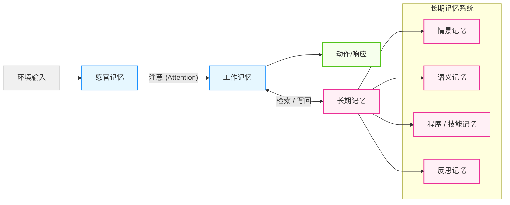

## 3.1 记忆的认知模型

在设计智能体（Agent）之前，需要先回答一个根本性问题：**智能体的“记忆”到底是什么？**

如果不理解记忆的本质，很容易陷入“把所有东西都塞进向量数据库”的误区。本节先从认知科学视角拆出不同记忆层，再给出这些层在 Agent 设计里的含义，为后续“窗口管理、长期存储、检索与上下文工程”建立共同语言。

### 3.1.1 参数记忆与非参数记忆

首先，需要区分两种最基础的记忆形态：

#### 1. 参数记忆

这是模型 **内部** 的记忆，存储在神经网络的权重（Weights）中。
* **类比**：人类的 **本能** 与 **潜意识知识**。
* **特点**：
    * **难以修改**：需要昂贵的训练（Training）或微调（Fine-tuning）才能更新。
    * **模糊**：信息被压缩为概率分布，容易产生“幻觉”（Hallucination）。
    * **静态**：截止于训练结束的那一刻（Knowledge Cutoff）。

#### 2. 非参数记忆

这是模型 **外部** 的记忆，通常以文本、向量或结构化数据的形式存在。
* **类比**：人类的 **笔记**、**书本** 或 **外脑**。
* **特点**：
    * **易通过检索获取**：通过 RAG（检索增强生成）或工具调用即时读取。
    * **精确**：可以逐字逐句地引用原始记录。
    * **动态**：可以随时插入、更新或删除。

> **Agent 的核心**：智能体系统的本质，就是构建一个强大的 **非参数记忆系统**，以弥补大模型参数记忆的滞后性和不准确性。

---

### 3.1.2 认知架构：从 Atkinson-Shiffrin 到现代智能体

受 1968 年 Atkinson-Shiffrin 的多重存储模型（Multi-Store Model）启发，现代智能体的记忆架构通常被划分为三个层级：感官记忆、工作记忆、长期记忆。


```mermaid
flowchart LR
    classDef env fill:#f0f0f0,stroke:#d9d9d9,stroke-width:2px;
    classDef agent fill:#e6f7ff,stroke:#1890ff,stroke-width:2px;
    classDef memory fill:#fff0f6,stroke:#eb2f96,stroke-width:2px;
    classDef tool fill:#f6ffed,stroke:#52c41a,stroke-width:2px;

    Input["环境输入"] --> Sensory["感官记忆"]
    Sensory -->|"注意 (Attention)"| Working["工作记忆"]
    Working --> Output["动作/响应"]
    Working <-->|"检索 / 写回"| LongTerm["长期记忆"]

    subgraph LongTermSystem ["长期记忆系统"]
        direction TB
        Episodic["情景记忆"]
        Semantic["语义记忆"]
        Procedural["程序 / 技能记忆"]
        Reflective["反思记忆"]
    end

    LongTerm --> Episodic
    LongTerm --> Semantic
    LongTerm --> Procedural
    LongTerm --> Reflective

    class Input env;
    class Sensory,Working agent;
    class LongTerm,Episodic,Semantic,Procedural,Reflective memory;
    class Output tool;
```

图 3-1：Atkinson-Shiffrin 多重存储模型

#### 1. 感官记忆

* **定义**：原始输入的瞬时缓冲区。
* **Agent 映射**：
    *   用户输入的原始提示词。
    *   多模态输入（图片像素、音频波形）。
    *   API 返回的原始 JSON 数据。
* **特点**：容量大但衰减极快。如果不被“注意”（写入上下文窗口），就会立即消失。

#### 2. 工作记忆

* **定义**：当前正在 **活跃处理** 的信息及其推理过程。这不仅仅是“短期记忆”，更强调 **加工**（Processing）能力。
* **Agent 映射**：**上下文窗口 (Context Window)**。
* **关键组件**：
    * **语音回路 (Phonological Loop)**：对应的对话历史（Chat History）。
    * **视觉空间画板 (Visuo-Spatial Sketchpad)**：对应的多模态输入处理。
    * **中央执行系统 (Central Executive)**：对应的 **CoT (Chain of Thought)** 推理过程。
* **限制**：虽然一些模型已支持更长的上下文窗口，但“注意力稀释”（Lost in the Middle）现象依然存在——窗口越大，推理精度越低。

#### 3. 长期记忆

这是 Agent 区别于普通 Chatbot 的关键。它分为四类：

| 记忆类型 | 定义 | 人类例子 | Agent 映射 | 存储介质 |
| :--- | :--- | :--- | :--- | :--- |
| **情景** | 个人经历的序列纪录 | “我昨天吃了寿司” | 对话日志、交互历史 | 向量数据库 (Vector DB) |
| **语义** | 事实与世界知识 | “寿司是日本食物” | 领域文档、百科知识 | 知识图谱 (Knowledge Graph) / RAG |
| **程序** | 执行任务的技能 | “如何骑自行车” | 工具 (Tools)、代码解释器 | 函数定义 (Function Schemas) |
| **反思** | 元认知与经验教训 | “我不该空腹吃生鲜” | 优化后的 Prompt、SOP 改进 (e.g., `.cursor/rules`) | 提示词库 / 元数据存储 |

> **补充：反思记忆**
> 许多架构忽略了这一点。反思记忆是智能体 **自我进化** 的关键。当 Agent 犯错并修正后，它应该将“教训”存储下来（例如：“查询 SQL 时对于日期字段必须加引号”）。下次遇到类似任务时，先检索“经验教训”，而非重蹈覆辙。该机制与第 2 章的反思框架紧密协作。

到这里，可以先抓住一个简化判断：**感官记忆决定输入如何进入系统，工作记忆决定模型此刻能处理什么，长期记忆决定系统跨轮次保留什么。** 后面章节并不是重复这套分类，而是分别回答三个工程问题：工作记忆怎么管、长期记忆怎么存、存下来以后怎样在任务里被正确召回和使用。

---

### 3.1.3 从认知模型到系统设计

认知模型的价值，不在于做一张“术语对照表”，而在于帮助我们明确每一层真正要解决的问题：

| 认知组件 | 在 Agent 中真正要解决的问题 | 后续对应章节 |
| :--- | :--- | :--- |
| **工作记忆** | 当前轮次哪些信息必须进入上下文窗口，哪些应被裁剪、压缩或延后使用 | 3.2、3.6 |
| **情景记忆** | 交互经历如何跨会话保留，并在需要时按时间与语境被召回 | 3.3、3.4 |
| **语义记忆** | 稳定事实与知识关系如何被组织，而不只是按语义相似度堆叠 | 3.4、3.5 |
| **程序记忆** | “会做事的方法”如何沉淀为工具、技能或稳定流程 | 3.6 及后续工具章节 |
| **反思记忆** | 错误与经验如何转化为下次可执行的约束和规则 | 3.6，并与第 2 章联动 |

这里先建立问题框架，不急着进入具体实现。比如“窗口怎么压缩”属于 3.2，“长期记忆的存储底座怎么选”属于 3.3，“检索与图结构如何组织”属于 3.4 和 3.5，“怎样把记忆、工具、提示词和安全约束合成一个系统”则属于 3.6。

---

### 3.1.4 理论启发：从检索评分到分层记忆

#### 斯坦福小镇：Generative Agents

在论文 [Generative Agents: Interactive Simulacra of Human Behavior](https://arxiv.org/abs/2304.03442) 中，研究人员提出了记忆检索的三条核心经验打分法则：
1. **近期性 (Recency)**：刚发生的事情权重更高。
2. **重要性 (Importance)**：对智能体目标影响大的事情权重更高（例如“结婚”与“吃早饭”）。
3. **相关性 (Relevance)**：与当前上下文语义相似度高的事情权重更高。

$$Score = \alpha \cdot Recency + \beta \cdot Importance + \gamma \cdot Relevance$$

#### MemGPT: 操作系统隐喻

论文 [MemGPT: Towards LLMs as Operating Systems](https://arxiv.org/abs/2310.08560) 借用了操作系统”虚拟内存”的思路来管理智能体的记忆。这里要注意时间线口径：Letta 官方在 **2024-09-23** 宣布”MemGPT is now part of Letta”，MemGPT 文档页也已明确迁移到 Letta。更稳妥的表述是：**MemGPT 是关键研究原型与架构隐喻，Letta 是沿这一路线继续演化的状态化智能体框架/平台。**

这个隐喻把记忆分成两层：

* **主上下文（类似内存）**：即 LLM 当前能直接看到的上下文窗口，容量有限、推理成本高。
* **外部存储（类似硬盘）**：向量库或文档库，容量几乎不受限，但需要额外检索才能使用。
* **分页调度**：由一个调度模块（Orchestrator）决定哪些记忆片段需要从外部存储“换入”上下文窗口，哪些已不再需要的信息可以“换出”腾出空间。

> **⚠️ 能力边界提示**：MemGPT 解决的是“虚拟上下文管理与分页调度”的问题，它在物理有限窗口内智能换入换出数据，**并非** 让大模型拥有真正的“无限上下文推理能力”。避免在工程决策时产生“接入即可无损读取整库文档”的能力误解。

---

### 3.1.5 案例：用户偏好记忆机制

不少产品形态会加入“用户偏好记忆”（Preference Memory）：不只存对话日志，还会抽取用户的 **偏好** 与 **背景上下文**，以减少重复指令并提升体验。

这类案例之所以值得单独讨论，是因为它把“长期记忆”从抽象概念拉回了一个很实际的问题：**系统到底应该记住哪些用户事实，又该如何处理这些事实随时间变化的状态？** 这仍然是认知模型层的问题；具体实现细节会在后文展开。

**核心机制**：它不是 RAG 那样的“查文档”，而是维护一个动态更新的 **Profile**：

```json
{
  "user_profile": {
    "coding_style": "Prefer TypeScript over JavaScript, use strict types",
    "role": "Frontend Architect",
    "project_context": "Working on a Next.js 15 dashboard"
  }
}
```

当用户说：“别用 `any`！”，系统会更新 Profile：“User dislikes `any` types”。
这种机制极大地减少了重复指令（Repetitive Prompting），是提升用户体验的低成本高收益手段。

然而，简单的 Profile 存储只是起点。更深层的问题是：**当用户状态随时间变化时，系统如何处理事实冲突与信息过期？**

#### 从“存原文”到“抽事实 + 管状态”

传统做法是将对话原文直接存入向量数据库，检索时靠语义相似度召回。这种方式有一个结构性缺陷：**旧事实和新事实会被同时召回，系统无法判断哪个应该失效**。

例如，用户三个月前说“我住在纽约”，上周说“我刚搬到旧金山”。纯向量检索在回答“用户住在哪里”时，两条记录的语义相似度几乎相同，系统无法自动判断后者覆盖了前者。

因此，很多长期记忆系统会把记忆重新定义为 **持续状态维护**（Continuous State Maintenance），而非被动存储。核心做法包括：

1. **事实抽取**（Fact Extraction）：不存原始对话，而是从对话中自动抽取结构化事实
2. **时间推理**（Temporal Reasoning）：理解事实的时间属性，判断新旧事实的覆盖关系
3. **冲突消解**（Contradiction Resolution）：当检测到矛盾时，自动用新事实替换旧事实
4. **自动遗忘**（Automatic Forgetting）：主动淘汰过期或不再相关的信息，而非无限累积

这些机制也是近年公开记忆评测反复考察的难点：跨会话推理、多跳关联、时间推理、知识更新和偏好学习。需要注意口径的是，**ConvoMem 更适合被表述为 2025-11 发布到 arXiv 的较新研究基准**，而不是已经定型的行业“官方标准”或某个成熟产品能力清单。

#### 用户画像的分层设计

在偏好记忆的基础上，更成熟的做法是将用户画像拆分为 **静态层** 和 **动态层**：

- **静态画像**（`profile.static`）：长期稳定的事实，如职业、技术栈偏好、语言习惯。更新频率低，查询权重高。
- **动态画像**（`profile.dynamic`）：近期上下文状态，如当前项目、最近关注的话题、临时偏好。更新频率高，有衰减机制。

这种分层的意义在于：个性化任务中最常见的错误不是“检索不到”，而是 **系统不知道哪些信息是长期偏好、哪些只是临时状态**。将两者混在同一层，会导致临时状态污染长期偏好，或者长期偏好被近期行为淹没。

> **设计启示**：记忆系统的核心不在于“检索更强”，而在于 **任务定义是否准确**。多数系统默认优化语义相似度，但长期记忆场景需要优化的是更新正确性、时间正确性、冲突消解和噪声抑制。目标函数的选择，往往比检索算法的选择更能决定系统效果。

当系统进一步要求“同时理解用户偏好”和“引用外部知识”时，就会自然过渡到后文的 RAG、图记忆与上下文工程问题：不仅要知道**记住什么**，还要知道**什么时候取、取多少、如何与当前任务拼接**。

---

**下一节**: [3.2 短期记忆管理](3.2_short_term_memory.md) 将深入探讨如何高效管理昂贵的上下文窗口。
