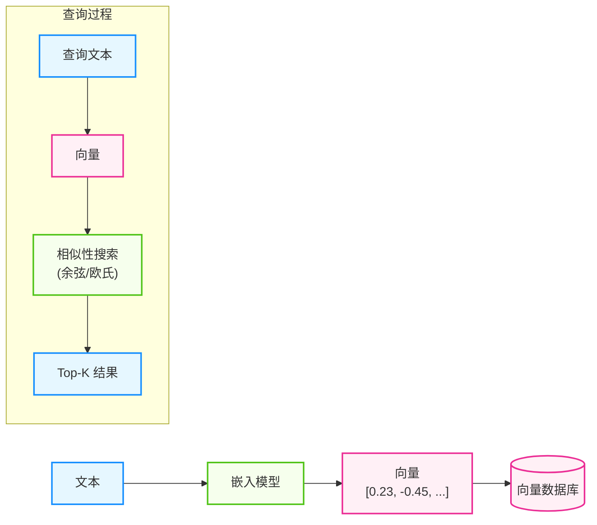
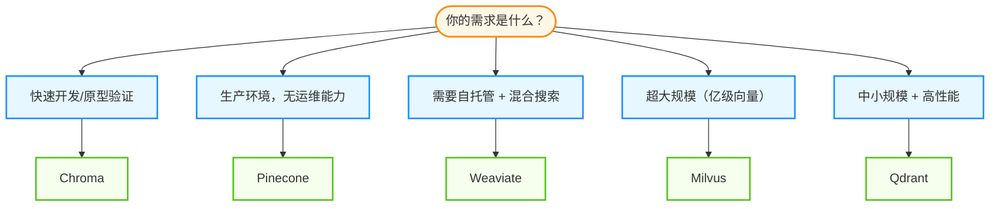

## 3.3 长期记忆与向量数据库

向量数据库是最常见的存储智能体长期记忆的方式。它们专门优化了 **向量** 的存储和相似性搜索，是构建 RAG 系统和记忆系统的关键组件。

### 3.3.1 为什么需要向量数据库

传统数据库擅长精确匹配查询（如 `SELECT * FROM users WHERE name = 'Alice'`），但无法处理语义相似性搜索：

```
用户问："如何在 Python 中读取文件？"
相关记忆：
  - "使用 open() 函数打开文件"      ← 语义相关
  - "Python 文件操作的最佳实践"     ← 语义相关
  - "用户昨天问了文件权限问题"      ← 可能相关
```

**向量数据库的工作原理**

下图展示了文本如何被转化为向量并存储检索的过程：



图 3-3：向量数据库检索流程

### 3.3.2 主流向量数据库快速对比

| 特性 | Pinecone | Weaviate | Chroma | Milvus | Qdrant |
|------|----------|----------|--------|--------|--------|
| 发布年份 | 2019 | 2019 | 2022 | 2019 | 2021 |
| 部署模式 | 全托管 | 自托管/云 | 本地/云 | 自托管/云 | 自托管/云 |
| 开源 | ❌ | ✅ | ✅ | ✅ | ✅ |
| 上手难度 | 简单 | 中等 | 最简单 | 较复杂 | 中等 |
| 扩展性 | 优秀 | 良好 | 有限 | 优秀 | 良好 |
| 成本 | 按用量付费 | 免费/企业版 | 免费 | 免费/企业版 | 免费/企业版 |
| 适用场景 | 生产环境 | 灵活场景 | 开发/原型 | 大规模 | 中小规模 |

---

### 3.3.3 Pinecone

**特点**

- **全托管服务**：无需运维
- **高性能**：毫秒级查询响应
- **易用性**：简洁的 API 设计
- **无服务器**：自动扩缩容

#### 快速开始

以下示例展示了 Pinecone 的核心操作：初始化客户端、创建索引、插入向量和查询。Pinecone 使用 `upsert` 操作插入或更新向量，查询时返回最相似的 Top-K 结果。

```python
from pinecone import Pinecone

# 初始化

pc = Pinecone(api_key="your-api-key")

# 创建索引

pc.create_index(
    name="agent-memory",
    dimension=1536,  # OpenAI text-embedding-3-small 维度
    metric="cosine"
)

# 获取索引

index = pc.Index("agent-memory")

# 插入向量

index.upsert(
    vectors=[
        {
            "id": "mem_001",
            "values": [0.1, 0.2, ...],  # 1536维向量
            "metadata": {
                "text": "用户偏好：深色主题",
                "type": "preference",
                "timestamp": "2024-01-15"
            }
        }
    ]
)

# 查询

results = index.query(
    vector=[0.15, 0.3, ...],
    top_k=5,
    include_metadata=True
)
```

#### 价格（参考）

| 计划 | 价格 | 适用场景 |
|------|------|----------|
| Starter | 免费 | 开发测试，100K 向量 |
| Standard | $0.025/小时 起 | 小型生产环境 |
| Enterprise | 定制 | 大规模部署 |

#### 适用场景

✅ 快速上线、无运维团队、中小规模应用
❌ 需要自托管、预算有限、超大规模

---

### 3.3.4 Weaviate

**特点**

- **开源**：Apache 2.0 许可
- **GraphQL API**：灵活的查询接口
- **模块化**：内置嵌入模块
- **混合搜索**：支持向量 + 关键词

#### 快速开始

Weaviate 的核心概念是 Schema（模式），类似于数据库表结构。定义 Schema 后，插入数据时可自动向量化（通过配置的 vectorizer 模块），查询时使用 `near_text` 进行语义搜索。

```python
import weaviate
import weaviate.classes.config as wvc

# 连接到 Weaviate (v4)
client = weaviate.connect_to_local()

# 创建 Collection (类似于以前的 Class)
try:
    questions = client.collections.create(
        name="Memory",
        vectorizer_config=wvc.Configure.Vectorizer.text2vec_openai(),
        properties=[
            wvc.Property(name="content", data_type=wvc.DataType.TEXT),
            wvc.Property(name="memoryType", data_type=wvc.DataType.TEXT),
            wvc.Property(name="timestamp", data_type=wvc.DataType.DATE),
        ]
    )
finally:
    client.close()

# 重新连接以插入数据
client = weaviate.connect_to_local()
collection = client.collections.get("Memory")

# 插入数据
collection.data.insert({
    "content": "用户喜欢使用 Python 编程",
    "memoryType": "preference",
    "timestamp": "2024-01-15T10:00:00Z"
})

# 语义搜索
response = collection.query.near_text(
    query="编程语言偏好",
    limit=5,
    return_properties=["content", "memoryType"]
)

for obj in response.objects:
    print(obj.properties)

client.close()
```

#### Docker 部署

具体示例如下：

```yaml
# docker-compose.yml

version: '3.4'
services:
  weaviate:
    image: semitechnologies/weaviate:latest
    ports:
      - "8080:8080"
    environment:
      QUERY_DEFAULTS_LIMIT: 25
      AUTHENTICATION_ANONYMOUS_ACCESS_ENABLED: 'true'
      DEFAULT_VECTORIZER_MODULE: 'text2vec-openai'
      ENABLE_MODULES: 'text2vec-openai'
      OPENAI_APIKEY: 'your-api-key'
```

#### 适用场景

✅ 需要自托管、混合搜索、GraphQL 偏好
❌ 追求极致简单、完全无运维需求

---

### 3.3.5 Chroma

**特点**

- **极简设计**：几行代码即可使用
- **内嵌模式**：无需独立服务
- **Python 原生**：与 Python 生态无缝集成
- **LangChain 集成**：开箱即用

#### 快速开始

Chroma 的设计理念是极简：创建客户端、创建集合、添加文档、查询——只需几行代码。它内置嵌入模型，无需手动向量化，特别适合快速原型开发。

```python
import chromadb

# 创建客户端（内存模式）

client = chromadb.Client()

# 或持久化模式

client = chromadb.PersistentClient(path="./chroma_db")

# 创建集合

collection = client.create_collection(
    name="agent_memory",
    metadata={"hnsw:space": "cosine"}
)

# 插入数据（自动嵌入）

collection.add(
    documents=[
        "用户偏好深色主题",
        "用户是 Python 开发者",
        "最近在学习机器学习"
    ],
    metadatas=[
        {"type": "preference"},
        {"type": "background"},
        {"type": "activity"}
    ],
    ids=["mem_1", "mem_2", "mem_3"]
)

# 查询

results = collection.query(
    query_texts=["用户的技术背景是什么？"],
    n_results=2
)
print(results['documents'])
# [['用户是 Python 开发者', '最近在学习机器学习']]


```

#### 与 LangChain 集成

LangChain 提供了统一的向量存储接口，可以无缝切换不同后端。以下示例展示了如何将 Chroma 与 LangChain 集成，并转换为 retriever 用于 RAG 流程。

```python
from langchain_community.vectorstores import Chroma
from langchain_openai import OpenAIEmbeddings

vectorstore = Chroma.from_documents(
    documents=docs,
    embedding=OpenAIEmbeddings(),
    persist_directory="./chroma_db"
)

# 直接用于 RAG

retriever = vectorstore.as_retriever(search_kwargs={"k": 3})
```

#### 适用场景

✅ 快速原型、本地开发、小型项目、LangChain 用户
❌ 大规模生产、高并发场景

---

### 3.3.6 选型决策树

下图展示了如何根据需求选择合适的向量数据库：



图 3-4：向量数据库选型决策树

### 3.3.7 性能优化建议

#### 选择合适的索引类型

| 索引类型 | 适用场景 | 查询速度 | 内存占用 |
|----------|----------|----------|----------|
| Flat | 小数据集 (<10K) | 最慢 | 最小 |
| IVF | 中等数据集 | 中等 | 中等 |
| HNSW | 大数据集，高性能需求 | 最快 | 较大 |

#### 向量维度选择


```python
# 常见嵌入模型维度

embedding_dimensions = {
    "text-embedding-3-small": 1536,  # OpenAI (Default)
    "text-embedding-3-large": 3072,  # OpenAI (High Quality)
    "all-MiniLM-L6-v2": 384,         # Sentence Transformers
    "bge-large-zh": 1024,            # 中文优化
}

# 权衡：维度越高，语义表达越丰富，但存储和查询成本也越高


```

#### 元数据过滤


```python
# 使用元数据预过滤，减少向量搜索范围

results = collection.query(
    query_texts=["编程相关"],
    n_results=5,
    where={"type": "preference"}  # 先按元数据过滤
)
```

---

**下一节**: [3.4 RAG 系统设计与优化](3.4_rag_advanced.md)
