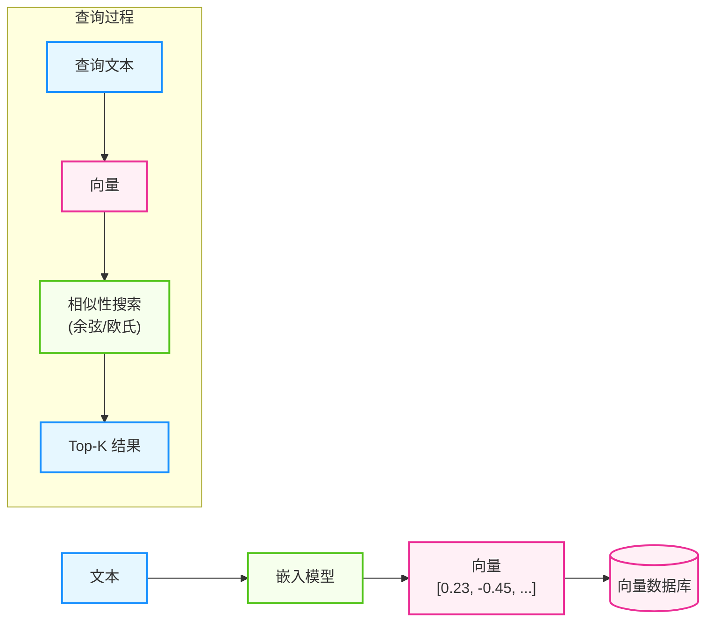
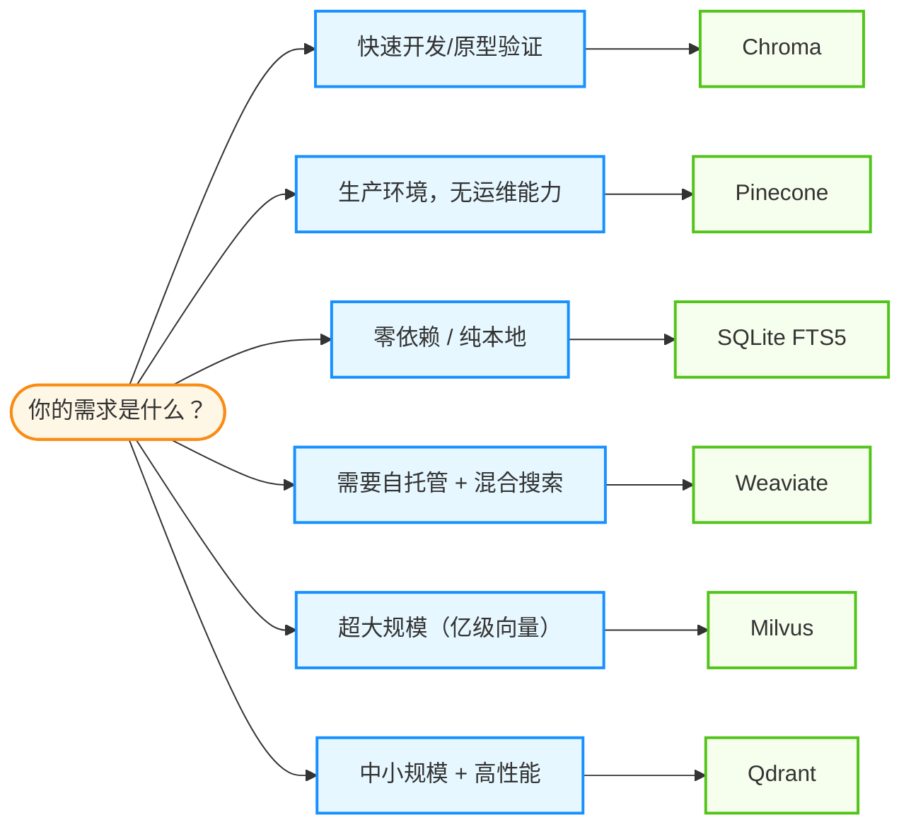

## 3.3 长期记忆与向量数据库

向量数据库是最常见的存储智能体长期记忆的方式。它们专门优化了 **向量** 的存储和相似性搜索，是构建 RAG 系统和记忆系统的关键组件。

### 3.3.1 为什么需要向量数据库

传统数据库擅长精确匹配查询（如 `SELECT * FROM users WHERE name = 'Alice'`），但无法处理语义相似性搜索：

```text
用户问：“如何在 Python 中读取文件？”
相关记忆：
  - “使用 open() 函数打开文件”      ← 语义相关
  - “Python 文件操作的最佳实践”     ← 语义相关
  - “用户昨天问了文件权限问题”      ← 可能相关
```

**向量数据库的工作原理**

下图展示了文本如何被转化为向量并存储检索的过程：


```mermaid
graph LR
    %% Agentic Design System
    classDef agent fill:#e6f7ff,stroke:#1890ff,stroke-width:2px;
    classDef memory fill:#fff0f6,stroke:#eb2f96,stroke-width:2px;
    classDef tool fill:#f6ffed,stroke:#52c41a,stroke-width:2px;

    Input["文本"] --> EmbedModel["嵌入模型"]
    EmbedModel --> Vector["向量<br/>[0.23, -0.45, ...]"]
    Vector --> DB[("向量数据库")]

    subgraph QueryProcess["查询过程"]
        QText["查询文本"] --> QVec["向量"]
        QVec --> Search["相似性搜索<br/>(余弦/欧氏)"]
        Search --> Result["Top-K 结果"]
    end

    class Input,QText agent;
    class EmbedModel,Search tool;
    class Vector,QVec,DB memory;
    class Result agent;
```

图 3-3：向量数据库检索流程

### 3.3.2 向量数据库选型维度

与其维护“某时点的主流产品对比表”，本节更推荐用维度来做选型：

| 维度 | 你需要回答的问题 |
|------|------------------|
| 部署形态 | 托管式还是自托管？是否需要离线环境？ |
| 伸缩与高可用 | 并发、延迟、容灾与运维能力如何？ |
| 搜索能力 | 是否需要混合检索、过滤、分片与多租户隔离？ |
| 成本模型 | 读写成本、存储成本、运维成本如何核算？ |
| 生态集成 | 是否容易与编排框架、评测与可观测性工具对接？ |
| 数据治理 | 审计、权限、加密与合规要求是什么？ |

以下各产品都基于这些维度评估。

---

### 3.3.3 Pinecone

**特点**

- **全托管服务**：无需运维
- **高性能**：毫秒级查询响应
- **易用性**：简洁的 API 设计
- **无服务器**：自动扩缩容

**快速开始**

Pinecone 官方 Python 文档的主线用法已经围绕 `pinecone` 包、`ServerlessSpec` 以及数据面按 `host` 访问展开。下面示例采用“自带向量 + serverless dense index”路径（具体 API 请以[官方文档](https://docs.pinecone.io)为准）：

⚠️ **版本注意**：以下示例代码验证于 2026-03，API 和依赖版本可能随后续更新而变动。使用前请参考 [官方文档](https://docs.pinecone.io)。

```python
# 运行前提（已按 Pinecone 官方文档于 2026-04 核对）
# pip install "pinecone[grpc]"
# 必要环境变量：PINECONE_API_KEY

from pinecone.grpc import PineconeGRPC as Pinecone
from pinecone import ServerlessSpec

pc = Pinecone(api_key="YOUR_API_KEY")
index_name = "agent-memory"

if not pc.has_index(index_name):
    pc.create_index(
        name=index_name,
        vector_type="dense",
        dimension=1536,  # 必须与嵌入模型输出维度一致
        metric="cosine",
        spec=ServerlessSpec(cloud="aws", region="us-east-1"),
        deletion_protection="disabled",
    )

# 教学示例中可直接解析 host；生产环境更适合预先缓存 host 再复用
index = pc.Index(host=pc.describe_index(index_name).host)

index.upsert(
    namespace="user-123",
    vectors=[
        {
            "id": "mem_001",
            "values": [0.10, 0.20, 0.30, 0.40],
            "metadata": {
                "text": "用户偏好深色主题",
                "type": "preference",
                "updated_at": "2026-04-19T10:00:00Z",
            }
        }
    ]
)

results = index.query(
    namespace="user-123",
    vector=[0.11, 0.19, 0.28, 0.41],
    top_k=5,
    include_metadata=True,
)

for match in results.matches:
    print(match.id, match.score, match.metadata["text"])
```

如果你希望 Pinecone 在写入和查询时自动完成文本向量化，当前官方文档还提供 `create_index_for_model(...)` 和 `index.search(...)` 的集成嵌入路径；但对于“记忆系统”和“向量数据库”这一节，显式展示“外部嵌入 -> upsert/query”更能说明底层接口的通用形态。

**成本与计费**

| 计划 | 计费特征 | 适用场景 |
|------|----------|----------|
| 免费/入门 | 通常有配额限制 | 开发测试、原型验证 |
| 标准/按量 | 随存储与查询量增长 | 小到中型生产环境 |
| 企业 | 合同与 SLA | 大规模部署与合规要求 |

**适用场景**

✅ 快速上线、无运维团队、中小规模应用
❌ 需要自托管、预算有限、超大规模

---

### 3.3.4 Weaviate

**特点**

- **开源**：BSD 3-Clause 许可
- **GraphQL API**：灵活的查询接口
- **模块化**：内置嵌入模块
- **混合搜索**：支持向量 + 关键词

**快速开始**

Weaviate 官方 Python 客户端已经稳定在 v4 系列，集合定义 API 使用 `vector_config`，本地连接默认同时检查 HTTP(`8080`) 与 gRPC(`50051`)。下面先给出最小、最稳妥的“自带向量”示例（具体 API 请以[官方文档](https://weaviate.io/developers/weaviate)为准）：

```python
# 运行前提（已按 Weaviate 官方文档于 2026-04 核对）
# pip install -U weaviate-client

import weaviate
import weaviate.classes as wvc

with weaviate.connect_to_local() as client:
    client.collections.create(
        name="Memory",
        vector_config=wvc.config.Configure.Vectors.self_provided(),
        properties=[
            wvc.config.Property(name="content", data_type=wvc.config.DataType.TEXT),
            wvc.config.Property(name="memory_type", data_type=wvc.config.DataType.TEXT),
            wvc.config.Property(name="updated_at", data_type=wvc.config.DataType.DATE),
        ],
    )

    memories = client.collections.use("Memory")
    memories.data.insert(
        properties={
            "content": "用户喜欢使用 Python 编程",
            "memory_type": "preference",
            "updated_at": "2026-04-19T10:00:00Z",
        },
        vector=[0.10, 0.20, 0.30, 0.40],
    )

    response = memories.query.near_vector(
        near_vector=[0.11, 0.19, 0.29, 0.39],
        limit=5,
        return_properties=["content", "memory_type"],
        return_metadata=wvc.query.MetadataQuery(distance=True),
    )

    for obj in response.objects:
        print(obj.properties, obj.metadata.distance)
```

如果你希望直接使用 `near_text(...)`，则需要按当前官方部署文档为实例启用向量化模块，或者使用云端/API 型向量化集成；没有配置向量化器时，最小本地示例应改用 `self_provided()` + `near_vector(...)`。

**Docker 部署**

如果你选择自托管方案，下面这个最小 `docker-compose.yml` 示例更接近 2026-04 官方文档中的当前口径：先跑一个不带模块的本地节点，用于验证集合创建、对象写入和 `near_vector` 查询。

⚠️ **版本注意**：以下示例代码验证于 2026-03。Weaviate 镜像版本和配置参数可能随后续更新而变动。使用前请参考 [官方部署指南](https://weaviate.io/developers/weaviate/installation)。

```yaml
# docker-compose.yml
---
services:
  weaviate:
    image: cr.weaviate.io/semitechnologies/weaviate:1.37.0
    command:
      - --host
      - 0.0.0.0
      - --port
      - "8080"
      - --scheme
      - http
    ports:
      - "8080:8080"
      - "50051:50051"
    volumes:
      - weaviate_data:/var/lib/weaviate
    restart: on-failure:0
    environment:
      QUERY_DEFAULTS_LIMIT: 25
      AUTHENTICATION_ANONYMOUS_ACCESS_ENABLED: "true"  # 仅限开发/验证
      PERSISTENCE_DATA_PATH: "/var/lib/weaviate"
      CLUSTER_HOSTNAME: "node1"
volumes:
  weaviate_data:
```

如果你需要 `near_text`、`hybrid` 里的向量化部分，或导入时自动生成向量，再按官方配置为该 compose 增加 `text2vec-*` 模块或相应的 API 型向量化集成。

**适用场景**

✅ 需要自托管、混合搜索、GraphQL 偏好
❌ 追求极致简单、完全无运维需求

> **注**：关于开源许可的选择（如 Weaviate 采用 BSD 而非 Apache 2.0），在选型时应确认最新的许可条款以满足项目合规要求。

---

### 3.3.5 Chroma

**特点**

- **极简设计**：几行代码即可使用
- **内嵌模式**：无需独立服务
- **Python 原生**：与 Python 生态无缝集成
- **编排框架集成**：常见框架多可对接

**快速开始**

Chroma 内置嵌入模型，只需几行代码即可创建客户端、集合、添加文档和查询。

⚠️ **版本注意**：以下示例代码验证于 2026-03，API 和依赖版本可能随后续更新而变动。使用前请参考 [官方文档](https://docs.trychroma.com)。

```python
# 运行前提 (Tested with chromadb>=1.0, Python 3.10+, 验证时间: 2026-03)

import chromadb

client = chromadb.EphemeralClient()  # 内存模式
# client = chromadb.PersistentClient(path="./chroma_db")  # 持久化模式

collection = client.create_collection(
    name="agent_memory",
    metadata={"hnsw:space": "cosine"}
)

collection.add(
    documents=[
        "用户偏好深色主题",
        "用户是 Python 开发者",
        "最近在学习机器学习"
    ],
    metadatas=[
        {"type": "preference"},
        {"type": "background"},
        {"type": "activity"}
    ],
    ids=["mem_1", "mem_2", "mem_3"]
)

results = collection.query(
    query_texts=["用户的技术背景是什么？"],
    n_results=2
)
print(results['documents'])  # [['用户是 Python 开发者', '最近在学习机器学习']]
```

**与编排框架集成**

许多编排框架提供了统一的向量存储抽象层，便于在不同后端间切换。

```python
from <orchestration_framework>.vectorstores import Chroma
from <orchestration_framework>.embeddings import <EmbeddingsProvider>

vectorstore = Chroma.from_documents(
    documents=docs,
    embedding=<EmbeddingsProvider>(),
    persist_directory="./chroma_db"
)

retriever = vectorstore.as_retriever(search_kwargs={"k": 3})
```

**适用场景**

✅ 快速原型、本地开发、小型项目
❌ 大规模生产、高并发场景

---

### 3.3.6 选型决策树

下图展示了如何根据需求选择合适的向量数据库：


```mermaid
graph LR
    %% Agentic Design System
    classDef agent fill:#e6f7ff,stroke:#1890ff,stroke-width:2px;
    classDef tool fill:#f6ffed,stroke:#52c41a,stroke-width:2px;
    classDef user fill:#fff7e6,stroke:#fa8c16,stroke-width:2px;

    Start(["你的需求是什么？"])

    Start --> Proto["快速开发/原型验证"]
    Proto --> Chroma["Chroma"]

    Start --> ProdNoOps["生产环境，无运维能力"]
    ProdNoOps --> Pinecone["Pinecone"]

    Start --> ZeroDep["零依赖 / 纯本地"]
    ZeroDep --> SQLite["SQLite FTS5"]

    Start --> SelfHost["需要自托管 + 混合搜索"]
    SelfHost --> Weaviate["Weaviate"]

    Start --> HugeScale["超大规模（亿级向量）"]
    HugeScale --> Milvus["Milvus"]

    Start --> MidPerf["中小规模 + 高性能"]
    MidPerf --> Qdrant["Qdrant"]

    class Start user;
    class Proto,ProdNoOps,SelfHost,HugeScale,MidPerf,ZeroDep agent;
    class Chroma,Pinecone,Weaviate,Milvus,Qdrant,SQLite tool;
```

图 3-4：向量数据库选型决策树

### 3.3.7 性能优化建议

**选择合适的索引类型**

| 索引类型 | 适用场景 | 查询速度 | 内存占用 |
|----------|----------|----------|----------|
| Flat | 小数据集 (<10K) | 最慢 | 最小 |
| IVF | 中等数据集 | 中等 | 中等 |
| HNSW | 大数据集，高性能需求 | 最快 | 较大 |

**向量维度选择**

向量维度通常由嵌入模型决定，同时也会影响存储成本与查询性能。下面给出一个常见维度清单示意与取舍提示：

```python
# 常见嵌入模型维度
embedding_dimensions = {
    "<embedding-model-A>": 1536,
    "<embedding-model-B>": 3072,
    "all-MiniLM-L6-v2": 384,         # Sentence Transformers
    "bge-large-zh": 1024,            # 中文优化
}
# 权衡：维度越高，语义表达越丰富，但存储和查询成本也越高
```

**元数据过滤**

在检索前先做元数据过滤，可以显著缩小候选集合，从而降低延迟并提升召回质量：

```python
results = collection.query(
    query_texts=["编程相关"],
    n_results=5,
    where={"type": "preference"}  # 元数据预过滤
)
```

---

### 3.3.8 统一抽象与契约测试

为了抵御底层 SDK 的变动风险并方便未来选型迁移，工程项目必须在业务逻辑与具体向量数据库之间封装一层 **统一抽象接口**，并结合 **契约测试 (Contract Tests)** 确保无论底层接入哪家产品，核心语义检索流均不受影响。

**统一接口与契约测试示例代码**：

```python
from typing import List, Dict, Any

class VectorStoreBase:
    def upsert(self, doc_ids: List[str], texts: List[str], metadatas: List[Dict]):
        raise NotImplementedError
    def search(self, query: str, top_k: int = 5, filter_dict: Dict = None) -> List[Dict]:
        raise NotImplementedError

def test_vector_store_contract(store: VectorStoreBase):
    """契约测试：验证向量存储核心功能"""
    store.upsert(
        doc_ids=["1", "2"],
        texts=["苹果是红色的", "天空是蓝色的"],
        metadatas=[{"color": "red"}, {"color": "blue"}]
    )

    res1 = store.search(query="哪种水果是红色的？", top_k=1)
    assert len(res1) == 1 and "苹果" in res1[0]["text"]

    res2 = store.search(query="红色的", top_k=5, filter_dict={"color": "blue"})
    assert len(res2) > 0 and "天空" in res2[0]["text"]
    print("✅ 契约测试通过！")
```

通过这套模式，底层向量库选型不再停留在“阅读对比表格”层面，而是变成了 **“跑测试代码”** 的工程级验证。

---

### 3.3.9 向量检索的能力边界

到这里可以把边界说得更直接一些：向量数据库解决的是“如何高效找相似内容”，而不是“如何维护一个始终自洽的用户状态”。

对长期记忆系统来说，至少还有三类问题必须在应用层补齐：

- **时间顺序**：当“我住在纽约”和“我刚搬到旧金山”同时存在时，向量相似度不会自动帮你判定哪条更新。
- **事实覆盖**：向量库原生提供的是写入、过滤和检索，不提供“用新事实替换旧事实”的业务语义。
- **噪声治理**：如果把所有原始对话都直接写进去，重复、过时和低价值片段会持续侵蚀召回质量。

因此，工程上更稳妥的做法是把向量数据库视为**记忆索引层**，并在其上叠加事实抽取、冲突消解、遗忘策略和检索编排。上一节的统一抽象与契约测试，是为了降低底层存储替换成本；下一节的 RAG 设计，则要回答“在真正生成答案时，什么时候检索、检索什么、以及检索失败时怎么办”。

---

**下一节**: [3.4 RAG 系统设计与优化](3.4_rag_advanced.md)
