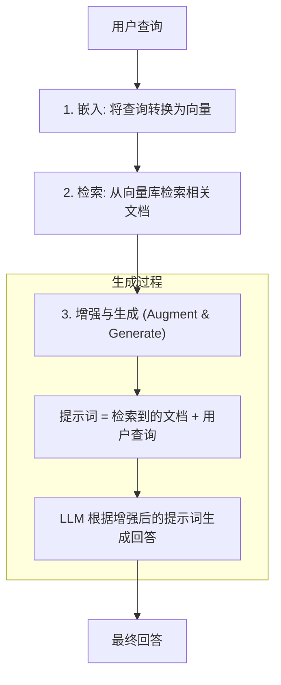

## 3.4 RAG 进阶实践

检索增强生成（Retrieval-Augmented Generation, RAG）是让大语言模型获取外部知识的核心技术。本节将深入探讨如何构建高质量的 RAG 系统。

### 3.4.1 核心思想

RAG 的核心思想是：在生成回答之前，先从外部知识库中检索相关信息，将检索到的内容作为上下文提供给大语言模型，从而生成更准确、更有依据的回答。

与直接依赖模型内部知识相比，RAG 具有以下优势：

- **知识实时性**：可以随时更新知识库，无需重新训练模型
- **可追溯性**：回答可以追溯到具体的文档来源
- **降低幻觉**：基于检索到的事实生成，减少模型"编造"内容的可能

### 3.4.2 基本流程

RAG 的工作流程可以分为三个核心步骤：**嵌入（Embed）**、**检索（Retrieve）** 和 **增强生成（Augment & Generate）**。下图展示了从用户提问到最终回答的完整流程：



### 3.4.3 简单实现

基本的 RAG 实现包括三个步骤：检索相关文档、将文档和查询组合成提示词、调用 LLM 生成回答。以下示例展示了这个核心流程。

```python
from openai import OpenAI
import chromadb

client = OpenAI()
chroma = chromadb.Client()
collection = chroma.get_collection("knowledge_base")

def simple_rag(query: str) -> str:
    # 1. 检索
    results = collection.query(
        query_texts=[query],
        n_results=3
    )
    
    # 2. 构建提示词
    context = "\n".join(results['documents'][0])
    prompt = f"""基于以下资料回答问题：

资料：
{context}

问题：{query}

请基于资料回答，如果资料中没有相关信息，请说明。"""

    # 3. 生成
    response = client.chat.completions.create(
        model="gpt-4",
        messages=[{"role": "user", "content": prompt}]
    )
    
    return response.choices[0].message.content
```

### 3.4.4 提升检索质量
基本的 RAG 实现，其检索质量通常不高，需要进行优化。以下是一些常用的优化方法：

#### 文档切分策略

**文档切分** 是 RAG 质量的关键。

**不良切分**：
```
Chunk 1: "Python 是一种编程语言，它的创始人"
Chunk 2: "是 Guido van Rossum。Python 具有"
```

**优良切分**：
```
Chunk 1: "Python 是一种编程语言，它的创始人是 Guido van Rossum。"
Chunk 2: "Python 具有简洁的语法和强大的库生态系统。"
```

**切分策略对比**：

| 策略 | 描述 | 适用场景 |
|------|------|----------|
| 固定长度 | 按字符/token 数切分 | 格式统一的文档 |
| 句子边界 | 按句号分割 | 连贯性要求高 |
| 段落边界 | 按段落分割 | 结构化文档 |
| 语义切分 | 按主题/语义分割 | 长文档、复杂内容 |
| 递归切分 | 层级递归分割 | 通用场景 |

```python
from langchain.text_splitter import RecursiveCharacterTextSplitter

# 推荐：递归切分，优先保持语义完整
splitter = RecursiveCharacterTextSplitter(
    chunk_size=500,
    chunk_overlap=50,  # 重叠部分，保持上下文连贯
    separators=["\n\n", "\n", "。", "；", "，", " ", ""]
)

chunks = splitter.split_text(document)
```

#### 增强嵌入质量

**查询扩展**：将用户查询扩展为多个变体

```python
def expand_query(query: str) -> List[str]:
    prompt = f"""请为以下查询生成 3 个不同表述的变体，用于提高搜索召回率：

查询：{query}

只输出变体，每行一个："""
    
    variants = llm.generate(prompt).split("\n")
    return [query] + variants

# 示例
# 输入: "Python 如何读文件"
# 输出: ["Python 如何读文件", 
#        "Python open 函数用法", 
#        "Python 文件 IO 操作",
#        "读取文本文件 Python"]
```

**假设文档嵌入（HyDE）**：

```python
def hyde_search(query: str) -> List[str]:
    # 让 LLM 先生成一个"假设的答案文档"
    hypothetical_doc = llm.generate(f"请回答：{query}")
    
    # 用假设文档的 嵌入 去检索
    # 这样可以提高语义匹配度
    return vector_store.search(hypothetical_doc)
```

#### 重排序

初次检索可能包含一些语义相似但实际无关的结果。重排序（Reranking）使用更精确的交叉编码器（Cross-Encoder）模型重新评估每个候选结果与查询的相关性，提高最终结果的准确性。

```python
from sentence_transformers import CrossEncoder

reranker = CrossEncoder('cross-encoder/ms-marco-MiniLM-L-12-v2')

def retrieve_and_rerank(query: str, k: int = 3) -> List[Dict]:
    # 1. 初次检索（多取一些）
    candidates = vector_store.search(query, k=10)
    
    # 2. 重排序
    pairs = [(query, doc['content']) for doc in candidates]
    scores = reranker.predict(pairs)
    
    # 3. 按分数排序，取 top-k
    sorted_results = sorted(
        zip(candidates, scores), 
        key=lambda x: x[1], 
        reverse=True
    )
    
    return [doc for doc, score in sorted_results[:k]]
```

#### 混合检索

向量检索擅长语义匹配，但可能遗漏关键词完全匹配的结果；关键词检索（如 BM25）擅长精确匹配，但无法理解语义。混合检索结合两者优势，通过加权融合分数得到更全面的结果。

```python
def hybrid_search(query: str, alpha: float = 0.5) -> List[Dict]:
    # 向量检索
    vector_results = vector_store.search(query, k=10)
    
    # 关键词检索（BM25）
    keyword_results = bm25_search(query, k=10)
    
    # 融合分数
    combined = {}
    for doc in vector_results:
        combined[doc['id']] = alpha * doc['score']
    
    for doc in keyword_results:
        if doc['id'] in combined:
            combined[doc['id']] += (1 - alpha) * doc['score']
        else:
            combined[doc['id']] = (1 - alpha) * doc['score']
    
    # 按融合分数排序
    return sorted(combined.items(), key=lambda x: x[1], reverse=True)
```

### 3.4.5 提升生成质量

#### 提示词工程

**基础模板**：
```python
RAG_PROMPT = """你是一个知识助手。请基于下面提供的资料回答用户问题。

### 资料
{context}

### 规则
1. 只基于资料中的信息回答，不要编造
2. 如果资料不包含答案，明确说"资料中没有相关信息"
3. 引用具体资料时，标注来源

### 用户问题
{query}

### 回答"""
```

**带来源引用的模板**：
```python
RAG_PROMPT_WITH_CITATIONS = """基于以下编号资料回答问题，并在回答中用 [1], [2] 等标注信息来源。

资料：
[1] {doc_1}
[2] {doc_2}
[3] {doc_3}

问题：{query}

回答（请包含引用标注）："""
```

#### 处理"不知道"

让模型诚实地表达不确定性：

```python
HONEST_RAG_PROMPT = """请基于资料回答问题。重要：

- 如果资料包含答案：完整回答
- 如果资料部分相关：说明能回答的部分，并指出缺失的信息
- 如果资料完全无关：回复"根据现有资料无法回答这个问题"

资料：
{context}

问题：{query}"""
```

#### 长上下文处理

当检索结果过多时：

```python
def summarize_if_needed(docs: List[str], max_tokens: int = 3000) -> str:
    combined = "\n\n".join(docs)
    
    if count_tokens(combined) <= max_tokens:
        return combined
    
    # 超长时进行摘要
    summary_prompt = f"""请将以下内容压缩为关键信息摘要：

{combined}

摘要："""
    
    return llm.generate(summary_prompt)
```

### 3.4.6 评估 RAG 系统

#### 评估指标

| 指标 | 描述 | 计算方法 |
|------|------|----------|
| 召回率 | 相关文档被检索到的比例 | 检索到的相关文档 / 所有相关文档 |
| 精确率 | 检索结果中相关的比例 | 相关文档 / 检索到的文档 |
| MRR | 第一个相关文档的排名倒数 | 1 / 相关文档排名 |
| 置信度 | 回答与资料的一致性/忠实度 | LLM 评估或人工标注 |
| 相关性 | 回答与问题的相关性 | LLM 评估 |

#### 使用 RAGAS 评估
RAGAS (Retrieval Augmented Generation Assessment) 是一个用于评估 RAG 应用的开源框架。它利用 LLM 作为评判者（LLM-as-a-judge），能够自动化地计算包括置信度（Faithfulness）、相关性（Answer Relevancy）和上下文精确度（Context Precision）在内的多种关键指标，帮助开发者无需大量人工标注即可量化评估系统的性能。

```python
from ragas import evaluate
from ragas.metrics import faithfulness, answer_relevancy, context_precision

# 准备测试数据
test_data = {
    "question": ["什么是 RAG？", "如何切分文档？"],
    "answer": [...],  # RAG 系统的回答
    "contexts": [...],  # 检索到的上下文
    "ground_truths": [...]  # 标准答案
}

# 评估
results = evaluate(test_data, metrics=[faithfulness, answer_relevancy, context_precision])
print(results)
```

### 3.4.7 常见问题与解决

#### 问题1：检索不到相关内容

**原因**：

- 嵌入 (Embedding) 模型与内容不匹配
- 文档切分不当
- 查询与文档表述差异大

**解决**：

- 尝试不同的嵌入模型
- 调整切分策略
- 使用查询扩展或 HyDE

#### 问题2：检索到无关内容

**原因**：

- 相似度阈值过低
- 语义漂移

**解决**：

- 设置相似度阈值过滤
- 使用重排序
- 添加元数据过滤

#### 问题3：回答不基于资料

**原因**：

- 提示词设计不当
- 资料信息不足

**解决**：

- 强化提示词中的约束
- 检查检索质量
- 考虑多轮检索

---

**下一节**: [3.5 图记忆与知识图谱](3.5_graph_memory.md)