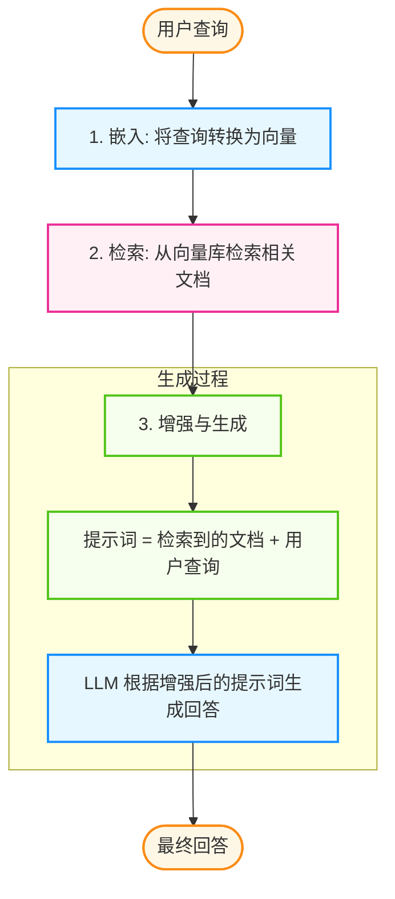

## 3.4 RAG 系统设计与优化

检索增强生成（RAG）是让大语言模型获取外部知识的核心技术。本节将深入探讨如何构建高质量的 RAG 系统。

### 3.4.1 核心思想

RAG 的核心思想是：在生成回答之前，先从外部知识库中检索相关信息，将检索到的内容作为上下文提供给大语言模型，从而生成更准确、更有依据的回答。

与直接依赖模型内部知识相比，RAG 具有以下优势：

- **知识实时性**：可以随时更新知识库，无需重新训练模型
- **可追溯性**：回答可以追溯到具体的文档来源
- **降低幻觉**：基于检索到的事实生成，减少模型“编造”内容的可能

### 3.4.2 基本流程

RAG 的工作流程可以分为三个核心步骤：**嵌入**、**检索** 和 **增强生成**。下图展示了从用户提问到最终回答的完整流程：


```mermaid
graph TD
    %% Agentic Design System
    classDef user fill:#fff7e6,stroke:#fa8c16,stroke-width:2px;
    classDef agent fill:#e6f7ff,stroke:#1890ff,stroke-width:2px;
    classDef memory fill:#fff0f6,stroke:#eb2f96,stroke-width:2px;
    classDef tool fill:#f6ffed,stroke:#52c41a,stroke-width:2px;

    UserQuery(["用户查询"]) --> Embed["1. 嵌入: 将查询转换为向量"]
    Embed --> Retrieve["2. 检索: 从向量库检索相关文档"]
    Retrieve --> Augment["3. 增强与生成"]

    subgraph process ["生成过程"]
        Augment --> Prompt["提示词 = 检索到的文档 + 用户查询"]
        Prompt --> Generate["LLM 根据增强后的提示词生成回答"]
    end

    Generate --> Answer(["最终回答"])

    class UserQuery,Answer user;
    class Embed,Generate agent;
    class Retrieve memory;
    class Augment,Prompt tool;
```

图 3-5：RAG 核心工作流程

### 3.4.3 简单实现

基本的 RAG 实现包括三个步骤：检索相关文档、将文档和查询组合成提示词、调用 LLM 生成回答。以下示例展示了这个核心流程。

> **接口建议**：如果你使用的平台提供了新版结构化/统一接口，优先使用新接口；示例保留一种常见写法以便理解流程。

```python
import anthropic
import chromadb

client = anthropic.Anthropic()
chroma = chromadb.Client()
collection = chroma.get_collection("knowledge_base")

def simple_rag(query: str) -> str:
    # 1. 检索
    results = collection.query(
        query_texts=[query],
        n_results=3
    )

    # 2. 构建提示词
    context = "\n".join(results['documents'][0])
    prompt = f"""基于以下资料回答问题：

资料：
{context}

问题：{query}

请基于资料回答，如果资料中没有相关信息，请说明。"""

    # 3. 生成
    response = client.messages.create(
        model="claude-3-5-sonnet-20241022",
        max_tokens=1024,
        messages=[{"role": "user", "content": prompt}]
    )

    return response.content[0].text
```

### 3.4.4 提升检索质量

基本的 RAG 实现需要进行优化，常用优化方法包括：

**常见优化技术**：

- **文档切分策略**：按语义边界（段落、句子）而非固定长度切分，推荐使用递归切分保持上下文连贯性。
- **查询扩展**：生成查询的多个表述变体，提高检索召回率。
- **假设文档嵌入（HyDE）**：让 LLM 先生成假设答案，用其进行检索以提高语义匹配度。
- **重排序（Reranking）**：用交叉编码器模型对初次检索结果进行二次排序，确保精确性。
- **混合检索**：结合向量检索和关键词检索（如 BM25），通过加权融合获得更全面的结果。

**常见问题与解决方案**：

- **检索不到相关内容**：尝试不同嵌入模型、调整切分策略、使用查询扩展或 HyDE。
- **检索到无关内容**：设置相似度阈值、使用重排序、添加元数据过滤。

> 更详细的文档切分、查询改写、重排序等通用 RAG 优化技术的实现，请参考《上下文工程指南》相关章节。

### 3.4.5 提升生成质量

提示词工程是核心策略，常用方法包括：

- **基础约束模板**：明确指示”只基于资料回答、资料缺失时说明、标注来源”。
- **带来源的结构化输出**：要求 JSON 格式包含答案、推理步骤、来源 ID 和 trace_id，确保可追溯性，与第 2 章可解释性设计对齐。
- **不确定性表达**：让模型诚实说”资料中没有”而非编造。
- **长上下文处理**：超过 Token 预算时对文档进行摘要，保留检索到的关键信息。

**常见问题**：回答不基于资料（幻觉）。解决方案：强化提示词约束、检查检索质量、利用 CoT 让模型先分析资料。

> 详细的 RAG 提示词模板、多轮对话中的资料更新策略等，请参考《上下文工程指南》相关章节。

### 3.4.6 最小可复现 RAG 评测脚手架

构建 RAG 评估能力至关重要。建议构建 **最小可运行评估栈**，包括：

1. **数据集设计**：包含 `query_id`、问题、标准答案和 `required_source_ids`，支持追溯”检索失败”vs”生成失败”。
2. **日志收集**：记录检索到的 chunk ID、生成的答案和引用的证据，完整保存执行轨迹。
3. **指标评估**：
   - **context_precision**：所需 chunk 是否被检索到（确定性指标）
   - **answer_faithfulness**：回答是否基于检索内容（用 LLM-as-a-judge 评分）
4. **回归门槛**：CI/CD 拦截 `context_precision` 下降、`answer_faithfulness` 未保持或提升。

> RAG 评测方法的详细设计（数据集构建、评估框架、自动化回归）请参考第 7 章（Ch7.2 评估方法）。

### 3.4.7 记忆系统核心评估指标

有效的记忆系统需要在多个维度上进行量化评估：

| 指标 | 定义 | 计算方式 | 目标值 |
|------|------|---------|-------|
| Recall@K | 前 K 个检索结果中包含相关文档的比例 | 相关命中数 / 总相关文档数 | > 0.85 |
| Precision@K | 前 K 个检索结果中相关文档的占比 | 相关命中数 / K | > 0.70 |
| 幻觉率 | 生成内容中无法溯源到检索结果的事实比例 | 无来源断言数 / 总断言数 | < 0.05 |
| 上下文利用率 | 检索到的上下文中被生成模型实际引用的比例 | 被引用段落数 / 检索段落数 | > 0.60 |
| 端到端延迟 | 从查询发出到生成完成的总时间 | P95 延迟 | < 3s |

> 💡 **度量建议**：在生产环境中，建议至少监控 Recall@K 和幻觉率这两个核心指标。Recall@K 反映”能否找到正确信息”，幻觉率反映”是否编造了错误信息”。两者共同决定了记忆系统的可信度。

### 3.4.8 RAG 与记忆系统的融合

传统 RAG 和用户记忆系统往往作为两套独立管道运行：RAG 检索知识库文档，记忆系统检索用户历史。这种松耦合架构存在一个根本问题——**知识与个性化上下文的割裂**。

#### 割裂带来的失败模式

考虑一个技术助手场景：用户问”如何部署我的服务”。

- 知识库 RAG 能检索到通用的部署文档（Kubernetes、Docker Compose、Serverless 等多种方案）
- 记忆系统知道”这个用户偏好 Kubernetes，且上周刚完成了集群搭建”

如果两者分离，系统要么给出不够个性化的通用答案，要么只基于记忆回答但缺少最新文档支撑。

#### 混合检索的设计思路

新一代框架（如 Supermemory）将两者合并为单次混合查询：一次检索同时返回知识库文档和个性化记忆，让模型在生成时能同时基于”外部知识是什么”和”用户的相关上下文是什么”。

这种设计对 RAG 系统的架构有两个重要启示：

1. **检索源的统一语义层**：来自不同源的内容（文档、聊天记录、文件、代码、邮件）需要经过统一的事实抽取和结构化处理，进入同一个语义空间。否则跨源召回时容易出现上下文不匹配。

2. **目标函数的重新定义**：传统 RAG 优化的是语义相似度（Semantic Similarity），但当记忆参与检索后，系统需要同时优化 **更新正确性**（新事实是否覆盖了旧事实）、**时间正确性**（是否返回了最新状态）和 **噪声抑制**（是否过滤了过期信息）。

#### 外部连接器：让记忆超越聊天

记忆不应只来自对话历史。在真实智能体场景中，用户的状态分散在多个外部系统中：

- 文档协作平台（Google Drive、Notion）中的最新工作内容
- 代码仓库（GitHub）中的最近变更
- 邮件中的确认事项和决策

通过实时连接器（Webhooks）同步这些外部源，系统获得的不只是”用户说过什么”，还有”用户最近做了什么”。这种多源融合显著提升了上下文的完整度，是从”聊天记忆”到”全景记忆”的关键一步。

> **架构提示**：混合检索不是简单地将两个检索结果拼接后送入 LLM。有效的实现需要在检索层面完成结果的去重、冲突消解和优先级排序，确保送入上下文窗口的信息既完整又不自相矛盾。

---

**下一节**: [3.5 图记忆与知识图谱](3.5_graph_memory.md)
