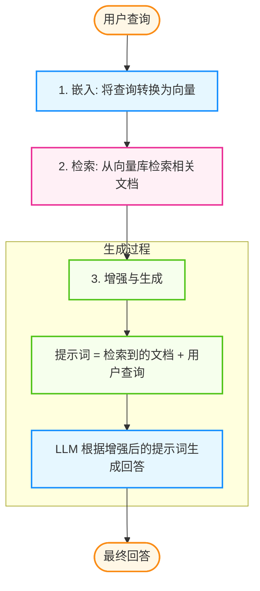

## 3.4 RAG 系统设计与优化

检索增强生成（RAG）是让大语言模型获取外部知识的核心技术。本节将深入探讨如何构建高质量的 RAG 系统。

### 3.4.1 核心思想

RAG 的核心思想是：在生成回答之前，先从外部知识库中检索相关信息，将检索到的内容作为上下文提供给大语言模型，从而生成更准确、更有依据的回答。

与直接依赖模型内部知识相比，RAG 具有以下优势：

- **知识实时性**：可以随时更新知识库，无需重新训练模型
- **可追溯性**：回答可以追溯到具体的文档来源
- **降低幻觉**：基于检索到的事实生成，减少模型“编造”内容的可能

### 3.4.2 基本流程

RAG 的工作流程可以分为三个核心步骤：**嵌入**、**检索**和**增强生成**。下图展示了从用户提问到最终回答的完整流程：



图 3-5：RAG 核心工作流程

### 3.4.3 简单实现

基本的 RAG 实现包括三个步骤：检索相关文档、将文档和查询组合成提示词、调用 LLM 生成回答。以下示例展示了这个核心流程。

> **接口建议**：如果你使用的平台提供了新版结构化/统一接口，优先使用新接口；示例保留一种常见写法以便理解流程。

```python
from <llm_client> import Client
import chromadb

client = Client()
chroma = chromadb.Client()
collection = chroma.get_collection("knowledge_base")

def simple_rag(query: str) -> str:
    # 1. 检索

    results = collection.query(
        query_texts=[query],
        n_results=3
    )
    
    # 2. 构建提示词

    context = "\n".join(results['documents'][0])
    prompt = f"""基于以下资料回答问题：

资料：
{context}

问题：{query}

请基于资料回答，如果资料中没有相关信息，请说明。"""

    # 3. 生成

    response = client.generate(
        model="<MODEL>",
        input=prompt
    )
    
    return response.output_text
```

### 3.4.4 提升检索质量

基本的 RAG 实现，其检索质量通常不高，需要进行优化。以下是一些常用的优化方法：

#### 文档切分策略

**文档切分**是 RAG 质量的关键。**不良切分**：
```
Chunk 1: "Python 是一种编程语言，它的创始人"
Chunk 2: "是 Guido van Rossum。Python 具有"
```

**优良切分**：
```
Chunk 1: "Python 是一种编程语言，它的创始人是 Guido van Rossum。"
Chunk 2: "Python 具有简洁的语法和强大的库生态系统。"
```

**切分策略对比**：

| 策略 | 描述 | 适用场景 |
|------|------|----------|
| 固定长度 | 按字符/token 数切分 | 格式统一的文档 |
| 句子边界 | 按句号分割 | 连贯性要求高 |
| 段落边界 | 按段落分割 | 结构化文档 |
| 语义切分 | 按主题/语义分割 | 长文档、复杂内容 |
| 递归切分 | 层级递归分割 | 通用场景 |

```python
from langchain.text_splitter import RecursiveCharacterTextSplitter

# 推荐：递归切分，优先保持语义完整

splitter = RecursiveCharacterTextSplitter(
    chunk_size=500,
    chunk_overlap=50,  # 重叠部分，保持上下文连贯
    separators=["\n\n", "\n", "。", "；", "，", " ", ""]
)

chunks = splitter.split_text(document)
```

#### 增强嵌入质量

**查询扩展**：将用户查询扩展为多个变体

```python
def expand_query(query: str) -> List[str]:
    prompt = f"""请为以下查询生成 3 个不同表述的变体，用于提高搜索召回率：

查询：{query}

只输出变体，每行一个："""
    
    variants = llm.generate(prompt).split("\n")
    return [query] + variants

# 示例

# 输入: "Python 如何读文件"

# 输出: ["Python 如何读文件", 

#        "Python open 函数用法", 

#        "Python 文件 IO 操作",

#        "读取文本文件 Python"]


```

**假设文档嵌入（HyDE）**：

```python
def hyde_search(query: str) -> List[str]:
    # 让 LLM 先生成一个"假设的答案文档"

    hypothetical_doc = llm.generate(f"请回答：{query}")
    
    # 用假设文档的 嵌入 去检索

    # 这样可以提高语义匹配度

    return vector_store.search(hypothetical_doc)
```

#### 重排序

初次检索可能包含一些语义相似但实际无关的结果。重排序（Reranking）使用更精确的交叉编码器（Cross-Encoder）模型重新评估每个候选结果与查询的相关性，提高最终结果的准确性。

```python
from sentence_transformers import CrossEncoder

reranker = CrossEncoder('cross-encoder/ms-marco-MiniLM-L-12-v2')

def retrieve_and_rerank(query: str, k: int = 3) -> List[Dict]:
    # 1. 初次检索（多取一些）

    candidates = vector_store.search(query, k=10)
    
    # 2. 重排序

    pairs = [(query, doc['content']) for doc in candidates]
    scores = reranker.predict(pairs)
    
    # 3. 按分数排序，取 top-k

    sorted_results = sorted(
        zip(candidates, scores), 
        key=lambda x: x[1], 
        reverse=True
    )
    
    return [doc for doc, score in sorted_results[:k]]
```

#### 混合检索

向量检索擅长语义匹配，但可能遗漏关键词完全匹配的结果；关键词检索（如 BM25）擅长精确匹配，但无法理解语义。混合检索结合两者优势，通过加权融合分数得到更全面的结果。

```python
def hybrid_search(query: str, alpha: float = 0.5) -> List[Dict]:
    # 向量检索

    vector_results = vector_store.search(query, k=10)
    
    # 关键词检索（使用 SQLite FTS5）
    keyword_results = sqlite_fts_search(query, k=10)
    
    # 融合分数
    combined = {}
    for doc in vector_results:
        combined[doc['id']] = alpha * doc['score']
    
    for doc in keyword_results:
        if doc['id'] in combined:
            combined[doc['id']] += (1 - alpha) * doc['score']
        else:
            combined[doc['id']] = (1 - alpha) * doc['score']
    
    # 按融合分数排序
    return sorted(combined.items(), key=lambda x: x[1], reverse=True)

def sqlite_fts_search(query: str, k: int) -> List[Dict]:
    """
    使用 SQLite FTS5 进行全文检索
    
    优点：
    1. 无需额外依赖，Python 内置 sqlite3
    2. 极其轻量，单文件部署
    3. 支持布尔查询与前缀匹配
    """
    import sqlite3
    
    conn = sqlite3.connect("knowledge.db")
    cursor = conn.cursor()
    
    # 假设表结构：CREATE VIRTUAL TABLE docs USING fts5(content)
    cursor.execute(
        "SELECT rowid, rank FROM docs WHERE docs MATCH ? ORDER BY rank LIMIT ?", 
        (query, k)
    )
    
    results = []
    for rowid, rank in cursor.fetchall():
        results.append({"id": str(rowid), "score": rank})
        
    conn.close()
    return results
```

#### 检索问题排查指南

1. **检索不到相关内容**
    * **原因**：嵌入 (Embedding) 模型与内容不匹配、文档切分不当、查询与文档表述差异大。
    * **解决**：尝试不同的嵌入模型、调整切分策略、使用查询扩展或 HyDE。
2. **检索到无关内容**
    * **原因**：相似度阈值过低、语义漂移。
    * **解决**：设置相似度阈值过滤、使用重排序、添加元数据过滤。

### 3.4.5 提升生成质量

#### 提示词工程

**基础模板**：
```python
RAG_PROMPT = """你是一个知识助手。请基于下面提供的资料回答用户问题。

### 资料

{context}

### 规则

1. 只基于资料中的信息回答，不要编造
2. 如果资料不包含答案，明确说"资料中没有相关信息"
3. 引用具体资料时，标注来源

### 用户问题

{query}

### 回答"""


```

**带来源引用的模板（强制证据链）**：

与 [第2章](2.1_cot.md) 的“可解释性摘要”结构统一，要求模型必须输出引用数组，包含精确的 `chunk_id` 或 `source_id`：
```python
RAG_PROMPT_WITH_CITATIONS = """基于以下编号资料回答问题，并在回答中用 [1], [2] 等标注信息来源。

资料：
[1] (ID: doc_a_chunk_1) {doc_1}
[2] (ID: doc_b_chunk_2) {doc_2}

问题：{query}

请按以下 JSON 格式输出：
{
  "answer": "包含引用标注的回答片段 [1]",
  "rationale_summary": ["关键推理步骤"],
  "evidence": ["doc_a_chunk_1"],
  "trace_id": "..."
}"""
```

#### 处理“不知道”

让模型诚实地表达不确定性：

```python
HONEST_RAG_PROMPT = """请基于资料回答问题。重要：

- 如果资料包含答案：完整回答
- 如果资料部分相关：说明能回答的部分，并指出缺失的信息
- 如果资料完全无关：回复"根据现有资料无法回答这个问题"

资料：
{context}

问题：{query}"""
```

#### 长上下文处理

当检索结果过多时：

```python
def summarize_if_needed(docs: List[str], max_tokens: int = 3000) -> str:
    combined = "\n\n".join(docs)
    
    if count_tokens(combined) <= max_tokens:
        return combined
    
    # 超长时进行摘要

    summary_prompt = f"""请将以下内容压缩为关键信息摘要：

{combined}

摘要："""
    
    return llm.generate(summary_prompt)
```

#### 生成问题排查指南

* **回答不基于资料（幻觉）**
    * **原因**：提示词约束不够、资料信息不足。
    * **解决**：强化提示词约束（如“严禁编造”）、检查检索质量、考虑利用 CoT 让模型先分析资料。

### 3.4.6 最小可复现 RAG 评测脚手架

在工程上，如果缺乏本地“改完即测”的回归能力，RAG 的任何调优（换模型、换切分）都是盲飞。因此，强烈建议构建如下**最小可运行评估栈 (Minimal Evaluation Scaffold)**。

#### 1. 离线验证数据集格式

切忌只测问题，所有检索日志必须落盘（明确包含 `chunk_id` 和 `source_id`），以便后续定位是“检索没捞出来”还是“生成瞎编”。

```json
// dataset_v1.json
[
  {
    "query_id": "q102",
    "question": "公司报销审批需要几级？",
    "ground_truth_answer": "根据最新规定需要两级审批：直属主管与部门总监。",
    "required_source_ids": ["policy_finance_v2_chunk3"] 
  }
]
```

#### 2. 测试执行与日志留存

运行检索增强管线，并将整个轨迹（Trace）存下。

```python
def run_eval_pipeline(dataset: List[Dict]):
    eval_logs = []
    for item in dataset:
        # 记录检索明细
        retrieved_chunks = vector_store.search(item["question"], top_k=5)
        retrieved_ids = [c["chunk_id"] for c in retrieved_chunks]
        
        # 记录生成结果与证据
        response = rag_agent.generate(item["question"], retrieved_chunks)
        
        eval_logs.append({
            "query_id": item["query_id"],
            "retrieved_ids": retrieved_ids,
            "generated_answer": response["answer"],
            "agent_evidence": response["evidence"]
        })
    return eval_logs
```

#### 3. 指标计算与 LLM-as-a-judge 评分

有了日志，即可离线算分（可借助 Ragas 等开源框架辅助生成 Prompt）：

```python
def calculate_metrics(eval_logs, ground_truth):
    metrics = {"context_precision": [], "answer_faithfulness": []}
    
    for log, truth in zip(eval_logs, ground_truth):
        # 1. 强确定的检索指标：需要的 chunk 捞出来了吗？
        hit = any(req_id in log["retrieved_ids"] for req_id in truth["required_source_ids"])
        metrics["context_precision"].append(1.0 if hit else 0.0)
        
        # 2. LLM-as-a-judge 评估回答质量与忠实度
        score = llm_judge.evaluate(
            question=truth["question"],
            expected=truth["ground_truth_answer"],
            actual=log["generated_answer"],
            retrieved_context=log["retrieved_ids"] # 甚至可以直接传真实文档要求判断有无幻觉
        )
        metrics["answer_faithfulness"].append(score)
        
    return {k: sum(v)/len(v) for k, v in metrics.items()}
```

**回归门槛建议**：CI/CD 必须拦截 `context_precision` 下降的任何调整；当更换生成模型时，`answer_faithfulness` 必须保持或提升。


---

**下一节**: [3.5 图记忆与知识图谱](3.5_graph_memory.md)
