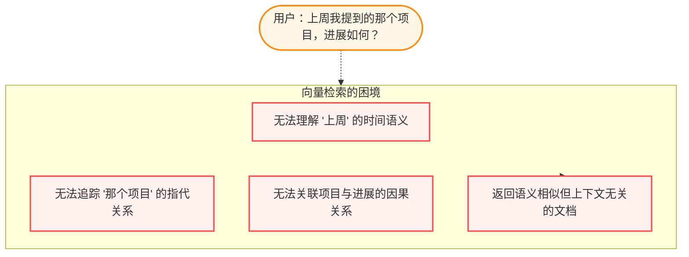
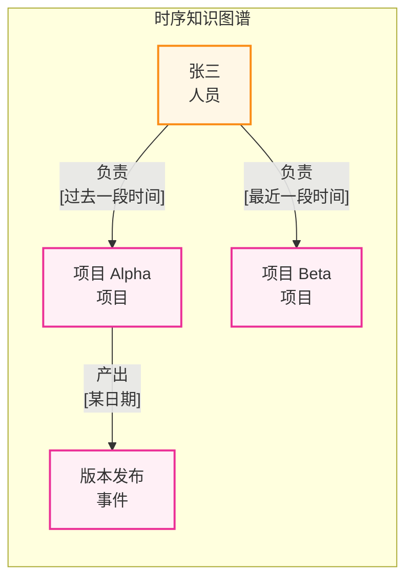
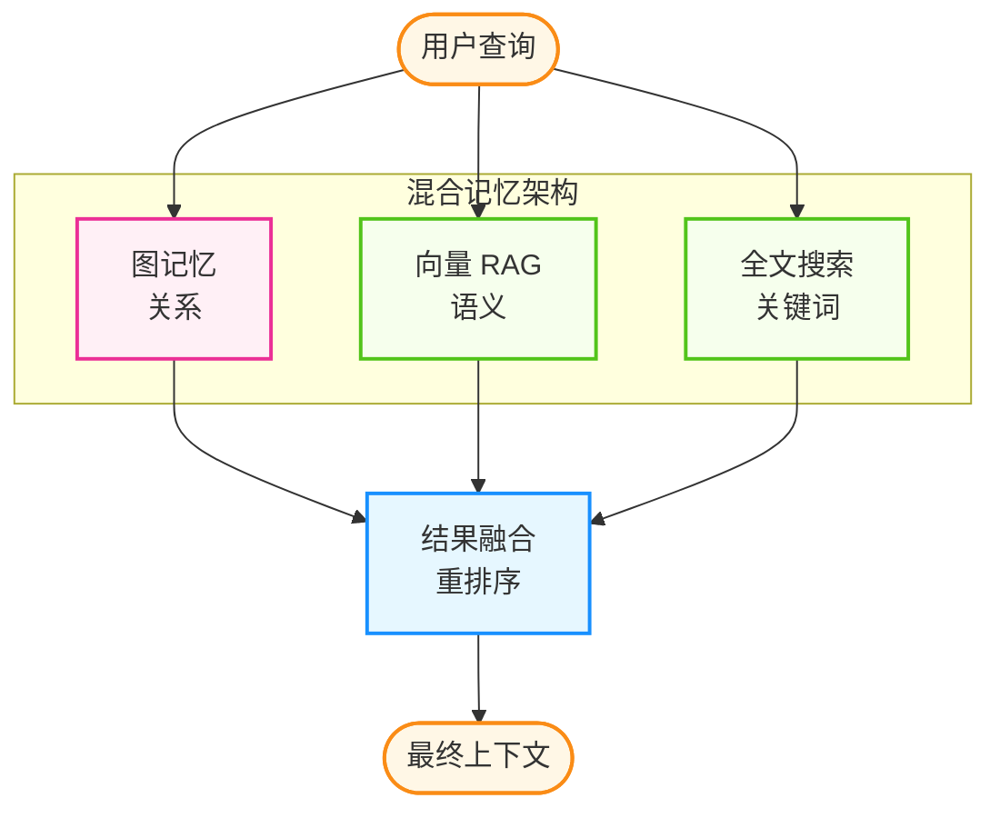
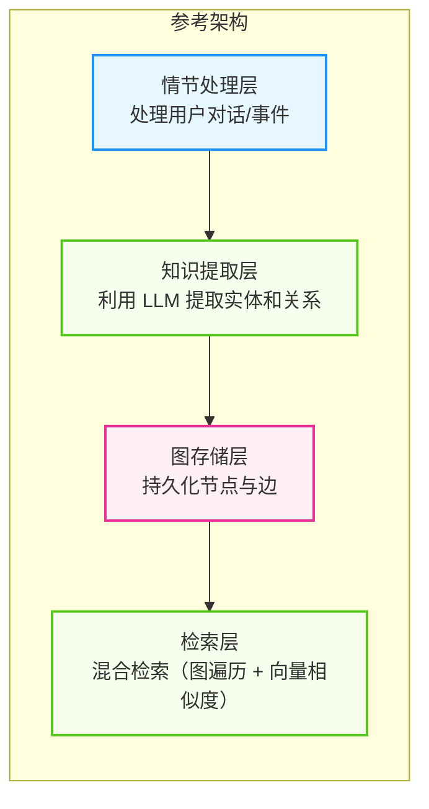

## 3.5 图记忆与知识图谱

传统的向量数据库在 RAG 场景中表现优异，但随着智能体系统的复杂化，其局限性日益明显。**图记忆**作为一种记忆范式逐渐受到关注，出现了**时序知识图谱**等用于表达“实体-关系-时间”三要素的实现方式。

### 3.5.1 向量数据库的局限性

向量数据库通过语义相似度检索信息，但存在几个根本性问题：



图 3-6：向量搜索的局限性

| 问题 | 向量数据库表现 | 图记忆方案 |
|------|---------------|-----------|
| 时间推理 | ❌ 无时间维度 | ✅ 时序知识图谱 |
| 实体追踪 | ❌ 孤立嵌入 | ✅ 实体节点关联 |
| 关系推理 | ❌ 仅语义相似 | ✅ 显式边关系 |
| 知识演化 | ❌ 静态快照 | ✅ 版本化更新 |

### 3.5.2 时序知识图谱核心概念

**时序知识图谱**在传统知识图谱基础上增加了**时间维度**，让智能体能够理解“什么时候发生了什么”。

#### 基础结构

下图展示了一个简单的时序知识图谱示例，其中包含了人员、项目、事件等实体，以及带有时间范围的“负责”、“产出”等关系。这种结构清晰地表达了实体间随时间演化的动态关联。



图 3-7：时序知识图谱结构示例

#### 核心元素

时序知识图谱由三个核心元素组成：
* **实体**（Entity）表示人、项目、事件等节点；
* **关系**（Relationship）表示实体之间的连接，并带有时间有效期；
* **情节**（Episode）记录一次完整的交互或事件。

```python
from dataclasses import dataclass
from datetime import datetime
from typing import Optional, List

@dataclass
class Entity:
    """知识图谱中的实体节点"""
    id: str
    name: str
    entity_type: str  # Person, Project, Event, Concept...
    attributes: dict
    created_at: datetime
    updated_at: datetime

@dataclass
class Relationship:
    """实体之间的关系边"""
    id: str
    source_id: str
    target_id: str
    relation_type: str  # 负责, 参与, 产出, 依赖...
    attributes: dict
    valid_from: datetime  # 关系生效时间
    valid_to: Optional[datetime]  # 关系失效时间（None=当前有效）

@dataclass
class Episode:
    """一次交互或事件的完整记录（情节）"""
    id: str
    content: str
    entities: List[str]  # 涉及的实体ID列表
    relationships: List[str]  # 涉及的关系ID列表
    timestamp: datetime
    source: str  # conversation, document, observation...
```

### 3.5.3 混合记忆架构：图记忆 + RAG

在选择技术方案之前，需要理解图记忆与向量检索的关系。两种技术并非互斥，而是互补：



图 3-8：图记忆与 RAG 混合架构

| 场景 | 推荐方案 |
|------|---------|
| 静态知识库问答 | 向量 RAG |
| 长期用户交互 | 图记忆 |
| 多实体关系推理 | 图记忆 |
| 文档语义检索 | 向量 RAG |
| 时间相关查询 | 图记忆 |
| 混合场景 | 图记忆 + 向量 RAG |

### 3.5.4 工程化落地路径

本节以工程视角归纳三类常见落地方式：图存储内核、知识抽取流水线、以及面向检索与推理的混合查询层。具体项目名与 API 细节可能随时间变化。

#### 方案一：图存储内核与抽取流水线

这类方案通常包含“情节采集 → 实体关系抽取 → 图存储持久化 → 检索与推理接口”四个环节。

**架构概览**



图 3-9：图记忆参考分层架构

这种分层架构实现了从非结构化文本到结构化图谱的自动流转：
1. **情节处理层**：作为系统入口，接收用户的对话、文档片段或观察到的事件。
2. **知识提取层**：利用 LLM 的语义理解能力，自动提取实体（Node）、关系（Edge）以及相关的时序元数据（Valid At）。
3. **图存储层**：将提取的三元组持久化到图数据库或图存储中，维护知识的演化历史。
4. **检索层**：提供混合检索能力，既能通过向量找到语义相关的节点，又能通过图遍历找到多跳关系节点。

**基础用法示例**

下例用伪代码展示典型工作流：初始化连接、写入情节、检索相关记忆。实现细节会因具体库而异，但接口形状通常相近。

```python
graph_memory = GraphMemory(
    graph_store=GraphStore(dsn="<GRAPH_DSN>"),
    extractor=EntityRelationExtractor(model="<MODEL>")
)

await graph_memory.add_episode(
    name="用户对话",
    content="用户：我刚加入了项目 Alpha 团队，负责后端开发。",
    timestamp=now(),
    source="conversation"
)

results = await graph_memory.search(query="用户在做什么项目？", k=5)
for item in results:
    print(item.fact)
    print(item.entities)
    print(item.valid_time)
```

**知识提取过程**

下面以通用流程为例：语言模型从对话中抽取实体与关系，再交由图存储进行持久化。

```python
# 输入对话

episode = "张三说他上周完成了项目 Alpha 的一次版本发布，现在开始负责项目 Beta。"

# LLM 提取的结构化知识

extracted = {
    "entities": [
        {"name": "张三", "type": "人员"},
        {"name": "项目 Alpha", "type": "项目"},
        {"name": "版本发布", "type": "事件"},
        {"name": "项目 Beta", "type": "项目"}
    ],
    "relationships": [
        {
            "source": "张三", 
            "target": "项目 Alpha", 
            "type": "完成",
            "valid_at": "上周"
        },
        {
            "source": "项目 Alpha",
            "target": "版本发布",
            "type": "发布",
            "valid_at": "上周"
        },
        {
            "source": "张三",
            "target": "项目 Beta",
            "type": "负责",
            "valid_from": "现在"
        }
    ]
}
```

#### 方案二：记忆服务化

这类方案把“抽取、存储、索引、检索、评测”打包为独立服务，对应用侧暴露统一 API。优点是集成门槛低、便于运维与观测；代价是需要处理网络延迟、成本与数据治理。

```python
memory_service = MemoryServiceClient(endpoint="<ENDPOINT>", api_key="<API_KEY>")

await memory_service.add(
    user_id="user_123",
    session_id="session_456",
    messages=[
        {"role": "user", "content": "我想了解上次讨论的项目进展"},
        {"role": "assistant", "content": "我记得你负责的项目 Alpha 正在推进。"}
    ]
)

context = await memory_service.retrieve(user_id="user_123", query="项目进展", k=10)
```

**与向量检索的差异（概念层）**

图记忆类系统通常更擅长：实体一致性、时间线追踪、多跳关系；代价是：建模与抽取更复杂、存储与维护成本更高。具体准确率/延迟取决于数据、抽取提示词、存储后端与评测口径。


#### 方案三：个性化画像记忆层

这类方案把“用户偏好、稳定事实、长期目标”抽取为可更新的画像，并与会话记忆解耦。常见策略包括去重、冲突消解与置信度更新。

```python
profile_memory = ProfileMemory()

profile_memory.add("我周末喜欢去爬山，但不喜欢去人多的地方。", user_id="alex_01")
related = profile_memory.search(user_id="alex_01", query="推荐个周末去处", k=5)
print(related)
```

### 3.5.5 实战：为智能体添加图记忆

以下示例展示了如何将图记忆集成到智能体中。核心流程是：检索相关记忆→构建增强上下文→生成回复→存储本次对话。这样智能体就能记住用户的历史信息并在后续对话中使用。

```python
from typing import List, Dict
class GraphMemoryAgent:
    """带有图记忆能力的智能体"""
    
    def __init__(self, llm, graph_memory):
        self.llm = llm
        self.memory = graph_memory
    
    async def chat(self, user_id: str, message: str) -> str:
        # 1. 检索相关记忆

        memories = await self.memory.search(query=message, k=10, filters={"user_id": user_id})
        
        # 2. 构建增强上下文

        memory_context = self._format_memories(memories)
        
        # 3. 生成回复

        response = await self.llm.generate(f"""
        你是一个有记忆的智能助手。
        
        用户历史记忆：
        {memory_context}
        
        用户问题：{message}
        
        基于历史记忆回答问题。如果记忆中没有相关信息，如实说明。
        """)
        
        # 4. 将本次对话存入记忆

        await self.memory.add_episode(
            name=f"对话-{user_id}",
            content=f"用户：{message}\n助手：{response}",
            timestamp=now(),
            source="conversation"
        )
        
        return response
    
    def _format_memories(self, memories: List) -> str:
        """格式化记忆为上下文"""
        if not memories:
            return "暂无相关历史记忆。"
        
        formatted = []
        for m in memories:
            formatted.append(
                f"- [{m.valid_time}] {m.fact}，相关实体：{', '.join(m.entities)}"
            )
        return "\n".join(formatted)
```

---

**下一节**: [3.6 上下文工程](3.6_context_engineering.md)
