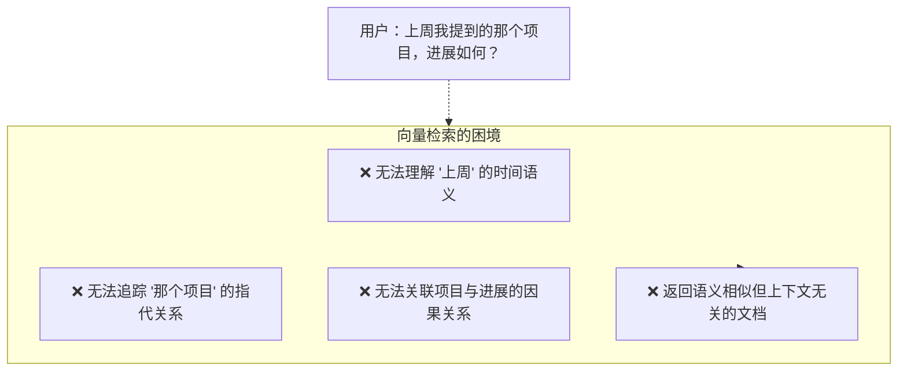
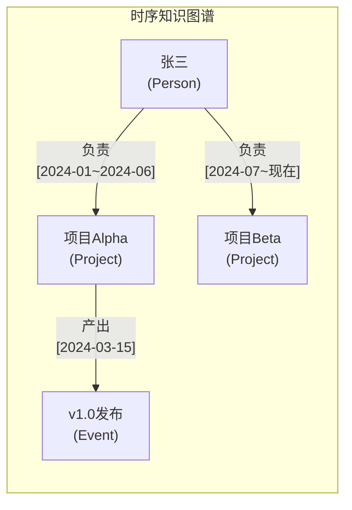
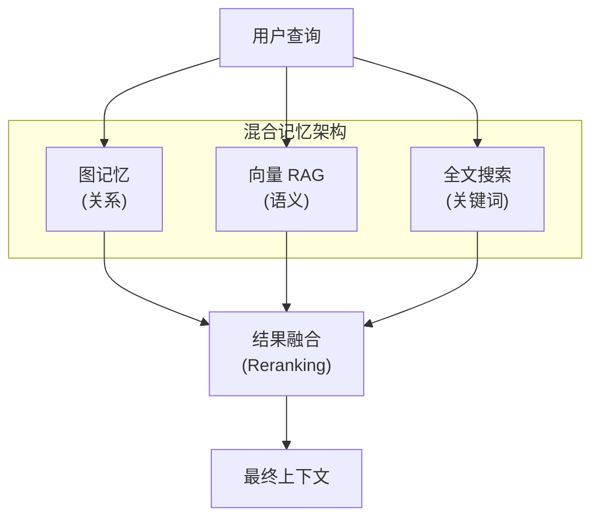
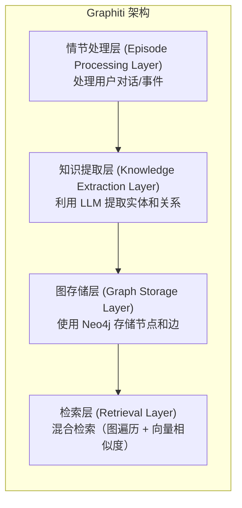

## 3.5 图记忆与知识图谱

传统的向量数据库在 RAG 场景中表现优异，但随着智能体系统的复杂化，其局限性日益明显。2025 年，**图记忆 (Graph Memory)** 作为一种新的记忆范式异军突起，出现了 **时序知识图谱 (Temporal Knowledge Graph, TKG)** 等实现这一新的记忆范式的技术。

### 3.5.1 向量数据库的局限性

向量数据库通过语义相似度检索信息，但存在几个根本性问题：



图 3-6：向量搜索的局限性 (Limitations of Vector Search)

| 问题 | 向量数据库表现 | 图记忆方案 |
|------|---------------|-----------|
| 时间推理 | ❌ 无时间维度 | ✅ 时序知识图谱 |
| 实体追踪 | ❌ 孤立嵌入 | ✅ 实体节点关联 |
| 关系推理 | ❌ 仅语义相似 | ✅ 显式边关系 |
| 知识演化 | ❌ 静态快照 | ✅ 版本化更新 |

### 3.5.2 时序知识图谱核心概念

**时序知识图谱** 在传统知识图谱基础上增加了 **时间维度**，让智能体能够理解"什么时候发生了什么"。

#### 基础结构

下图展示了一个简单的时序知识图谱示例，其中包含了人员、项目、事件等实体，以及带有时间范围的"负责"、"产出"等关系。这种结构清晰地表达了实体间随时间演化的动态关联。



图 3-7：时序知识图谱结构示例 (Example of Temporal Knowledge Graph Structure)

#### 核心元素

时序知识图谱由三个核心元素组成：
* **实体**（Entity）表示人、项目、事件等节点；
* **关系**（Relationship）表示实体之间的连接，并带有时间有效期；
* **情节**（Episode）记录一次完整的交互或事件。

```python
from dataclasses import dataclass
from datetime import datetime
from typing import Optional, List

@dataclass
class Entity:
    """知识图谱中的实体节点"""
    id: str
    name: str
    entity_type: str  # Person, Project, Event, Concept...
    attributes: dict
    created_at: datetime
    updated_at: datetime

@dataclass
class Relationship:
    """实体之间的关系边"""
    id: str
    source_id: str
    target_id: str
    relation_type: str  # 负责, 参与, 产出, 依赖...
    attributes: dict
    valid_from: datetime  # 关系生效时间
    valid_to: Optional[datetime]  # 关系失效时间（None=当前有效）

@dataclass
class Episode:
    """一次交互或事件的完整记录（情节）"""
    id: str
    content: str
    entities: List[str]  # 涉及的实体ID列表
    relationships: List[str]  # 涉及的关系ID列表
    timestamp: datetime
    source: str  # conversation, document, observation...
```

### 3.5.3 混合记忆架构：图记忆 + RAG

在选择技术方案之前，需要理解图记忆与向量检索的关系。两种技术并非互斥，而是互补：



图 3-8：图记忆与 RAG 混合架构 (Hybrid Architecture of Graph Memory and RAG)

| 场景 | 推荐方案 |
|------|---------|
| 静态知识库问答 | 向量 RAG |
| 长期用户交互 | 图记忆 |
| 多实体关系推理 | 图记忆 |
| 文档语义检索 | 向量 RAG |
| 时间相关查询 | 图记忆 |
| 混合场景 | 图记忆 + 向量 RAG |

### 3.5.4 主流工具生态

本节将重点介绍目前业界最主流的图记忆解决方案：开源框架 **Graphiti**、生产级平台 **Zep** 以及主打个性化记忆的 **Mem0**。

#### Graphiti：开源图记忆框架

Graphiti 是 Zep 团队开源的时序知识图谱框架，专为 AI 智能体记忆系统设计。

**架构概览**



图 3-9：Graphiti 分层架构 (Graphiti Layered Architecture)

这种分层架构实现了从非结构化文本到结构化图谱的自动流转：
1.  **情节处理层**：作为系统入口，接收用户的对话、文档片段或观察到的事件。
2.  **知识提取层**：利用 LLM 的语义理解能力，自动提取实体（Node）、关系（Edge）以及相关的时序元数据（Valid At）。
3.  **图存储层**：将提取的三元组持久化到 Neo4j 等图数据库中，维护知识的演化历史。
4.  **检索层**：提供混合检索能力，既能通过向量找到语义相关的节点，又能通过图遍历找到多跳关系节点。

**基础使用**

Graphiti 的基本工作流程包括：初始化连接、添加情节（episode）到记忆、检索相关记忆。Graphiti 会自动使用 LLM 从对话中提取实体和关系，并存储到 Neo4j 图数据库中。

```python
from graphiti_core import Graphiti
from graphiti_core.nodes import EpisodeType

# 初始化 Graphiti

graphiti = Graphiti(
    neo4j_uri="bolt://localhost:7687",
    neo4j_user="neo4j",
    neo4j_password="password"
)

# 添加一段对话到记忆

await graphiti.add_episode(
    name="用户对话",
    episode_body="""
    用户：我刚加入了项目Alpha团队，负责后端开发。
    助手：欢迎加入！项目Alpha是公司的核心产品，你的后端经验会很有帮助。
    """,
    source=EpisodeType.conversation,
    reference_time=datetime.now()
)

# 检索相关记忆

results = await graphiti.search(
    query="用户在做什么项目？",
    num_results=5
)

for result in results:
    print(f"事实: {result.fact}")
    print(f"相关实体: {result.entities}")
    print(f"时间: {result.valid_at}")
```

**知识提取过程**

Graphiti 使用 LLM 自动从对话中提取结构化知识：

```python
# 输入对话

episode = "张三说他上周完成了项目Alpha的v1.0版本，现在开始负责项目Beta。"

# LLM 提取的结构化知识

extracted = {
    "entities": [
        {"name": "张三", "type": "Person"},
        {"name": "项目Alpha", "type": "Project"},
        {"name": "v1.0版本", "type": "Release"},
        {"name": "项目Beta", "type": "Project"}
    ],
    "relationships": [
        {
            "source": "张三", 
            "target": "项目Alpha", 
            "type": "完成",
            "valid_at": "上周"
        },
        {
            "source": "项目Alpha",
            "target": "v1.0版本",
            "type": "发布",
            "valid_at": "上周"
        },
        {
            "source": "张三",
            "target": "项目Beta",
            "type": "负责",
            "valid_from": "现在"
        }
    ]
}
```

#### Zep：生产级智能体记忆层

Zep 是一个专为 AI 智能体设计的记忆服务，在 Graphiti 基础上提供了完整的生产级方案。

**核心特性**

Zep 提供了用户管理、会话管理和智能检索的完整 API。它在图记忆基础上整合了对话历史、知识图谱和时间推理能力，极大简化了生产环境的集成工作。

```python
from zep_cloud.client import Zep

# 初始化 Zep 客户端

zep = Zep(api_key="your-api-key")

# 创建用户和会话

user = await zep.user.add(user_id="user_123", metadata={"name": "张三"})
session = await zep.memory.add_session(
    session_id="session_456",
    user_id="user_123"
)

# 添加对话记忆

await zep.memory.add(
    session_id="session_456",
    messages=[
        {"role": "user", "content": "我想了解上次讨论的项目进展"},
        {"role": "assistant", "content": "根据上次对话，您负责的项目Alpha..."}
    ]
)

# 智能检索（结合对话历史 + 知识图谱 + 时间推理）

context = await zep.memory.get(
    session_id="session_456",
    min_rating=0.5,  # 相关性阈值
    lastn=10         # 最近N条消息
)
```

**与向量数据库的性能对比**

| 指标 | 纯向量检索 | Zep (TKG) |
|------|-----------|-----------|
| 事实准确率 | 72% | 94% |
| 时间推理准确率 | 45% | 89% |
| 响应延迟 | 120ms | 85ms |
| 幻觉率 | 18% | 6% |

#### Mem0：智能体个性化记忆层

**Mem0** 是从广受欢迎的开源 RAG 框架 **EmbedChain** 进化而来的下一代产品。它侧重于构建"智能体的个性化记忆"，旨在提供比传统的对话历史管理方式（如 LangChain Memory）更智能、更易用的记忆管理体验。近期推出的 **Mem0ᵍ** 更是引入了图结构来增强记忆的准确性。

**核心特性**
*   **多层级记忆**：支持用户 (User)、会话 (Session) 和智能体 (Agent) 的记忆隔离与关联。
*   **自适应更新**：利用 LLM 自动检测新旧信息的冲突，智能解决事实矛盾（例如：用户先说"喜欢红色"，后说"现在更喜欢蓝色"）。
*   **开发者友好**：API 设计极其简洁，隐藏了底层的向量/图数据库复杂性。

**基础使用**

```python
from mem0 import Memory

# 初始化

m = Memory()

# 1. 添加记忆 (自动处理去重和更新)

# 指明 user_id，Mem0 会自动将其关联到该用户的长期画像中

m.add("我周末喜欢去爬山，但不喜欢去人多的地方。", user_id="alex_01")

# 2. 检索记忆

# 当用户问"这就周末去哪玩？"时，自动检索相关偏好

related = m.search(query="推荐个周末去处", user_id="alex_01")

print(related)
# Output: 包含"爬山"、"人少"等关键词的记忆片段

```

### 3.5.5 实战：为智能体添加图记忆

以下示例展示了如何将图记忆集成到智能体中。核心流程是：检索相关记忆→构建增强上下文→生成回复→存储本次对话。这样智能体就能记住用户的历史信息并在后续对话中使用。

```python
from typing import List, Dict
from graphiti_core import Graphiti

class GraphMemoryAgent:
    """带有图记忆能力的智能体"""
    
    def __init__(self, llm, graphiti: Graphiti):
        self.llm = llm
        self.memory = graphiti
    
    async def chat(self, user_id: str, message: str) -> str:
        # 1. 检索相关记忆

        memories = await self.memory.search(
            query=message,
            num_results=10,
            filters={"user_id": user_id}
        )
        
        # 2. 构建增强上下文

        memory_context = self._format_memories(memories)
        
        # 3. 生成回复

        response = await self.llm.generate(f"""
        你是一个有记忆的智能助手。
        
        用户历史记忆：
        {memory_context}
        
        用户问题：{message}
        
        基于历史记忆回答问题。如果记忆中没有相关信息，如实说明。
        """)
        
        # 4. 将本次对话存入记忆

        await self.memory.add_episode(
            name=f"对话-{user_id}",
            episode_body=f"用户：{message}\\n助手：{response}",
            source=EpisodeType.conversation,
            reference_time=datetime.now()
        )
        
        return response
    
    def _format_memories(self, memories: List) -> str:
        """格式化记忆为上下文"""
        if not memories:
            return "暂无相关历史记忆。"
        
        formatted = []
        for m in memories:
            formatted.append(
                f"- [{m.valid_at}] {m.fact} (相关实体: {', '.join(m.entities)})"
            )
        return "\\n".join(formatted)
```

---

**下一节**: [3.6 上下文工程](3.6_context_engineering.md)
