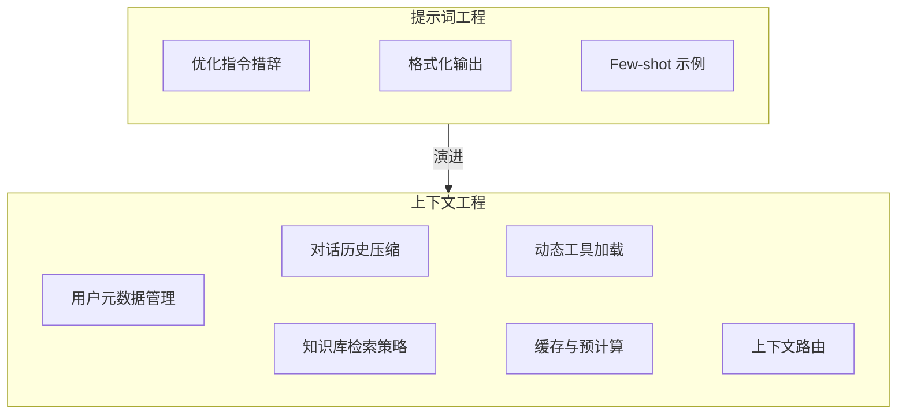
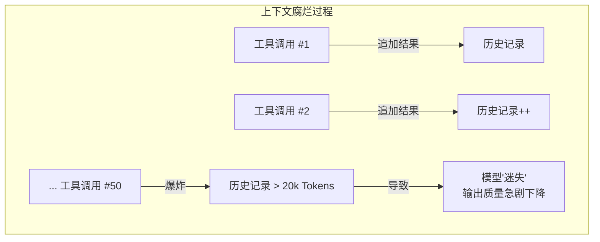
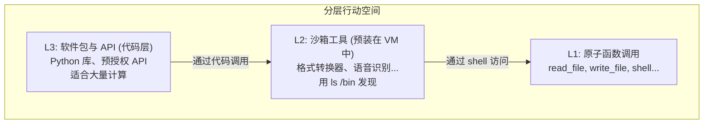
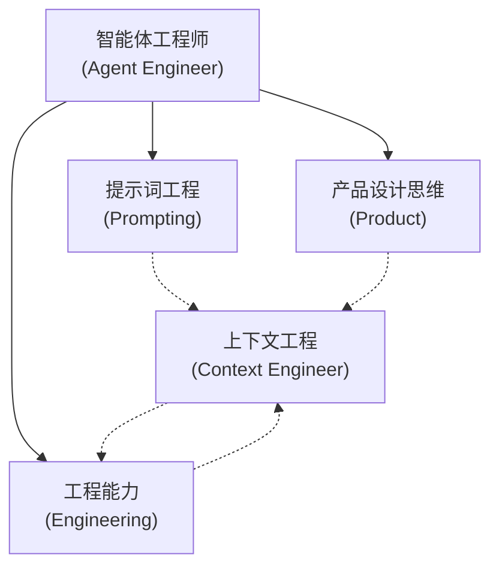

## 3.6 上下文工程

2025 年，随着智能体系统复杂度的提升，业界逐渐意识到：仅仅优化提示词已经不够了。一个全新的工程学科正在兴起——**[上下文工程 (Context Engineering)](https://github.com/yeasy/context_engineering_guide)**。

> [!IMPORTANT]
> **行业信号**：LangChain CEO Harrison Chase 在 2025 年 Interrupt 大会上指出："上下文工程是构建可靠智能体的核心技能。我们需要的不仅仅是提示词工程师（Prompt Engineer），而是智能体工程师（Agent Engineer）——一个融合提示、工程、产品设计和机器学习的新角色。"

### 3.6.1 什么是上下文工程

**上下文工程** 是系统性地管理、优化和编排输入给 AI 模型的所有信息的工程技术。

下图总结了与提示词工程的区别。

| 维度 | **提示词工程** | **上下文工程** |
|------|-------------------|---------------------|
| 优化对象 | 单个提示词 | 整个信息生态系统 |
| 关注范围 | 指令措辞、格式 | 用户元数据、历史、Schema、工具、缓存 |
| 复杂度 | 相对简单 | 系统工程级别 |
| 动态性 | 通常静态 | 高度动态、上下文感知 |
| 角色 | 提示词工程师 | 智能体工程师 |

下图展示了从提示词工程到上下文工程的演进关系。



图 3-10：提示词工程与上下文工程的演进关系 (Evolution from Prompt Engineering to Context Engineering)

### 3.6.2 核心约束：名义上下文 vs 有效上下文

在进行上下文工程时，必须面对两个物理规律限制：

#### 有效上下文远小于标称值

虽然模型宣称支持 200K 甚至 1M Token，但这不意味着在满载时仍能保持智能。

*   **稀疏注意力**：当上下文过长时，注意力权重被稀释。
*   **经验法则**：编程智能体（Coding Agent）通常只能有效利用 **10-15%** 的上下文窗口。超过 20% 后，性能（推理准确性、指令遵循）开始急剧恶化。

#### 智能陷没区

研究发现，上下文窗口的 **中间 40-60% 区域** 存在“Dumb Zone”。

*   **首尾偏好**：Model 倾向于关注开头（系统提示词）和结尾（最新对话）。
*   **中间丢失（Lost in the Middle）**：关键信息如果被淹没在中间的日志海中，很容易被忽略。

> [!TIP]
> **氧气瓶理论**：上下文窗口就像潜水员的氧气瓶。给你一个更大的氧气瓶（2M Token），不代表你能一直潜水直到用完。在深度（复杂度）增加时，耗氧量剧增，你必须在“氧气耗尽”前浮出水面（重启会话）。

### 3.6.3 四大核心策略

面对 **"有限的上下文窗口"** 与 **"无限的知识需求"** 之间的矛盾，LangChain 提出了上下文工程的四大核心策略。这套框架旨在解决一个核心问题：*如何在不溢出 Token 预算的前提下，让 AI 获得最精准、最相关的决策依据？*

LangChain 将其定义为四种对信息的处理原语（Primitives）：

#### 持久化上下文

**核心理念**：将信息持久化存储到外部系统，超越即时上下文窗口（Context Window）的限制。

大模型的上下文窗口是昂贵且易失的（Volatile）。"持久化上下文"不仅仅是简单的日志记录，而是要构建一个 **外部记忆体（External Memory）**。这使得智能体能够"记住"跨越数天甚至数月的交互细节，而无需每次都重新输入。

**关键操作**：
- **索引化（Indexing）**：将非结构化文本通过嵌入转化为向量，从一开始就为后续检索做好准备。
- **结构化存储**：将关键实体（如用户偏好、项目配置）提取存入 SQL/NoSQL 数据库。
- **状态快照**：定期保存智能体的思维状态，支持断点续传。

```python
class ContextWriter:
    """将重要信息写入持久化存储"""
    
    def __init__(self, memory_store):
        self.memory = memory_store
    
    def persist_user_preference(self, user_id: str, preference: dict):
        """保存用户偏好，供后续会话使用"""
        self.memory.write(
            key=f"user:{user_id}:preferences",
            value=preference,
            ttl=86400 * 30  # 保留30天
        )
    
    def persist_task_context(self, task_id: str, context: dict):
        """保存任务上下文，支持跨会话恢复"""
        self.memory.write(
            key=f"task:{task_id}:context",
            value={
                "state": context,
                "timestamp": datetime.now().isoformat(),
                "checksum": self._compute_checksum(context)
            }
        )
```

**应用场景**：

- 用户偏好和个性化设置
- 长期任务的进度保存
- 跨会话的知识积累

#### 筛选上下文

**核心理念**：从海量信息中检索最相关的内容，只向模型展示即刻决策所需的信息。

这是 **RAG** 的本质。即便拥有 1M Token 的上下文窗口，将整本技术手册塞入 提示词通常也是低效且昂贵的。"筛选上下文"就像是为模型佩戴一副"滤镜"，过滤掉噪音，只保留信号。

**关键操作**：
- **向量检索**：通过语义相似度快速定位相关片段。
- **重排序（Re-ranking）**：使用高精度模型对召回结果进行二次排序，确保Top-K的相关性。
- **查询改写**：将用户的模糊问题转化为精确的检索查询。

```python
class ContextSelector:
    """智能筛选相关上下文"""
    
    def __init__(self, retriever, reranker):
        self.retriever = retriever
        self.reranker = reranker
    
    def select_relevant_context(
        self, 
        query: str, 
        max_tokens: int = 4000
    ) -> List[str]:
        """选择与查询最相关的上下文片段"""
        
        # 1. 粗筛：向量检索

        candidates = self.retriever.search(query, k=20)
        
        # 2. 精排：重排序模型

        ranked = self.reranker.rank(query, candidates)
        
        # 3. 裁剪：控制 Token 预算

        selected = []
        current_tokens = 0
        for doc in ranked:
            doc_tokens = count_tokens(doc)
            if current_tokens + doc_tokens > max_tokens:
                break
            selected.append(doc)
            current_tokens += doc_tokens
        
        return selected
```

**关键技术**：

- RAG（检索增强生成）
- 多阶段检索（粗筛 + 精排）
- Token 预算管理

#### 压缩上下文

**核心理念**：在保留信息（关键意图、事实）的前提下，大幅减少 Token 占用量。

这是一种"用时间换空间"的策略。通过额外的计算（调用 LLM 进行总结），来换取更精简的提示词空间。这对于维持长期会话（Long-term Conversation）至关重要，能防止上下文随着对话轮数线性膨胀。

**关键操作**：
- **摘要化（Summarization）**：将过去 10 轮对话压缩为一段 200 字的摘要。
- **信息提取**：从冗长的网页中只提取价格、日期等结构化字段。
- **语言精炼**：去除口语词、冗余修饰，保留语义骨架。

```python
class ContextCompressor:
    """压缩上下文，保留关键信息
    
    注：具体的压缩算法（如滑动窗口、重要性采样）实现细节，
    请参考 [3.2 短期记忆算法与窗口管理](3.2_short_term_memory.md)。
    """
    
    def compress_conversation_history(
        self, 
        messages: List[dict],
        max_tokens: int = 2000
    ) -> List[dict]:
        """压缩对话历史"""
        
        total_tokens = sum(count_tokens(m['content']) for m in messages)
        
        if total_tokens <= max_tokens:
            return messages
        
        # 策略1：保留最近N轮 + 摘要早期对话

        recent_messages = messages[-6:]  # 保留最近3轮
        early_messages = messages[:-6]
        
        if early_messages:
            summary = self.llm.generate(f"""
            请用一段话总结以下对话的关键信息：
            {self._format_messages(early_messages)}
            """)
            
            return [
                {"role": "system", "content": f"[早期对话摘要] {summary}"}
            ] + recent_messages
        
        return recent_messages
    
    def compress_document(self, doc: str, query: str) -> str:
        """基于查询压缩文档，只保留相关部分"""
        return self.llm.generate(f"""
        提取以下文档中与问题「{query}」相关的关键信息：
        
        文档：{doc}
        
        只输出相关的关键信息，删除无关内容。
        """)
```

**压缩策略**：

- 对话摘要（Summarization）
- 关键信息提取
- 渐进式遗忘（保留最近，压缩历史）

#### 隔离上下文

**核心理念**：通过将任务拆分给不同的子智能体（Sub-agents），实现信息的物理隔离和关注点分离。

这体现了 **"最小特权原则"（Principle of Least Privilege）** 在 AI 工程中的应用。与其让一个全能智能体面对包含代码、文档、聊天记录的混杂上下文，不如让"编码智能体"只看代码，"客服智能体"只看 FAQ。这不仅提高了安全性，还通过减少干扰（Distraction）显著提升了特定任务的准确率。

**关键操作**：
- **上下文路由**：根据用户意图，分发到特定的处理单元。
- **防火墙设计**：确保敏感数据（如 API Key）只在特定的执行环境中可见。
- **独立状态机**：每个子智能体维护自己的简短历史，互不污染。

```python
class ContextIsolator:
    """上下文隔离与路由"""
    
    def route_to_specialist(self, query: str, context: dict) -> str:
        """根据任务类型，路由到专业子 Agent"""
        
        task_type = self.classify_task(query)
        
        # 不同任务类型只接收相关上下文

        if task_type == "code":
            specialist_context = {
                "codebase": context.get("codebase"),
                "lsp_errors": context.get("lsp_errors"),
                "git_diff": context.get("git_diff")
                # 不包含：用户偏好、对话历史等无关信息

            }
            return self.code_agent.run(query, specialist_context)
        
        elif task_type == "research":
            specialist_context = {
                "search_results": context.get("search_results"),
                "knowledge_base": context.get("knowledge_base")
                # 不包含：代码相关上下文

            }
            return self.research_agent.run(query, specialist_context)
```

**隔离原则**：

- 最小知识原则：智能体只获取完成任务所需的信息
- 减少干扰：无关上下文会降低推理精度（Lost in the Middle）
- 安全边界：敏感信息隔离

### 3.6.4 实战：构建上下文管理系统

将上述四种策略整合成一个统一的上下文管理器。它协调持久化存储、智能筛选、历史压缩和工具过滤，为每次智能体调用准备优化后的上下文。

```python
class ContextManager:
    """统一的上下文管理器"""
    
    def __init__(self):
        self.writer = ContextWriter(memory_store)
        self.selector = ContextSelector(retriever, reranker)
        self.compressor = ContextCompressor(llm)
        self.isolator = ContextIsolator()
    
    def prepare_context(
        self,
        query: str,
        user_id: str,
        conversation_history: List[dict],
        available_tools: List[dict]
    ) -> dict:
        """为智能体调用准备优化后的上下文"""
        
        # 1. 加载持久化的用户上下文

        user_preferences = self.writer.memory.read(
            f"user:{user_id}:preferences"
        )
        
        # 2. 筛选相关知识

        relevant_knowledge = self.selector.select_relevant_context(
            query, max_tokens=4000
        )
        
        # 3. 压缩对话历史

        compressed_history = self.compressor.compress_conversation_history(
            conversation_history, max_tokens=2000
        )
        
        # 4. 过滤相关工具

        relevant_tools = self._filter_relevant_tools(query, available_tools)
        
        return {
            "user_context": user_preferences,
            "knowledge": relevant_knowledge,
            "history": compressed_history,
            "tools": relevant_tools,
            "token_budget": {
                "used": self._count_total_tokens(...),
                "remaining": 8000 - self._count_total_tokens(...)
            }
        }
```


### 3.6.5 进阶模式：应对复杂场景

随着智能体系统的规模化，我们面临着上下文腐烂、工具过载等深层次挑战。本节介绍几种应对这些复杂场景的高级工程模式。

#### 上下文腐烂与卸载策略

> [!WARNING]
> **上下文腐烂（Context Rot）**：当智能体调用工具次数增多，消息列表不断膨胀，推理性能会出现断崖式下跌——推理变慢、质量下降、甚至开始无意义地重复。

#### 为什么会发生上下文腐烂

下图展示了随着工具调用增加，上下文腐烂的过程：



图 3-11：上下文腐烂过程示意 (Context Rot Process)

Manus 观察到典型的智能体任务大约需要调用 50 次工具。Anthropic 报告生产环境中的智能体可能进行数百轮对话。

**关键阈值**：虽然现代模型支持 100万+ Token 的上下文窗口，但 **性能衰减往往在 12.8万~20万 Token 时就开始**。这个"腐烂前阈值"（Pre-rot Threshold）是触发上下文缩减的信号。

#### 上下文卸载（Context Offloading）

核心思路：**不要把所有东西都硬塞进智能体的短期记忆里，而是卸载到外部存储，需要时再检索回来**。

```python
class ContextOffloader:
    """上下文卸载管理器"""
    
    def offload_tool_result(self, tool_name: str, result: str) -> str:
        """将冗长的工具结果卸载到文件"""
        if len(result) > 2000:  # 超过阈值
            # 写入文件

            file_path = f"/workspace/outputs/{tool_name}_{uuid4()}.log"
            with open(file_path, 'w') as f:
                f.write(result)
            
            # 返回引用而非完整内容

            return f"[结果已保存至 {file_path}，可用 tail/grep 查看]"
        
        return result
    
    def offload_conversation_history(self, messages: List[dict]) -> str:
        """将完整对话历史卸载到文件"""
        file_path = f"/workspace/history/session_{self.session_id}.json"
        with open(file_path, 'w') as f:
            json.dump(messages, f, ensure_ascii=False)
        
        return file_path
```

#### 两阶段缩减策略

Manus 设计了一套结构化的、有明确触发机制的两阶段缩减流程。

#### 第一阶段：紧凑化（Compaction）— 无损可逆

剥离任何能从外部状态重建的信息：

```python
class ContextCompactor:
    """无损、可逆的上下文紧凑化"""
    
    def compact_tool_calls(self, history: List[dict]) -> List[dict]:
        """紧凑化工具调用记录"""
        compacted = []
        
        for msg in history:
            if msg.get("tool_call"):
                # 例：文件写入操作，只保留 path，移除 content

                if msg["tool_call"]["name"] == "write_file":
                    compacted_call = {
                        "tool_call": {
                            "name": "write_file",
                            "args": {
                                "path": msg["tool_call"]["args"]["path"]
                                # content 已写入文件系统，可随时重建

                            }
                        },
                        "result": "[内容已写入文件]"
                    }
                    compacted.append(compacted_call)
                else:
                    compacted.append(msg)
            else:
                compacted.append(msg)
        
        return compacted
```

**关键原则**：

- 只紧凑化 **最早的 50%** 历史记录
- 保留最新的完整工具调用作为 Few-shot 示例
- **可逆性**：任何被剥离的信息都能通过文件路径重建

#### 第二阶段：摘要化（Summarization）— 有损带保险

当紧凑化收益不再明显时，启动摘要化，但需要极其谨慎：

```python
class ContextSummarizer:
    """有损但带保险的摘要化"""
    
    def summarize_with_backup(self, history: List[dict]) -> Tuple[str, str]:
        """摘要化前先创建完整快照"""
        
        # 1. 保险：转储完整上下文到日志文件

        backup_path = f"/workspace/backups/context_{datetime.now()}.json"
        with open(backup_path, 'w') as f:
            json.dump(history, f, ensure_ascii=False)
        
        # 2. 使用完整版本（非紧凑版本）生成摘要

        full_context = self._reconstruct_full_context(history)
        summary = self.llm.generate(f"""
        请总结以下智能体执行历史的关键信息：
        - 完成了哪些任务
        - 关键发现和结论
        - 当前状态
        
        历史记录：
        {full_context}
        """)
        
        # 3. 保留最后几次完整的工具调用（保持连贯性）

        recent_calls = history[-6:]
        
        return summary, backup_path, recent_calls
```


紧凑化是无损且可逆的，而摘要化是有损且不可逆的。虽然两者都能缩减上下文长度，但其底层机制与最终效果截然不同。

#### 动态上下文发现

**少即是多**——在开始时提供给模型的细节越少，效果反而越好。

Cursor 并没有试图把所有上下文都压缩进提示词，而是将所有可能的上下文都转化为文件，让智能体按需检索：

*   **工具结果**：写入 `.log` 文件
*   **对话历史**：写入 `history.json`
*   **终端输出**：自动同步到本地文件
*   **MCP 工具定义**：同步到文件夹
*   **智能体技能 (Agent Skills)**：同步到文件夹

```python
class DynamicContextDiscovery:
    """动态上下文发现"""
    
    def __init__(self):
        self.tool_index = {}  # 工具名称 -> 文件路径
        self.sync_tools_to_files()
    
    def sync_tools_to_files(self):
        """将工具定义同步到文件"""
        for tool in self.available_tools:
            file_path = f"/workspace/.tools/{tool['name']}.md"
            with open(file_path, 'w') as f:
                f.write(f"# {tool['name']}\n\n")
                f.write(f"{tool['description']}\n\n")
                f.write(f"## 参数\n```json\n{json.dumps(tool['schema'])}\n```")
            self.tool_index[tool['name']] = file_path
    
    def get_minimal_system_prompt(self) -> str:
        """返回最小化的系统提示词"""
        tool_names = list(self.tool_index.keys())
        return f"""
        你是一个智能助手。
        
        可用工具列表：{', '.join(tool_names)}
        
        工具详情在 /workspace/.tools/ 目录下。
        需要使用某个工具时，先用 cat 或 grep 查看其详细定义。
        """
```

**A/B 测试结果**：对于调用了 MCP 工具的任务，动态发现策略将 Token 消耗降低了 **46.9%**。

#### 分层行动空间：解决工具过载

当智能体配备的工具越来越多，会出现 **上下文混淆**——模型可能调用错误的工具，甚至幻觉出不存在的工具。此时需要 隔离工具空间。

下图展示了分层行动空间的架构设计：



图 3-12：分层行动空间架构 (Layered Action Space Architecture)

**为什么这样设计**：

1. **L1 固定不变**：原子级函数定义稳定，不会频繁变化，对 KV 缓存友好
2. **L2 按需发现**：工具在沙箱中，智能体像开发者一样用 `ls`、`--help` 自行探索
3. **L3 代码执行**：复杂计算写 Python 脚本，只返回摘要结果

从模型的角度看，无论想使用 L2 还是 L3 的复杂工具，最终都通过 L1 的那几个原子函数执行。这种接口设计，对模型极度简洁，且缓存稳定。

### 3.6.6 智能体工程师：能力模型与职责

构建可靠智能体需要一种新的复合型人才——**智能体工程师**，需要掌握提示词工程、工程能力和产品设计思维。

下图展示了智能体工程师的核心能力模型：



图 3-13：智能体工程师能力模型 (Agent Engineer Capability Model)

**核心技能**：

### 3.6.7 设计哲学：避免过度复杂化

**上下文工程的目标是让模型的工作变得更简单，而不是更难。**> [!IMPORTANT]
> **智能体工程的核心定律**> 
> *"中等模型 + 精心设计的流程"，远胜于"顶级模型 + 混乱的架构"。*
> 
> [!TIP]
> **延伸阅读**：
> - Cursor: [Dynamic Context Discovery](https://cursor.com/cn/blog/dynamic-context-discovery)
> - Manus: [Context Engineering for AI Agents](https://manus.im/blog/context-engineering-for-ai-agents) (英文原版)

---

**下一节**: [本章小结](summary.md)
