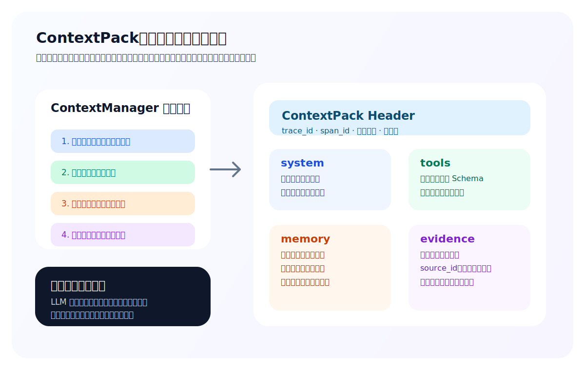

## 3.6 上下文工程

随着智能体系统复杂度的提升，业界逐渐意识到：仅仅优化提示词已经不够了，一个更系统的工程方向正在兴起——**上下文工程**。

> 💡 关于上下文工程的完整介绍，请参阅《上下文工程指南》。

> **要点**：上下文工程强调把“提示词、工具、记忆、用户元数据、缓存与路由”当成一个整体系统来设计。很多稳定性问题，本质上不是“提示词写得不够好”，而是“上下文注入的内容不对/不全/不可控”。

> **关键链接**：上下文工程是必要条件但非充分条件。要将精心设计的上下文转化为生产级的可靠行为，还需要 Harness 层的执行治理——工具执行控制、状态持久化、安全边界和生命周期管理（详见 [9.2 节](../09_agentops/9.2_harness.md) Harness 架构）。

### 3.6.1 上下文工程在智能体中的关键角色

**上下文工程** 是系统性地管理、优化和编排输入给 AI 模型的所有信息的技术。在智能体系统中，核心职能是将长期记忆（数据库、知识库）中的海量信息，经筛选、压缩和编排，高效注入到短期记忆（上下文窗口）中。

智能体与一般的 LLM 应用不同，上下文工程需要特别关注：
- 工具的动态注入与卸载
- 内存（episodic、semantic、procedural）的分层管理
- 用户元数据与权限隔离
- 缓存与路由的动态调整

### 3.6.2 核心约束：有效上下文远小于标称值

模型宣称的上下文窗口规模（如 200K tokens）并不反映实际推理能力。两个核心限制：

1. **上下文腐烂（Context Rot）**：即便模型能处理长序列，推理准确率也会随上下文长度增加而逐步衰减。这不是突然崖裂，而是性能的渐进式下降。

2. **中段丢失（Lost in the Middle）**：模型倾向于关注开头（系统提示）和结尾（最新结果），对中间内容重视度低。关键信息如淹没在日志海中，易被忽略。

**经验法则**：编码智能体通常只能有效利用上下文窗口的一小部分；当窗口被噪音填满时，推理准确性与指令遵循会明显下降。

### 3.6.3 系统提示词的“高度”校准

系统提示词需避免两个极端：

- **过度硬编码**：`IF 包含“代码” THEN 调用 tool_A` 在边界情况下失效，需不断补丁。
- **过度抽象**：`你是聪明助手，按最佳实践完成任务` 指导不足，易导致猜测。

**正确做法**：提供启发式指导而非严格规则。例如：“你是编码助手。修改代码时：(1) 搜索相关文件理解上下文 (2) 提出方案并说明原因 (3) 实施后运行测试 (4) 失败则分析并迭代（最多 3 次）”——既具体又灵活。

### 3.6.4 四大核心策略

面对 **“有限的上下文窗口”** 与 **“无限的知识需求”** 之间的矛盾，工程上常用一组可复用的上下文工程策略来解决一个核心问题：*如何在不溢出 Token 预算的前提下，让 AI 获得最精准、最相关的决策依据？*

这套方法可以抽象为四种对信息的处理原语：持久化上下文、筛选上下文、压缩上下文、隔离上下文。

把这四种策略放进一个统一流水线里，会更容易理解它们之间的前后关系：持久化负责“把信息留在系统外”，筛选负责“把相关内容找回来”，压缩负责“把必要内容变短”，隔离负责“把不该看到的内容挡在外面”。


```mermaid
flowchart LR
    classDef source fill:#e6f7ff,stroke:#1890ff,stroke-width:2px,color:#0f172a;
    classDef step fill:#f8fafc,stroke:#64748b,stroke-width:2px,color:#0f172a;
    classDef pack fill:#fff7e6,stroke:#fa8c16,stroke-width:2px,color:#0f172a;
    classDef sink fill:#f6ffed,stroke:#52c41a,stroke-width:2px,color:#0f172a;

    Query["任务 / 用户请求"] --> Persist["1. 持久化<br/>加载偏好、快照、长期记忆"]
    Persist --> Select["2. 筛选<br/>检索、重排序、预算裁剪"]
    Select --> Compress["3. 压缩<br/>摘要历史、提取结构化字段"]
    Compress --> Isolate["4. 隔离<br/>过滤工具域、路由子智能体"]
    Isolate --> Pack["ContextPack<br/>统一上下文数据包"]
    Pack --> Model["当前推理步的 LLM / Agent"]
    Model --> Feedback["结果、日志、用户反馈"]
    Feedback -.写回.-> Persist

    class Query source;
    class Persist,Select,Compress,Isolate,Feedback step;
    class Pack pack;
    class Model sink;
```

图 3-10：四大上下文策略的统一管线

#### 1. 持久化上下文

**核心理念**：将信息持久化存储到外部系统，超越即时上下文窗口的限制。

大模型的上下文窗口是昂贵且易失的。“持久化上下文”不仅仅是简单的日志记录，而是要构建一个 **外部记忆体**。这使得智能体能够“记住”跨越数天甚至数月的交互细节，而无需每次都重新输入。

**关键操作**：
- **索引化**：将非结构化文本通过嵌入转化为向量，从一开始就为后续检索做好准备。
- **结构化存储**：将关键实体（如用户偏好、项目配置）提取存入 SQL/NoSQL 数据库。
- **状态快照**：定期保存智能体的思维状态，支持断点续传。

```python
class ContextWriter:
    """将重要信息写入持久化存储"""

    def __init__(self, memory_store):
        self.memory = memory_store

    def persist_user_preference(self, user_id: str, preference: dict):
        """保存用户偏好，供后续会话使用"""
        self.memory.write(
            key=f"user:{user_id}:preferences",
            value=preference,
            ttl=86400 * 30  # 保留 30 天
        )

    def persist_task_context(self, task_id: str, context: dict):
        """保存任务上下文，支持跨会话恢复"""
        self.memory.write(
            key=f"task:{task_id}:context",
            value={
                "state": context,
                "timestamp": datetime.now().isoformat(),
                "checksum": self._compute_checksum(context)
            }
        )
```

**应用场景**：

- 用户偏好和个性化设置
- 长期任务的进度保存
- 跨会话的知识积累

**工具设计中的 Token 效率原则**：设计工具时应优先考虑 Token 消耗。例如 `search_contacts(query)` 比 `list_contacts()` 的 Token 效率高出一个数量级——前者只返回匹配结果，后者返回完整列表。设计原则是：**让工具 API 支持查询与过滤，而非一次性加载全集**。

#### 2. 筛选上下文

**核心理念**：从海量信息中检索最相关的内容，只向模型展示即刻决策所需的信息——这就是 RAG 的本质。

**关键操作**：向量检索（语义相似度）→ 重排序（精确性）→ Token 预算控制（选择 Top-K）。

```python
def select_context(query: str, candidates: List[str], budget: int = 4000) -> List[str]:
    """多阶段检索：粗筛 → 精排 → 预算截断"""
    coarse = vector_search(query, candidates, top_k=20)   # 语义粗筛
    ranked = reranker.rank(query, coarse, top_k=10)        # 交叉编码器精排
    selected, used = [], 0
    for doc in ranked:
        tokens = count_tokens(doc)
        if used + tokens <= budget:
            selected.append(doc)
            used += tokens
    return selected
```

详细的检索优化技术请参考 [3.4 RAG 系统设计与优化](3.4_rag_advanced.md)。

#### 3. 压缩上下文

**核心理念**：通过额外计算（LLM 摘要），在保留关键信息的前提下大幅减少 Token 占用（“用时间换空间”）。

**关键操作**：对话摘要（保留最近 N 轮，更早的压缩为摘要）、信息提取（只保留结构化字段）、渐进式遗忘（周期性压缩早期记录）。

一种被实证验证高效的变体是 **结构化笔记**：让智能体在执行过程中定期将关键发现写入外部文件（如 `NOTES.md`），重启会话时直接读取笔记恢复工作记忆，而非压缩整个对话历史。笔记比自由文本摘要更紧凑、更易检索，且支持跨会话延续。

详细实现请参考 [3.2 短期记忆管理](3.2_short_term_memory.md)。

#### 4. 隔离上下文

**核心理念**：将任务拆分给不同的子智能体（Sub-agents），实现信息隔离和关注点分离——体现“最小特权原则”。

不让全能智能体面对混杂上下文，而是“编码智能体”只看代码、“客服智能体”只看 FAQ，既提升准确性，也强化安全边界。

```python
def route_to_subagent(query: str, context: dict) -> str:
    """按意图将请求路由到专用子智能体，每个子智能体只看到自己领域的上下文"""
    intent = classify_intent(query)  # coding / support / analysis
    subagent = AGENT_REGISTRY[intent]
    filtered_ctx = filter_context_by_domain(context, domain=intent)  # 隔离
    return subagent.run(query, context=filtered_ctx)
```

**关键操作**：上下文路由（按意图分发）、防火墙设计（敏感数据隔离）、独立状态机（各子智能体的历史互不污染）。详见 [第 5 章 多智能体协作](../05_collaboration/5.1_architectures.md)。

### 3.6.5 实战：构建统一的上下文结构与管理器

在工程落地时，强类型与标准化的上下文结构能极大简化调试与监控。建议抛弃散装的字符串拼接，改用统一的 `ContextPack` 结构。该结构必须内置 `trace_id` 与 `span_id`，以保证与系统其余部分（如互操作协议、可观测性平台）的日志完全对齐。

```python
import uuid
from typing import List, Dict

class ContextPack:
    """标准化的上下文数据包——所有字段对齐可观测性体系"""
    def __init__(self, trace_id: str = None):
        self.trace_id = trace_id or str(uuid.uuid4())
        self.span_id = str(uuid.uuid4())
        self.system: str = ""              # 身份与规则提示词
        self.tools: List[Dict] = []        # 当前可用工具 Schema
        self.memory: List[Dict] = []       # 长/短期记忆、压缩历史及偏好
        self.evidence: List[Dict] = []     # 检索到的事实片段（需含 source_id）

class ContextManager:
    """四大策略的统一编排入口"""

    def prepare_context(self, query: str, user_id: str,
                        history: List[dict], tools: List[dict]) -> ContextPack:
        pack = ContextPack()
        # 1. 持久化 → 加载用户偏好
        pack.memory += self.load_user_prefs(user_id)
        # 2. 筛选 → 检索相关知识
        pack.evidence = self.select_relevant(query, max_tokens=4000)
        # 3. 压缩 → 摘要对话历史
        pack.memory += self.compress_history(history, max_tokens=2000)
        # 4. 隔离 → 过滤当前任务相关的工具
        pack.tools = self.filter_tools(query, tools)
        return pack
```

对应到工程对象，`ContextPack` 本身可以看成一个带来源标签的标准容器：顶部是全链路追踪信息，中间是系统提示词与工具定义，底部是记忆和证据片段。



图 3-11：ContextPack 的结构与来源

通过引入 `ContextPack` 及强制性的 `trace_id/span_id`，每一次上下文拼接过程都可以被独立回放和审计。这与[第 6 章](../06_communication/README.md)的通信协议及[第 9 章](../09_agentops/README.md)的可观测性监控体系形成了完美的闭环。

### 3.6.6 进阶模式：应对复杂场景

随着智能体系统规模化，面临上下文腐烂、工具过载等挑战。以下是四种应对方案：

#### 1. 上下文腐烂与卸载

**问题**：工具调用累积，历史膨胀，模型推理性能断崖式下跌。

**解决**：不硬塞进短期记忆，改为卸载到外部存储（超过 Token 阈值的结果写入 `.log`，对话历史写入 `.json`），需要时再检索。这比持续压缩短期窗口更高效。

#### 2. 两阶段缩减策略

当卸载不足时，采用渐进式缩减：

- **第一阶段（紧凑化）**：无损、可逆。剥离能从外部重建的信息（如文件写入只保留路径），保留最近调用作为 Few-shot 示例。
- **第二阶段（摘要化）**：有损但带保险。生成摘要前先备份，保留最后 6 次完整调用维持连贯性。

关键：紧凑化可逆，摘要化不可逆，应优先尽力紧凑。

#### 3. 动态上下文发现

**核心**：“少即是多”——不在系统提示中列举所有工具，改为同步工具定义到文件（`.tools/` 目录），让智能体按需用 `cat` 或 `grep` 自行发现。

**效果**：显著降低初始上下文 Token 消耗，尤其对工具众多的场景。

#### 4. 分层行动空间

**问题**：工具过多导致上下文混淆与幻觉。

**解决**：分三层架构——
- **L1（原子）**：`read_file, write_file, shell` 等基础操作，固定且缓存友好
- **L2（沙箱）**：格式转换、语音识别等工具，智能体自行用 `ls/--help` 探索
- **L3（代码）**：复杂计算写成 Python 脚本，只返回摘要

模型只需调用统一的 L1 接口，通过 L1 执行 L2/L3 的工具，大幅简化认知负荷并提高稳定性。

### 3.6.7 智能体工程师的核心技能

构建可靠智能体需要 **提示词工程 × 软件工程 × 产品设计** 三者的交叉能力，业界开始将这一角色称为“智能体工程师”或“上下文工程师”。其核心技能包括：

* **上下文预算与裁剪**：权衡成本、延迟与信息量，制定可执行的预算策略。
* **信息检索与证据链**：设计检索、重排序与引用格式，让答案可追溯、可审计。
* **工具与接口设计**：将复杂能力封装为稳定的原子工具，通过 Schema 降低参数幻觉。
* **评估与回归**：将需求转化为验收标准，维护回归样例集并量化改动收益。
* **安全与隐私**：处理提示词注入、数据脱敏、权限分级与保留期治理。
* **可观测与故障恢复**：用轨迹日志定位失败模式，设计重试、回退与熔断机制。

### 3.6.8 设计哲学：避免过度复杂化

**上下文工程的目标是让模型的工作变得更简单，而不是更难。**

> **重要**：
> **智能体工程的核心定律**
> *“中等模型 + 精心设计的流程”，远胜于“顶级模型 + 混乱的架构”。*

> **提示**：
> **延伸阅读**：
> - 上下文预算与成本：见 3.2、9.3。
> - 证据链与工具调用：见 4.2、9.2。
> - 安全防御与对抗测试：见 11.1、9.4。

### 3.6.9 被动上下文 vs. 动态技能：实证对比

2026 年初，Vercel 的研究对比了两种传递框架知识的方式：**被动上下文（AGENTS.md）** 与 **动态技能（Skills）**。

**实证发现**：在 Next.js 16 API（超出模型训练数据的框架特性）的评估套件上，以下四种配置的表现对比：

| 配置 | 成功率 |
| :--- | :--- |
| **无文档（基线）** | 53% |
| **Skills（默认）** | 53% |
| **Skills + 显式指导** | 79% |
| **AGENTS.md（压缩索引）** | 100% |

关键洞见：**被动上下文优势**——信息总在系统提示词中可用，无需智能体主动激活技能，消除了“先参考文档还是先探索代码”的决策摩擦。一份压缩的 8KB 文档索引（从原 40KB 文档压缩而来）嵌入系统提示，达到了完美的适应性。

这启示我们：在上下文有限的情况下，**精心设计、无需激活的被动信息往往优于可选的动态工具**。

> **补注**：上述数据来自特定项目的内部评估。实际效果因项目复杂度、框架特性和 LLM 能力而异。建议在自身项目中通过类似评估验证效果。

### 3.6.10 记忆安全与隐私

记忆系统一旦“能写能读”，就具备了长期影响智能体行为的能力；相应地，它也会带来更高的安全与合规要求。工程上建议把记忆与上下文视为一类“可被攻击、可被治理”的数据资产。

#### 3.6.10.1 记忆投毒与间接注入

记忆投毒是指攻击者通过对话、文档或工具输出，把恶意指令写入长期记忆或知识库，从而在后续检索中反复触发。常见防护思路包括：

- **写入前审查**：将“可写入记忆”的内容分为白名单字段（偏好、事实、已验证结论），拒绝写入指令性文本。
- **分区与隔离**：将“用户偏好”“任务轨迹”“外部知识”分库存储，检索时按任务域选择分区，避免跨域污染。
- **带证据的写入**：要求每条可持久化记忆携带来源与证据指针，支持事后回放与撤销。

#### 3.6.10.2 保留期与删除权

记忆越持久，风险越大。建议把保留期做成明确策略，而不是“默认永久保存”：

- **按类型设置保留期**：偏好可长存，任务轨迹与日志应短存，敏感字段应不落盘或强加密。
- **可删除与可追溯**：支持按用户、会话、记忆条目删除，并确保下游索引与缓存同步失效。
- **最小化原则**：能从原始数据推导出的信息不要重复存储；能用摘要表达的不要存全文。

例如，可以把保留期策略做成可配置的规则集：

```yaml
memory_retention:
  preference:
    ttl_days: 365
  episodic_trace:
    ttl_days: 30
  tool_outputs:
    ttl_days: 7
  pii_fields:
    persist: false
```

#### 3.6.10.3 隐私与脱敏清单

落地时可以用一份最小清单做自检：

- 记忆写入前是否做了 PII 识别与脱敏
- 是否区分“用户可见摘要”和“受控日志细节”
- 是否记录了每条记忆的 `source`、`timestamp`、`trace_id`
- 是否支持删除与撤销，并能覆盖向量索引与缓存
- 是否为跨租户检索设置了硬隔离与权限校验

在前面的章节里，我们讨论的是抽象原则；下面给出一个“贴近真实产品、但明确标注边界”的示意案例，把持久化、压缩、隔离与治理串成一个完整闭环。

---

### 3.6.11 “做梦”机制：跨会话记忆整合

一种新兴的记忆管理模式是”做梦”（Dreaming）机制，灵感来自生物学上睡眠期间大脑的记忆整合过程。这套机制尤其适合长期运行的智能体系统。

#### 工作原理

在积累足够数量的会话后，后台触发一个 **专用记忆整合 Agent**（类似”梦者”），执行以下四个阶段：

1. **定位**（Locate）：扫描过去 N 个会话的记忆存储，识别重复出现或稳定的知识点、模式与经验。
2. **收集**（Collect）：把这些稳定内容从分散的会话记忆中收集起来，去重并标记源会话。
3. **合并**（Merge）：将相似内容合并，生成更紧凑、更通用的总结（如”处理 API 错误的最佳实践”）。
4. **组织**（Organize）：将合并后的知识重新组织回外部记忆库（如 MEMORY.md 的 topic 文件），供未来会话检索。

#### 互斥与安全保障

多个会话同时触发梦者存在竞争风险。通常采用 **PID + 时间戳的文件锁**：

```python
lock_file = f"~/.claude/projects/{project_id}/memory/.dreamlock"
# 格式：{pid}:{timestamp}
# 只有最早的进程获得独占权
```

梦者 Agent 本身使用受限工具集：只读访问 bash（查询文件）和对 `memory/` 目录的写权限，防止误修改项目代码。

#### 实施建议

- **触发阈值**：每 5-10 个会话或每周一次定期触发。
- **隔离上下文**：梦者运行时与主会话隔离，使用独立的系统提示与工具定义。
- **版本管理**：整合前备份原始会话记录，支持事后审计与回滚。

## 3.7 示意案例：以 Claude Code 官方机制为参照的”autoDream”记忆整合器

> 说明：Anthropic 官方文档公开了 Claude Code 的 `CLAUDE.md`、auto memory、`/memory`、`/compact`、subagents 与 hooks 等机制；下文中的”autoDream”只是为了说明这些机制如何被工程化组合而构造的示意名称，不代表 Anthropic 已公开发布同名功能或内部实现。

### 3.7.1 官方文档已经公开的记忆机制

根据 Anthropic 公开的 Claude Code 文档，以下机制可以作为”记忆整合器”的可靠设计基础：

- **层级化指令记忆**：`CLAUDE.md`/`CLAUDE.local.md` 会按目录层级加载；当前工作目录以上的文件在启动时加载，子目录下的文件在读取相关文件时按需加载。
- **项目级 auto memory**：每个项目对应 `~/.claude/projects/<project>/memory/`；其中 `MEMORY.md` 是入口文件，首 200 行或 25KB 会在每次会话开始时加载，其余 topic 文件按需读取。
- **显式管理入口**：`/memory` 可以查看当前加载的记忆文件、切换 auto memory，并直接打开和编辑记忆目录。
- **上下文压缩机制**：`/compact` 与自动 compact 会在上下文逼近上限时摘要历史；Claude Code 也会为 `claude --resume` 做后台会话摘要。
- **隔离式子智能体**：subagent 运行在独立上下文中；若启用 `memory` 字段，还可拥有单独的持久化记忆目录。
- **可编排触发点**：hooks 提供 `PostCompact`、`TaskCompleted`、`SubagentStop` 等事件，可作为记忆整理流程的触发器。

这些都是文档可证实的“能力边界”；再往里一层的调度策略与内部实现，官方并未公开。

### 3.7.2 一个推测性的“autoDream”架构

如果要在 Claude Code 的公开机制之上实现后台记忆整合，可以把“autoDream”理解为一个**示意性的维护流程**，而不是既有产品特性：

1. **触发**：在 `PostCompact`、`TaskCompleted`、`SessionEnd` 等 hooks 上触发，或由外部定时任务周期性唤起。
2. **读取**：检查项目的 `CLAUDE.md`、auto memory 目录，以及需要长期积累知识的 subagent memory。
3. **整合**：把稳定、可复用的经验写回 topic 文件，把 `MEMORY.md` 保持为简洁索引，避免超出首屏加载预算。
4. **回流**：下一次会话启动时，`CLAUDE.md` 与 `MEMORY.md` 头部自动进入上下文；更细的主题文件继续按需读取。

用伪代码表示，大致会是下面这样的组合：

```python
def auto_dream(event):
    project_memory = load_auto_memory_dir()
    instruction_files = load_claude_md_hierarchy()
    agent_memories = load_subagent_memories()

    stable_notes = consolidate(
        instruction_files=instruction_files,
        project_memory=project_memory,
        agent_memories=agent_memories,
        trigger=event,
    )

    rewrite_memory_index(
        memory_dir=project_memory,
        notes=stable_notes,
        max_head_lines=200,
        max_head_bytes=25 * 1024,
    )
```

这里真正关键的不是“是否有一个叫 autoDream 的后台代理”，而是是否把**压缩、分层、按需加载、可审计编辑**这些公开机制连接成了闭环。

### 3.7.3 哪些内容不能当作 Claude Code 官方事实

为了避免把示意架构误读为产品说明，下面这些说法都不应写成“Claude Code 已经如此实现”：

- 存在一个官方命名为“autoDream”的内置后台组件。
- 存在固定的“三重门控”规则，如“24 小时 + 5 次会话 + 互斥锁”。
- 官方使用了本文所写的 `~/memories/` 目录结构、`findRelevantMemories()` 函数或特定向量嵌入流程。
- 官方要求只能通过某个专用 memory API 写入，或采用了文中的特定淘汰/冲突消解启发式。

更稳妥的写法是：**官方公开了可拼装这些能力的机制；至于如何组合成后台记忆整合器，则属于工程实现选择。**

---

**下一节**: [本章小结](summary.md)
