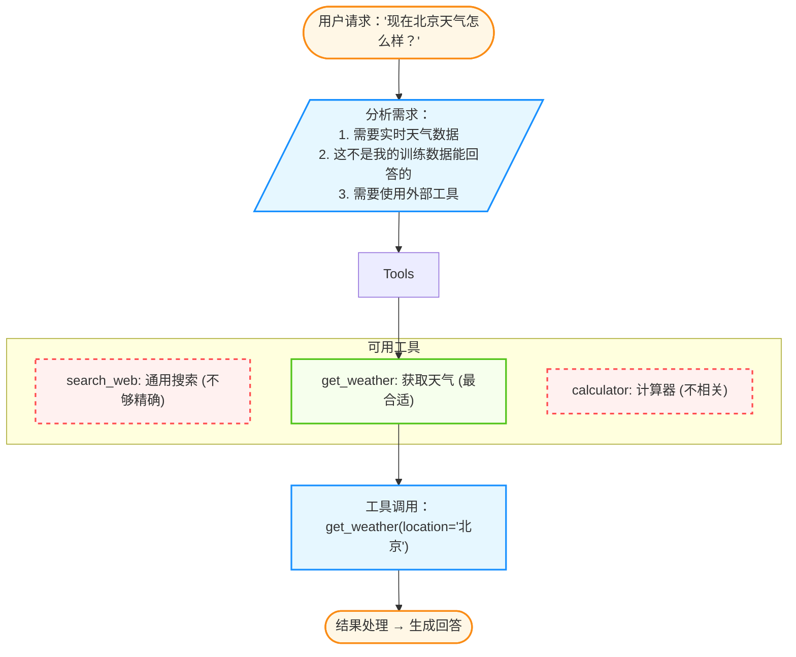
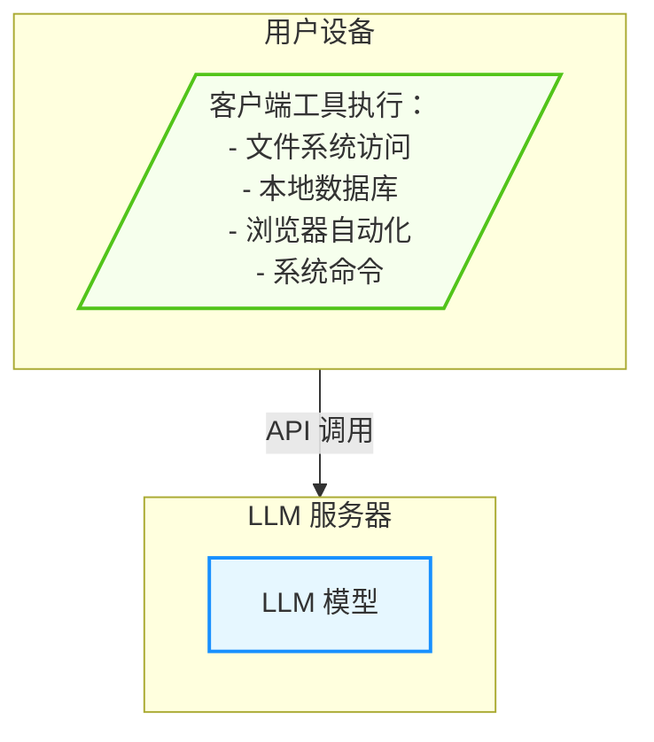
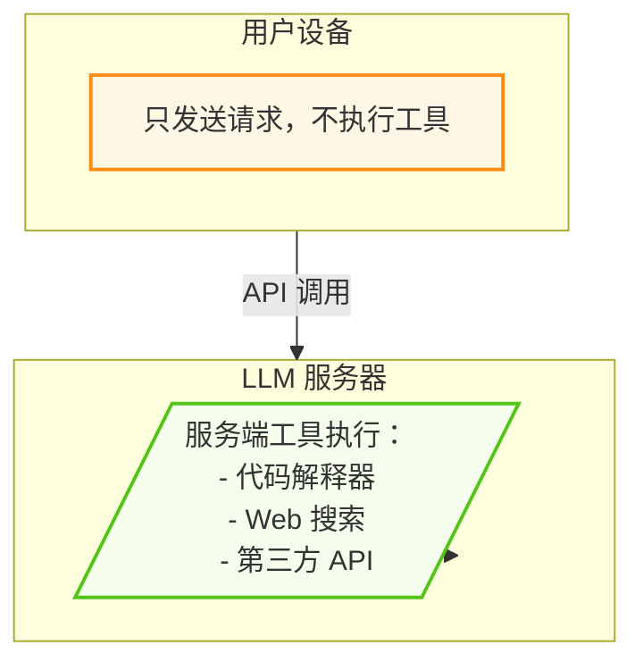
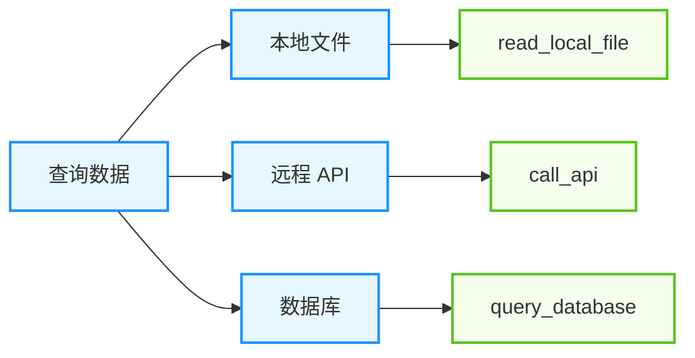

## 4.1 工具使用概述与分类

工具是智能体扩展能力边界的核心手段。理解工具的分类和设计原则，是构建强大智能体系统的基础。

### 4.1.1 什么是智能体的工具

在智能体系统中，**工具（Tool）** 是一个可被模型调用的函数或服务，它接收结构化输入，执行特定操作，并返回结果。以下是工具的基本结构定义：

```python
# 一个简单的工具定义

class Tool:
    name: str                    # 工具名称
    description: str             # 工具描述
    parameters: dict             # 参数定义
    
    def run(self, **kwargs):     # 执行函数
        pass
```

### 4.1.2 为什么工具使用如此重要

大语言模型虽然强大，但存在固有局限：

| 局限 | 示例 | 工具解决方案 |
|------|------|--------------|
| 知识截止日期 | 不知道最新新闻 | 网页搜索工具 |
| 无法计算 | 复杂数学容易出错 | 计算器/代码执行 |
| 无法访问私有数据 | 不知道用户文件 | 文件系统工具 |
| 无法执行操作 | 不能发送邮件 | API 调用工具 |
| 无法感知环境 | 不知道当前时间 | 系统信息工具 |

### 4.1.3 工具使用的核心流程

智能体使用工具通常遵循一个基本的 “感知-思考-行动” 循环：

#### 基本循环

智能体使用工具的核心是一个循环过程：分析需求、选择工具、生成参数、执行工具、处理结果。以下代码展示了这一基本流程：

```python
while not task_completed:
    # 1. 理解当前状态和目标

    analysis = llm.analyze(context, goal)
    
    # 2. 决定是否需要使用工具

    if needs_tool(analysis):
        # 3. 选择合适的工具

        tool = select_tool(analysis, available_tools)
        
        # 4. 生成工具参数

        params = generate_params(analysis, tool)
        
        # 5. 执行工具

        result = execute_tool(tool, params)
        
        # 6. 将结果反馈给模型

        context.add(f"工具返回：{result}")
    else:
        # 直接生成回答

        response = llm.generate(context)
        return response
```

#### 工具选择的决策过程




图 4-1：工具选择决策流程

### 4.1.4 工具与提示词的区别

| 维度 | **提示词** | **工具** |
|------|--------|------|
| 执行者 | 模型自身 | 外部系统 |
| 能力边界 | 模型内在知识 | 可无限扩展 |
| 结果确定性 | 可能产生幻觉 | 确定性结果 |
| 实时性 | 训练数据截止 | 可获取实时信息 |


### 4.1.5 工具的分类体系

根据功能和用途，智能体工具主要可以分为信息获取类、信息处理类、环境交互类和任务执行类。

#### 信息获取类

从外部源获取信息的工具，包括 Web 搜索、数据库查询、API 调用、文档检索等。以下是典型的信息获取工具接口定义：

```python
# Web 搜索

def search_web(query: str, num_results: int = 5) -> List[SearchResult]:
    """搜索网页获取信息"""
    pass

# 数据库查询

def query_database(sql: str) -> QueryResult:
    """执行 SQL 查询"""
    pass

# API 调用

def call_api(endpoint: str, method: str, params: dict) -> ApiResponse:
    """调用外部 API"""
    pass

# 文档检索

def retrieve_documents(query: str, k: int = 3) -> List[Document]:
    """从知识库检索相关文档"""
    pass
```

#### 计算执行类

执行计算和数据处理的工具，包括数学计算、代码执行、数据分析等。以下是典型的计算执行工具接口定义：

```python
# 数学计算

def calculate(expression: str) -> float:
    """执行数学计算"""
    return eval(expression)  # 实际应使用安全的解析器

# 代码执行

def run_python(code: str) -> ExecutionResult:
    """在沙箱中执行 Python 代码"""
    pass

# 数据分析

def analyze_data(data: DataFrame, analysis_type: str) -> AnalysisResult:
    """执行数据分析"""
    pass
```

#### 内容生成类

生成特定格式内容的工具，包括图像生成、图表生成、文档生成等。以下是典型的内容生成工具接口定义：

```python
# 图像生成

def generate_image(prompt: str, style: str = "realistic") -> Image:
    """根据描述生成图像"""
    pass

# 图表生成

def create_chart(data: dict, chart_type: str) -> Chart:
    """生成数据可视化图表"""
    pass

# 文档生成

def generate_pdf(content: str, template: str) -> bytes:
    """生成 PDF 文档"""
    pass
```

#### 环境交互类

与运行环境交互的工具，包括文件操作、命令行操作、浏览器控制等。以下是典型的环境交互工具接口定义：

```python
# 文件操作

def read_file(path: str) -> str:
    """读取文件内容"""
    pass

def write_file(path: str, content: str) -> bool:
    """写入文件"""
    pass

# 命令行操作

def run_shell(command: str) -> ShellResult:
    """执行 shell 命令"""
    pass

# 浏览器控制

def browser_navigate(url: str) -> PageContent:
    """打开网页并获取内容"""
    pass
```

#### 通信类

与外部实体通信的工具，包括发送消息、调用其他智能体、人机交互等。以下是典型的通信工具接口定义：

```python
# 发送消息

def send_email(to: str, subject: str, body: str) -> bool:
    """发送电子邮件"""
    pass

def send_slack(channel: str, message: str) -> bool:
    """发送 Slack 消息"""
    pass

# 调用其他智能体

def call_agent(agent_id: str, task: str) -> AgentResponse:
    """调用另一个智能体"""
    pass

# 人机交互

def ask_human(question: str, timeout: int = 300) -> str:
    """向人类提问"""
    pass
```

### 4.1.6 按接口类型分类

除了功能维度的分类，工具还可以根据其执行环境和调用方式进行区分。主要包括客户端工具和服务端工具。

#### 客户端工具

客户端工具在用户设备上执行，可以直接访问本地资源：



图 4-2：客户端工具执行模式

**优点**：可访问本地资源、低延迟
**缺点**：安全风险、依赖客户端环境

#### 服务端工具

服务端工具在远程服务器上执行，用户设备只发送请求：



图 4-3：服务端工具执行模式

**优点**：安全可控、统一管理
**缺点**：无法访问本地资源

### 4.1.7 工具设计原则

为了确保智能体能够准确、高效地使用工具，在设计工具时应遵循以下核心原则。这些原则旨在降低模型的认知负担，提高工具调用的成功率和系统的整体稳定性。

#### 单一职责原则

每个工具只做一件事：

```python
# ✅ 好的设计

tools = [
    Tool(name="search_web", description="搜索网页"),
    Tool(name="read_file", description="读取文件"),
    Tool(name="write_file", description="写入文件"),
]

# ❌ 不好的设计

tools = [
    Tool(name="file_operation", description="文件操作，包括读取、写入、删除等"),
]
```

#### 清晰的描述

让模型准确理解何时使用：

```python
# ✅ 好的描述

Tool(
    name="calculate",
    description="""执行数学计算。
    
    适用场景：
    - 简单四则运算
    - 复杂数学表达式
    - 统计计算（均值、标准差等）
    
    不适用场景：
    - 需要推理的逻辑题
    - 需要外部数据的计算
    
    参数格式：标准数学表达式，如 "2 + 3 * 4" 或 "sqrt(16)"
    """
)

# ❌ 模糊的描述

Tool(
    name="calculate",
    description="计算"
)
```

#### 明确的参数定义

使用 JSON Schema 规范参数：

```python
Tool(
    name="send_email",
    parameters={
        "type": "object",
        "properties": {
            "to": {
                "type": "string",
                "description": "收件人邮箱地址",
                "pattern": r"^[\w\.-]+@[\w\.-]+\.\w+$"
            },
            "subject": {
                "type": "string",
                "description": "邮件主题",
                "maxLength": 200
            },
            "body": {
                "type": "string",
                "description": "邮件正文，支持 Markdown 格式"
            },
            "cc": {
                "type": "array",
                "items": {"type": "string"},
                "description": "抄送列表（可选）"
            }
        },
        "required": ["to", "subject", "body"]
    }
)
```

#### 友好的错误信息

返回可操作的错误提示：

```python
class ToolResult:
    success: bool
    data: Any = None
    error: str = None
    error_code: str = None
    suggestion: str = None

# 示例返回

ToolResult(
    success=False,
    error="API 调用失败：认证错误",
    error_code="AUTH_ERROR",
    suggestion="请检查 API Key 是否正确配置"
)
```

#### 幂等性

相同输入产生相同结果：

```python
# ✅ 幂等操作

def get_weather(city: str) -> WeatherInfo:
    """获取天气（幂等）"""
    return weather_api.get(city)

# ⚠️ 非幂等操作（需要特殊处理）

def send_message(to: str, content: str) -> bool:
    """发送消息（非幂等）"""
    # 添加幂等性 ID

    idempotency_key = hash(f"{to}:{content}:{timestamp}")
    return message_api.send(to, content, idempotency_key)
```

### 4.1.8 工具组合模式

在面对复杂的现实任务时，往往无法仅靠单一工具解决问题。通过将多个工具按照特定的逻辑进行组合，可以构建出更强大的工作流，以应对更高级的挑战。常见的组合模式包括链式模式、分支模式和并行模式。

#### 链式模式

多个工具按顺序调用：


图 4-4：链式组合模式

#### 分支模式

根据条件选择不同工具：



图 4-5：分支组合模式

#### 并行模式

同时调用多个独立工具：

```python
async def parallel_search(query: str):
    results = await asyncio.gather(
        search_web(query),
        search_docs(query),
        search_code(query)
    )
    return merge_results(results)
```

### 4.1.9 为 AI 设计的信息架构

现有的 CLI 工具是为人设计的（人类可读的输出、隐式的上下文），而 AI 需要更明确的信息架构。将来支持 AI 调用的工具，需要支持结构化的输出、显式的上下文和进度感知。

#### 结构化输出

* **Human**: `ls -l` (表格视图)
* **AI**: `ls --json` (JSON 格式，易于解析，无歧义)

#### 显式上下文

当工具报错时，必须提供足够的上下文让智能体自行修复：

*   ❌ `Error: file not found`
*   ✅ `Error: file 'main.py' not found in current directory '/src/utils'. Did you mean '/src/app/main.py'?`

#### 进度感知

对于长输出（如日志），不要让智能体盲目猜测。

*   提供 `head/tail` 的同时，告知总行数。
*   允许智能体缓存输出到文件，而不是塞满上下文。

---

**下一节**: [4.2 工具使用机制](4.2_tool_use.md)
