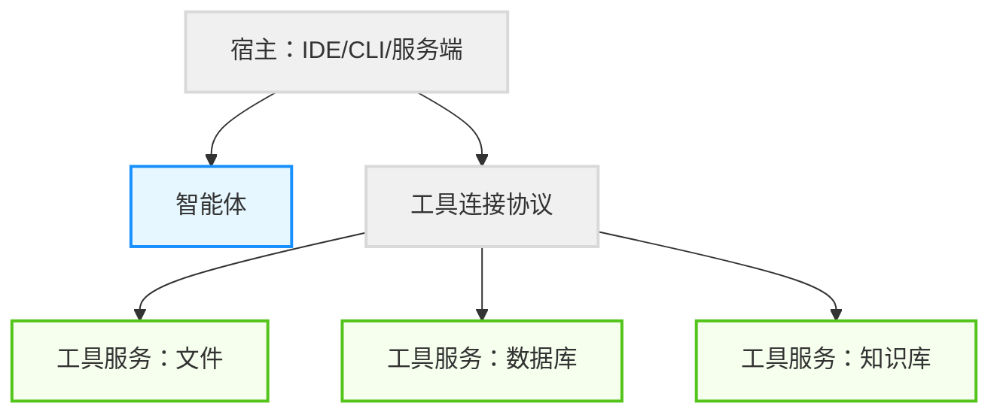

## 4.3 工具连接协议：模型上下文与工具服务

当智能体需要访问外部世界（数据库、文件、知识库、SaaS）时，最大的工程痛点往往不是“能不能调 API”，而是**如何在不同工具之间用一致方式描述能力、传递上下文、处理错误与权限**。

本节介绍一类“工具连接协议”的通用思路：把工具与数据源以标准化结构暴露给智能体宿主，让不同模型与不同工具更容易互联互通。

### 4.3.1 为什么需要工具连接协议

在缺乏统一协议时，常见问题包括：

- **重复造轮子**：每个应用为每个数据源单独开发连接器。
- **语义不一致**：同一类工具在不同系统里参数、错误码与返回结构不同。
- **权限难治理**：鉴权方式分散，审计事件不统一。
- **难以复用**：一个工具的集成难以迁移到另一个宿主或框架。

### 4.3.2 从静态集成到动态发现

工具连接协议的一个关键收益是从“静态硬编码”走向“动态发现”：

- **静态硬编码**：开发者手写每个工具的描述、参数格式、错误处理与权限边界。
- **动态发现**：宿主在运行时向工具服务询问：你能提供什么资源？你有哪些操作？输入输出结构是什么？需要什么权限？

这使得智能体可以在复杂的企业数据库、本地文件系统和第三方服务之间更容易切换，降低集成成本。

### 4.3.3 协议能力结构

一个实用的工具连接协议通常包含三类能力：资源、工具、提示模板。

#### 1. 资源（Resources）

资源代表只读或受限读写的数据项，例如文件、表、文档、记录集合。

```json
{
  "resources": [
    {"uri": "file:///project/README.md", "name": "项目说明", "mimeType": "text/markdown"},
    {"uri": "db://users", "name": "用户表"}
  ]
}
```

#### 2. 工具（Tools）

工具代表可执行的操作，例如查询、写入、创建工单、发送消息。

```json
{
  "tools": [
    {
      "name": "query_database",
      "description": "执行查询",
      "inputSchema": {
        "type": "object",
        "properties": {"sql": {"type": "string"}},
        "required": ["sql"]
      }
    }
  ]
}
```

#### 3. 提示模板（Prompts）

提示模板用于把“可复用的交互模式”沉淀为结构化模板，避免每次从零写提示词。

```json
{
  "prompts": [
    {
      "name": "summarize_ticket",
      "description": "总结工单并输出结构化要点",
      "arguments": [{"name": "ticket_id", "type": "string"}]
    }
  ]
}
```

### 4.3.4 宿主、协议与工具服务

工具连接协议通常把系统拆成三层：

1. **宿主（Host）**：承载智能体运行的环境（IDE、CLI、服务端）。
2. **协议层（Protocol）**：负责发现、调用与事件回传。
3. **工具服务（Server）**：暴露资源与工具的具体实现。



图 4-6：工具连接协议分层示意

### 4.3.5 最佳实践

- **单一职责**：一个工具服务聚焦一个领域，避免“巨无霸工具服务”。
- **结构化错误**：返回机器可读的错误类型与建议，减少智能体盲目重试。
- **权限前置**：在工具服务侧做硬权限校验，不把安全寄托在提示词。
- **可观测性统一**：为每次调用打上 `trace_id`，支持跨系统回放与排障。
- **与技能协同**：协议解决“连接与调用”，技能解决“流程与最佳实践”。

---

**下一节**: [4.4 Agent Skills：能力扩展规范](4.4_skills.md)
