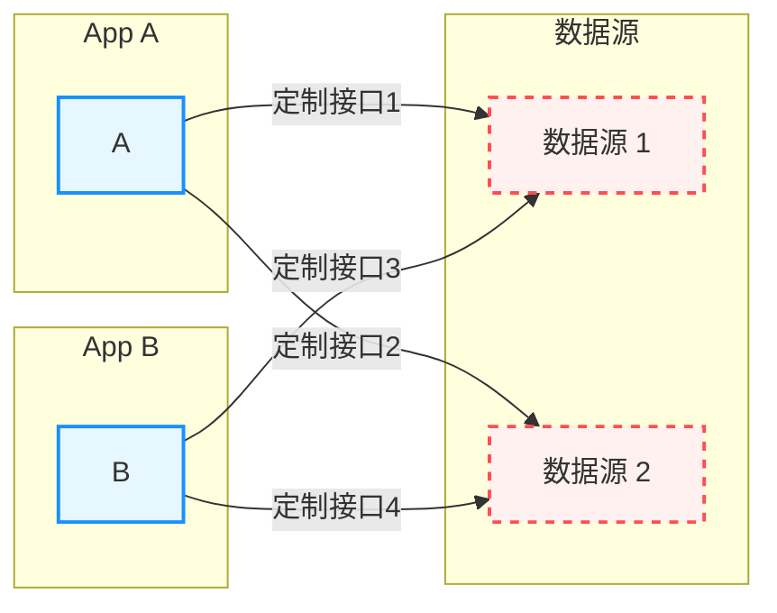
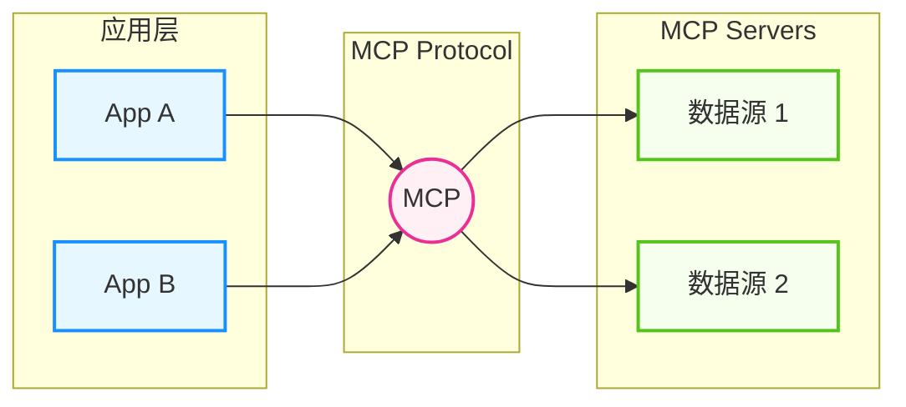
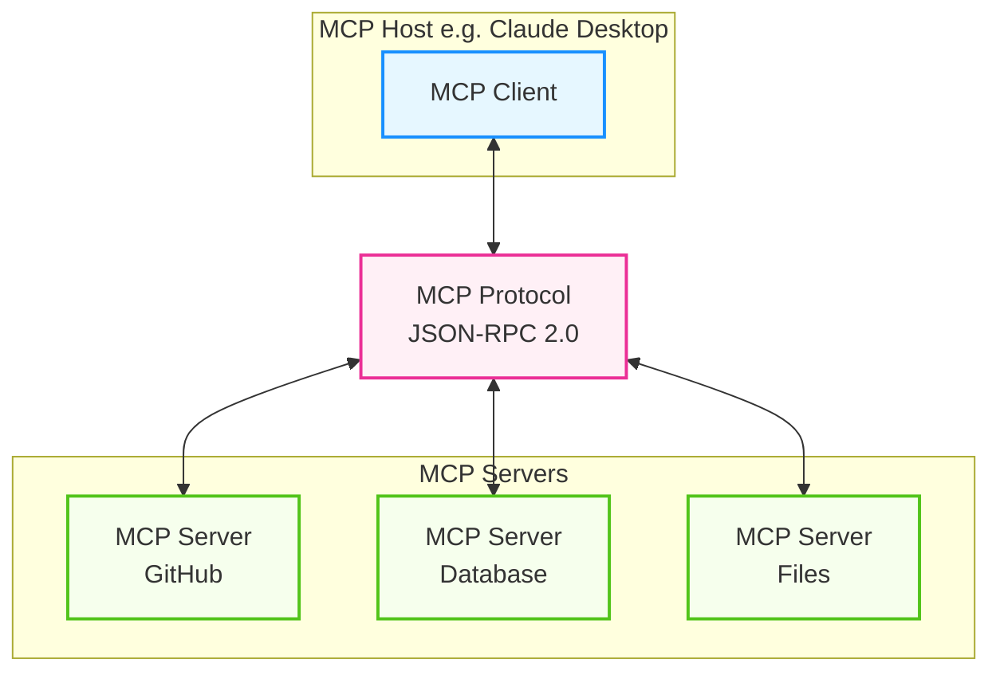
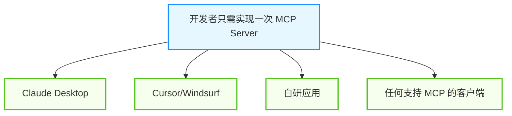
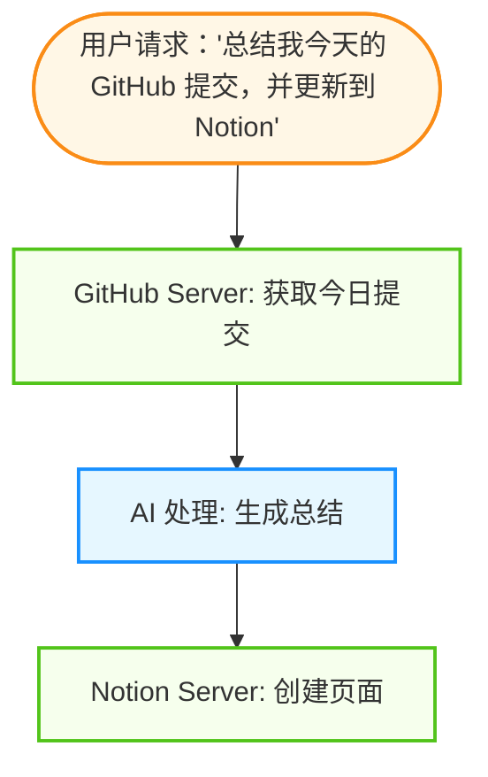

## 4.3 MCP：模型上下文协议

**模型上下文协议（Model Context Protocol, MCP）** 是 Anthropic 在 2024 年底推出的开放标准，旨在统一 AI 应用与外部数据源和工具的连接方式。它类似于 AI 领域的"USB 接口"，让不同的模型和工具可以通过标准协议互联互通。

> [!IMPORTANT]
> **行业里程碑**：2025年12月，Anthropic 将 MCP 正式捐赠给 Linux Foundation 的 **智能体 AI 基金会（Agentic AI Foundation, AAIF）**。MCP 已从单一厂商的开源项目升级为由 AWS、Google、Microsoft、OpenAI 等共同治理的行业标准协议。

### 4.3.1 MCP 的诞生背景

MCP 的诞生是为了解决 AI 系统与外部世界连接时的碎片化问题。通过定义统一的协议标准，它大大降低了集成的复杂度。

#### 问题背景

在 MCP 出现之前，每个 AI 应用都需要：

- 为每个数据源单独开发连接器
- 为每个工具实现特定的集成代码
- 在不同平台之间重复造轮子



图 4-6：碎片化集成问题 (Fragmented Integration Problem)

#### MCP 的解决方案

MCP 定义了一个标准化的协议，任何符合协议的服务都可以无缝连接：




图 4-7：MCP 标准化解决方案 (MCP Standardized Solution)

#### 演进视角：从静态集成到动态发现

如果从更宏观的时间线来看，MCP 标志着连通性的代际升级：

*   **传统模式**：**静态代码**。开发者需要为每个工具手动编写调用代码（如 `get_weather_api()`）。每增加一个工具，都要写一遍描述、参数格式和错误处理。这种硬编码方式就像在家里每买一个电器，都要重新拉一条专线。
*   **MCP 模式**：**动态上下文发现**。智能体不再是死板地记住 API，而是在运行时通过协议“询问”外部系统：“你现在能提供什么数据？格式是什么？”这使得智能体能在复杂的企业数据库、本地文件系统和第三方 SaaS 之间无缝切换，实现了真正的“即插即用”。

### 4.3.2 MCP 的行业采用

MCP 在发布两年内迅速成为 AI 工具集成的事实标准。

#### 采用平台

| 平台类型 | 采用者 |
|---------|--------|
| AI 对话 | Claude, ChatGPT, Gemini |
| 代码编辑器 | Cursor, VS Code, Windsurf, Zed |
| 企业服务 | Microsoft Copilot, AWS, Google Cloud, Azure |

#### 生态规模

- **10,000+** 已发布的 MCP 服务器
- 覆盖开发工具到 Fortune 500 企业部署
- 所有主流 AI 平台均已支持

#### 行业领袖评价

> "MCP 是智能体 AI 时代 API 的基础构建块。作为 Linux Foundation 治理的开放标准，MCP 将推动金融领域更广泛的采用和创新。"  
> — **Shawn Edwards**, Bloomberg 首席技术官

> "开放标准和协议如 MCP 对于构建繁荣的智能体开发者生态至关重要——它们确保任何人都可以跨平台构建智能体，而无需担心供应商锁定。"  
> — **Dane Knecht**, Cloudflare 首席技术官


### 4.3.3 MCP 核心概念

要掌握 MCP 的使用，首先需要理解其核心架构组件以及定义的三种基本能力。这些概念构成了 MCP 协议的基础。

#### 架构组成

具体示例如下：



图 4-8：MCP 核心架构 (MCP Core Architecture)

#### 三种核心能力

MCP 服务器可以提供三种类型的能力：

**资源 (Resources)**：只读数据，类似文件系统：

```json
{
  "resources": [
    {
      "uri": "file:///project/README.md",
      "name": "项目说明",
      "mimeType": "text/markdown"
    },
    {
      "uri": "postgres://db/users",
      "name": "用户表"
    }
  ]
}
```

**工具 (Tools)**：可执行的操作：

```json
{
  "tools": [
    {
      "name": "query_database",
      "description": "执行 SQL 查询",
      "inputSchema": {
        "type": "object",
        "properties": {
          "sql": {"type": "string"}
        },
        "required": ["sql"]
      }
    }
  ]
}
```

**提示模板 (Prompts)**：预定义的交互模板：

```json
{
  "prompts": [
    {
      "name": "code_review",
      "description": "代码审查模板",
      "arguments": [
        {"name": "code", "required": true}
      ]
    }
  ]
}
```

### 4.3.4 实现 MCP Server

实现一个 MCP Server 并不复杂。通过官方提供的 SDK，开发者可以快速创建服务。本节将通过不同语言的示例来展示如何构建一个 MCP Server。

#### Python 示例

使用官方 `mcp` 库创建一个简单的 MCP 服务器：

```python
# server.py

from mcp.server.fastmcp import FastMCP

# 创建 MCP 服务器

mcp = FastMCP("My MCP Server")

# 定义工具

@mcp.tool()
def get_weather(city: str) -> str:
    """获取指定城市的天气信息
    
    Args:
        city: 城市名称
    
    Returns:
        天气信息字符串
    """
    # 实际实现中调用天气 API

    return f"{city}今天晴，气温 22°C"

@mcp.tool()
def search_notes(query: str, limit: int = 10) -> list:
    """搜索笔记
    
    Args:
        query: 搜索关键词
        limit: 返回结果数量
    
    Returns:
        匹配的笔记列表
    """
    # 实际实现中搜索数据库

    return [{"title": f"Note about {query}", "content": "..."}]

# 定义资源

@mcp.resource("notes://{note_id}")
def get_note(note_id: str) -> str:
    """获取指定笔记内容"""
    return f"Note content for {note_id}"

# 定义提示模板

@mcp.prompt()
def summarize_notes(topic: str) -> str:
    """生成笔记摘要的提示模板"""
    return f"""请总结关于 "{topic}" 的所有笔记内容，包括：
1. 主要观点
2. 关键信息
3. 待办事项"""

if __name__ == "__main__":
    mcp.run()
```

#### 配置 Claude Desktop

在 Claude Desktop 中使用 MCP 服务器：

```json
// ~/.config/claude/claude_desktop_config.json (macOS)
// %APPDATA%\Claude\claude_desktop_config.json (Windows)

{
  "mcpServers": {
    "my-notes": {
      "command": "python",
      "args": ["/path/to/server.py"],
      "env": {
        "API_KEY": "your-api-key"
      }
    },
    "weather": {
      "command": "npx",
      "args": ["-y", "@mcp/weather-server"]
    }
  }
}
```

#### MCP 服务器生态

**官方维护的 Server**：

| Server | 功能 | 安装方式 |
|--------|------|----------|
| `@modelcontextprotocol/server-filesystem` | 文件系统访问 | npx |
| `@modelcontextprotocol/server-github` | GitHub 集成 | npx |
| `@modelcontextprotocol/server-postgres` | PostgreSQL 查询 | npx |
| `@modelcontextprotocol/server-slack` | Slack 消息 | npx |
| `@modelcontextprotocol/server-memory` | 持久化记忆 | npx |

**社区 Server**：

- **Obsidian MCP**：Obsidian 笔记管理
- **Notion MCP**：Notion 页面操作
- **Raycast MCP**：Raycast 扩展集成
- **Browser MCP**：浏览器自动化

### 4.3.5 MCP 的优势与最佳实践

MCP 不仅仅是一个协议，更代表了一种现代化的 AI 系统架构理念。采用 MCP 能够带来多方面的工程优势，同时也需要遵循一定的最佳设计实践。

#### 标准化

一次开发，处处可用：



图 4-9：MCP 标准化优势 (Advantages of MCP Standardization)

#### 安全性

- **本地运行**：服务器运行在用户本地，数据不外泄
- **权限控制**：主机可以控制服务器的权限
- **审计日志**：所有调用都可被记录

#### 可组合性

多个 Server 可以协同工作：



图 4-10：MCP 可组合性示例 (MCP Composability Example)

#### MCP 与传统工具使用的区别

| 维度 | 传统工具使用 | MCP |
|------|-----------------|-----|
| 定义位置 | 每次 API 调用时传入 | 独立的服务定义 |
| 执行位置 | 客户端或服务端 | 标准化的 Server |
| 标准化程度 | 各平台不同 | 统一协议 |
| 复用性 | 需要重复定义 | 一次定义多处使用 |
| 生态 | 各平台独立 | 共享的 Server 生态 |

#### 服务器设计最佳实践

设计 MCP 服务器时，应遵循单一职责原则，让每个服务器专注于特定领域的功能，而不是试图包罗万象：

```python
# ✅ 好的设计：功能聚焦

class NotesServer:
    """专注于笔记管理的 MCP Server"""
    
    def search_notes(self, query): pass
    def create_note(self, title, content): pass
    def update_note(self, note_id, content): pass

# ❌ 不好的设计：功能过于宽泛

class EverythingServer:
    """什么都做的服务器"""
    
    def search_notes(self): pass
    def send_email(self): pass
    def query_database(self): pass
```

#### 错误处理

良好的错误处理是 MCP 服务器可靠性的关键。应返回结构化的错误信息，包括错误类型、详细描述和可能的解决建议：

```python
@mcp.tool()
def query_database(sql: str) -> dict:
    try:
        result = db.execute(sql)
        return {"success": True, "data": result}
    except SQLSyntaxError as e:
        return {
            "success": False,
            "error": "SQL 语法错误",
            "details": str(e),
            "suggestion": "请检查 SQL 语法"
        }
    except PermissionError:
        return {
            "success": False,
            "error": "权限不足",
            "suggestion": "该表不允许查询"
        }
```

#### 文档完善

完善的文档是工具可发现性和可用性的保障。每个工具都应包含清晰的描述、参数说明、返回值定义和使用示例：

```python
@mcp.tool()
def create_issue(
    title: str,
    body: str,
    labels: list = None,
    assignees: list = None
) -> dict:
    """在 GitHub 仓库创建新 Issue
    
    创建一个新的 GitHub Issue。需要仓库的写入权限。
    
    Args:
        title: Issue 标题，建议不超过 100 字符
        body: Issue 正文，支持 Markdown 格式
        labels: 标签列表，如 ["bug", "high-priority"]
        assignees: 指派人列表，使用 GitHub 用户名
    
    Returns:
        包含创建的 Issue 信息的字典，包括:
        - issue_number: Issue 编号
        - url: Issue 链接
        - created_at: 创建时间
    
    Raises:
        AuthenticationError: API token 无效
        PermissionError: 无仓库写入权限
        ValidationError: 参数格式错误
    
    Example:
        create_issue(
            title="登录按钮无响应",
            body="## 问题描述\n点击登录按钮没有反应...",
            labels=["bug"],
            assignees=["developer1"]
        )
    """
    pass
```

### 4.3.6 MCP 与 Skills 的协同关系

MCP 和 **智能体技能 (Agent Skills)** 是互补而非竞争的关系。

*   **MCP** 解决 **"连接" (Connectivity)** 问题：让智能体能够访问外部数据和执行原子操作（如"查询数据库"、"调用 API"）。
*   **Skills** 解决 **"能力" (Competency)** 问题：封装了特定领域的专业知识和复杂工作流（如"如何进行合规的财务审计"、"如何准备一场高质量会议"）。

简单来说：**MCP 提供了工具箱，而 Skills 提供了使用说明书和最佳实践。**> [!TIP]
> 关于 MCP 与 Skills 如何协同工作的详细架构、边界划分及实战案例，请深入阅读下一节 **[4.4 智能体技能：能力扩展规范](4.4_skills.md)**，其中包含专门的 "4.4.6 Skills 与 MCP 的协同" 章节。

> [!TIP]
> **相关资源**：
> - AAIF 官网：https://aaif.io
> - MCP 规范：https://github.com/modelcontextprotocol
> - MCP 服务器目录：https://github.com/modelcontextprotocol/servers

---

**下一节**: [智能体技能：能力扩展规范](4.4_skills.md)
