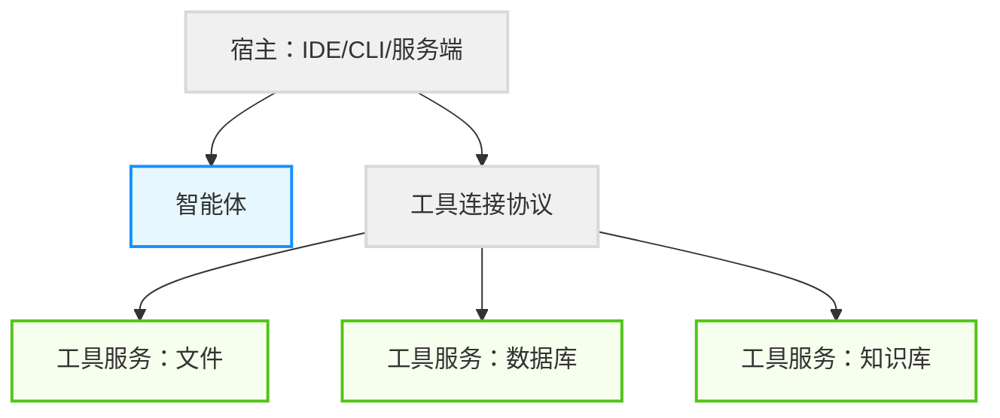

## 4.3 工具连接协议：模型上下文与工具服务

当智能体需要访问外部世界（数据库、文件、知识库、SaaS）时，最大的工程痛点往往不是“能不能调 API”，而是 **如何在不同工具之间用一致方式描述能力、传递上下文、处理错误与权限**。

本节介绍一类“工具连接协议”的通用思路：把工具与数据源以标准化结构暴露给智能体宿主，让不同模型与不同工具更容易互联互通。

### 4.3.1 什么是工具连接协议：以 MCP 为例

随着智能体生态的发展，业界急需一种连接标准。其中，由 Anthropic 牵头、2024 年 11 月开源的 **Model Context Protocol (MCP)** 正在迅速成为事实上的行业标准。本节探讨的理念适用于各类工具互操作协议，但我们将以 MCP 的核心设计为代表蓝本来阐述。

在缺乏统一协议时，常见痛点包括：

- **重复造轮子**：每个应用为每个数据源单独开发连接器。
- **语义不一致**：同一类工具在不同系统里参数、错误码与返回结构不同。
- **权限难治理**：鉴权方式分散，审计事件不统一。
- **难以复用**：一个工具的集成难以迁移到另一个宿主或框架。

### 4.3.2 从静态集成到动态发现

工具连接协议的一个关键收益是从”静态硬编码”走向”动态发现”：

- **静态硬编码**：开发者手写每个工具的描述、参数格式、错误处理与权限边界。
- **动态发现**：宿主在运行时向工具服务询问：你能提供什么资源？你有哪些操作？输入输出结构是什么？需要什么权限？

这使得智能体可以在复杂的企业数据库、本地文件系统和第三方服务之间更容易切换，降低集成成本。


在接入协议前，应该先构建本地原型并进行评估：

1. **快速原型**：使用 Claude Code 或本地环境快速搭建工具的初版
   - 如果依赖第三方库或 API，应提供完整的文档（如 `llms.txt` 格式）
   - 在 MCP 服务或 Desktop Extension 中注册，以便本地测试

2. **人工测试**：在将工具暴露给智能体前，开发者应亲自测试各种边界情况

3. **自动化评估**：构建一套综合评估任务，涵盖真实使用场景
   - 弱任务：单一操作（”创建日历事件”）
   - 强任务：多步工作流（”为 Jane 安排下周会议，讨论 Acme 项目，附加上次会议记录，预订会议室”）

4. **迭代优化**：
   - 分析工具调用日志，找出高错误率的操作
   - 改进工具描述或合并相关功能
   - 通过 Claude 自动分析轨迹，获得优化建议

### 4.3.3 协议能力结构

一个实用的工具连接协议通常包含三类能力：资源、工具、提示模板。

#### 1. 资源

资源代表只读或受限读写的数据项，例如文件、表、文档、记录集合。

```json
{
  "resources": [
    {"uri": "file:///project/README.md", "name": "项目说明", "mimeType": "text/markdown"},
    {"uri": "db://users", "name": "用户表"}
  ]
}
```

#### 2. 工具

工具代表可执行的操作，例如查询、写入、创建工单、发送消息。

```json
{
  "tools": [
    {
      "name": "query_database",
      "description": "执行查询",
      "inputSchema": {
        "type": "object",
        "properties": {"sql": {"type": "string"}},
        "required": ["sql"]
      }
    }
  ]
}
```

#### 3. 提示模板

提示模板用于把“可复用的交互模式”沉淀为结构化模板，避免每次从零写提示词。

```json
{
  "prompts": [
    {
      "name": "summarize_ticket",
      "description": "总结工单并输出结构化要点",
      "arguments": [{"name": "ticket_id", "type": "string"}]
    }
  ]
}
```

### 4.3.4 宿主、协议与工具服务

工具连接协议通常把系统拆成三层：

1. **宿主（Host）**：承载智能体运行的环境（IDE、CLI、服务端）。
2. **协议层（Protocol）**：负责发现、调用与事件回传。
3. **工具服务（Server）**：暴露资源与工具的具体实现。


```mermaid
graph TD
    classDef agent fill:#e6f7ff,stroke:#1890ff,stroke-width:2px;
    classDef tool fill:#f6ffed,stroke:#52c41a,stroke-width:2px;
    classDef system fill:#f0f0f0,stroke:#d9d9d9,stroke-width:2px;

    Host[宿主：IDE/CLI/服务端]:::system --> Agent[智能体]:::agent
    Host --> Protocol[工具连接协议]:::system
    Protocol --> S1[工具服务：文件]:::tool
    Protocol --> S2[工具服务：数据库]:::tool
    Protocol --> S3[工具服务：知识库]:::tool
```

图 4-6：工具连接协议分层示意

### 4.3.5 安全基线与漏洞防范

在工具连接协议中，安全性必须在协议与服务实现层建立硬护栏，而非仅依赖提示词。核心基线包括：

1. **强白名单机制**：所有文件、进程、URL 访问必须约束在沙箱目录或白名单域列表中。防止路径遍历（`../`）和参数注入。

2. **最小权限原则**：按需配置权限。数据库查询工具仅使用 SELECT 权限账号，写入工具限制到特定沙箱目录。

3. **速率控制与熔断防御**：配置 API 级速率限制，防止智能体陷入重试风暴导致系统崩溃。

在工具服务侧可以结合**应用自定义的权限声明**和返回错误处理提供防御基础，例如把 `permissions.scope: “database:read”` 作为示意性元数据，表达“这个工具只允许读取数据库”，但不要把它当作 MCP 协议原生字段。宿主侧实施路径验证和参数清洗。企业级场景可部署 IAM 策略引擎管理会话级约束（Token 预算、操作上限、审计日志）。

详见《AI 安全指南》第 8 章完整的权限配置、沙箱实现与速率控制方案。

### 4.3.6 实战建议

对于中小团队，建议从以下步骤起步：

1. **路径沙箱守卫**：在工具调用前验证路径，拦截 `../` 等目录遍历。
2. **SQL 白名单**：禁止 DROP、DELETE、UPDATE 等危险操作。
3. **结构化错误**：返回机器可读的错误类型，减少智能体盲目重试。

随着业务规模扩大，逐步引入会话级 Token 预算、网络域白名单和完整审计日志。

### 4.3.7 新兴方向：支付协议与代理经济

当工具或服务需付费时，支付协议（如 Stripe 的 Machine Payments Protocol）可扩展 MCP 能力，让智能体自主购买服务。这是代理经济演进的新方向，但目前仍属探索阶段，不是核心建议。

### 4.3.8 最佳实践

- **单一职责**：一个工具服务聚焦一个领域，避免“巨无霸工具服务”。
- **结构化错误**：返回机器可读的错误类型与建议，减少智能体盲目重试。
- **权限前置**：在工具服务侧做硬权限校验，不把安全寄托在提示词。
- **可观测性统一**：为每次调用打上 `trace_id`，支持跨系统回放与排障。
- **与技能协同**：协议解决“连接与调用”，技能解决“流程与最佳实践”。

---

**下一节**: [4.4 智能体技能：能力扩展规范](4.4_skills.md)
