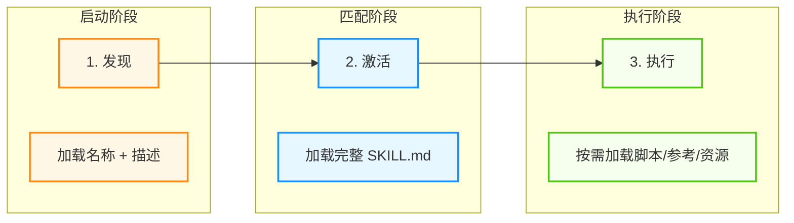
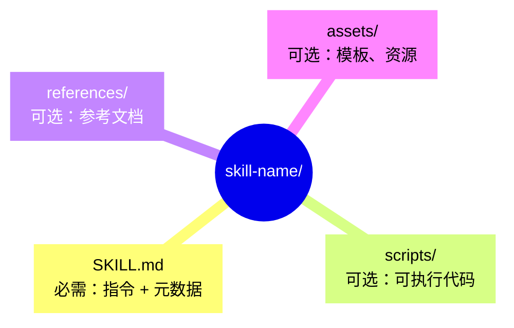
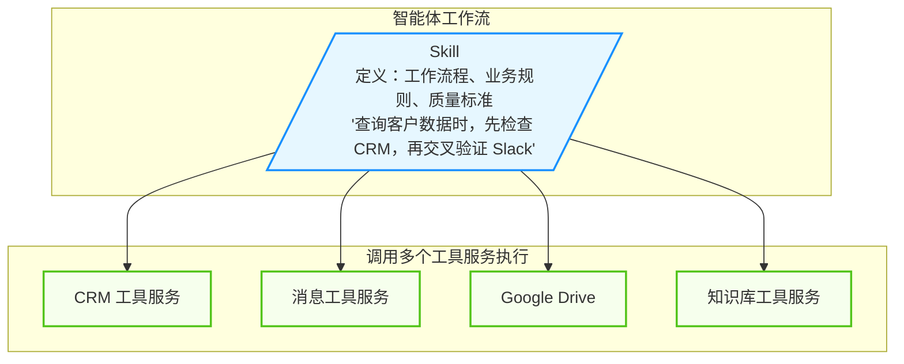

## 4.4 智能体技能：能力扩展规范

**智能体技能（Agent Skills）** 是一种用于扩展 AI 智能体能力与专业知识的开放格式实践。它提供了一种轻量级、可移植的方式来封装领域知识和工作流程。

### 4.4.1 什么是 Agent Skills

Skills 是一种简单的开放格式，用于赋予智能体新的能力和专业知识。与工具连接协议提供系统连接能力不同，Skills 专注于 **过程性知识** 的封装。

> 工具连接协议是 **通道**，技能是 **智慧**。
> 
> 工具连接协议解决“通过什么做”，技能解决“如何做”。

Skills 为智能体系统带来了以下核心价值：

- **领域专业知识**：将法律审查流程、数据分析管道等专业知识封装为可复用指令
- **新能力扩展**：赋予智能体创建演示文稿、构建工具服务、分析数据集等能力
- **可重复工作流**：将多步骤任务转化为一致、可审计的工作流程
- **跨平台互操作**：在不同 Skills 兼容的智能体产品间复用相同技能

### 4.4.2 Skills 工作机制

Skills 采用三阶段加载机制：



图 4-11：Skills 三阶段加载机制

1. **发现（Discovery）**：启动时仅加载每个技能的 name 和 description，足以判断其相关性
2. **激活（Activation）**：当任务匹配某个技能的描述时，将完整 SKILL.md 指令加载到上下文
3. **执行（Execution）**：智能体按照指令执行，按需加载引用的文件或执行捆绑的脚本

### 4.4.3 Skill 目录结构

一个 Skill 的标准目录结构如下：



| 目录/文件 | 说明 |
|-----------|------|
| `SKILL.md` | **必需**。包含元数据和详细指令 |
| `scripts/` | 可执行脚本，应自包含或清晰声明依赖 |
| `references/` | 技术参考文档，如 REFERENCE.md、领域专用文档 |
| `assets/` | 模板、图片、数据文件等资源 |

### 4.4.4 SKILL.md 格式规范

SKILL.md 由 YAML Frontmatter 和 Markdown 正文两部分组成。

#### 前置元数据（必需）

以下是一个完整的 YAML Frontmatter 示例：

```yaml
---
name: pdf-processing
description: Extract text and tables from PDF files, fill forms, merge documents.
license: Apache-2.0
compatibility: Designed for agentic coding hosts
allowed-tools: Bash(git:*) Bash(jq:*) Read
metadata:
  author: example-org
  version: "1.0"
---
```

| 字段 | 要求 | 说明 |
|------|------|------|
| `name` | 必需 | 1-64 字符，仅小写字母、数字和连字符 |
| `description` | 必需 | 1-1024 字符，描述功能和使用场景 |
| `license` | 可选 | 许可证信息 |
| `compatibility` | 可选 | 环境要求，如"需要 git、docker" |
| `allowed-tools` | 可选 | 预授权工具列表 |
| `metadata` | 可选 | 自定义键值对 |

#### 正文内容

正文采用 Markdown 格式，应包含：

- 分步骤指令
- 输入输出示例
- 常见边界情况处理

以下是一个 SKILL.md 正文的典型结构示例（示意采用英文小节名，实际项目可使用中文）：

```markdown
# PDF 处理

### 何时使用

当用户需要处理 PDF 文件时使用本技能。

### 如何抽取文本

1. 使用合适的 PDF 解析工具抽取文本。

### 如何填写表单

...
```

### 4.4.5 渐进式披露

Skills 采用三层加载机制优化上下文使用：

| 层级 | 内容 | Token 预算 | 加载时机 |
|------|------|-----------|---------|
| 元数据 (Metadata) | name + description | ~100 tokens | 启动时加载所有 Skills |
| 指令 (Instructions) | 完整 SKILL.md 正文 | <5000 tokens（建议） | 任务匹配时激活 |
| 资源 (Resources) | scripts/、references/、assets/ | 按需 | 执行时按需加载 |

这种设计确保：

- 启动时上下文开销极小
- 仅在需要时加载详细指令
- 大型资源文件按需获取

### 4.4.6 Skills 与工具连接协议的协同

技能和工具连接协议是互补的：技能定义“做什么”和“怎么做”，协议提供“用什么工具做”。

#### 协同架构

具体示例如下：



图 4-12：Skills 与工具连接协议协同架构

#### 边界划分

| 维度 | 协议负责 | 技能负责 |
|------|---------|------------|
| 核心 | 连接能力 | 领域知识 |
| 内容 | API 格式、查询语法 | 工作流程、业务规则 |
| 指令 | 工具使用提示 | 多工具编排逻辑 |
| 粒度 | 单个服务 | 跨服务流程 |

**经验法则**：

- 协议指令覆盖 **如何正确使用服务及其工具**；Skill 指令覆盖 **如何在特定流程或多服务工作流中使用它们**。

#### 实际案例

下面用两个示例展示 Skill 如何把“方法论与流程”固化为可复用能力。

**案例 1：财务分析 Skill**

```markdown
# Comparable Company Analysis Skill

## 工作流程

1. 从财务数据工具服务拉取指标
2. 从补充数据工具服务获取额外字段
3. 应用估值方法论（Skill 定义）
4. 格式化输出符合合规要求（Skill 定义）
```

**案例 2：会议准备 Skill（Notion 官方）**

```markdown
# Meeting Intelligence Skill

## 工作流程

1. 通过知识库工具服务搜索相关项目页面
2. 通过知识库工具服务获取历史会议记录
3. 整理为两份文档：内部预读 + 外部议程
4. 通过知识库工具服务保存到指定位置
```

#### Skills 生态与企业部署

本节将依次介绍“组织级管理”与“版本化与回归”等内容。

##### 组织级管理

在团队/组织场景下，Skills 往往需要被当成“可审计的组织资产”来管理：版本控制、审批、权限与分发。

**集中配置能力**：

- 组织管理员可从管理设置集中配置 Skills
- 管理员配置的 Skills 默认为所有用户启用
- 用户仍可选择关闭个别 Skills 以自定义体验
- 确保团队使用一致、经批准的工作流

**部署优势**：

- 统一标准：整个组织遵循相同的工作流程
- 质量控制：IT 团队审核和批准 Skills
- 快速推广：一次配置，全员可用
- 灵活性：用户保留个性化选择权

##### 版本化与回归

当 Skill 被用于关键业务流程时，建议把它当作“可发布的软件资产”治理：

- **版本管理**：为 Skill 建立语义化版本号与变更日志，支持回滚。
- **审批与灰度**：在推广到全员前先做小范围试点，避免一次性引入大范围回归。
- **回归样例集**：为核心 Skill 维护最小回归用例（输入、期望输出结构、失败诊断），每次更新前后对比。

#### Skills 目录与生态

生态与具体合作伙伴会随时间变化；工程上更重要的是：能否把 Skill 当成可版本化的资产（仓库管理）、能否做审批与分发、能否与权限/审计体系集成。

##### 创建与编辑体验优化

**简化创建流程**：

- **描述即创建**：描述需求，由系统/助手协助构建 Skill
- **直接编写**：直接编写指令文件
- **文件夹上传**：上传完整的 Skill 文件夹结构
- **Skill-creator 工具**：处理复杂工作流的官方工具

**完整预览功能**：

- 启用前查看 Skill 完整内容
- 理解 Skill 具体做什么
- 审核指令的安全性和合理性

**助手辅助编辑**：

- 助手可帮助编辑现有 Skills
- 根据反馈优化指令
- 迭代改进工作流

##### 跨平台可用性

Agent Skills 作为开放标准发布，支持多平台使用：

**桌面端应用/客户端**：

- 浏览 Skills 目录
- 通过 Settings → Capabilities → Skills 启用
- 个人或组织级配置

**代码智能体宿主（IDE/CLI）**：

- 从插件目录安装
- 将 Skills 检入代码仓库
- 与项目代码一起版本控制

**开发者平台（API）**：

- 通过 `/v1/skills` 端点使用
- 编程式集成到应用中
- 支持动态加载和管理

> [!NOTE]
> **前置要求**：使用 Skills 需要启用 Code Execution 和 File Creation 能力。

### 4.4.7 最佳实践

在开发和使用 Agent Skills 时，遵循经过验证的最佳实践可以显著提高技能的质量和可用性，避免常见的陷阱。

#### Skill 设计原则

- **功能聚焦**：每个 Skill 专注于一个明确的领域或工作流
- **自文档化**：任何人阅读 SKILL.md 都能理解其功能
- **可移植性**：Skills 就是文件，易于编辑、版本控制和分享

#### 避免常见问题

- **避免指令冲突**：如果工具服务指定返回 JSON，而 Skill 要求 Markdown 表格，智能体需要猜测。让工具服务处理连接，Skill 处理呈现。
- **保持复用性**：一个工具服务可支持多个 Skills；一个 Skill 可编排多个工具服务。
- **利用渐进式加载**：将详细参考资料放在 references/ 目录，仅在需要时加载

#### 验证工具

可以使用项目提供的校验脚本或自定义 linter 来验证 Skill 格式：

```bash
<skill-linter> check ./my-skill
```

> [!TIP]
> **相关资源**：建议在项目内维护一份“Skill 规范/示例/校验工具”的链接清单，并定期核验有效性。

---

**下一节**: [浏览器自动化与计算机操作](4.5_browser.md)
