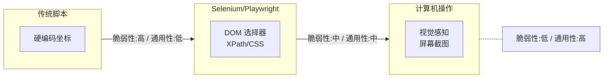
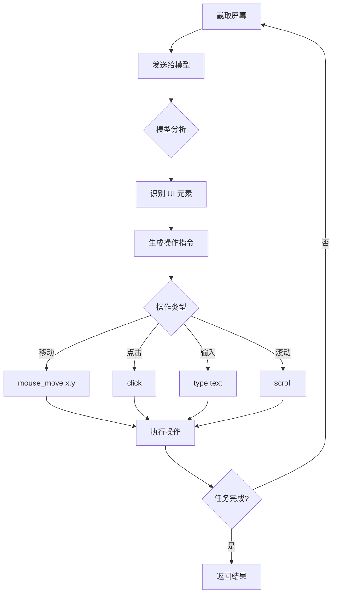
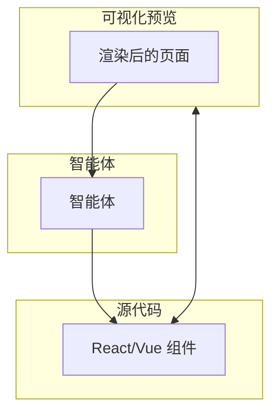
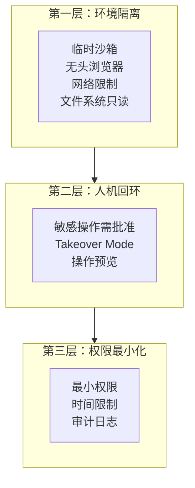

## 4.5 浏览器自动化与计算机操作

智能体不仅需要调用 API，还需要与图形界面交互。**浏览器自动化（Browser Automation）** 和 **计算机操作（Computer Use）** 让智能体能够像人类一样操控 GUI 界面，打破了传统 API 的限制。

### 4.5.1 为什么需要浏览器自动化

并非所有系统都开放 API。遗留系统（ERP/CRM）和现代 SaaS 往往只有 Web 界面，要实现自动化操作，必须让智能体具备操控浏览器的能力。

**典型应用场景**：
- **Web 抓数据**：从没有 API 的网站提取信息
- **遗留系统集成**：自动操作老旧的企业内部系统
- **端到端测试**：模拟用户行为进行 UI 测试
- **RPA 任务**：订票、购物、表单填写等重复性工作

### 4.5.2 自动化技术的三代演进

自动化技术经历了三代演进，从硬编码坐标到 DOM 选择器，再到基于视觉感知的智能操作：



图 4-13：自动化技术三代演进 (Three Generations of Automation Technology Evolution)

当前主流的两种范式有着根本不同的工作方式：

- **DOM-based（基于文档对象模型）**：通过解析网页的 HTML 结构，使用 CSS 选择器或 XPath 定位元素。这是 Selenium/Playwright 的工作方式，精确高效，但**依赖页面结构**——一旦开发者修改了 HTML 布局、类名或 ID，脚本就会失效。

- **视觉感知（Vision-based）**：通过截取屏幕图像，让多模态模型"看"界面并理解其含义。模型像人类一样识别"登录按钮在哪里"，然后输出坐标和操作指令。这种方式**不依赖代码结构**，能够适应界面变化，但速度较慢且消耗更多计算资源。

| 维度 | DOM-based | 视觉感知 |
|------|-----------|----------|
| **工作方式** | 解析 HTML 结构 | 分析屏幕截图 |
| **选择器** | CSS/XPath | 视觉坐标 (x, y) |
| **精确性** | 高 | 中 |
| **速度** | 快 | 较慢 |
| **通用性** | 仅 Web | 任意 GUI |
| **维护成本** | 页面变化需更新 | 自适应 |
| **成本** | 低 | 高（消耗 Token） |

### 4.5.3 DOM-based 自动化

DOM-based 自动化通过程序化方式操控浏览器，适合结构稳定的网页场景。以下是使用 Playwright 实现登录的示例：

```python
from playwright.sync_api import sync_playwright

def login_traditional():
    with sync_playwright() as p:
        browser = p.chromium.launch()
        page = browser.new_page()
        page.goto("https://example.com/login")
        
        # 依赖 CSS 选择器 - 页面结构变化即失效
        page.fill("#username", "user@example.com")
        page.fill("#password", "password123")
        page.click("button[type='submit']")
```

**适用场景**：
- 内部系统自动化（页面结构可控）
- 需要高速批量操作
- 测试自动化

### 4.5.4 视觉感知与计算机操作

视觉感知方式让智能体通过"看"屏幕来操作界面，不依赖底层代码结构。

#### 工作机制

以下流程图展示了计算机操作的完整循环：截屏→分析→生成操作→执行→重复直到任务完成：



图 4-14：计算机操作循环 (Computer Use Loop)

#### 代码示例

以下是使用 Anthropic Computer Use 实现登录的示例：

```python
from anthropic import Anthropic

def login_computer_use():
    client = Anthropic()
    
    # 发送屏幕截图，让模型"看"界面
    response = client.messages.create(
        model="claude-sonnet-4-20250514",
        max_tokens=1024,
        tools=[{
            "type": "computer_20241022",
            "name": "computer",
            "display_width_px": 1920,
            "display_height_px": 1080,
        }],
        messages=[{
            "role": "user",
            "content": [
                {"type": "image", "source": {"type": "base64", "data": screenshot_b64}},
                {"type": "text", "text": "请登录这个网站，用户名是 user@example.com"}
            ]
        }]
    )
    
    # 模型返回具体操作：移动鼠标到 (x, y)，点击，输入文字等
    return response.content
```

#### OpenAI Operator

> [!IMPORTANT]
> **OpenAI Operator**：2025 年发布的生产级浏览器智能体，结合了 CUA（Computer-Using Agent）模型，能够自动执行订票、购物等复杂多步骤的网页任务。

| 特性 | 描述 |
|------|------|
| **端到端任务执行** | 完整完成"订一张北京到上海的机票"等任务 |
| **多步骤规划** | 自动分解复杂任务为可执行步骤 |
| **错误恢复** | 遇到验证码、弹窗等能自动处理 |
| **人机接管** | 敏感操作（支付、密码）暂停等待用户 |

以下是 Operator 执行购物任务的完整流程示例：

```
用户：帮我在 Amazon 上找一个评分 4.5 以上的无线键盘，
      价格在 50-100 美元，加入购物车

Operator 执行流程：
1. 打开 amazon.com
2. 搜索 "wireless keyboard"
3. 筛选价格范围 $50-$100
4. 筛选评分 4.5+
5. 浏览结果，比较选项
6. 选择最佳匹配
7. 点击 "Add to Cart"
8. 返回确认信息
```

### 4.5.5 混合模式：视觉与代码结合

将"视觉"与"代码"结合是 DOM-based 和视觉感知的融合方向。Cursor 推出的 Visual Editor 展示了这种新型交互形态。

#### 工作模式

以下图示展示了可视化预览、源代码和智能体之间的交互关系：



图 4-15：可视化编辑器交互模型 (Visual Editor Interaction Model)

#### 应用场景

```markdown
用户：（指向渲染页面上的按钮）
"把这个按钮的圆角改大一点，颜色改成蓝色渐变"

智能体：
1. [视觉识别] 定位到页面中的按钮元素
2. [代码映射] 找到对应的 React 组件 Button.tsx
3. [修改代码] 更新 className 和 style
4. [实时预览] 页面立即更新显示效果

用户：（满意）"好的，再把文字改成白色"

智能体：
1. 继续修改同一组件
2. 更新文字颜色
3. 保存更改
```

### 4.5.6 安全与风险控制

赋予智能体"手"的同时也引入了巨大风险。如果智能体不小心删除了数据库或发送了钓鱼邮件，后果严重。

#### 三层防御体系



图 4-16：安全防御三层体系 (Three-Layer Security Defense System)

#### 敏感操作分级

| 级别 | 操作类型 | 处理方式 |
|------|---------|---------|
| 低 | 读取公开页面、搜索 | 自动执行 |
| 中 | 填写表单、点击按钮 | 日志记录 |
| 高 | 提交订单、发送消息 | 预览确认 |
| 极高 | 支付、删除数据、密码输入 | 人工接管 |

#### 安全配置示例

以下示例展示了如何实现操作黑名单、高风险确认和审计日志：

```python
class SecureComputerUse:
    """安全的计算机操作封装"""
    
    BLOCKED_ACTIONS = [
        ("navigate", r".*bank.*"),      # 禁止访问银行网站
        ("type", r"password=.*"),       # 禁止输入密码
        ("click", r".*delete.*all.*"),  # 禁止点击全删除
    ]
    
    HIGH_RISK_PATTERNS = [
        r".*payment.*",
        r".*checkout.*",
        r".*confirm.*order.*",
    ]
    
    def execute(self, action: dict) -> dict:
        # 1. 检查黑名单
        for action_type, pattern in self.BLOCKED_ACTIONS:
            if action["type"] == action_type:
                if re.match(pattern, str(action.get("target", ""))):
                    return {"blocked": True, "reason": "Forbidden action"}
        
        # 2. 高风险操作需确认
        if any(re.match(p, str(action)) for p in self.HIGH_RISK_PATTERNS):
            if not self.get_user_confirmation(action):
                return {"blocked": True, "reason": "User declined"}
        
        # 3. 记录审计日志
        self.audit_log(action)
        
        # 4. 执行操作
        return self.do_execute(action)
```

---

**下一节**: [多模态感知与行动](4.6_multimodal.md)
