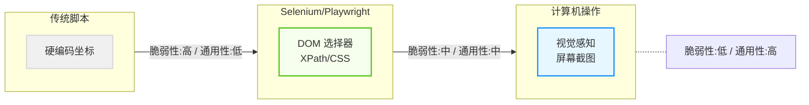
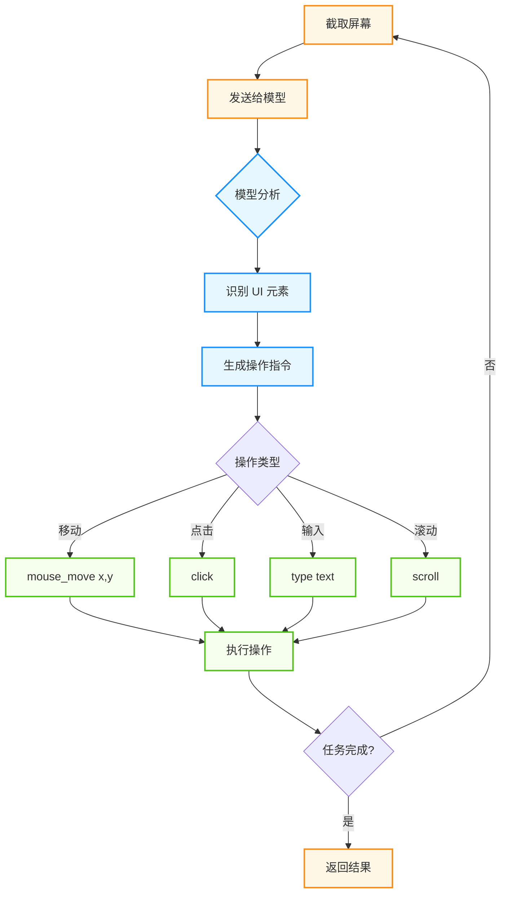
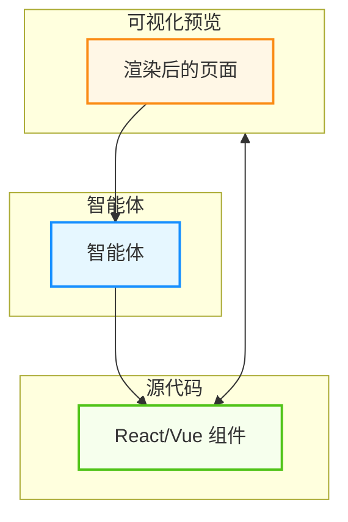
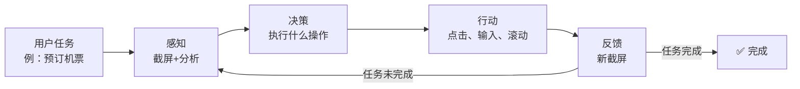
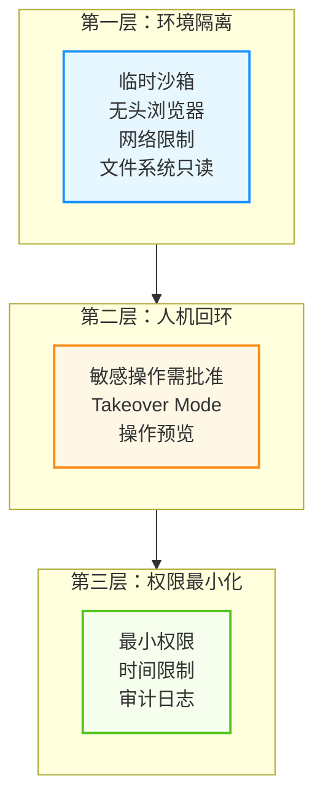

## 4.5 浏览器自动化与计算机操作

智能体不仅需要调用 API，还需要与图形界面交互。**浏览器自动化（Browser Automation）** 和 **计算机操作（Computer Use）** 都在扩展智能体的执行边界，但两者的成熟度不应一概而论：基于 DOM/CDP 的浏览器自动化已经是成熟工程手段；模型驱动的 browsing / computer use 则要按具体产品、环境范围和安全承诺分别评估。

### 4.5.1 为什么需要浏览器自动化

并非所有系统都开放 API。遗留系统（ERP/CRM）和现代 SaaS 往往只有 Web 界面，要实现自动化操作，必须让智能体具备操控浏览器的能力。

**典型应用场景**：
- **Web 抓数据**：从没有 API 的网站提取信息
- **遗留系统集成**：自动操作老旧的企业内部系统
- **端到端测试**：模拟用户行为进行 UI 测试
- **RPA 任务**：订票、购物、表单填写等重复性工作

### 4.5.2 自动化技术的三代演进

自动化技术经历了三代演进，从硬编码坐标到 DOM 选择器，再到基于视觉感知的智能操作：


```mermaid
graph LR
    %% Agentic Design System
    classDef agent fill:#e6f7ff,stroke:#1890ff,stroke-width:2px;
    classDef tool fill:#f6ffed,stroke:#52c41a,stroke-width:2px;
    classDef env fill:#f0f0f0,stroke:#d9d9d9,stroke-width:2px;

    subgraph Gen1 [传统脚本]
        T1[硬编码坐标]
    end

    subgraph Gen2 [Selenium/Playwright]
        T2[DOM 选择器<br>XPath/CSS]
    end

    subgraph Gen3 [计算机操作]
        T3[视觉感知<br>屏幕截图]
    end

    Gen1 --"脆弱性:高 / 通用性:低"--> Gen2
    Gen2 --"脆弱性:中 / 通用性:中"--> Gen3
    Gen3 -.- Note["脆弱性:低 / 通用性:高"]

    class T1 env;
    class T2 tool;
    class T3 agent;
```

图 4-9：自动化技术三代演进

当前主流的两种范式有着根本不同的工作方式：

- **DOM-based（基于文档对象模型）**：通过解析网页的 HTML 结构，使用 CSS 选择器或 XPath 定位元素。这是 Selenium/Playwright 的工作方式，精确高效，但 **依赖页面结构**——一旦开发者修改了 HTML 布局、类名或 ID，脚本就会失效。

- **视觉感知（Vision-based）**：通过截取屏幕图像，让多模态模型“看”界面并理解其含义。模型像人类一样识别“登录按钮在哪里”，然后输出坐标和操作指令。这种方式 **不依赖代码结构**，能够适应界面变化，但速度较慢且消耗更多计算资源。

| 维度 | DOM-based | 视觉感知 |
|------|-----------|----------|
| **工作方式** | 解析 HTML 结构 | 分析屏幕截图 |
| **选择器** | CSS/XPath | 视觉坐标 (x, y) |
| **精确性** | 高 | 中 |
| **速度** | 快 | 较慢 |
| **通用性** | 仅 Web | 任意 GUI |
| **维护成本** | 页面变化需更新 | 自适应 |
| **成本** | 低 | 高（消耗 Token） |

### 4.5.3 DOM-based 自动化

DOM-based 自动化通过程序化方式操控浏览器，适合结构稳定的网页场景。以下是使用 Playwright 实现登录的示例：

```python
from playwright.sync_api import sync_playwright

def login_traditional():
    with sync_playwright() as p:
        browser = p.chromium.launch()
        page = browser.new_page()
        page.goto("https://example.com/login")

        # 依赖 CSS 选择器 - 页面结构变化即失效

        page.fill("#username", "user@example.com")
        page.fill("#password", "password123")
        page.click("button[type='submit']")
```

**适用场景**：
- 内部系统自动化（页面结构可控）
- 需要高速批量操作
- 测试自动化

### 4.5.4 视觉感知与计算机操作

视觉感知方式让智能体通过“看”屏幕来操作界面，不依赖底层代码结构。

#### 工作机制

以下流程图展示了计算机操作的完整循环：截屏→分析→生成操作→执行→重复直到任务完成：


```mermaid
flowchart TD
    %% Agentic Design System
    classDef agent fill:#e6f7ff,stroke:#1890ff,stroke-width:2px;
    classDef tool fill:#f6ffed,stroke:#52c41a,stroke-width:2px;
    classDef user fill:#fff7e6,stroke:#fa8c16,stroke-width:2px;

    A[截取屏幕] --> B[发送给模型]
    B --> C{模型分析}
    C --> D[识别 UI 元素]
    D --> E[生成操作指令]
    E --> F{操作类型}
    F -->|移动| G[mouse_move x,y]
    F -->|点击| H[click]
    F -->|输入| I[type text]
    F -->|滚动| J[scroll]
    G & H & I & J --> K[执行操作]
    K --> L{任务完成?}
    L -->|否| A
    L -->|是| M[返回结果]

    class A,B user;
    class C,D,E agent;
    class G,H,I,J,K tool;
    class M user;
```

图 4-10：计算机操作循环

#### 代码示例

```python
client = Client(model="<MODEL>")

while not done:
    screenshot = capture_screen()
    action = client.decide_action(
        image=screenshot,
        goal="请登录这个网站，用户名是 <USERNAME>"
    )
    done = execute_ui_action(action)
```

#### 浏览器智能体

一些平台提供了面向网页任务的浏览器智能体形态：结合规划 + 浏览器操作，可执行订票、购物、表单填写等多步骤任务。工程上最好把它和“任意桌面 / 任意 GUI 的 computer use”分开看待：前者通常局限在浏览器沙箱，后者风险面更大、成熟度判断也要更保守。

常见能力包括：端到端任务执行、多步骤规划、错误恢复、人机接管（敏感操作暂停等待用户）。

### 4.5.5 混合模式：视觉与代码结合

将“视觉”与“代码”结合是 DOM-based 和视觉感知的融合方向。一些 IDE/开发工具的可视化编辑能力展示了这种新型交互形态。

#### 工作模式

以下图示展示了可视化预览、源代码和智能体之间的交互关系：


```mermaid
graph TD
    %% Agentic Design System
    classDef agent fill:#e6f7ff,stroke:#1890ff,stroke-width:2px;
    classDef tool fill:#f6ffed,stroke:#52c41a,stroke-width:2px;
    classDef user fill:#fff7e6,stroke:#fa8c16,stroke-width:2px;

    subgraph Visual [可视化预览]
        Page[渲染后的页面]
    end

    subgraph Code [源代码]
        Source[React/Vue 组件]
    end

    subgraph Ag [智能体]
        Agent[智能体]
    end

    Visual <--> Source
    Page --> Agent
    Agent --> Source

    class Page user;
    class Source tool;
    class Agent agent;
```

图 4-11：可视化编辑器交互模型

#### 应用场景

```markdown
用户：（指向渲染页面上的按钮）
"把这个按钮的圆角改大一点，颜色改成蓝色渐变"

智能体：
1. [视觉识别] 定位到页面中的按钮元素
2. [代码映射] 找到对应的 React 组件 Button.tsx
3. [修改代码] 更新 className 和 style
4. [实时预览] 页面立即更新显示效果

用户：（满意）"好的，再把文字改成白色"

智能体：
1. 继续修改同一组件
2. 更新文字颜色
3. 保存更改
```

### 4.5.6 主流浏览器自动化框架对比

在选择浏览器自动化框架时，需要考虑延迟、可靠性、成本和易用性等多个维度。

#### 框架对比表

| 框架 | 工作原理 | 性能 | 学习曲线 | 生产就绪 | 特色 |
|------|---------|------|--------|--------|------|
| **Playwright** | CDP协议 + 无头浏览器 | 快速（200-500ms） | 中 | ✅ | 跨浏览器、稳定 |
| **Selenium** | WebDriver标准 | 中等（500-2000ms） | 低 | ✅ | 生态成熟、广泛支持 |
| **Puppeteer** | Chrome DevTools Protocol | 快速（200-500ms） | 中 | ✅ | Chrome专用、轻量 |
| **视觉感知(Vision)** | 图像识别 + LLM | 慢速（2-5s） | 高 | ⚠️ | 通用性强、自适应 |

#### Playwright vs Selenium 深度对比

| 特性 | Playwright | Selenium |
|------|-----------|----------|
| **跨浏览器** | ✅ 原生支持 Chromium、Firefox、WebKit | ✅ 支持，需配置 |
| **性能** | 更快（CDP 协议） | 较慢（WebDriver） |
| **API** | 现代异步 | 传统同步 |
| **生态** | 新兴 | 成熟完善 |
| **跨语言** | 有限 | 广泛（Java、Ruby、JS） |

**代码对比**：

```python
# Playwright：灵活的元素定位
from playwright.async_api import async_playwright

async def test_with_playwright():
    async with async_playwright() as p:
        page = await p.chromium.launch().new_page()
        await page.goto("https://example.com")
        await page.locator("button:has-text('Submit')").click()

# Selenium：显式等待
from selenium.webdriver.support.ui import WebDriverWait
from selenium.webdriver.support import expected_conditions as EC

def test_with_selenium():
    driver = webdriver.Chrome()
    driver.get("https://example.com")
    WebDriverWait(driver, 10).until(
        EC.presence_of_element_located((By.XPATH, "//button[contains(text(), 'Submit')]"))
    ).click()
```

#### Puppeteer 的适用场景

Puppeteer 最适合：
- **Chrome/Chromium 专属场景**（不需要跨浏览器）
- **高性能需求**（需要毫秒级延迟）
- **复杂交互自动化**（JavaScript 操作）

```javascript
// Puppeteer 例子：执行 JavaScript 交互
const puppeteer = require('puppeteer');

(async () => {
  const browser = await puppeteer.launch();
  const page = await browser.newPage();
  await page.goto('https://example.com');

  // 在页面上下文中执行JavaScript
  const result = await page.evaluate(() => {
    // 这段代码在浏览器中执行
    return document.querySelector('.result').textContent;
  });

  await browser.close();
})();
```

### 4.5.7 视觉定位 vs DOM定位的权衡

#### DOM 定位的最佳实践

DOM 定位快速可靠，但需应对页面结构变化。采用多策略查找降低脆弱性：

```python
class RobustDOMLocator:
    def __init__(self, page):
        self.page = page

    def find_by_multiple_strategies(self, target_name: str):
        """多策略回退：ID → aria-label → data-testid → text → class"""
        strategies = [
            f"#{target_name}", f"[aria-label='{target_name}']",
            f"[data-testid='{target_name}']", f"button:has-text('{target_name}')",
            f"[class*='{target_name.lower()}']",
        ]
        for selector in strategies:
            try:
                element = self.page.query_selector(selector)
                if element: return element
            except:
                continue
        raise RuntimeError(f"Could not locate {target_name}")

    def click_with_retry(self, selector, max_attempts=3):
        """失败重试，最终降级到视觉操作"""
        for attempt in range(max_attempts):
            try:
                self.find_by_multiple_strategies(selector).click()
                return True
            except Exception:
                if attempt == max_attempts - 1:
                    return self._click_by_vision(selector)
                time.sleep(0.5)
```

#### 视觉感知的实际应用

```python
class VisionBasedInteraction:
    def __init__(self, model):
        self.model = model

    def interact_with_screenshot(self, task: str, screenshot: bytes) -> dict:
        """分析截图，返回操作指令：{"action": "click", "x": 342, "y": 215}"""
        import base64
        encoded = base64.b64encode(screenshot).decode()
        response = self.model.generate(
            prompt=f"Task: {task}\nRespond: {{'action': 'click'|'type'|'scroll', 'x': int, 'y': int}}",
            image_data=encoded, image_type="image/png"
        )
        return json.loads(response.content)

    def loop_until_task_complete(self, task: str, page, max_iterations: int = 10) -> dict:
        """循环：截屏→分析→操作→检查→重复"""
        for i in range(max_iterations):
            screenshot = page.screenshot()
            check = self.model.generate(
                prompt=f"Task: {task}\nCompleted? {{'completed': bool, 'reason': str}}",
                image_data=base64.b64encode(screenshot).decode(), image_type="image/png"
            )
            if json.loads(check.content)["completed"]:
                return {"success": True, "iterations": i}
            action = self.interact_with_screenshot(task, screenshot)
            self._execute_action(page, action)
        return {"success": False, "reason": "max_iterations_reached"}
```

### 4.5.8 生产中的稳定性挑战与解决方案

浏览器自动化在生产环境中需应对四类问题：

**问题一：页面加载不完整** - 动态内容未渲染。解决：`page.wait_for_selector(".content", state="visible", timeout=5000)` 等待目标元素出现，或 `page.goto(url, wait_until="networkidle")` 等待网络空闲。

**问题二：网络不稳定导致随机失败** - 使用指数退避重试（3 次尝试，延迟为 1s → 2s → 4s），超时设为 30 秒，失败时 reload() 重新导航。

**问题三：JavaScript 动态渲染** - 等待网络空闲（networkidle），或等待特定元素出现（wait_for_selector），或注入 JavaScript 等待自定义事件（page.evaluate）。

**问题四：反爬虫对策** - 设置 User-Agent（模拟真实浏览器），添加随机延迟（1-5 秒），模拟滚动行为。对于 Cloudflare 等高级保护，尝试等待 networkidle，或使用专门的反爬虫绕过服务（Browserless、Bright Data）或直接获取 API。

### 4.5.9 Computer Use 类方案的最新进展

随着多模态模型（视觉+文本）的进展，出现了”Computer Use”类方案，让模型可以在截图反馈回路中提出点击、输入、滚动等动作建议。根据各厂商最新官方资料，**不同厂商与产品的 computer use / browsing 成熟度分化明显**。有的已经提供更稳定的浏览器或受限环境集成，有的仍明确标注为 beta / preview，旧 preview 接口也常只为兼容历史集成而保留。

#### Computer Use 架构


```mermaid
graph LR
    Task["用户任务<br/>例：预订机票"] --> Perception["感知<br/>截屏+分析"]
    Perception --> Decision["决策<br/>执行什么操作"]
    Decision --> Action["行动<br/>点击、输入、滚动"]
    Action --> Feedback["反馈<br/>新截屏"]
    Feedback -->|任务未完成| Perception
    Feedback -->|任务完成| Done["✅ 完成"]
```

#### 实现原理

```python
class ComputerUseAgent:
    def __init__(self, model, browser):
        self.model = model
        self.browser = browser

    def act(self, goal: str, max_steps: int = 10):
        for step in range(max_steps):
            screenshot = self.browser.screenshot()
            response = self.model.generate(messages=[{
                "role": "user",
                "content": [
                    {"type": "image", "source": {"type": "base64", "media_type": "image/png", "data": screenshot}},
                    {"type": "text", "text": f"Goal: {goal}\nStep {step}: Respond in JSON: {{\"type\": \"click\"|\"type\"|\"scroll\"|\"finish\", \"x\": int, \"y\": int}}"}
                ]
            }])
            action = json.loads(response.content)
            if action["type"] == "finish":
                return {"success": True, "result": action.get("result"), "steps": step}

            # 执行对应操作
            if action["type"] == "click":
                self.browser.click(action["x"], action["y"])
            elif action["type"] == "type":
                self.browser.type(action["text"])
            elif action["type"] == "scroll":
                self.browser.scroll(action.get("direction", "down"))
            time.sleep(1)
        return {"success": False, "reason": "max_steps_exceeded"}
```

#### Computer Use 的优势与局限

| 维度 | 优势 | 局限 |
|------|------|------|
| **通用性** | 可操作任意GUI，无需集成 API | 速度慢（每次 2-5秒） |
| **鲁棒性** | 页面结构变化不影响操作 | 成本高（每次视觉分析）|
| **易用性** | 开发简单，快速原型 | 容易被反爬虫阻止 |

实践上，**browser-scoped browsing** 往往先于“跨桌面任意 GUI computer use”进入更可控的可用阶段；无论厂商是否提供 GA 路径，高权限环境、破坏性操作和认证态会话都仍应默认要求沙箱、域白名单与人类确认。

### 4.5.10 实战建议：选择合适的方案

```text
任务类型与方案选择决策树：

├─ 内部系统/已有API
│  └─ 使用 API 或数据库连接（最佳）
│
├─ 稳定的商业网站（如 AWS、GitHub）
│  └─ 使用 DOM-based（Playwright/Selenium）+ XPath
│
├─ 动态渲染+频繁变化的网站
│  └─ 使用视觉感知（Vision + Computer Use）
│
├─ 反爬虫保护很强的网站
│  └─ 考虑：(1) 是否有 API，(2) 是否值得成本，(3) 人工操作
│
└─ 一次性/原型任务
   └─ 使用 Computer Use（快速开发）
```

赋予智能体”手”的同时也引入了巨大风险。如果智能体不小心删除了数据库或发送了钓鱼邮件，后果严重。

#### 三层防御体系


```mermaid
graph TD
    %% Agentic Design System
    classDef agent fill:#e6f7ff,stroke:#1890ff,stroke-width:2px;
    classDef tool fill:#f6ffed,stroke:#52c41a,stroke-width:2px;
    classDef user fill:#fff7e6,stroke:#fa8c16,stroke-width:2px;

    subgraph L1 [第一层：环境隔离]
        D1[临时沙箱<br>无头浏览器<br>网络限制<br>文件系统只读]
    end

    subgraph L2 [第二层：人机回环]
        D2[敏感操作需批准<br>Takeover Mode<br>操作预览]
    end

    subgraph L3 [第三层：权限最小化]
        D3[最小权限<br>时间限制<br>审计日志]
    end

    L1 --> L2 --> L3

    class D1 agent;
    class D2 user;
    class D3 tool;
```

图 4-12：安全防御三层体系

#### 敏感操作分级

| 级别 | 操作类型 | 处理方式 |
|------|---------|---------|
| 低 | 读取公开页面、搜索 | 自动执行 |
| 中 | 填写表单、点击按钮 | 日志记录 |
| 高 | 提交订单、发送消息 | 预览确认 |
| 极高 | 支付、删除数据、密码输入 | 人工接管 |

#### 安全配置示例

以下示例展示了如何实现操作黑名单、高风险确认和审计日志：

```python
class SecureComputerUse:
    """安全的计算机操作封装"""

    BLOCKED_ACTIONS = [
        ("navigate", r".*bank.*"),
        ("type", r"password=.*"),
        ("click", r".*delete.*all.*"),
    ]
    HIGH_RISK_PATTERNS = [r".*payment.*", r".*checkout.*", r".*confirm.*order.*"]

    def execute(self, action: dict) -> dict:
        # 检查黑名单
        for action_type, pattern in self.BLOCKED_ACTIONS:
            if action["type"] == action_type and re.match(pattern, str(action.get("target", ""))):
                return {"blocked": True, "reason": "Forbidden action"}

        # 高风险操作需确认
        if any(re.match(p, str(action)) for p in self.HIGH_RISK_PATTERNS):
            if not self.get_user_confirmation(action):
                return {"blocked": True, "reason": "User declined"}

        # 记录审计日志并执行
        self.audit_log(action)
        return self.do_execute(action)
```

---

**下一节**: [4.6 多模态能力](4.6_multimodal.md)
