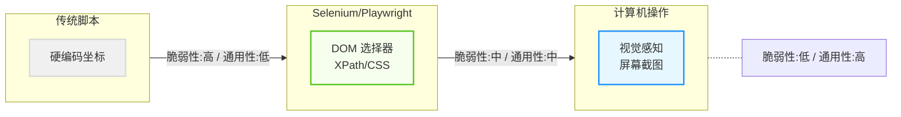
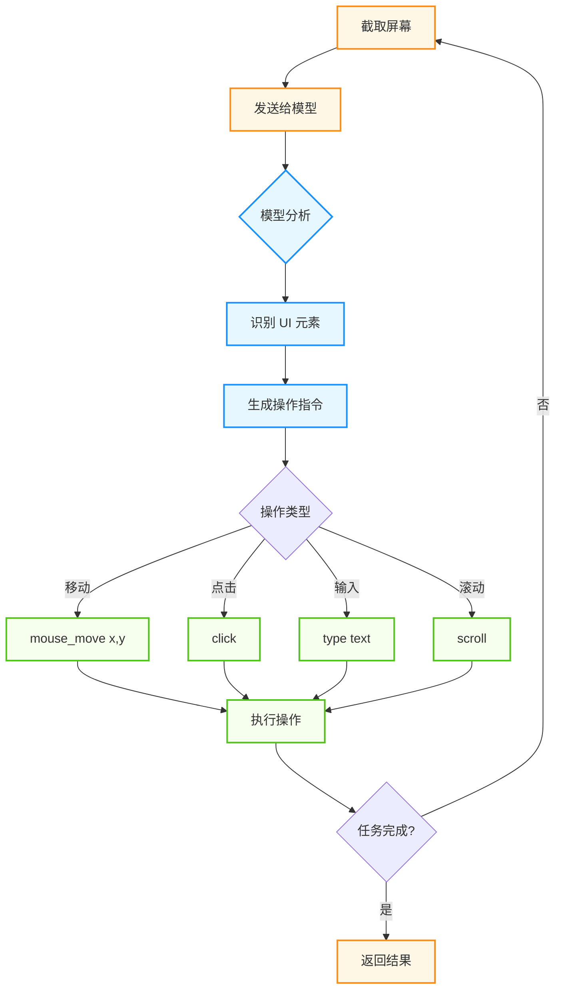
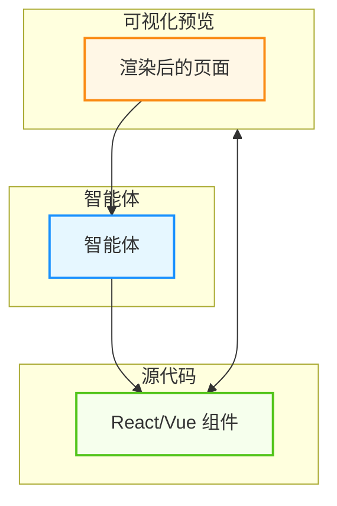
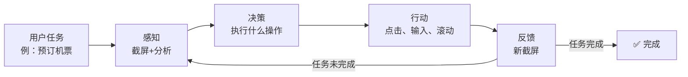
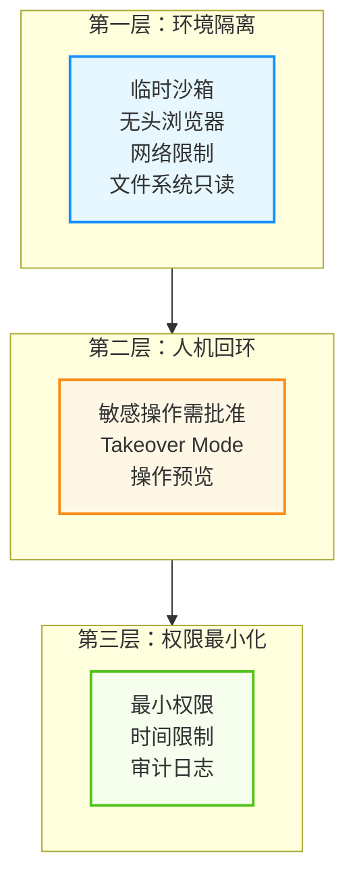

## 4.5 浏览器自动化与计算机操作

智能体不仅需要调用 API，还需要与图形界面交互。**浏览器自动化（Browser Automation）** 和 **计算机操作（Computer Use）** 让智能体能够像人类一样操控 GUI 界面，打破了传统 API 的限制。

### 4.5.1 为什么需要浏览器自动化

并非所有系统都开放 API。遗留系统（ERP/CRM）和现代 SaaS 往往只有 Web 界面，要实现自动化操作，必须让智能体具备操控浏览器的能力。

**典型应用场景**：
- **Web 抓数据**：从没有 API 的网站提取信息
- **遗留系统集成**：自动操作老旧的企业内部系统
- **端到端测试**：模拟用户行为进行 UI 测试
- **RPA 任务**：订票、购物、表单填写等重复性工作

### 4.5.2 自动化技术的三代演进

自动化技术经历了三代演进，从硬编码坐标到 DOM 选择器，再到基于视觉感知的智能操作：


```mermaid
graph LR
    %% Agentic Design System
    classDef agent fill:#e6f7ff,stroke:#1890ff,stroke-width:2px;
    classDef tool fill:#f6ffed,stroke:#52c41a,stroke-width:2px;
    classDef env fill:#f0f0f0,stroke:#d9d9d9,stroke-width:2px;

    subgraph Gen1 [传统脚本]
        T1[硬编码坐标]
    end
    
    subgraph Gen2 [Selenium/Playwright]
        T2[DOM 选择器<br>XPath/CSS]
    end
    
    subgraph Gen3 [计算机操作]
        T3[视觉感知<br>屏幕截图]
    end
    
    Gen1 --"脆弱性:高 / 通用性:低"--> Gen2
    Gen2 --"脆弱性:中 / 通用性:中"--> Gen3
    Gen3 -.- Note["脆弱性:低 / 通用性:高"]
    
    class T1 env;
    class T2 tool;
    class T3 agent;
```

图 4-9：自动化技术三代演进

当前主流的两种范式有着根本不同的工作方式：

- **DOM-based（基于文档对象模型）**：通过解析网页的 HTML 结构，使用 CSS 选择器或 XPath 定位元素。这是 Selenium/Playwright 的工作方式，精确高效，但 **依赖页面结构**——一旦开发者修改了 HTML 布局、类名或 ID，脚本就会失效。

- **视觉感知（Vision-based）**：通过截取屏幕图像，让多模态模型“看”界面并理解其含义。模型像人类一样识别“登录按钮在哪里”，然后输出坐标和操作指令。这种方式 **不依赖代码结构**，能够适应界面变化，但速度较慢且消耗更多计算资源。

| 维度 | DOM-based | 视觉感知 |
|------|-----------|----------|
| **工作方式** | 解析 HTML 结构 | 分析屏幕截图 |
| **选择器** | CSS/XPath | 视觉坐标 (x, y) |
| **精确性** | 高 | 中 |
| **速度** | 快 | 较慢 |
| **通用性** | 仅 Web | 任意 GUI |
| **维护成本** | 页面变化需更新 | 自适应 |
| **成本** | 低 | 高（消耗 Token） |

### 4.5.3 DOM-based 自动化

DOM-based 自动化通过程序化方式操控浏览器，适合结构稳定的网页场景。以下是使用 Playwright 实现登录的示例：

```python
from playwright.sync_api import sync_playwright

def login_traditional():
    with sync_playwright() as p:
        browser = p.chromium.launch()
        page = browser.new_page()
        page.goto("https://example.com/login")
        
        # 依赖 CSS 选择器 - 页面结构变化即失效

        page.fill("#username", "user@example.com")
        page.fill("#password", "password123")
        page.click("button[type='submit']")
```

**适用场景**：
- 内部系统自动化（页面结构可控）
- 需要高速批量操作
- 测试自动化

### 4.5.4 视觉感知与计算机操作

视觉感知方式让智能体通过“看”屏幕来操作界面，不依赖底层代码结构。

#### 工作机制

以下流程图展示了计算机操作的完整循环：截屏→分析→生成操作→执行→重复直到任务完成：


```mermaid
flowchart TD
    %% Agentic Design System
    classDef agent fill:#e6f7ff,stroke:#1890ff,stroke-width:2px;
    classDef tool fill:#f6ffed,stroke:#52c41a,stroke-width:2px;
    classDef user fill:#fff7e6,stroke:#fa8c16,stroke-width:2px;

    A[截取屏幕] --> B[发送给模型]
    B --> C{模型分析}
    C --> D[识别 UI 元素]
    D --> E[生成操作指令]
    E --> F{操作类型}
    F -->|移动| G[mouse_move x,y]
    F -->|点击| H[click]
    F -->|输入| I[type text]
    F -->|滚动| J[scroll]
    G & H & I & J --> K[执行操作]
    K --> L{任务完成?}
    L -->|否| A
    L -->|是| M[返回结果]
    
    class A,B user;
    class C,D,E agent;
    class G,H,I,J,K tool;
    class M user;
```

图 4-10：计算机操作循环

#### 代码示例

下面是一个抽象化的伪代码示例，展示“截图 → 模型决策 → 执行动作”的闭环：

```python
client = Client(model="<MODEL>")

while not done:
    screenshot = capture_screen()
    action = client.decide_action(
        image=screenshot,
        goal="请登录这个网站，用户名是 <USERNAME>"
    )
    done = execute_ui_action(action)
```

#### 浏览器智能体（Browser Agent）

一些平台提供了面向网页任务的浏览器智能体形态：结合规划 + 浏览器操作，可执行订票、购物、表单填写等多步骤任务。

常见能力包括：端到端任务执行、多步骤规划、错误恢复、人机接管（敏感操作暂停等待用户）。

### 4.5.5 混合模式：视觉与代码结合

将“视觉”与“代码”结合是 DOM-based 和视觉感知的融合方向。一些 IDE/开发工具的可视化编辑能力展示了这种新型交互形态。

#### 工作模式

以下图示展示了可视化预览、源代码和智能体之间的交互关系：


```mermaid
graph TD
    %% Agentic Design System
    classDef agent fill:#e6f7ff,stroke:#1890ff,stroke-width:2px;
    classDef tool fill:#f6ffed,stroke:#52c41a,stroke-width:2px;
    classDef user fill:#fff7e6,stroke:#fa8c16,stroke-width:2px;

    subgraph Visual [可视化预览]
        Page[渲染后的页面]
    end
    
    subgraph Code [源代码]
        Source[React/Vue 组件]
    end
    
    subgraph Ag [智能体]
        Agent[智能体]
    end
    
    Visual <--> Source
    Page --> Agent
    Agent --> Source
    
    class Page user;
    class Source tool;
    class Agent agent;
```

图 4-11：可视化编辑器交互模型

#### 应用场景

```markdown
用户：（指向渲染页面上的按钮）
"把这个按钮的圆角改大一点，颜色改成蓝色渐变"

智能体：
1. [视觉识别] 定位到页面中的按钮元素
2. [代码映射] 找到对应的 React 组件 Button.tsx
3. [修改代码] 更新 className 和 style
4. [实时预览] 页面立即更新显示效果

用户：（满意）"好的，再把文字改成白色"

智能体：
1. 继续修改同一组件
2. 更新文字颜色
3. 保存更改
```

### 4.5.6 主流浏览器自动化框架对比

在选择浏览器自动化框架时，需要考虑延迟、可靠性、成本和易用性等多个维度。

#### 框架对比表

| 框架 | 工作原理 | 性能 | 学习曲线 | 生产就绪 | 特色 |
|------|---------|------|--------|--------|------|
| **Playwright** | CDP协议 + 无头浏览器 | 快速（200-500ms） | 中 | ✅ | 跨浏览器、稳定 |
| **Selenium** | WebDriver标准 | 中等（500-2000ms） | 低 | ✅ | 生态成熟、广泛支持 |
| **Puppeteer** | Chrome DevTools Protocol | 快速（200-500ms） | 中 | ✅ | Chrome专用、轻量 |
| **视觉感知(Vision)** | 图像识别 + LLM | 慢速（2-5s） | 高 | ⚠️ | 通用性强、自适应 |

#### Playwright vs Selenium 深度对比

**Playwright 优势**：
- **跨浏览器原生支持**：同一套代码支持 Chromium、Firefox、WebKit
- **更快的性能**：使用 Chrome DevTools Protocol，避免了网络开销
- **现代API**：支持异步/等待模式，更符合当代开发习惯

**Selenium 优势**：
- **生态成熟**：大量已有项目、社区支持
- **跨语言**：支持 Java、Python、Ruby、JavaScript 等
- **学习资源丰富**：文档、教程、Stack Overflow 回答众多

```python
# Playwright 示例：快速定位元素
from playwright.async_api import async_playwright

async def test_with_playwright():
    async with async_playwright() as p:
        browser = await p.chromium.launch()
        page = await browser.new_page()
        await page.goto("https://example.com")

        # 使用更灵活的选择器
        # 支持 XPath、CSS、自定义选择器
        button = page.locator("button:has-text('Submit')")
        await button.click()

        browser.close()

# Selenium 示例：传统方式
from selenium import webdriver
from selenium.webdriver.common.by import By
from selenium.webdriver.support.ui import WebDriverWait

def test_with_selenium():
    driver = webdriver.Chrome()
    driver.get("https://example.com")

    # 需要显式等待，语法较冗长
    wait = WebDriverWait(driver, 10)
    button = wait.until(
        EC.presence_of_element_located((By.XPATH, "//button[contains(text(), 'Submit')]"))
    )
    button.click()

    driver.quit()
```

#### Puppeteer 的适用场景

Puppeteer 最适合：
- **Chrome/Chromium 专属场景**（不需要跨浏览器）
- **高性能需求**（需要毫秒级延迟）
- **复杂交互自动化**（JavaScript 操作）

```javascript
// Puppeteer 例子：执行 JavaScript 交互
const puppeteer = require('puppeteer');

(async () => {
  const browser = await puppeteer.launch();
  const page = await browser.newPage();
  await page.goto('https://example.com');

  // 在页面上下文中执行JavaScript
  const result = await page.evaluate(() => {
    // 这段代码在浏览器中执行
    return document.querySelector('.result').textContent;
  });

  await browser.close();
})();
```

### 4.5.7 视觉定位 vs DOM定位的权衡

#### DOM 定位的最佳实践

DOM 定位快速且可靠，但需要应对页面结构变化：

```python
class RobustDOMLocator:
    """健壮的 DOM 定位器"""

    def __init__(self, page):
        self.page = page

    def find_by_multiple_strategies(self, target_name: str):
        """
        使用多种策略查找元素，降低脆弱性
        """
        strategies = [
            # 策略1：精确的ID查找（最可靠）
            f"#{target_name}",

            # 策略2：使用 aria-label（无障碍标签，往往更稳定）
            f"[aria-label='{target_name}']",

            # 策略3：使用 data-testid（开发者预留给测试的属性）
            f"[data-testid='{target_name}']",

            # 策略4：包含文本的查找（页面结构重构时仍可用）
            f"button:has-text('{target_name}')",

            # 策略5：使用部分CSS类名（避免完全依赖类名）
            f"[class*='{target_name.lower()}']",
        ]

        for selector in strategies:
            try:
                element = self.page.query_selector(selector)
                if element:
                    print(f"Found element using strategy: {selector}")
                    return element
            except Exception:
                continue

        raise RuntimeError(f"Could not locate {target_name} using any strategy")

    def click_with_retry(self, selector, max_attempts=3):
        """点击，带重试和降级"""
        for attempt in range(max_attempts):
            try:
                element = self.find_by_multiple_strategies(selector)
                element.click()
                return True
            except Exception as e:
                if attempt < max_attempts - 1:
                    time.sleep(0.5)
                else:
                    # 降级：如果 DOM 点击失败，改用坐标点击
                    print("DOM click failed, falling back to coordinate click")
                    return self._click_by_vision(selector)

    def _click_by_vision(self, target_name):
        """降级方案：基于视觉的点击"""
        # 截屏 + 识别 + 点击
        screenshot = self.page.screenshot()
        coords = self._identify_target(screenshot, target_name)
        if coords:
            self.page.mouse.click(coords["x"], coords["y"])
            return True
        return False
```

#### 视觉感知的实际应用

```python
class VisionBasedInteraction:
    """基于视觉的交互"""

    def __init__(self, model):
        """model: 多模态LLM（如Claude Vision）"""
        self.model = model

    def interact_with_screenshot(self, task: str, screenshot_bytes: bytes):
        """
        给定截图和任务，模型决定如何操作

        例子：
        - 任务："点击最左边的红色按钮"
        - 输入：截图二进制数据
        - 输出：{"action": "click", "x": 100, "y": 50}
        """

        # 将截图转换为base64
        import base64
        encoded = base64.b64encode(screenshot_bytes).decode()

        # 调用视觉LLM
        response = self.model.generate(
            prompt=f"""
            Look at this screenshot and perform the following task:
            {task}

            Respond with a JSON object containing:
            - action: "click", "type", "scroll", etc.
            - target: description of what you're clicking
            - x, y: pixel coordinates (if clicking)
            - text: text to type (if typing)

            Example response format:
            {{"action": "click", "target": "submit button", "x": 342, "y": 215}}
            """,
            image_data=encoded,
            image_type="image/png"
        )

        # 解析响应
        action = json.loads(response.content)
        return action

    def loop_until_task_complete(self, task: str, page, max_iterations: int = 10):
        """
        循环式交互：截屏→识别→操作→检查→重复
        """
        for iteration in range(max_iterations):
            # 截屏
            screenshot = page.screenshot()

            # 判断任务是否完成
            completion_check = self.model.generate(
                prompt=f"""
                Has the following task been completed?
                Task: {task}

                Respond with JSON: {{"completed": true/false, "reason": "..."}}
                """,
                image_data=base64.b64encode(screenshot).decode(),
                image_type="image/png"
            )

            check_result = json.loads(completion_check.content)
            if check_result["completed"]:
                return {"success": True, "iterations": iteration}

            # 未完成，执行下一步操作
            action = self.interact_with_screenshot(task, screenshot)
            self._execute_action(page, action)

        return {"success": False, "reason": "max_iterations_reached"}
```

### 4.5.8 生产中的稳定性挑战与解决方案

浏览器自动化在生产环境中面临多个稳定性问题，以下是常见的陷阱和解决方案：

#### 问题一：页面加载不完整

```python
# ❌ 问题：页面虽然加载了，但动态内容还未渲染
page.goto(url)
data = page.query_selector(".content").text_content()  # 可能是空的

# ✅ 解决方案：等待特定元素可见
page.goto(url)
page.wait_for_selector(".content", state="visible", timeout=5000)
data = page.query_selector(".content").text_content()
```

#### 问题二：网络不稳定导致的随机失败

```python
class ResilientBrowserAgent:
    """具有恢复能力的浏览器智能体"""

    def __init__(self):
        self.max_retries = 3
        self.timeout = 30  # 秒

    def execute_with_resilience(self, task, page):
        """
        带重试、超时和降级的执行
        """
        for attempt in range(self.max_retries):
            try:
                result = self._execute_task(task, page, timeout=self.timeout)
                return {"success": True, "result": result, "attempts": attempt + 1}

            except TimeoutError:
                print(f"Timeout on attempt {attempt + 1}, retrying...")
                if attempt < self.max_retries - 1:
                    # 网络超时，重新导航
                    page.reload()
                    time.sleep(2 ** attempt)  # 指数退避
                else:
                    return {"success": False, "reason": "network_timeout"}

            except Exception as e:
                print(f"Error on attempt {attempt + 1}: {e}")
                if attempt == self.max_retries - 1:
                    # 最后一次失败，返回降级响应或报警
                    return {
                        "success": False,
                        "reason": str(e),
                        "fallback_action": "escalate_to_human"
                    }

    def _execute_task(self, task, page, timeout):
        """执行任务，设置超时"""
        # 这里简化处理，实际应该用上下文管理器
        import signal

        def timeout_handler(signum, frame):
            raise TimeoutError("Task execution exceeded timeout")

        signal.signal(signal.SIGALRM, timeout_handler)
        signal.alarm(timeout)

        try:
            # 执行实际任务
            result = self._do_execute(task, page)
            return result
        finally:
            signal.alarm(0)  # 取消闹钟
```

#### 问题三：动态内容与 JavaScript 渲染

```python
class JavaScriptAwareNavigator:
    """处理 JavaScript 渲染的导航器"""

    def navigate_and_wait_for_content(self, page, url):
        """
        某些网站的内容通过 JavaScript 动态生成
        需要等待 JavaScript 执行完成
        """

        # 方式1：等待网络空闲（推荐）
        page.goto(url, wait_until="networkidle")

        # 方式2：等待特定元素出现
        page.wait_for_load_state("domcontentloaded")
        page.wait_for_selector(".lazy-loaded-content")

        # 方式3：手动注入 JavaScript，等待自定义事件
        page.evaluate("""
            new Promise(resolve => {
                // 自定义逻辑：等待应用初始化完成
                if (window.appReady) {
                    resolve();
                } else {
                    window.addEventListener('appInitialized', resolve);
                }
            })
        """)

        return page
```

#### 问题四：反爬虫对策

许多网站部署了反爬虫机制。以下是应对策略：

```python
class AntiCrawlerResistant:
    """应对反爬虫机制的浏览器智能体"""

    def __init__(self):
        # 设置 User-Agent，模拟真实浏览器
        self.user_agent = "Mozilla/5.0 (Windows NT 10.0; Win64; x64) AppleWebKit/537.36"

        # 添加随机延迟，避免请求过于规则
        self.min_delay = 1
        self.max_delay = 5

    def launch_browser_with_stealth(self):
        """启动隐身模式的浏览器"""
        options = {
            "user_agent": self.user_agent,
            "viewport": {"width": 1920, "height": 1080},
            # 禁用无头模式指示
            "args": [
                "--disable-blink-features=AutomationControlled",
                "--disable-dev-shm-usage"
            ]
        }
        return options

    def navigate_with_human_like_behavior(self, page, url):
        """
        模拟真人行为：随机延迟、随机滚动等
        """
        import random
        import time

        # 随机延迟
        delay = random.uniform(self.min_delay, self.max_delay)
        time.sleep(delay)

        # 导航
        page.goto(url)

        # 随机滚动（某些网站检测滚动行为）
        for _ in range(random.randint(2, 5)):
            scroll_height = page.evaluate("window.innerHeight")
            page.evaluate(f"window.scrollBy(0, {random.randint(100, 500)})")
            time.sleep(random.uniform(0.5, 2))

        return page

    def handle_cloudflare_protection(self, page):
        """处理 Cloudflare 等高级反爬虫"""
        # 方案1：等待 Cloudflare JavaScript 执行完毕
        try:
            page.wait_for_load_state("networkidle", timeout=10000)
        except:
            pass

        # 方案2：如果还是被拦截，可以：
        # - 使用真实浏览器池服务（如 Browserless）
        # - 使用反爬虫绕过服务（如 Bright Data）
        # - 合作获取 API 而非爬取

        return page
```

### 4.5.9 Computer Use 类方案的最新进展

随着多模态模型（视觉+文本）的进展，出现了“Computer Use”类方案，让LLM能够像人一样操作任意GUI界面。

#### Computer Use 架构


```mermaid
graph LR
    Task["用户任务<br/>例：预订机票"] --> Perception["感知<br/>截屏+分析"]
    Perception --> Decision["决策<br/>执行什么操作"]
    Decision --> Action["行动<br/>点击、输入、滚动"]
    Action --> Feedback["反馈<br/>新截屏"]
    Feedback -->|任务未完成| Perception
    Feedback -->|任务完成| Done["✅ 完成"]
```

#### 实现原理

```python
class ComputerUseAgent:
    """Computer Use 类智能体"""

    def __init__(self, model, browser):
        self.model = model  # 多模态LLM
        self.browser = browser

    def act(self, goal: str, max_steps: int = 10):
        """
        循环式执行，直到完成任务
        """
        history = []

        for step in range(max_steps):
            # 第1步：截屏
            screenshot = self.browser.screenshot()

            # 第2步：让模型分析截图和目标，决定下一步操作
            response = self.model.generate(
                messages=[
                    {
                        "role": "user",
                        "content": [
                            {
                                "type": "image",
                                "source": {"type": "base64", "media_type": "image/png", "data": screenshot}
                            },
                            {
                                "type": "text",
                                "text": self._build_prompt(goal, history, step)
                            }
                        ]
                    }
                ],
                system_prompt=self._get_system_prompt()
            )

            # 第3步：解析模型的操作指令
            action = self._parse_action(response.content)
            history.append({"screenshot": screenshot, "action": action})

            # 第4步：执行操作
            if action["type"] == "finish":
                return {"success": True, "result": action.get("result"), "steps": step}

            self._execute_action(action)

            # 第5步：等待、观察效果
            time.sleep(1)

        return {"success": False, "reason": "max_steps_exceeded"}

    def _build_prompt(self, goal: str, history: list, step: int):
        """构造提示词"""
        context = f"""
You are operating a computer to achieve the following goal:
{goal}

Current step: {step}

{self._format_history(history)}

Based on the current screenshot above, what is your next action?
Respond in JSON format:
{{
    "type": "click" | "type" | "scroll" | "finish",
    "target": "description of what you're interacting with",
    "x": 100,  // for click
    "y": 200,  // for click
    "text": "text to type",  // for type
    "result": "final answer"  // for finish
}}
        """
        return context

    def _execute_action(self, action: dict):
        """执行操作"""
        if action["type"] == "click":
            self.browser.click(action["x"], action["y"])
        elif action["type"] == "type":
            self.browser.type(action["text"])
        elif action["type"] == "scroll":
            self.browser.scroll(action.get("direction", "down"))
```

#### Computer Use 的优势与局限

| 维度 | 优势 | 局限 |
|------|------|------|
| **通用性** | 可操作任意GUI，无需集成 API | 速度慢（每次 2-5秒） |
| **鲁棒性** | 页面结构变化不影响操作 | 成本高（每次视觉分析）|
| **易用性** | 开发简单，快速原型 | 容易被反爬虫阻止 |

### 4.5.10 实战建议：选择合适的方案

```
任务类型与方案选择决策树：

├─ 内部系统/已有API
│  └─ 使用 API 或数据库连接（最佳）
│
├─ 稳定的商业网站（如 AWS、GitHub）
│  └─ 使用 DOM-based（Playwright/Selenium）+ XPath
│
├─ 动态渲染+频繁变化的网站
│  └─ 使用视觉感知（Vision + Computer Use）
│
├─ 反爬虫保护很强的网站
│  └─ 考虑：(1) 是否有 API，(2) 是否值得成本，(3) 人工操作
│
└─ 一次性/原型任务
   └─ 使用 Computer Use（快速开发）
```

---

**下一节**: [4.6 多模态能力](4.6_multimodal.md)

赋予智能体“手”的同时也引入了巨大风险。如果智能体不小心删除了数据库或发送了钓鱼邮件，后果严重。

#### 三层防御体系


```mermaid
graph TD
    %% Agentic Design System
    classDef agent fill:#e6f7ff,stroke:#1890ff,stroke-width:2px;
    classDef tool fill:#f6ffed,stroke:#52c41a,stroke-width:2px;
    classDef user fill:#fff7e6,stroke:#fa8c16,stroke-width:2px;

    subgraph L1 [第一层：环境隔离]
        D1[临时沙箱<br>无头浏览器<br>网络限制<br>文件系统只读]
    end
    
    subgraph L2 [第二层：人机回环]
        D2[敏感操作需批准<br>Takeover Mode<br>操作预览]
    end
    
    subgraph L3 [第三层：权限最小化]
        D3[最小权限<br>时间限制<br>审计日志]
    end
    
    L1 --> L2 --> L3
    
    class D1 agent;
    class D2 user;
    class D3 tool;
```

图 4-12：安全防御三层体系

#### 敏感操作分级

| 级别 | 操作类型 | 处理方式 |
|------|---------|---------|
| 低 | 读取公开页面、搜索 | 自动执行 |
| 中 | 填写表单、点击按钮 | 日志记录 |
| 高 | 提交订单、发送消息 | 预览确认 |
| 极高 | 支付、删除数据、密码输入 | 人工接管 |

#### 安全配置示例

以下示例展示了如何实现操作黑名单、高风险确认和审计日志：

```python
class SecureComputerUse:
    """安全的计算机操作封装"""
    
    BLOCKED_ACTIONS = [
        ("navigate", r".*bank.*"),      # 禁止访问银行网站
        ("type", r"password=.*"),       # 禁止输入密码
        ("click", r".*delete.*all.*"),  # 禁止点击全删除
    ]
    
    HIGH_RISK_PATTERNS = [
        r".*payment.*",
        r".*checkout.*",
        r".*confirm.*order.*",
    ]
    
    def execute(self, action: dict) -> dict:
        # 1. 检查黑名单

        for action_type, pattern in self.BLOCKED_ACTIONS:
            if action["type"] == action_type:
                if re.match(pattern, str(action.get("target", ""))):
                    return {"blocked": True, "reason": "Forbidden action"}
        
        # 2. 高风险操作需确认

        if any(re.match(p, str(action)) for p in self.HIGH_RISK_PATTERNS):
            if not self.get_user_confirmation(action):
                return {"blocked": True, "reason": "User declined"}
        
        # 3. 记录审计日志

        self.audit_log(action)
        
        # 4. 执行操作

        return self.do_execute(action)
```

---

**下一节**: [4.6 多模态能力](4.6_multimodal.md)
