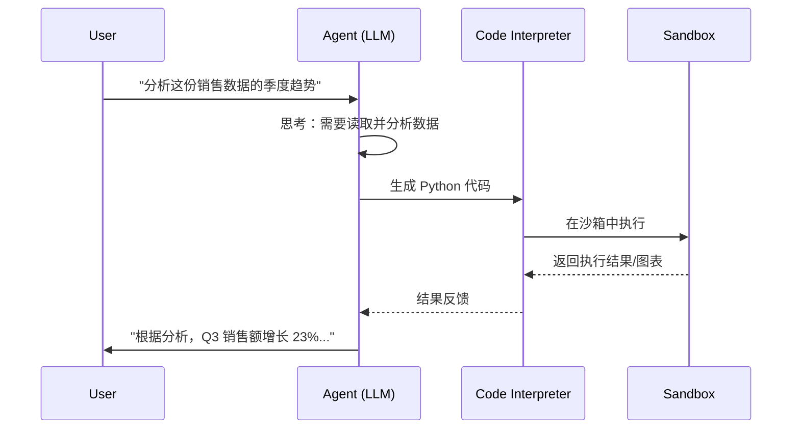
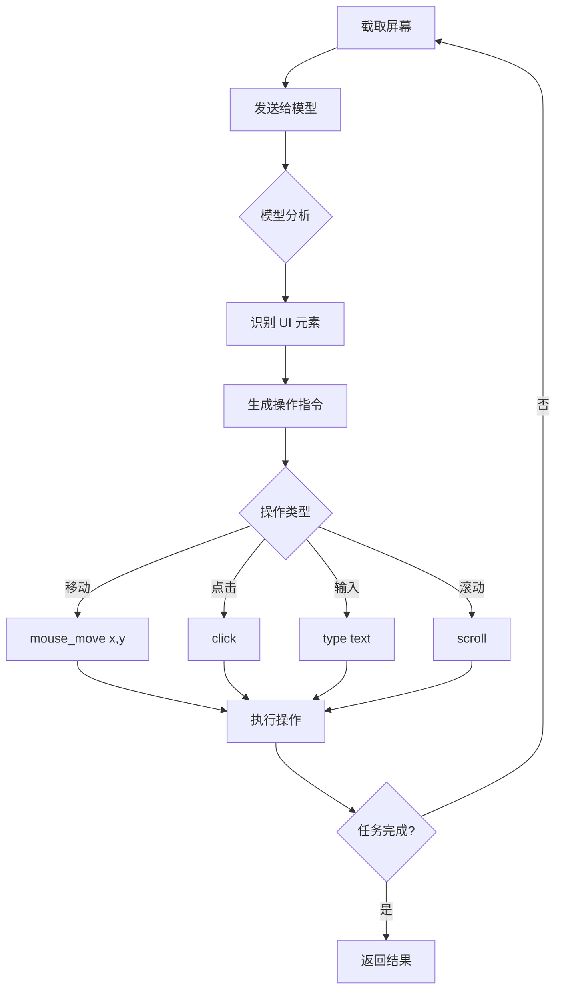

## 4.5 环境交互：代码解释器与浏览器操作

智能体不仅需要"大脑"（模型），更需要"双手"（执行环境）。**代码解释器（Code Interpreter）** 赋予了智能体精确计算和数据分析的能力，而 **计算机操作（Computer Use）** 则让智能体能够像人类一样操控 GUI 界面，打破了 API 的限制。本节将深入探讨这两大核心交互能力。

### 4.5.1 代码解释器

代码解释器的核心是让 LLM 从"说话者"变成了"行动者"。它不仅能写代码，还能**运行**代码。

#### 核心价值

| 价值 | 问题 | 解决方案 |
|------|------|---------|
| **弥补数学短板** | LLM 是概率模型，不擅长精确计算 | 运行 `print(248 * 1923)` 得到 100% 正确结果 |
| **精确数据分析** | 百万行数据无法放入上下文 | 编写 Pandas 代码进行清洗、聚合和分析 |
| **多模态输出** | 需要生成图表、文档 | 调用 Matplotlib、MoviePy 等库 |
| **算法验证** | 复杂逻辑难以口述验证 | 实际运行代码验证正确性 |

#### 工作原理



#### 沙箱技术方案

代码解释器必须运行在严格隔离的沙箱中，防止 `rm -rf /` 等危险操作：

| 技术 | 描述 | 优点 | 缺点 |
|------|------|------|------|
| **Docker 容器** | 行业标准，每个 Session 独立容器 | 隔离性强，库支持全 | 启动较慢 |
| **WebAssembly (WASM)** | 浏览器端通过 Pyodide 运行 | 绝对安全，轻量 | 性能有限，库受限 |
| **E2B 微虚拟机** | 云原生沙箱，毫秒级启动 | 快速、安全、可扩展 | 依赖云服务 |
| **gVisor/Firecracker** | 轻量级容器运行时 | 安全性极高 | 配置复杂 |

#### 代码解释器配置示例

```python
# E2B 沙箱配置示例
from e2b import CodeInterpreter

async def run_analysis(code: str, data_path: str):
    with CodeInterpreter() as sandbox:
        # 上传数据文件
        sandbox.upload_file(data_path)
        
        # 执行分析代码
        result = sandbox.run_code(code)
        
        # 获取生成的图表
        for artifact in result.artifacts:
            if artifact.type == "image":
                return artifact.download()
        
        return result.text
```

### 4.5.2 浏览器自动化

并非所有系统都开放 API。遗留系统（ERP/CRM）和现代 SaaS 往往只有 Web 界面。**浏览器自动化**让智能体能通过 UI 与这些系统交互。

#### 技术演进

```
┌─────────────────────────────────────────────────────────────────┐
│                    浏览器自动化技术演进                          │
├─────────────────────────────────────────────────────────────────┤
│                                                                  │
│  传统脚本        Selenium/Playwright      Computer Use          │
│  ┌──────┐        ┌──────────────┐        ┌──────────────┐       │
│  │ 硬编码 │   →    │  DOM 选择器   │   →    │  视觉感知    │       │
│  │ 坐标  │        │  XPath/CSS   │        │  屏幕截图    │       │
│  └──────┘        └──────────────┘        └──────────────┘       │
│                                                                  │
│  脆弱性：高       脆弱性：中              脆弱性：低             │
│  通用性：低       通用性：中              通用性：高             │
│                                                                  │
└─────────────────────────────────────────────────────────────────┘
```

#### 从 DOM 到视觉感知

**传统自动化（Playwright/Selenium）**：

```python
# 基于 DOM 结构
from playwright.sync_api import sync_playwright

def login_traditional():
    with sync_playwright() as p:
        browser = p.chromium.launch()
        page = browser.new_page()
        page.goto("https://example.com/login")
        
        # 依赖 CSS 选择器 - 页面结构变化即失效
        page.fill("#username", "user@example.com")
        page.fill("#password", "password123")
        page.click("button[type='submit']")
```

**计算机操作（Computer Use，Anthropic）**：

```python
# 基于视觉感知
from anthropic import Anthropic

def login_computer_use():
    client = Anthropic()
    
    # 发送屏幕截图，让模型"看"界面
    response = client.messages.create(
        model="claude-3-5-sonnet-20241022",
        max_tokens=1024,
        tools=[{
            "type": "computer_20241022",
            "name": "computer",
            "display_width_px": 1920,
            "display_height_px": 1080,
        }],
        messages=[{
            "role": "user",
            "content": [
                {"type": "image", "source": {"type": "base64", "data": screenshot_b64}},
                {"type": "text", "text": "请登录这个网站，用户名是 user@example.com"}
            ]
        }]
    )
    
    # 模型返回具体操作：移动鼠标到 (x, y)，点击，输入文字等
    return response.content
```

#### Computer Use 工作机制



#### 对比分析

| 维度 | DOM-based | Computer Use |
|------|-----------|--------------|
| **工作方式** | 解析 HTML 结构 | 分析屏幕截图 |
| **选择器** | CSS/XPath | 视觉坐标 (x, y) |
| **精确性** | 高 | 中 |
| **速度** | 快 | 较慢 |
| **通用性** | 仅 Web | 任意 GUI |
| **维护成本** | 页面变化需更新 | 自适应 |
| **成本** | 低 | 高（消耗 Token） |

### 4.5.3 OpenAI Operator

> [!IMPORTANT]
> **OpenAI Operator**：2025 年发布的生产级浏览器智能体，结合了 CUA（Computer-Using Agent）模型，能够自动执行订票、购物等复杂多步骤的网页任务。

#### 核心特性

| 特性 | 描述 |
|------|------|
| **端到端任务执行** | 完整完成"订一张北京到上海的机票"等任务 |
| **多步骤规划** | 自动分解复杂任务为可执行步骤 |
| **错误恢复** | 遇到验证码、弹窗等能自动处理 |
| **人机接管** | 敏感操作（支付、密码）暂停等待用户 |

#### 典型应用场景

```
用户：帮我在 Amazon 上找一个评分 4.5 以上的无线键盘，
      价格在 50-100 美元，加入购物车

Operator 执行流程：
1. 打开 amazon.com
2. 搜索 "wireless keyboard"
3. 筛选价格范围 $50-$100
4. 筛选评分 4.5+
5. 浏览结果，比较选项
6. 选择最佳匹配
7. 点击 "Add to Cart"
8. 返回确认信息
```

### 4.5.4 安全与风险控制

赋予智能体"手"的同时也引入了巨大风险。如果智能体不小心删除了数据库或发送了钓鱼邮件，后果严重。

#### 三层防御体系

```
┌─────────────────────────────────────────────────────────────────┐
│                      安全防御体系                                │
├─────────────────────────────────────────────────────────────────┤
│                                                                  │
│  ┌──────────────────────────────────────────────────────────┐  │
│  │              第一层：环境隔离 (Isolation)                  │  │
│  │  • 代码在临时沙箱中运行                                    │  │
│  │  • 浏览器在无头模式/隔离虚拟机中                           │  │
│  │  • 限制网络访问范围                                        │  │
│  │  • 文件系统只读或白名单                                    │  │
│  └──────────────────────────────────────────────────────────┘  │
│                              │                                   │
│                              ▼                                   │
│  ┌──────────────────────────────────────────────────────────┐  │
│  │             第二层：人机回环 (Human-in-the-loop)           │  │
│  │  • 敏感操作（资金、删除）需用户批准                         │  │
│  │  • Takeover Mode：检测密码输入时暂停                       │  │
│  │  • 操作预览：执行前展示将要进行的操作                       │  │
│  └──────────────────────────────────────────────────────────┘  │
│                              │                                   │
│                              ▼                                   │
│  ┌──────────────────────────────────────────────────────────┐  │
│  │             第三层：权限最小化 (Least Privilege)           │  │
│  │  • 只授予完成任务所需的最小权限                             │  │
│  │  • 时间限制：权限自动过期                                   │  │
│  │  • 审计日志：所有操作可追溯                                 │  │
│  └──────────────────────────────────────────────────────────┘  │
│                                                                  │
└─────────────────────────────────────────────────────────────────┘
```

#### 敏感操作分级

| 级别 | 操作类型 | 处理方式 |
|------|---------|---------|
| 低 | 读取公开页面、搜索 | 自动执行 |
| 中 | 填写表单、点击按钮 | 日志记录 |
| 高 | 提交订单、发送消息 | 预览确认 |
| 极高 | 支付、删除数据、密码输入 | 人工接管 |

#### 安全配置示例

```python
class SecureComputerUse:
    """安全的 Computer Use 封装"""
    
    BLOCKED_ACTIONS = [
        ("navigate", r".*bank.*"),      # 禁止访问银行网站
        ("type", r"password=.*"),       # 禁止输入密码
        ("click", r".*delete.*all.*"),  # 禁止点击全删除
    ]
    
    HIGH_RISK_PATTERNS = [
        r".*payment.*",
        r".*checkout.*",
        r".*confirm.*order.*",
    ]
    
    def execute(self, action: dict) -> dict:
        # 1. 检查黑名单
        for action_type, pattern in self.BLOCKED_ACTIONS:
            if action["type"] == action_type:
                if re.match(pattern, str(action.get("target", ""))):
                    return {"blocked": True, "reason": "Forbidden action"}
        
        # 2. 高风险操作需确认
        if any(re.match(p, str(action)) for p in self.HIGH_RISK_PATTERNS):
            if not self.get_user_confirmation(action):
                return {"blocked": True, "reason": "User declined"}
        
        # 3. 记录审计日志
        self.audit_log(action)
        
        # 4. 执行操作
        return self.do_execute(action)
```

### 4.5.5 实战案例：Cursor Visual Editor

Cursor 推出的 Visual Editor 展示了另一种交互形态：将"视觉"与"代码"结合。

#### 工作模式

```
┌─────────────────────────────────────────────────────────────────┐
│                    Visual Editor 双向交互                        │
├─────────────────────────────────────────────────────────────────┤
│                                                                  │
│  ┌─────────────────────┐     ┌─────────────────────┐           │
│  │                     │     │                     │           │
│  │   渲染后的页面       │ ←→  │    源代码           │           │
│  │   (可视化预览)       │     │    (React/Vue)      │           │
│  │                     │     │                     │           │
│  └─────────────────────┘     └─────────────────────┘           │
│           │                           ▲                         │
│           │                           │                         │
│           ▼                           │                         │
│  ┌─────────────────────┐             │                         │
│  │   智能体            │             │                         │
│  │   • 看到渲染效果     │─────────────┘                         │
│  │   • 理解用户意图     │                                       │
│  │   • 修改源代码       │                                       │
│  └─────────────────────┘                                       │
│                                                                  │
└─────────────────────────────────────────────────────────────────┘
```

#### 应用场景

```markdown
用户：（指向渲染页面上的按钮）
"把这个按钮的圆角改大一点，颜色改成蓝色渐变"

智能体：
1. [视觉识别] 定位到页面中的按钮元素
2. [代码映射] 找到对应的 React 组件 Button.tsx
3. [修改代码] 更新 className 和 style
4. [实时预览] 页面立即更新显示效果

用户：（满意）"好的，再把文字改成白色"

智能体：
1. 继续修改同一组件
2. 更新文字颜色
3. 保存更改
```

### 4.5.6 小结

| 能力 | 技术方案 | 适用场景 | 关键考量 |
|------|---------|---------|---------|
| **代码解释器** | E2B/Docker/WASM | 数据分析、计算、可视化 | 沙箱安全性 |
| **DOM 自动化** | Playwright/Selenium | Web 应用、API 受限场景 | 选择器维护 |
| **Computer Use** | Vision + 坐标操作 | 任意 GUI、遗留系统 | 成本与速度 |
| **OpenAI Operator** | 端到端任务执行 | 复杂多步骤网页任务 | 人机接管设计 |

**核心原则**：
- 代码解释器是智能体的"左脑"，负责逻辑、数学和数据
- 浏览器/Computer Use 是智能体的"手"，负责与数字世界交互
- **安全是底线**，必须建立完善的沙箱与鉴权机制

---

**下一节**: [多模态感知与行动](4.6_multimodal.md)
