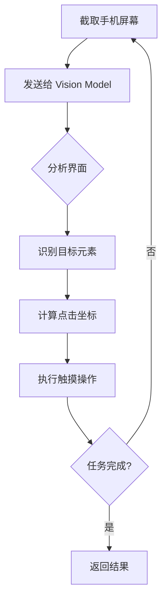
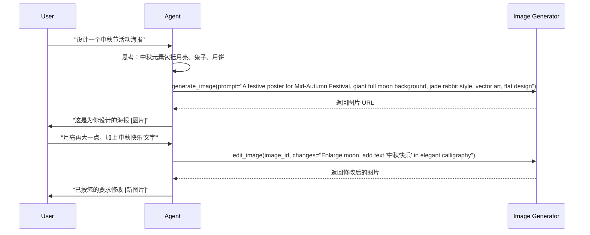
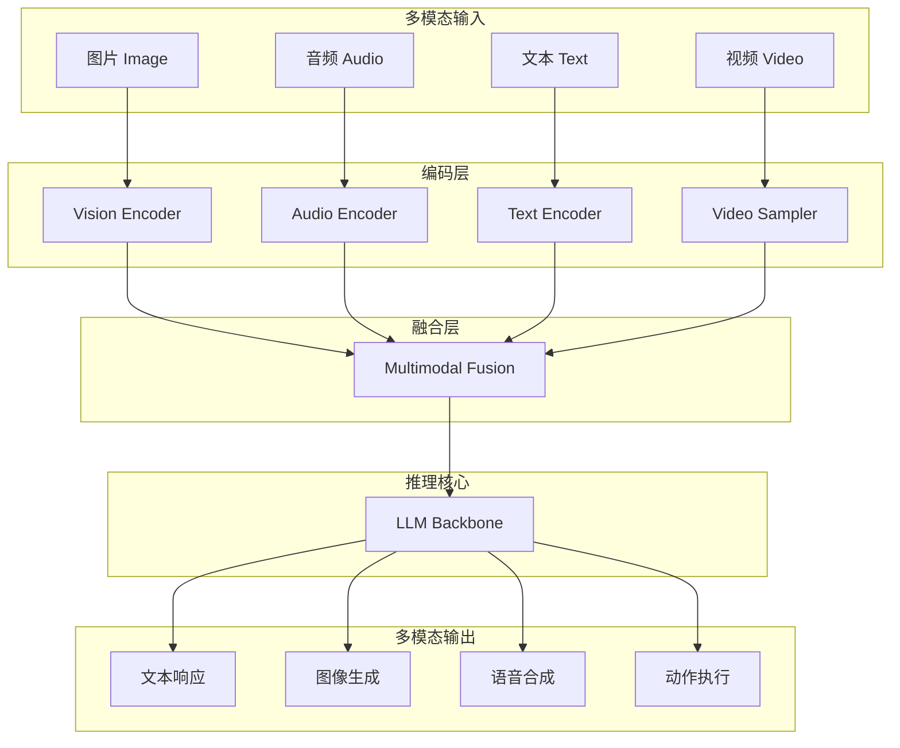

## 4.6 多模态感知与行动

世界不仅仅由文字组成。人类通过眼睛（视觉）、耳朵（听觉）感知世界，通过绘画、语音表达观点。**多模态智能体（Multimodal Agent）** 突破了纯文本的限制，能够理解图像、处理音频、观看视频，并生成丰富多彩的内容。

本节探讨 LMM（Large Multimodal Model）如何让智能体获得"五官"。

### 4.6.1 视觉感知

#### 现代视觉模型

现代前沿模型（如 GPT-5、Claude 4 Sonnet、Gemini 2.0 Pro）都原生具备了极强的视觉能力。它们不再是将图片转成文字描述，而是直接**理解**像素。

**图像提示（Prompting with Images）**：

```python
from anthropic import Anthropic
import base64

client = Anthropic()

# 读取图片并编码
with open("financial_report.png", "rb") as f:
    image_data = base64.b64encode(f.read()).decode("utf-8")

response = client.messages.create(
    model="claude-sonnet-4-20250514",
    max_tokens=1024,
    messages=[{
        "role": "user",
        "content": [
            {
                "type": "image",
                "source": {
                    "type": "base64",
                    "media_type": "image/png",
                    "data": image_data
                }
            },
            {
                "type": "text",
                "text": "分析这张财报图表，指出三个关键趋势"
            }
        ]
    }]
)
```

**多图对比分析**：

```python
messages = [{
    "role": "user",
    "content": [
        {"type": "text", "text": "比较这两张财报图表，哪家公司的增长更健康？"},
        {"type": "image", "source": {"type": "base64", "data": report_a_b64}},
        {"type": "image", "source": {"type": "base64", "data": report_b_b64}}
    ]
}]
```

#### 典型应用场景

| 场景 | 描述 | 技术实现 |
|------|------|---------|
| **UI 自动化** | 像人一样"看"手机/电脑屏幕 | 截图 → 识别元素 → 点击坐标 |
| **文档智能** | 理解文档的布局和结构 | 图像输入 → 提取表格/流程图 |
| **视频理解** | 回答关于视频内容的问题 | 抽帧 → 图像序列分析 |
| **代码审查** | 分析架构图和流程图 | 图像理解 → 代码建议 |

#### App Agent：移动端视觉智能体



**腾讯 AppAgent** 工作流示例：

```python
class AppAgent:
    """移动端视觉智能体"""
    
    def execute_task(self, task: str):
        while not self.is_task_complete():
            # 1. 截取当前屏幕
            screenshot = self.capture_screen()
            
            # 2. 发送给视觉模型
            analysis = self.vision_model.analyze(
                image=screenshot,
                task=task,
                history=self.action_history
            )
            
            # 3. 执行推荐的操作
            action = analysis.recommended_action
            if action.type == "tap":
                self.device.tap(action.x, action.y)
            elif action.type == "swipe":
                self.device.swipe(action.start, action.end)
            elif action.type == "type":
                self.device.input_text(action.text)
            
            # 4. 记录历史
            self.action_history.append(action)
```

### 4.6.2 图像生成与编辑

除了看，智能体还能画。通常通过调用扩散模型（Diffusion Models）的工具来实现。

#### 图像生成工作流

智能体不直接画图，而是充当**提示词工程师**：



#### 工具定义示例

```python
image_tools = [
    {
        "name": "generate_image",
        "description": "根据文字描述生成图像",
        "parameters": {
            "prompt": {
                "type": "string",
                "description": "详细的图像描述，英文"
            },
            "style": {
                "type": "string",
                "enum": ["realistic", "artistic", "cartoon", "3d"],
                "description": "图像风格"
            },
            "size": {
                "type": "string",
                "enum": ["1024x1024", "1792x1024", "1024x1792"],
                "description": "图像尺寸"
            }
        }
    },
    {
        "name": "edit_image",
        "description": "编辑现有图像",
        "parameters": {
            "image_url": {"type": "string"},
            "mask_description": {"type": "string", "description": "需要修改的区域描述"},
            "edit_prompt": {"type": "string", "description": "修改内容描述"}
        }
    }
]
```

#### 图像编辑能力

| 能力 | 描述 | 示例 |
|------|------|------|
| **内补绘制（Inpainting）** | 替换图像中的特定区域 | "把图里这只狗换成猫" |
| **外补拓展（Outpainting）** | 扩展图像边界 | "把这张图向左右延伸" |
| **风格迁移** | 改变图像风格 | "把这张照片变成油画风格" |
| **背景移除** | 提取前景主体 | "去掉背景，只保留人物" |

### 4.6.3 语音交互

未来的智能体交互将是 **语音优先（Voice-First）** 的。

#### 语音处理技术栈

```
┌─────────────────────────────────────────────────────────────────┐
│                      语音交互技术栈                              │
├─────────────────────────────────────────────────────────────────┤
│                                                                  │
│  ┌──────────────┐                                               │
│  │ 语音输入      │ ──→ ASR (Whisper) ──→ 文本                    │
│  └──────────────┘                                               │
│                           │                                      │
│                           ▼                                      │
│                    ┌──────────────┐                             │
│                    │    LLM       │                             │
│                    │   处理文本    │                             │
│                    └──────────────┘                             │
│                           │                                      │
│                           ▼                                      │
│  ┌──────────────┐                                               │
│  │ 语音输出      │ ←── TTS (ElevenLabs) ←── 文本                 │
│  └──────────────┘                                               │
│                                                                  │
│  端到端模式 (GPT-4o/Gemini 2.0)：                                │
│  ┌──────────────┐                                               │
│  │ 语音输入      │ ──→ 原生语音模型 ──→ 语音输出                   │
│  └──────────────┘    (直接理解情绪)                             │
│                                                                  │
└─────────────────────────────────────────────────────────────────┘
```

#### ASR：语音转文字

**Whisper** 是目前的工业标准：

```python
import whisper

# 加载模型
model = whisper.load_model("large-v3")

# 转录音频
result = model.transcribe(
    "meeting_recording.mp3",
    language="zh",  # 指定语言提高准确率
    task="transcribe"  # 或 "translate" 直接翻译成英文
)

print(result["text"])
# 输出转录文本

# 带时间戳的分段
for segment in result["segments"]:
    print(f"[{segment['start']:.1f}s - {segment['end']:.1f}s] {segment['text']}")
```

#### TTS：文字转语音

```python
from elevenlabs import generate, save

# 生成语音
audio = generate(
    text="欢迎使用智能体助手，有什么可以帮您？",
    voice="Bella",           # 选择声音
    model="eleven_multilingual_v2"
)

# 保存音频文件
save(audio, "welcome.mp3")
```

**情感控制**：

```python
# 不同情绪的语音生成
responses = {
    "apologize": generate(
        text="非常抱歉给您带来不便...",
        voice="Bella",
        voice_settings={"stability": 0.3, "similarity_boost": 0.5}  # 低稳定性 = 更有表情
    ),
    "excited": generate(
        text="恭喜您中奖了！",
        voice="Bella",
        voice_settings={"stability": 0.2, "similarity_boost": 0.8}
    )
}
```

#### 实时语音对话

GPT-4o 和 Gemini 2.0 展示了端到端的语音处理能力：

| 特性 | 传统流水线 | 端到端模型 |
|------|-----------|-----------|
| 延迟 | 高（逐步转换） | 低（直接处理） |
| 情绪理解 | 仅文字情感 | 语气、语调、节奏 |
| 中断处理 | 需额外逻辑 | 原生支持 |
| 自然度 | 机械感 | 接近真人 |

### 4.6.4 多模态智能体架构

在设计多模态智能体时，核心挑战是**模态对齐（Modality Alignment）**。

#### 架构设计



#### 模态对齐策略

| 策略 | 描述 | 适用场景 |
|------|------|---------|
| **早期融合** | 在编码层合并所有模态 | 紧密相关的多模态任务 |
| **晚期融合** | 各模态独立处理后合并 | 松散关联的任务 |
| **交叉注意力** | 模态间相互注意 | 需要精细对齐的任务 |
| **统一词表** | 所有模态映射到同一空间 | 端到端生成任务 |

### 4.6.5 实战：构建多模态客服智能体

```python
class MultimodalCustomerService:
    """多模态客服智能体"""
    
    def __init__(self):
        self.vision_model = VisionModel()
        self.asr = WhisperASR()
        self.tts = ElevenLabsTTS()
        self.llm = Claude()
    
    async def handle_request(self, request: MultimodalRequest):
        # 1. 处理输入
        context = []
        
        if request.audio:
            # 转录语音
            text = await self.asr.transcribe(request.audio)
            context.append({"type": "text", "content": text})
            
            # 检测情绪
            emotion = await self.asr.detect_emotion(request.audio)
            context.append({"type": "emotion", "content": emotion})
        
        if request.images:
            # 分析图片
            for img in request.images:
                analysis = await self.vision_model.analyze(img)
                context.append({"type": "image_analysis", "content": analysis})
        
        if request.text:
            context.append({"type": "text", "content": request.text})
        
        # 2. LLM 推理
        response = await self.llm.generate(
            system="你是一个友好的客服助手",
            context=context
        )
        
        # 3. 生成多模态响应
        result = MultimodalResponse()
        result.text = response.text
        
        if response.should_show_image:
            result.image = await self.generate_illustration(response.image_prompt)
        
        if request.prefers_audio:
            # 根据情绪选择语气
            voice_style = self.select_voice_style(emotion)
            result.audio = await self.tts.speak(response.text, style=voice_style)
        
        return result
    
    def select_voice_style(self, emotion: str) -> dict:
        """根据用户情绪选择回复语气"""
        styles = {
            "angry": {"stability": 0.5, "speed": 0.9},      # 稳定、稍慢，安抚
            "confused": {"stability": 0.7, "speed": 0.85},  # 清晰、慢速
            "happy": {"stability": 0.3, "speed": 1.1},      # 活泼
            "neutral": {"stability": 0.5, "speed": 1.0}
        }
        return styles.get(emotion, styles["neutral"])
```

### 4.6.6 小结

多模态不是锦上添花，而是智能体走向物理世界的必经之路。

| 模态 | 感知能力 | 生成能力 | 关键技术 |
|------|---------|---------|---------|
| **视觉** | 理解图像、视频、屏幕 | 生成图像、编辑 | Vision Encoder, Diffusion |
| **听觉** | 语音识别、情绪检测 | 语音合成、音效 | Whisper, TTS |
| **动作** | — | 鼠标/键盘/机械臂 | Computer Use, Robotics |

**核心洞察**：
- **Vision** 让智能体能看懂屏幕和摄像头
- **Audio** 让智能体能听懂指令和情绪
- **Action** 让智能体能操作鼠标或机械臂

当这些感官被打通，我们也就迎来了真正的**具身智能（Embodied AI）** 时代。

---

**下一节**: [本章小结](summary.md)