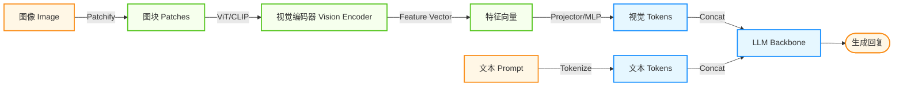
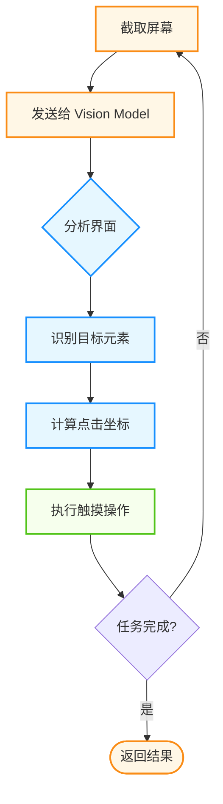
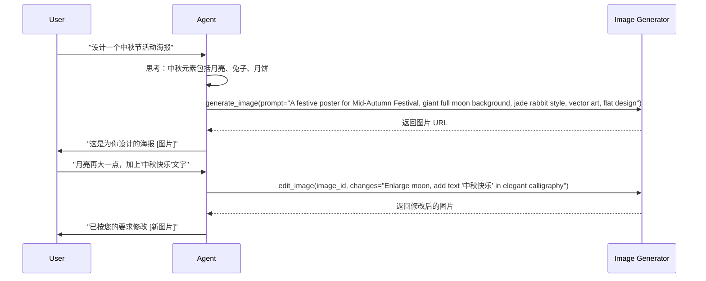
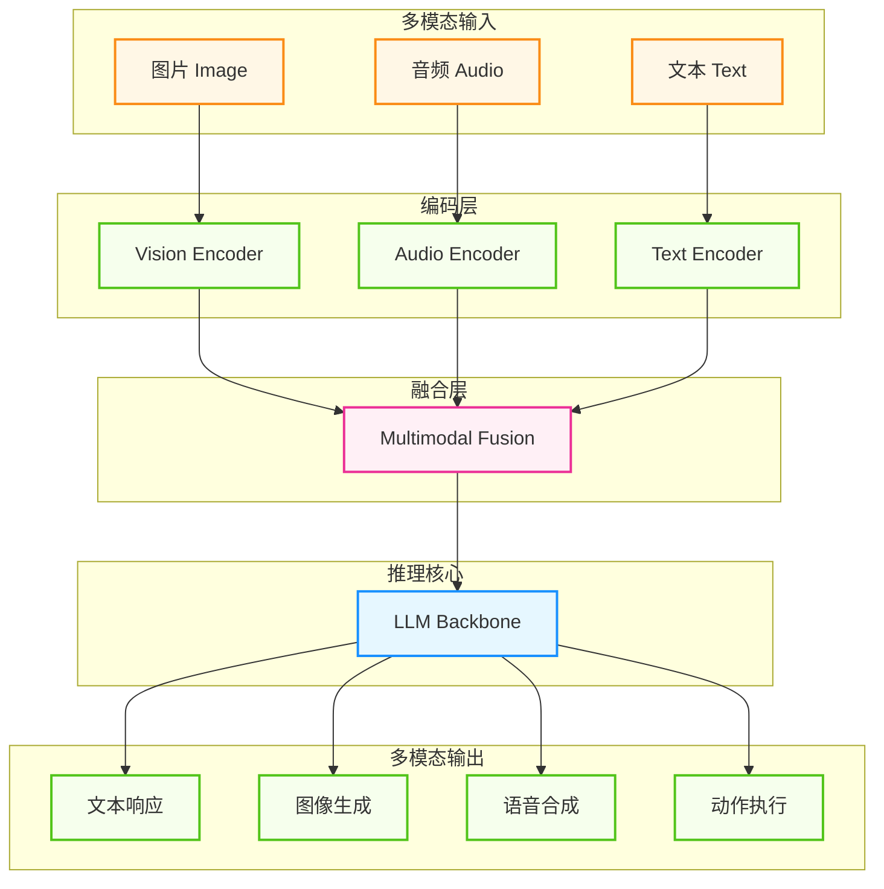

## 4.6 多模态能力

世界不仅仅由文字组成。人类通过眼睛（视觉）、耳朵（听觉）感知世界，通过绘画、语音表达观点。**多模态智能体（Multimodal Agent）** 突破了纯文本的限制，能够理解图像、处理音频、观看视频，并生成丰富多彩的内容。

本节探讨 LMM（Large Multimodal Model）如何让智能体获得“五官”，以及如何构建能够看、听、说、画的全能智能体。

### 4.6.1 视觉智能

视觉是人类获取信息最主要的渠道。赋予智能体视觉感知能力，使其能够像人类一样“看”懂屏幕和物理世界，是迈向通用人工智能的重要一步。

#### 视觉感知

不少多模态模型都具备较强的视觉理解能力。它们不再是将图片转成文字描述，而是直接 **理解**像素。**图像提示（Prompting with Images）**：

通过将图像以 Base64 编码的形式与文本提示词一起发送给模型，智能体可以“看”并理解图像内容：

```python
import base64

client = Client(model="<MODEL>")

with open("financial_report.png", "rb") as f:
    image_b64 = base64.b64encode(f.read()).decode("utf-8")

response = client.generate(
    input=[
        {"type": "input_image", "image_base64": image_b64},
        {"type": "input_text", "text": "分析这张财报图表，指出三个关键趋势"},
    ]
)
```


**多图对比分析**：

在同一请求中发送多张图像，让模型进行对比分析：

```python
messages = [{
    "role": "user",
    "content": [
        {"type": "text", "text": "比较这两张财报图表，哪家公司的增长更健康？"},
        {"type": "image", "source": {"type": "base64", "data": report_a_b64}},
        {"type": "image", "source": {"type": "base64", "data": report_b_b64}}
    ]
}]
```

**技术原理：LMM 如何“看见”？**

多模态大模型（LMM）的核心思想是将图像转化为语言模型能够理解的“视觉词汇”（Visual Tokens）。

1. **视觉编码器（Vision Encoder）**：使用如 CLIP 或 SigLIP 等模型将图像分割成小块（Patches），并提取每块的特征向量。
2. **投影层（Projector）**：通过一个简单的线性层或 MLP，将视觉特征向量映射到 LLM 的文本特征空间。
3. **LLM 处理**：对于 LLM 来说，这些映射后的视觉特征只是一串特殊的 Token，它像处理文本一样处理这些视觉 Token，从而实现“图生文”。



图 4-13：LMM 视觉处理架构

#### 视觉行动

除了“看”，智能体还可以通过视觉与设备交互。智能体通过截取手机/电脑屏幕、让视觉模型识别 UI 元素并生成触控指令，实现像人类一样操作应用。

以下是视觉行动的典型工作流程：



图 4-14：视觉行动工作流程

下面是一个通用的 GUI 智能体（GUI Agent）实现框架，展示了“观察-思考-行动”的典型循环：

```python
class VisualGUIAgent:
    """通用的视觉 GUI 智能体"""
    
    def run_task(self, goal: str):
        history = []
        
        while not self.is_done():
            # 1. 观察：获取当前屏幕截图和布局信息

            screenshot, xml_dump = self.env.observe()
            
            # 2. 思考：将视觉信息发送给 LMM 决策

            # LMM 会结合当前截图、历史操作和任务目标，输出下一步动作

            action = self.lmm.predict(
                image=screenshot,
                layout=xml_dump,
                instruction=goal,
                history=history
            )
            
            # 3. 行动：执行点击、滑动或输入

            print(f"执行动作: {action}")
            self.env.step(action)
            
            # 4. 记忆：更新操作历史

            history.append((screenshot, action))
            
            # 暂停一会等待界面响应

            time.sleep(1.0)
```

**技术原理：视觉定位 (Visual Grounding)**视觉行动的核心难点在于**定位（Grounding）**：如何让只懂文字的模型输出精确的 `(x, y)` 像素坐标？

1. **纯坐标预测**：直接让模型输出归一化坐标（如 `[0.25, 0.75]`），但这对 LLM 的空间推理能力要求极高，且容易产生幻觉。
2. **标号集（Set-of-Marks, SoM）**：这是目前最主流的方案。
    -   **预处理**：先用检测模型（如 SAM 或 IconDet）识别屏幕上所有可交互元素，并给每个元素打上数字标号（1, 2, 3...）。
    -   **决策**：将带有数字标签的截图喂给 LMM，告诉它“点击标号 5”。
    -   **执行**：智能体输出 "Click 5"，脚本将其映射回标号 5 对应的中心坐标进行点击。

这种方法将复杂的空间坐标回归问题，简化为了简单的 **多项选择题**，极大地提高了准确率。

**这一能力的典型应用场景**：

| 场景 | 描述 | 技术实现 |
|------|------|---------|
| **UI 自动化** | 像人一样操纵软件 | 截图 → 识别元素 → 点击坐标 |
| **文档智能** | 理解文档的布局和结构 | 图像输入 → 提取表格/流程图 |
| **视频理解** | 回答关于视频内容的问题 | 抽帧 → 图像序列分析 |
| **代码审查** | 分析架构图和流程图 | 图像理解 → 代码建议 |

#### GUI 智能体的失败模式与安全护栏

尽管 GUI 智能体展现出了强大的潜力，但在实际工程落地中，让 AI 直接接管鼠标和键盘伴随着极大的不确定性与风险。

**常见失败模式 (Failure Modes)**：
1. **定位偏移 (Grounding Offset)**：模型正确理解了意图，但输出的点击坐标偏离了目标元素几像素，导致点击了旁边的广告或关闭按钮。
2. **状态误判 (State Misjudgment)**：界面加载缓慢或出现弹窗遮挡时，智能体依然按照预期状态点击，导致操作完全错位（例如在加载动画上反复点击）。
3. **严重破坏性后果 (Irreversible Actions)**：如误删文件、发送乱码邮件等。由于模型缺乏现实常识，它很难感知点击 “Delete” 或 “Send” 按钮的严重性后果。

**必备安全护栏 (Safety Guardrails)**：
- **硬编码黑/白名单**：在环境控制层拦截对系统关键区域或危险应用的访问（例如禁止焦点切入终端、系统设置、网银页面）。
- **敏感操作人工确认 (HITL)**：涉及支付、删除、发送等破坏性操作时，环境必须挂起执行并通知人类二次授权（Human-in-the-loop）。
- **动作频控与熔断**：限制智能体每分钟的最大动作数量、连续异常重试次数，防止失控后的无底线重试或循环点击。
- **DOM / API 优先**：如果仅需获取信息或执行确定性修改，在有后门 API 或 DOM 树可用的情况下，尽量不要使用纯视觉机械点击的黑盒方案。

### 4.6.2 听觉与语音交互

未来的智能体交互将是 **语音优先（Voice-First）** 的。让智能体能听、能说，并理解语气及情绪。

#### 语音处理技术栈

语音处理有两种主要架构：传统的 ASR→LLM→TTS 流水线，和新型的端到端语音模型。

**技术原理：音频也是 Token**在端到端模型中，音频被离散化为**Audio Tokens**（通常使用 VQ-VAE 或 SoundStream 技术）。这意味着 1 秒钟的语音可能被表示为 25-50 个整数 ID。大模型可以像预测下一个文本 Token 一样，预测下一个音频 Token，从而直接生成语音。

```mermaid
graph TD
    %% Agentic Design System
    classDef agent fill:#e6f7ff,stroke:#1890ff,stroke-width:2px;
    classDef tool fill:#f6ffed,stroke:#52c41a,stroke-width:2px;
    classDef user fill:#fff7e6,stroke:#fa8c16,stroke-width:2px;

    subgraph Input [语音输入]
        AudioIn[音频]
    end
    
    subgraph Stack1 [传统流水线]
        ASR[ASR（语音识别）]
        LLM[LLM (文本处理)]
        TTS[TTS（语音合成）]
        
        AudioIn --> ASR --> LLM --> TTS --> AudioOut
    end
    
    subgraph Stack2 [端到端模式]
        E2E[端到端语音模型]
        AudioIn2[音频] --> E2E --> AudioOut2
    end
    
    subgraph Output [语音输出]
        AudioOut[音频]
        AudioOut2[音频]
    end
    
    class AudioIn,AudioIn2 user;
    class ASR,TTS tool;
    class LLM,E2E agent;
    class AudioOut,AudioOut2 user;
```

图 4-15：语音处理架构对比

**自动语音识别 (Automatic Speech Recognition, ASR)**

业界常见做法是使用语音识别（ASR）模型进行转写，并尽可能保留时间戳与分段信息：

```python
asr = ASRModel(name="<ASR_MODEL>")
result = asr.transcribe(
    "meeting_recording.mp3",
    language="zh"
)
for segment in result.segments:
    print(f"[{segment.start:.1f}s - {segment.end:.1f}s] {segment.text}")
```

**语音合成 (Text-to-Speech, TTS)**

现代 TTS 系统支持多种音色、情绪控制和语调调整：

```python
tts = TTSModel(name="<TTS_MODEL>")
audio = tts.synthesize(
    text="非常抱歉给您带来不便...",
    voice="<VOICE>",
    style={"stability": 0.3, "similarity_boost": 0.5}
)
tts.save(audio, "apology.mp3")
```

#### 端到端实时对话

端到端语音模型相较传统流水线通常有明显优势：

| 特性 | 传统流水线 | 端到端模型 |
|------|-----------|-----------|
| **延迟** | 高（逐步转换） | 低（直接处理） |
| **情绪理解** | 仅文字情感 | 语气、语调、节奏 |
| **中断处理** | 需额外逻辑 | 原生支持 |
| **自然度** | 机械感 | 接近真人 |

### 4.6.3 图像生成与编辑

除了看和听，智能体还能像艺术家一样创作。通常通过调用扩散模型（Diffusion Models）的工具来实现。

#### 图像生成工作流

智能体不直接画图，而是充当 **提示词工程师**，通过工具调用控制生成模型：



图 4-16：图像生成与编辑工作流

#### 工具定义示例

```python
image_tools = [
    {
        "name": "generate_image",
        "description": "根据文字描述生成图像",
        "parameters": {
            "prompt": {"type": "string", "description": "详细的图像描述，英文"},
            "style": {"type": "string", "enum": ["realistic", "artistic", "cartoon", "3d"]}
        }
    },
    {
        "name": "edit_image",
        "description": "编辑现有图像",
        "parameters": {
            "image_url": {"type": "string"},
            "mask_description": {"type": "string", "description": "需要修改的区域描述"},
            "edit_prompt": {"type": "string", "description": "修改内容描述"}
        }
    }
]
```

| 能力 | 描述 | 示例 |
|------|------|------|
| **内补绘制（Inpainting）** | 替换图像中的特定区域 | “把图里这只狗换成猫” |
| **外补拓展（Outpainting）** | 扩展图像边界 | “把这张图向左右延伸” |
| **风格迁移** | 改变图像风格 | “把这张照片变成油画风格” |

### 4.6.4 多模态架构与实战

在设计多模态智能体时，核心挑战是 **模态对齐（Modality Alignment）**。

#### 架构设计

多模态智能体包括输入编码、融合层、推理核心和多模态输出：



图 4-17：多模态智能体架构

| 策略 | 描述 | 适用场景 |
|------|------|---------|
| **早期融合** | 在编码层合并所有模态 | 紧密相关的多模态任务 |
| **晚期融合** | 各模态独立处理后合并 | 松散关联的任务 |
| **统一词表** | 所有模态映射到同一空间 | 端到端生成任务 |

#### 实战：构建多模态客服智能体

以下示例展示了一个完整的多模态客服智能体实现，它能够处理语音、图像和文本输入，并根据用户情绪调整回复语气：

```python
class MultimodalCustomerService:
    """多模态客服智能体"""
    
    def __init__(self):
        self.vision_model = VisionModel()
        self.asr = ASRModel()
        self.tts = TTSModel()
        self.llm = LLM()
    
    async def handle_request(self, request: MultimodalRequest):
        # 1. 处理输入

        context = []
        
        if request.audio:
            # 转录语音 & 检测情绪

            text = await self.asr.transcribe(request.audio)
            emotion = await self.asr.detect_emotion(request.audio)
            context.append({"type": "text", "content": text})
            context.append({"type": "emotion", "content": emotion})
        
        if request.images:
            # 分析图片

            for img in request.images:
                analysis = await self.vision_model.analyze(img)
                context.append({"type": "image_analysis", "content": analysis})
        
        # 2. LLM 推理

        response = await self.llm.generate(
            system="你是一个友好的客服助手",
            context=context
        )
        
        # 3. 生成多模态响应

        result = MultimodalResponse()
        result.text = response.text
        
        if response.should_show_image:
            result.image = await self.generate_illustration(response.image_prompt)
        
        if request.prefers_audio:
            # 根据情绪选择语气

            voice_style = self.select_voice_style(emotion)
            result.audio = await self.tts.speak(response.text, style=voice_style)
        
        return result
    
    def select_voice_style(self, emotion: str) -> dict:
        """根据用户情绪选择回复语气"""
        styles = {
            "angry": {"stability": 0.5, "speed": 0.9},      # 稳定、稍慢，安抚
            "confused": {"stability": 0.7, "speed": 0.85},  # 清晰、慢速
            "happy": {"stability": 0.3, "speed": 1.1},      # 活泼
            "neutral": {"stability": 0.5, "speed": 1.0}
        }
        return styles.get(emotion, styles["neutral"])
```

---

**下一节**: [4.7 智能体交互体验：人机交互接口](4.7_agentic_ux.md)
