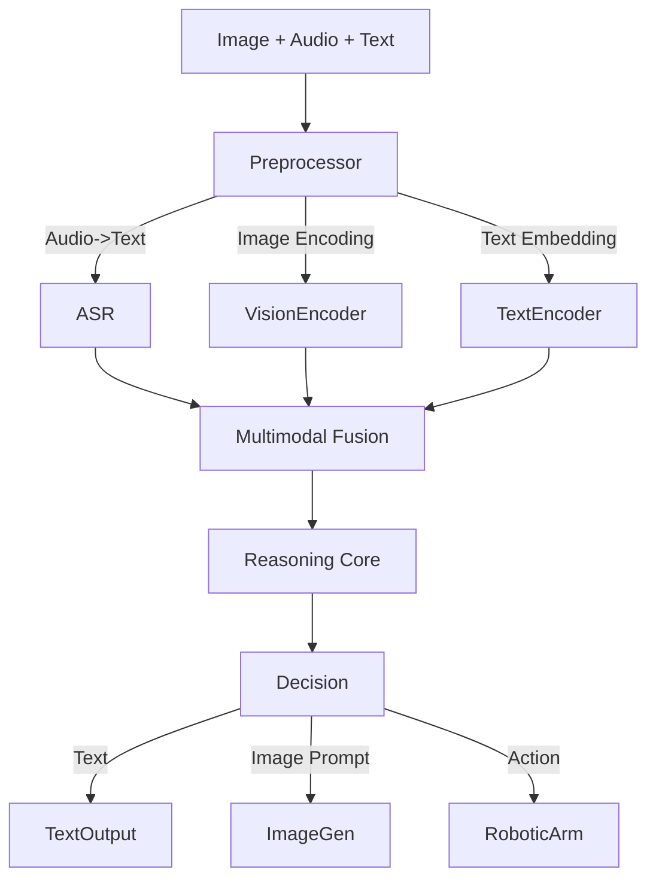

## 4.6 多模态感知与行动

世界不仅仅由文字组成。人类通过眼睛（视觉）、耳朵（听觉）感知世界，通过绘画、语音表达观点。
**多模态 Agent (Multimodal Agent)** 突破了纯文本的限制，能够理解图像、处理音频、观看视频，并生成丰富多彩的内容。

本节探讨 LMM (Large Multimodal Model) 如何让 Agent 获得"五官"。

### 4.6.1 视觉感知

#### GPT-4V 与 Claude 3

现代前沿模型（如 GPT-4o, Claude 3.5 Sonnet, Gemini 1.5 Pro）都原生具备了极强的视觉能力。它们不再是将图片转成文字描述，而是直接**理解**像素。

- **Prompting with Images**:
  你可以把多张图片作为 Prompt 的一部分发给模型。
  ```python
  messages = [
      {"role": "user", "content": [
          {"type": "text", "text": "比较这两张财报图表，哪家公司的增长更健康？"},
          {"type": "image_url", "image_url": {"url": "https://.../report_a.png"}},
          {"type": "image_url", "image_url": {"url": "https://.../report_b.png"}}
      ]}
  ]
  ```

#### 典型应用场景

1.  **UI 自动化 (App Agent)**:
    - Agent 像人一样"看"手机屏幕。它不需要读取 XML 源码，直接通过截图识别 "登录" 按钮的坐标，然后点击。
    - **Tencent AppAgent** 就是这方面的代表作。

2.  **文档智能**:
    - 传统的 OCR 只能提取文字。多模态 Agent 可以理解文档的**布局 (Layout)**。
    - 能够读懂复杂的流程图、发票表格甚至手写笔记。

3.  **视频理解**:
    - 将视频抽帧，作为图像序列输入给 LLM。
    - Agent 可以回答："视频第 35 秒那个穿红衣服的人手里拿的是什么？"

### 4.6.2 图像生成与编辑

除了看，Agent 还能画。通常通过调用扩散模型（Diffusion Models）的工具来实现。

#### DALL-E 3 与 Stable Diffusion

Agent 不直接画图，而是充当 **Prompt Engineer**。

**工作流**：
1. 用户："我想设计一个中秋节的活动海报。"
2. Agent (Thinking): 用户需要节日氛围，中秋节元素包括月亮、兔子、月饼。
3. Agent (Tool Call): `generate_image(prompt="A festive poster for Mid-Autumn Festival, giant full moon background, jade rabbit style, vector art, flat design")`
4. Tool: 返回图片 URL。
5. Agent: "这是为你设计的海报..."

#### 图像编辑工具

更高级的 Agent 能够修改图片。
- **In-painting**: "把图里这只狗换成猫"。
- **Out-painting**: "把这张图向左右延伸，画出背景"。

### 4.6.3 语音交互

未来的 Agent 交互将是 **Voice-First** 的。

#### ASR 语音转文字
- **Whisper**: OpenAI 的 Whisper 模型是目前的工业标准。它能处理多种语言、口音甚至背景噪音。
- 用于将用户的语音指令转化为 Text，输入给 LLM。

#### TTS 文字转语音
- **ElevenLabs / OpenAI TTS**: 生成极其逼真的、带有情感的人声。
- Agent 可以根据语境选择语气："悲伤地道歉" 或 "兴奋地通知"。

#### 实时语音
- GPT-4o 展示了端到端的语音处理能力。跳过了 `Audio -> Text -> LLM -> Text -> Audio` 的漫长转化。
- 模型直接听懂声波中的**情绪**（是否在生气？是否在喘气？），并以毫秒级延迟回应。这让 AI 客服不再像机器人。

### 4.6.4 多模态 Agent 架构设计

在设计多模态 Agent 时，核心挑战是**模态对齐 (Modality Alignment)**。



### 4.6.5 小结

多模态不是锦上添花，而是 Agent 走向物理世界的必经之路。
- **Vision** 让 Agent 能看懂屏幕和摄像头。
- **Audio** 让 Agent 能听懂指令和情绪。
- **Action** 让 Agent 能操作鼠标或机械臂。

当这些感官被打通，我们也就迎来了真正的**具身智能 (Embodied AI)** 时代。

下一章我们将进入实战，学习如何让 Agent 像人类一样协作。

---

**下一节**: [本章小结](summary.md)