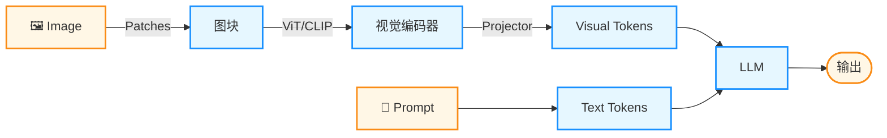
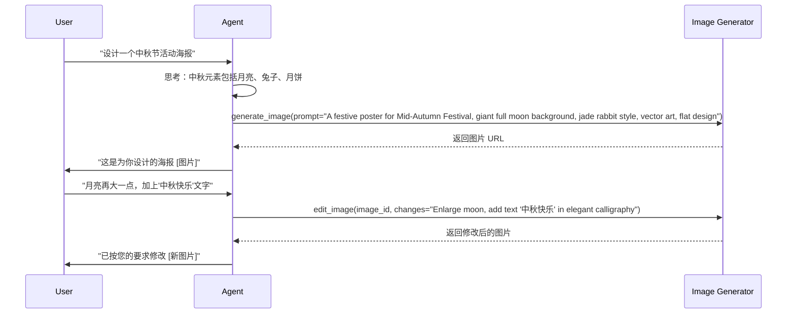
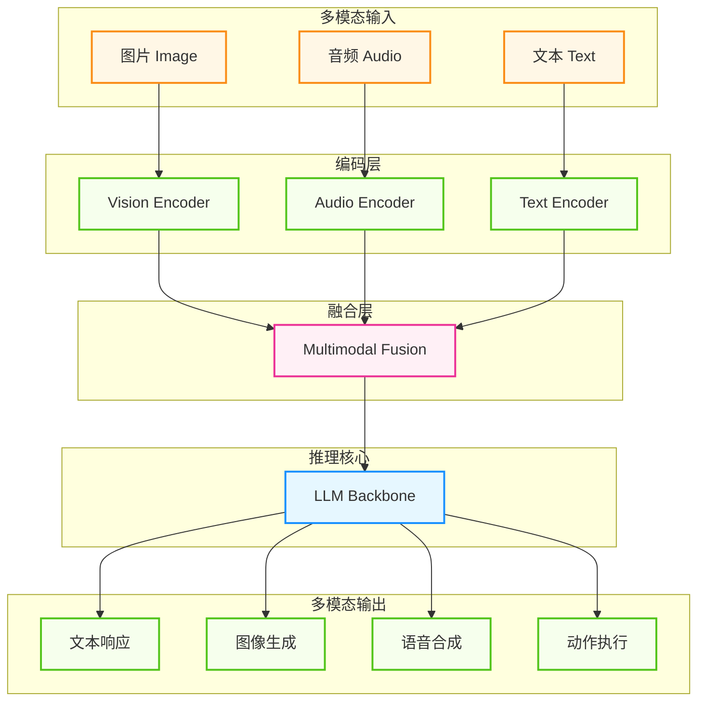

## 4.6 多模态能力

世界不仅仅由文字组成。人类通过眼睛（视觉）、耳朵（听觉）感知世界，通过绘画、语音表达观点。**多模态智能体（Multimodal Agent）** 突破了纯文本的限制，能够理解图像、处理音频、观看视频，并生成丰富多彩的内容。

本节探讨 LMM（Large Multimodal Model）如何让智能体获得“五官”，以及如何构建能够看、听、说、画的全能智能体。

### 4.6.1 视觉智能

视觉是人类获取信息最主要的渠道。赋予智能体视觉感知能力，使其能够像人类一样“看”懂屏幕和物理世界，是迈向通用人工智能的重要一步。

#### 视觉感知

不少多模态模型都具备较强的视觉理解能力。它们不再是将图片转成文字描述，而是直接 **理解** 像素。**图像提示（Prompting with Images）**：

通过将图像以 Base64 编码形式与文本一起发送给模型，智能体可以“看”并理解图像内容：

```python
import base64

client = Client(model="<MODEL>")
with open("report.png", "rb") as f:
    image_b64 = base64.b64encode(f.read()).decode()

response = client.generate(input=[
    {"type": "image", "data": image_b64},
    {"type": "text", "text": "分析这张财报，指出三个关键趋势"}
])
```

**多图对比分析**：

在同一请求中发送多张图像，让模型进行对比分析：

```python
messages = [{
    "role": "user",
    "content": [
        {"type": "text", "text": "比较这两张财报图表，哪家公司的增长更健康？"},
        {"type": "image", "source": {"type": "base64", "data": report_a_b64}},
        {"type": "image", "source": {"type": "base64", "data": report_b_b64}}
    ]
}]
```

**技术原理：LMM 如何“看见”？** LMM 将图像转化为“视觉 Tokens”：视觉编码器（CLIP/ViT）将图像分块提取特征，投影层映射到 LLM 空间，LLM 将其与文本 Token 并联处理。


```mermaid
graph LR
    classDef agent fill:#e6f7ff,stroke:#1890ff,stroke-width:2px;
    classDef tool fill:#f6ffed,stroke:#52c41a,stroke-width:2px;
    classDef user fill:#fff7e6,stroke:#fa8c16,stroke-width:2px;

    Img["🖼 Image"] -->|Patches| P["图块"]
    P -->|ViT/CLIP| Enc["视觉编码器"]
    Enc -->|Projector| Tok["Visual Tokens"]
    Txt["📝 Prompt"] --> TTok["Text Tokens"]
    Tok & TTok --> LLM["LLM"]
    LLM --> Out(["输出"])

    class Img,Txt user;
    class P,Enc,Tok,TTok agent;
    class LLM agent;
    class Out user;
```

图 4-11：LMM 视觉处理架构

#### 视觉行动

除了“看”，智能体还可以通过视觉与设备交互。通过截屏→识别元素→计算坐标→执行触摸的循环实现自动化操作。详见 [第 4.5 节](4.5_browser.md)。

以下是 GUI 智能体的“观察-思考-行动”循环实现：

```python
class VisualGUIAgent:
    """通用的视觉 GUI 智能体：观察→思考→行动"""

    def run_task(self, goal: str):
        history = []
        while not self.is_done():
            # 1. 观察：屏幕截图 + 布局信息
            screenshot, xml_dump = self.env.observe()

            # 2. 思考：LMM 决策下一步动作
            action = self.lmm.predict(
                image=screenshot, layout=xml_dump,
                instruction=goal, history=history
            )

            # 3. 行动：执行操作
            self.env.step(action)
            history.append((screenshot, action))
            time.sleep(1.0)
```

**技术原理：视觉定位 (Visual Grounding)** 核心难点是输出精确的 `(x, y)` 像素坐标。主流方案是**标号集（Set-of-Marks, SoM）**：先用检测模型（SAM/IconDet）识别所有可交互元素并编号（1,2,3...），LMM 只需输出“点击标号 5”，脚本再映射回实际坐标。这将复杂的坐标回归简化为多项选择，大幅提高准确率。

**这一能力的典型应用场景**：

| 场景 | 描述 | 技术实现 |
|------|------|---------|
| **UI 自动化** | 像人一样操纵软件 | 截图 → 识别元素 → 点击坐标 |
| **文档智能** | 理解文档的布局和结构 | 图像输入 → 提取表格/流程图 |
| **视频理解** | 回答关于视频内容的问题 | 抽帧 → 图像序列分析 |
| **代码审查** | 分析架构图和流程图 | 图像理解 → 代码建议 |

#### GUI 智能体的失败模式与安全护栏

尽管 GUI 智能体展现出了强大的潜力，但在实际工程落地中，让 AI 直接接管鼠标和键盘伴随着极大的不确定性与风险。

**常见失败模式 (Failure Modes)**：
1. **定位偏移 (Grounding Offset)**：模型正确理解了意图，但输出的点击坐标偏离了目标元素几像素，导致点击了旁边的广告或关闭按钮。
2. **状态误判 (State Misjudgment)**：界面加载缓慢或出现弹窗遮挡时，智能体依然按照预期状态点击，导致操作完全错位（例如在加载动画上反复点击）。
3. **严重破坏性后果 (Irreversible Actions)**：如误删文件、发送乱码邮件等。由于模型缺乏现实常识，它很难感知点击 “Delete” 或 “Send” 按钮的严重性后果。

**必备安全护栏 (Safety Guardrails)**：
- **硬编码黑/白名单**：在环境控制层拦截对系统关键区域或危险应用的访问（例如禁止焦点切入终端、系统设置、网银页面）。
- **敏感操作人工确认 (HITL)**：涉及支付、删除、发送等破坏性操作时，环境必须挂起执行并通知人类二次授权（Human-in-the-loop）。
- **动作频控与熔断**：限制智能体每分钟的最大动作数量、连续异常重试次数，防止失控后的无底线重试或循环点击。
- **DOM / API 优先**：如果仅需获取信息或执行确定性修改，在有后门 API 或 DOM 树可用的情况下，尽量不要使用纯视觉机械点击的黑盒方案。

### 4.6.2 听觉与语音交互

未来的智能体交互将是 **语音优先（Voice-First）** 的。让智能体能听、能说，并理解语气及情绪。


语音处理有两种主要架构：传统的 ASR→LLM→TTS 流水线，和新型的端到端语音模型。

**技术原理：音频也是 Token** 端到端模型将音频离散化为 Audio Tokens（VQ-VAE/SoundStream），1 秒语音约 25-50 个 Token ID。LLM 像处理文本 Token 一样直接预测音频 Token，实现端到端语音生成。

| 方案 | ASR→LLM→TTS | 端到端模型 |
|------|-------------|----------|
| 延迟 | 高（三次转换） | 低 |
| 情绪感知 | 仅文字 | 语音表现力 |
| 自然度 | 机械 | 接近真人 |

**自动语音识别 (Automatic Speech Recognition, ASR)**

业界常见做法是使用语音识别（ASR）模型进行转写，并尽可能保留时间戳与分段信息：

```python
asr = ASRModel(name="<ASR_MODEL>")
result = asr.transcribe(
    "meeting_recording.mp3",
    language="zh"
)
for segment in result.segments:
    print(f"[{segment.start:.1f}s - {segment.end:.1f}s] {segment.text}")
```

**语音合成 (Text-to-Speech, TTS)**

现代 TTS 系统支持多种音色、情绪控制和语调调整：

```python
tts = TTSModel(name="<TTS_MODEL>")
audio = tts.synthesize(
    text="非常抱歉给您带来不便...",
    voice="<VOICE>",
    style={"stability": 0.3, "similarity_boost": 0.5}
)
tts.save(audio, "apology.mp3")
```


### 4.6.3 图像生成与编辑

除了看和听，智能体还能像艺术家一样创作。常见实现既包括扩散模型，也包括原生多模态图像模型，或两者结合的系统。对智能体工程而言，更重要的是把“生成 / 编辑 / 局部重绘”封装为稳定工具，而不是预设后端一定是 diffusion-only。

#### 图像生成工作流

智能体不直接逐像素作画，而是充当 **创意导演 / 编辑器**，通过工具调用控制生成或编辑模型：


```mermaid
sequenceDiagram
    participant U as User
    participant A as Agent
    participant G as Image Generator

    U->>A: "设计一个中秋节活动海报"
    A->>A: 思考：中秋元素包括月亮、兔子、月饼
    A->>G: generate_image(prompt="A festive poster for Mid-Autumn Festival, giant full moon background, jade rabbit style, vector art, flat design")
    G-->>A: 返回图片 URL
    A->>U: "这是为你设计的海报 [图片]"
    U->>A: "月亮再大一点，加上'中秋快乐'文字"
    A->>G: edit_image(image_id, changes="Enlarge moon, add text '中秋快乐' in elegant calligraphy")
    G-->>A: 返回修改后的图片
    A->>U: "已按您的要求修改 [新图片]"
```

图 4-12：图像生成与编辑工作流

#### 工具定义

| 工具 | 参数 | 示例 |
|------|------|------|
| **generate_image** | prompt(str), style(enum) | “生成中秋节海报” |
| **edit_image** | image_url, mask_description, edit_prompt | “把这只狗换成猫” |
| **inpaint** | image, mask, description | 替换图像特定区域 |
| **outpaint** | image, direction | “向左右延伸图像” |
| **style_transfer** | image, target_style | “转换为油画风格” |

### 4.6.4 多模态架构与实战

在设计多模态智能体时，核心挑战是 **模态对齐（Modality Alignment）**。

#### 架构设计

多模态智能体包括输入编码、融合层、推理核心和多模态输出：


```mermaid
graph TD
    %% Agentic Design System
    classDef agent fill:#e6f7ff,stroke:#1890ff,stroke-width:2px;
    classDef tool fill:#f6ffed,stroke:#52c41a,stroke-width:2px;
    classDef user fill:#fff7e6,stroke:#fa8c16,stroke-width:2px;
    classDef memory fill:#fff0f6,stroke:#eb2f96,stroke-width:2px;

    subgraph Input["多模态输入"]
        direction LR
        I1[图片 Image]
        I2[音频 Audio]
        I3[文本 Text]
    end

    subgraph Encode["编码层"]
        direction LR
        E1[Vision Encoder]
        E2[Audio Encoder]
        E3[Text Encoder]
    end

    subgraph Fusion["融合层"]
        F[Multimodal Fusion]
    end

    subgraph Core["推理核心"]
        C[LLM Backbone]
    end

    subgraph Output["多模态输出"]
        direction LR
        O1[文本响应]
        O2[图像生成]
        O3[语音合成]
        O4[动作执行]
    end

    I1 --> E1
    I2 --> E2
    I3 --> E3

    E1 & E2 & E3 --> F
    F --> C

    C --> O1
    C --> O2
    C --> O3
    C --> O4

    class I1,I2,I3 user;
    class E1,E2,E3 tool;
    class F memory;
    class C agent;
    class O1,O2,O3,O4 tool;
```

图 4-13：多模态智能体架构

| 策略 | 描述 | 适用场景 |
|------|------|---------|
| **早期融合** | 在编码层合并所有模态 | 紧密相关的多模态任务 |
| **晚期融合** | 各模态独立处理后合并 | 松散关联的任务 |
| **统一词表** | 所有模态映射到同一空间 | 端到端生成任务 |

#### 实战：构建多模态客服智能体

以下示例展示了一个完整的多模态客服智能体实现，它能够处理语音、图像和文本输入，并根据用户情绪调整回复语气：

```python
class MultimodalCustomerService:
    """多模态客服智能体"""

    async def handle_request(self, request: MultimodalRequest):
        context = []

        # 处理语音：转录 + 情绪识别
        if request.audio:
            text = await self.asr.transcribe(request.audio)
            emotion = await self.asr.detect_emotion(request.audio)
            context.append({"type": "text", "content": text})
            context.append({"type": "emotion", "content": emotion})

        # 处理图像
        if request.images:
            for img in request.images:
                analysis = await self.vision_model.analyze(img)
                context.append({"type": "image_analysis", "content": analysis})

        # LLM 推理
        response = await self.llm.generate(
            system="你是友好的客服助手", context=context
        )

        # 多模态响应
        result = MultimodalResponse(text=response.text)
        if response.should_show_image:
            result.image = await self.generate_illustration(response.image_prompt)
        if request.prefers_audio:
            voice_style = {"angry": {"stability": 0.5, "speed": 0.9},
                          "happy": {"stability": 0.3, "speed": 1.1}}.get(emotion)
            result.audio = await self.tts.speak(response.text, style=voice_style)
        return result
```

### 4.6.5 长上下文能力

多模态智能体的另一个关键维度是 **上下文窗口（Context Window）** 的扩展。2026 年，主流模型已支持 200K 乃至 1M+ tokens 的上下文窗口，这意味着智能体可以一次性接收大量材料（书稿、长文档集、代码库等），而不再受限于片段化处理。

#### 长上下文 vs 传统上下文

| 维度 | 传统模型（4K-128K） | 1M+ tokens 模型 |
|------|---------------------|-----------------|
| 单次对话 | 10-20 轮 | 数百轮 |
| 文档分析 | 最多 10-50 页 | 更长文档或多文档联合分析 |
| 代码库分析 | 单个文件 | 大型项目中的关键文件集或较完整仓库切片 |
| 信息保持 | 前面信息逐渐“遗忘” | 具备更强的长程引用能力，但仍需检索与验证 |

#### 典型应用场景

长上下文在以下场景中展现价值：

- **代码库分析**：全代码库安全审计、架构分析或重构建议
- **知识库问答**：跨多个文档的综合分析和交叉引用
- **文档处理**：整个项目文档的关联分析
- **长文本理解**：完整书籍或长篇论文的分析

#### 成本优化策略

长上下文虽然强大，但使用整个上下文可能成本高昂。推荐采用 **渐进式策略**：先用向量搜索缩小范围，不够再逐步扩展。详细的长上下文管理策略请参考 [第 3 章 记忆与上下文](../03_memory/3.6_context_engineering.md)。

```python
from anthropic import Anthropic

# 渐进式上下文管理示例
client = Anthropic()
model = "claude-sonnet-4-6"

# 第 1 步：用向量搜索找最相关文档（低成本）
relevant_docs = vector_search(query, top_k=5)

# 第 2 步：如果不足，扩展到更多文档
if insufficient_info(response):
    relevant_docs = vector_search(query, top_k=15)

# 第 3 步：仍不够时，加载完整上下文
if still_insufficient(response):
    relevant_docs = load_full_context()

response = client.messages.create(
    model=model,
    max_tokens=4096,
    messages=[{"role": "user", "content": prepare_context(relevant_docs, query)}]
)
```

这种策略在大多数情况下可将成本降低 80% 以上——只有少数复杂问题才需要加载完整上下文。

---

**下一节**: [4.7 智能体交互体验：人机交互接口](4.7_agentic_ux.md)
