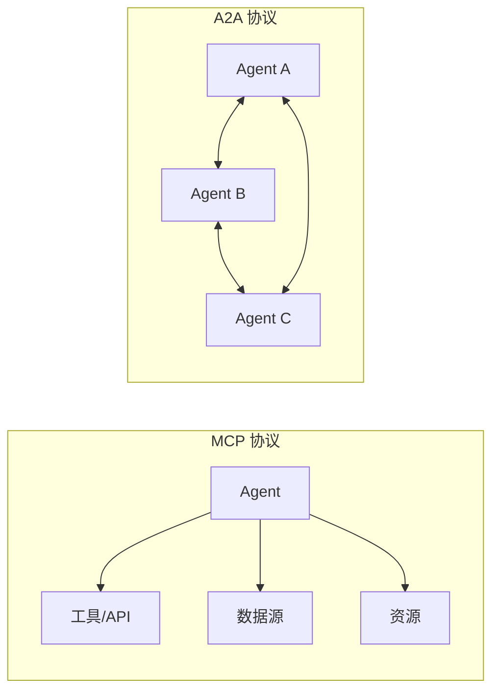
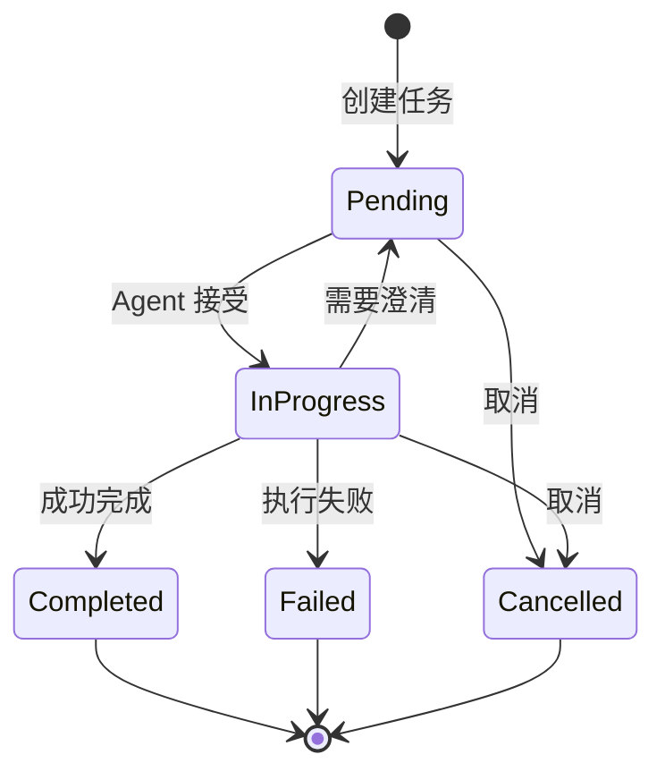

## 4.7 A2A：Agent-to-Agent 协议

如果说 MCP 是 Agent 与工具/数据源的"USB 接口"，那么 **A2A (Agent-to-Agent Protocol)** 就是 Agent 与 Agent 之间的"互联网协议"。这两个标准共同构成了 Agentic AI 时代的基础设施层。

> [!IMPORTANT]
> **里程碑**：2025年4月，Google 联合 50+ 技术合作伙伴（包括 Atlassian、Salesforce、SAP、LangChain 等）发布 A2A 协议。同年 12 月，A2A 与 MCP 一起捐赠给 Linux Foundation 的 Agentic AI Foundation (AAIF)。

### 4.7.1 为什么需要 A2A

#### 多 Agent 协作的挑战

随着 Agent 系统的成熟，企业开始部署来自不同厂商的多个 Agent：

```
企业 AI 部署现状：
├── HR Agent (来自 Workday)
├── Sales Agent (来自 Salesforce)  
├── IT Support Agent (来自 ServiceNow)
├── Finance Agent (来自 SAP)
└── 自研 Agent (内部开发)

问题：这些 Agent 如何互相协作？
```

**没有 A2A 的世界**：
- 每对 Agent 需要定制集成
- N 个 Agent 需要 N(N-1)/2 个集成接口
- 供应商锁定严重
- 跨平台协作几乎不可能

### 4.7.2 A2A 协议概览

A2A 定义了一套开放标准，让任何符合协议的 Agent 可以：
1. **发现**：找到能够帮助完成任务的其他 Agent
2. **通信**：以标准化方式交换消息
3. **协作**：委托任务、共享上下文、协调行动

#### A2A vs MCP



| 维度 | MCP | A2A |
|------|-----|-----|
| 连接对象 | Agent ↔ 工具/数据 | Agent ↔ Agent |
| 协议目的 | 获取能力 | 协作完成任务 |
| 交互模式 | 客户端-服务器 | 对等通信 |
| 核心概念 | Resources, Tools, Prompts | Agent Cards, Tasks |
| 典型场景 | 查询数据库、调用 API | 跨部门/跨平台协作 |

**互补关系**：
- **MCP**：Agent 如何使用工具和访问数据
- **A2A**：Agent 如何与其他 Agent 协作

### 4.7.3 核心概念

#### Agent Card（智能体名片）

每个符合 A2A 协议的 Agent 必须发布一个 **Agent Card**——描述自己身份和能力的 JSON 文档。

```json
{
  "name": "HR Assistant",
  "description": "处理员工入职、离职、请假等人力资源事务",
  "version": "1.0.0",
  "provider": {
    "name": "Workday",
    "url": "https://workday.com"
  },
  "capabilities": [
    {
      "name": "onboard_employee",
      "description": "处理新员工入职流程",
      "input_schema": {
        "type": "object",
        "properties": {
          "employee_name": {"type": "string"},
          "department": {"type": "string"},
          "start_date": {"type": "string", "format": "date"}
        },
        "required": ["employee_name", "department", "start_date"]
      }
    },
    {
      "name": "process_leave_request",
      "description": "处理员工请假申请",
      "input_schema": {...}
    }
  ],
  "authentication": {
    "type": "oauth2",
    "authorization_url": "https://api.workday.com/oauth/authorize"
  },
  "endpoint": "https://api.workday.com/a2a/v1"
}
```

**Agent Card 的作用**：
1. **能力发现**：其他 Agent 知道你能做什么
2. **接口契约**：定义输入输出格式
3. **路由决策**：中央编排器选择合适的 Agent

#### Task（任务）

A2A 中的通信以 **Task** 为核心单元：

```python
from dataclasses import dataclass
from enum import Enum
from typing import Optional, List

class TaskState(Enum):
    PENDING = "pending"        # 等待处理
    IN_PROGRESS = "in_progress"  # 处理中
    COMPLETED = "completed"    # 已完成
    FAILED = "failed"          # 失败
    CANCELLED = "cancelled"    # 已取消

@dataclass
class Task:
    id: str
    name: str
    description: str
    
    # 任务来源
    client_agent: str  # 发起请求的 Agent
    remote_agent: str  # 执行任务的 Agent
    
    # 输入输出
    input_data: dict
    output_data: Optional[dict] = None
    
    # 状态管理
    state: TaskState = TaskState.PENDING
    created_at: str
    updated_at: str
    
    # 上下文共享
    shared_context: Optional[dict] = None
    conversation_history: Optional[List[dict]] = None
```

#### Task 生命周期



### 4.7.4 协议实现

#### 技术栈

A2A 构建于成熟的 Web 标准之上：

| 层级 | 技术选择 |
|------|---------|
| 传输层 | HTTP/HTTPS |
| 消息格式 | JSON-RPC 2.0 |
| 实时更新 | Server-Sent Events (SSE) |
| 长任务通知 | Webhooks / Push |
| 认证授权 | OAuth 2.0 |

#### 客户端实现示例

```python
import httpx
from typing import Optional

class A2AClient:
    """A2A 协议客户端"""
    
    def __init__(self, agent_card_url: str):
        self.agent_card = self._fetch_agent_card(agent_card_url)
        self.endpoint = self.agent_card["endpoint"]
    
    def _fetch_agent_card(self, url: str) -> dict:
        """获取目标 Agent 的 Agent Card"""
        response = httpx.get(f"{url}/.well-known/agent.json")
        return response.json()
    
    async def create_task(
        self,
        capability: str,
        input_data: dict,
        context: Optional[dict] = None
    ) -> dict:
        """向远程 Agent 发起任务请求"""
        
        request = {
            "jsonrpc": "2.0",
            "method": "tasks/create",
            "params": {
                "capability": capability,
                "input": input_data,
                "context": context
            },
            "id": str(uuid.uuid4())
        }
        
        async with httpx.AsyncClient() as client:
            response = await client.post(
                f"{self.endpoint}/rpc",
                json=request,
                headers=self._get_auth_headers()
            )
            return response.json()
    
    async def get_task_status(self, task_id: str) -> dict:
        """查询任务状态"""
        request = {
            "jsonrpc": "2.0",
            "method": "tasks/get",
            "params": {"task_id": task_id},
            "id": str(uuid.uuid4())
        }
        
        async with httpx.AsyncClient() as client:
            response = await client.post(
                f"{self.endpoint}/rpc",
                json=request
            )
            return response.json()
    
    async def stream_task_updates(self, task_id: str):
        """通过 SSE 流式接收任务更新"""
        async with httpx.AsyncClient() as client:
            async with client.stream(
                "GET",
                f"{self.endpoint}/tasks/{task_id}/stream"
            ) as response:
                async for line in response.aiter_lines():
                    if line.startswith("data:"):
                        yield json.loads(line[5:])
```

#### 服务端实现示例

```python
from fastapi import FastAPI, Request
from sse_starlette.sse import EventSourceResponse

app = FastAPI()

# 存储 Agent Card
AGENT_CARD = {
    "name": "IT Support Agent",
    "capabilities": [
        {
            "name": "create_ticket",
            "description": "创建 IT 支持工单"
        }
    ],
    "endpoint": "https://api.example.com/a2a"
}

@app.get("/.well-known/agent.json")
async def get_agent_card():
    """发布 Agent Card"""
    return AGENT_CARD

@app.post("/rpc")
async def handle_rpc(request: Request):
    """处理 JSON-RPC 请求"""
    body = await request.json()
    method = body.get("method")
    params = body.get("params", {})
    
    if method == "tasks/create":
        task = await create_task(params)
        return {
            "jsonrpc": "2.0",
            "result": {"task_id": task.id, "state": task.state},
            "id": body.get("id")
        }
    
    elif method == "tasks/get":
        task = await get_task(params["task_id"])
        return {
            "jsonrpc": "2.0",
            "result": task.to_dict(),
            "id": body.get("id")
        }
    
    return {"jsonrpc": "2.0", "error": {"code": -32601, "message": "Method not found"}}

@app.get("/tasks/{task_id}/stream")
async def stream_task(task_id: str):
    """SSE 流式推送任务更新"""
    async def event_generator():
        while True:
            task = await get_task(task_id)
            yield {"event": "update", "data": json.dumps(task.to_dict())}
            
            if task.state in [TaskState.COMPLETED, TaskState.FAILED]:
                break
            
            await asyncio.sleep(1)
    
    return EventSourceResponse(event_generator())
```

### 4.7.5 实战：跨 Agent 协作场景

#### 场景：员工入职自动化

```
用户请求："帮新员工张三办理入职，他下周一加入技术部"

涉及的 Agent：
├── Coordinator Agent (编排器)
├── HR Agent (Workday)
├── IT Agent (ServiceNow)
└── Facilities Agent (自研)
```

```python
class OnboardingCoordinator:
    """员工入职编排 Agent"""
    
    def __init__(self):
        self.hr_client = A2AClient("https://hr.example.com")
        self.it_client = A2AClient("https://it.example.com")
        self.facilities_client = A2AClient("https://facilities.example.com")
    
    async def onboard_employee(
        self,
        name: str,
        department: str,
        start_date: str
    ) -> dict:
        """协调多个 Agent 完成入职流程"""
        
        results = {}
        
        # 1. HR 创建员工档案
        hr_task = await self.hr_client.create_task(
            capability="onboard_employee",
            input_data={
                "employee_name": name,
                "department": department,
                "start_date": start_date
            }
        )
        results["hr"] = await self._wait_for_task(self.hr_client, hr_task["task_id"])
        
        employee_id = results["hr"]["output"]["employee_id"]
        
        # 2. IT 配置账号和设备（与 HR 结果关联）
        it_task = await self.it_client.create_task(
            capability="setup_employee_it",
            input_data={
                "employee_id": employee_id,
                "department": department
            },
            context={"hr_result": results["hr"]}  # 共享上下文
        )
        results["it"] = await self._wait_for_task(self.it_client, it_task["task_id"])
        
        # 3. 设施分配工位
        facilities_task = await self.facilities_client.create_task(
            capability="assign_workspace",
            input_data={
                "employee_id": employee_id,
                "department": department,
                "start_date": start_date
            }
        )
        results["facilities"] = await self._wait_for_task(
            self.facilities_client, 
            facilities_task["task_id"]
        )
        
        return {
            "status": "completed",
            "employee_id": employee_id,
            "email": results["it"]["output"]["email"],
            "workspace": results["facilities"]["output"]["desk_number"],
            "equipment": results["it"]["output"]["equipment_list"]
        }
```

### 4.7.6 生态系统

#### 首批合作伙伴 (50+)

| 类别 | 合作伙伴 |
|------|---------|
| 企业 SaaS | Salesforce, SAP, Workday, ServiceNow, Box |
| 开发工具 | LangChain, Cohere, MongoDB |
| 支付/金融 | PayPal, Intuit |
| 协作办公 | Atlassian |
| 云服务 | Google Cloud, AWS |

#### 相关标准

Google 还推出了 A2A 的扩展协议：

- **A2UI (Agent-to-UI)**：Agent 如何动态生成用户界面
- **AP2 (Agent Payments Protocol)**：Agent 代理支付的标准

### 4.7.7 小结

A2A 协议代表了多 Agent 系统互操作性的重大突破：

| 特性 | 描述 |
|------|------|
| **开放标准** | 由 Linux Foundation AAIF 治理，避免厂商锁定 |
| **能力发现** | Agent Card 让 Agent 自描述能力 |
| **任务导向** | 完整的 Task 生命周期管理 |
| **上下文共享** | 跨 Agent 传递必要的上下文信息 |
| **企业就绪** | OAuth 2.0 认证，企业级安全 |

**与 MCP 的协同**：
- MCP 解决 Agent 如何使用工具
- A2A 解决 Agent 如何协作
- 两者共同构成 Agentic AI 的基础设施

> [!TIP]
> **相关资源**：
> - A2A 官方规范：https://github.com/google/a2a-protocol
> - AAIF 官网：https://aaif.io
> - Agent Card 验证器：https://a2aprotocol.ai/validator

---

**下一节**: [本章小结](summary.md)
