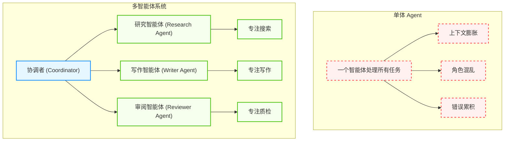
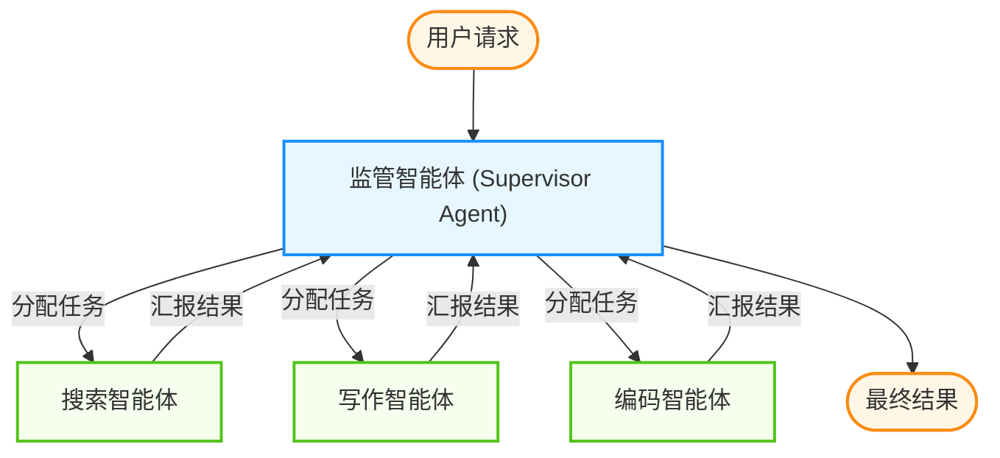

## 5.1 协作架构：层级、扁平与动态

本节将依次介绍“为什么需要多智能体”与“角色定义与身份构建”等内容。

### 5.1.1 为什么需要多智能体

正如一个人无法同时精通产品设计、后端架构、前端绘图和法律合规一样，指望单个智能体完成所有复杂任务是不现实的。**单体智能体** 面临以下瓶颈：

1. **上下文限制**：所有角色的指令都塞进一个系统提示词 (System Prompt)，会导致逻辑混乱，注意力分散
2. **幻觉风险**：缺乏检查机制，自己产生的错误自己信以为真
3. **能力专业化**：不同的任务需要不同的工具和提示词策略
4. **Token 经济性**：单一智能体处理复杂任务时，上下文膨胀导致 Token 成本激增

**多智能体系统**通过**分工**和**协作** 解决这些问题，实现"1+1>2"的涌现效果。



图 5-1：单体智能体与多智能体系统对比

### 5.1.2 角色定义与身份构建

每个智能体是一个独立的实体，拥有完整的“身份档案”：

| 属性 | 说明 | 示例 |
|------|------|------|
| **Role** | 职位定义 | “首席架构师” |
| **Goal** | 具体的 KPI | “设计可扩展的微服务架构” |
| **Backstory** | 背景故事 | “你长期从事大型系统开发，崇尚简洁可维护的代码风格” |
| **Tools** | 专属工具权限 | HR 智能体可读工资单，Coding 智能体不可 |
| **Constraints** | 行为边界 | “不得讨论竞争对手产品” |

背景故事的设计尤为重要——它能显著影响 LLM 的输出风格。一个“资深律师”背景的智能体会比“实习生”输出更谨慎、更规范的文本。

### 5.1.3 主流协作拓扑

本节将依次介绍“顺序式架构”与“层级式架构”等内容。

#### 顺序式架构

这是最简单的流水线模式，类似于传统的瀑布开发模型。

```
User → Product Manager → Tech Lead → Developer → Tester → Result
```

**工作机制**：
- 上一个智能体的 Output 直接成为下一个智能体的 Input
- 每个智能体完成其专属任务后，将结果传递给下游
- 整个流程是线性的、确定性的

**适用场景**：
- SOP 非常明确的任务
- 如“写一篇文章并翻译成三种语言”
- 静态工作流，步骤固定

**局限性**：
- 这是一个开环系统
- 如果源头（PM）的需求理解错了，后面全错
- 缺乏反馈修正机制

#### 层级式架构

引入一个 **监督者** 角色来动态分派任务。



图 5-2：层级式监督者架构

**核心角色**：
- **监管者 (Supervisor)**：大脑角色，不干具体的活。分析用户需求，决定任务路由
- **执行者 (Worker)**：执行者角色，只负责执行 Supervisor 分配的具体指令

**路由决策示例**：
```json
{
  "thought": "用户需要查询最新股价并生成分析报告",
  "next_agent": "FinanceSearchAgent",
  "args": {"ticker": "AAPL", "period": "1Y"}
}
```

**适用场景**：
- 复杂的、非线性的任务
- 需要根据中间结果动态调整下一步
- 任务优先级和资源分配需要集中控制

#### 联合协作式架构

类似于头脑风暴会议的模式，多个智能体在共享空间中自由交流。**工作机制**：
- **广播通信**：智能体 A 发言，其他所有智能体都能接收
- **轮次控制**：需要 Controller 决定发言顺序（如“CEO 发言后必须是 CTO”）
- **共识达成**：通过多轮讨论形成最终决策

**优势与风险**：
- ✅ 利用群体智慧涌现出意想不到的创意
- ✅ 模拟真实团队协作动态
- ❌ 容易跑题或陷入死循环争论
- ❌ Token 消耗较高

#### 混合智能体架构

这是一种前沿的 **模型级协作（MoA）**：一种常见思路是“多提议 + 再聚合”。

- **提议层**：多个模型/策略并行生成候选解（不同视角、不同温度或不同工具集）。
- **聚合层**：由一个聚合器对候选解做对比、去噪、融合，输出最终答案。

这种结构的价值主要在于提升稳健性与覆盖面，但会带来更高的成本与编排复杂度。

### 5.1.4 实战案例：长期自主编码

在长周期的自主编码任务里，系统常见的挑战包括：并发冲突、任务选择偏好（只挑简单的做）、上下文漂移、以及质量与速度的权衡。

一个常见的演进路径是从“扁平协作（人人平等、靠共享状态协同）”走向“分层协作（规划/执行/评审分工）”：

- **扁平模式的风险**：需要复杂的锁/协同协议；一旦异常退出或忘记释放资源，吞吐量会显著下降；同时容易出现“困难任务无人负责”。
- **分层模式的优势**：规划者只做拆解与分派，执行者专注交付，评审者负责验收与回退；执行者之间尽量隔离，从结构上降低协调成本。

> 设计要点：如果系统出现“空转”（看似忙但无交付），优先收紧角色职责与交付接口，而不是继续堆叠协调机制。

### 5.1.5 架构选型决策矩阵

| 架构类型 | 复杂度 | 延迟 | 成本 | 适用场景 |
|----------|--------|------|------|----------|
| 顺序式 | 低 | 低 | 低 | 固定流程、SOP 任务 |
| 层级式 | 中 | 中 | 中 | 动态路由、复杂决策 |
| 联合协作式 | 高 | 高 | 高 | 创意生成、头脑风暴 |
| 混合架构 | 中 | 中 | 中 | 质量优先、模型集成 |

### 5.1.6 本节小结

架构即政治。在设计智能体系统时，实际上是在设计一个人类组织的电子映射。选择 **顺序式**还是**层级式**，取决于你的业务流程是更像工厂流水线（追求效率），还是像咨询公司项目组（追求灵活）。

核心原则：

1. **专业化分工**：让每个智能体专注于其擅长的领域
2. **明确边界**：定义清晰的输入输出接口和责任范围
3. **容错机制**：设计失败处理和回退策略
4. **可观测性**：确保每个智能体的行为可追踪、可审计

---

**下一节**: [5.2 角色分工与 SOP 流程编排](5.2_roles_sop.md)
