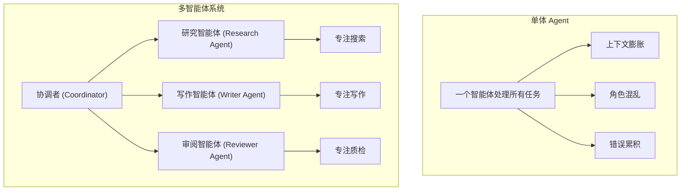
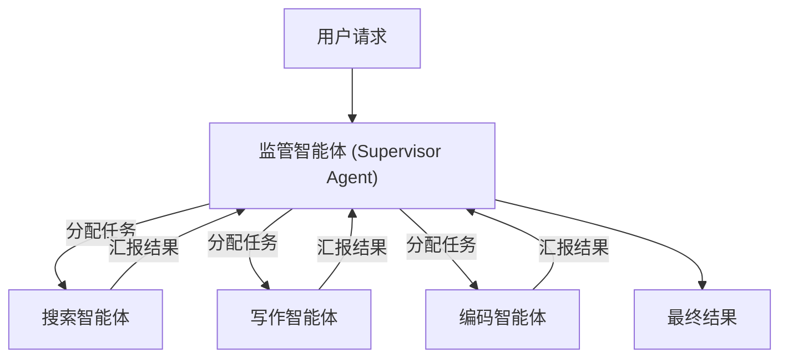
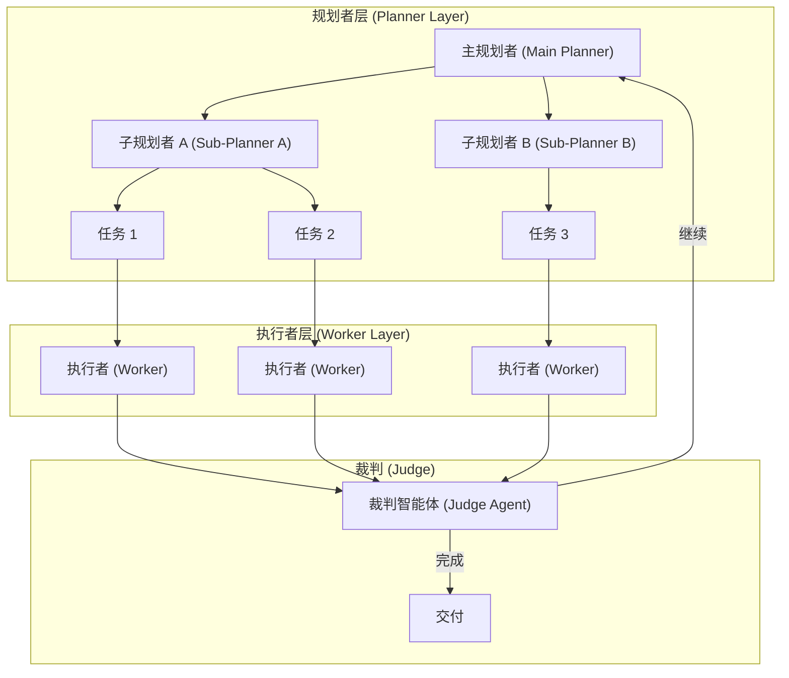

## 5.1 协作架构：层级 vs 扁平 vs 动态

### 5.1.1 为什么需要多智能体

正如一个人无法同时精通产品设计、后端架构、前端绘图和法律合规一样，指望单个智能体完成所有复杂任务是不现实的。**单体智能体（Single Agent）** 面临以下瓶颈：

7. **上下文限制**：所有角色的指令都塞进一个系统提示词 (System Prompt)，会导致逻辑混乱，注意力分散
2. **幻觉风险**：缺乏检查机制，自己产生的错误自己信以为真
3. **能力专业化**：不同的任务需要不同的工具和 Prompt 策略
10. **Token 经济性**：单一智能体处理复杂任务时，上下文膨胀导致词元 (Token) 成本激增

**多智能体系统**通过**分工**和**协作**解决这些问题，实现"1+1>2"的涌现效果。



### 5.1.2 角色定义与身份构建

每个智能体是一个独立的实体，拥有完整的"身份档案"：

| 属性 | 说明 | 示例 |
|------|------|------|
| **Role** | 职位定义 | "首席架构师" |
| **Goal** | 具体的 KPI | "设计可扩展的微服务架构" |
| **Backstory** | 背景故事 | "你曾就职于 Google，崇尚简洁的代码风格" |
| **Tools** | 专属工具权限 | HR 智能体可读工资单，Coding 智能体不可 |
| **Constraints** | 行为边界 | "不得讨论竞争对手产品" |

背景故事（Backstory）的设计尤为重要——它能显著影响 LLM 的输出风格。一个"资深律师"背景的智能体会比"实习生"输出更谨慎、更规范的文本。

### 5.1.3 主流协作拓扑结构

#### 顺序式架构

这是最简单的流水线模式，类似于传统的瀑布开发模型。

```
User → Product Manager → Tech Lead → Developer → Tester → Result
```

**工作机制**：
- 上一个智能体的 Output 直接成为下一个智能体的 Input
- 每个智能体完成其专属任务后，将结果传递给下游
- 整个流程是线性的、确定性的

**适用场景**：
- SOP（标准作业程序）非常明确的任务
- 如"写一篇文章并翻译成三种语言"
- 静态工作流，步骤固定

**局限性**：
- 这是一个开环系统
- 如果源头（PM）的需求理解错了，后面全错
- 缺乏反馈修正机制

#### 层级式架构

引入一个 **监督者（Supervisor）** 角色来动态分派任务。



**核心角色**：
- **监管者 (Supervisor)**：大脑角色，不干具体的活。分析用户需求，决定任务路由
- **执行者 (Worker)**：执行者角色，只负责执行 Supervisor 分配的具体指令

**路由决策示例**：
```json
{
  "thought": "用户需要查询最新股价并生成分析报告",
  "next_agent": "FinanceSearchAgent",
  "args": {"ticker": "AAPL", "period": "1Y"}
}
```

**适用场景**：
- 复杂的、非线性的任务
- 需要根据中间结果动态调整下一步
- 任务优先级和资源分配需要集中控制

#### 联合协作式架构

类似于头脑风暴会议或 **ChatDev** 模式，多个智能体在共享空间中自由交流。

**工作机制**：
- **广播通信**：智能体 A 发言，其他所有智能体都能接收
- **轮次控制**：需要 Controller 决定发言顺序（如"CEO 发言后必须是 CTO"）
- **共识达成**：通过多轮讨论形成最终决策

**优势与风险**：
- ✅ 利用群体智慧涌现出意想不到的创意
- ✅ 模拟真实团队协作动态
- ❌ 容易跑题或陷入死循环争论
- ❌ Token 消耗较高

#### 混合智能体架构

这是一种前沿的**模型级**协作，又称 Mixture of Agents（MoA）。

**两层结构**：
- **Layer 1（提议层）**：多个开源小模型（Llama-4, Qwen, Mistral）并行处理同一个 Prompt，生成多个不同视角的回答
- **Layer 2（聚合层）**：一个聚合模型（如 GPT-4）阅读所有回答，取长补短，合成最终答案

Together AI 的研究表明，MoA 架构能让开源模型组合达到甚至超越 GPT-4 级别的性能。

### 5.1.4 实战案例：长期自主编码的多智能体 (Agent) 协调

Cursor 团队在 2026 年初公开了他们运行数百个并发智能体、持续数周完成大型项目的经验。这是目前公开的最大规模多智能体协调实践之一，其失败教训和成功经验对设计生产级系统极具参考价值。

#### 扁平协作的失败

团队最初尝试了**点对点 (Peer-to-Peer)**模式：所有智能体地位平等，通过共享文件自协调，使用锁机制防止冲突。

```
┌─────────────────────────────────────────────────┐
│              共享协调文件                       │
│  ┌─────────┐  ┌─────────┐  ┌─────────┐         │
│  │ Agent A │  │ Agent B │  │ Agent C │  ...    │
│  │ (锁任务1)│  │ (等待锁) │  │ (等待锁) │         │
│  └─────────┘  └─────────┘  └─────────┘         │
└─────────────────────────────────────────────────┘
```

**失败原因**：

1. **锁机制成为瓶颈**：智能体持锁时间过长或忘记释放，20 个智能体的实际吞吐量降至 2-3 个
2. **系统脆弱性**：智能体可能在持锁时失败、重复获取锁、或绕过锁直接更新
3. **风险规避行为**：没有层级时，智能体倾向于选择简单安全的任务，困难问题无人负责
4. **进展停滞**：团队观察到系统长时间"空转"而无实质进展

乐观并发控制（读取自由、写入时验证状态）简化了锁问题，但无法解决深层的协调失效。

#### Planner-Worker 分层架构

团队转向**角色分离**的流水线设计：



**角色定义**：

| 角色 | 职责 | 特点 |
|------|------|------|
| **规划者 (Planner)** | 持续探索代码库，创建任务 | 可递归生成子 Planner，规划本身并行化 |
| **执行者 (Worker)** | 专注执行分配的任务 | 不与其他 Worker 协调，完成后推送更改 |
| **裁判 (Judge)** | 每轮结束时评估是否继续 | 决定下一迭代或终止 |

**关键设计**：
- Worker 之间**完全隔离**，避免协调开销
- Planner 可**递归分解**，将规划本身并行化
- 每轮结束后**全新迭代**，防止上下文漂移

#### 实战成果

| 项目 | 运行时长 | 代码规模 | 说明 |
|------|---------|---------|------|
| 从零构建浏览器 | ~1 周 | 100万行，1000文件 | 可渲染网页的完整浏览器 |
| Solid→React 迁移 | 3+ 周 | +266K/-193K 行 | Cursor 代码库的框架迁移 |
| Java LSP | 持续中 | 7.4K commits，550K 行 | 语言服务器协议实现 |
| Windows 7 模拟器 | 持续中 | 14.6K commits，120万行 | 操作系统模拟 |

#### 关键洞见

**模型选择影响长期任务**：不同模型在长期自主工作中表现差异显著。GPT-5.2 系列在遵循指令、保持专注、避免漂移方面优于某些专为编码训练的模型。团队现在为不同角色选择最适合的模型，而非使用单一模型。

**减法优于加法**：团队最初构建了"整合器"角色负责质量控制和冲突解决，但发现它反而成为瓶颈——Worker 自身已能处理大部分冲突。最佳系统往往比预期更简单。

**Prompt 的影响超过预期**：相比 harness（运行框架）和模型本身，Prompt 设计对协调效果的影响更大。让智能体协调良好、避免病态行为、长期保持专注，需要大量的 Prompt 实验。

> [!TIP]
> **设计启示**：如果你的多智能体系统出现"空转"（智能体都在工作但没有实质进展），考虑引入明确的角色层级和职责边界，而非增加更多协调机制。

### 5.1.5 架构选型决策矩阵

| 架构类型 | 复杂度 | 延迟 | 成本 | 适用场景 |
|----------|--------|------|------|----------|
| 顺序式 | 低 | 低 | 低 | 固定流程、SOP 任务 |
| 层级式 | 中 | 中 | 中 | 动态路由、复杂决策 |
| 联合协作式 | 高 | 高 | 高 | 创意生成、头脑风暴 |
| 混合架构 | 中 | 中 | 中 | 质量优先、模型集成 |

### 5.1.6 本节小结

架构即政治。在设计智能体系统时，我们实际上是在设计一个人类组织的电子映射。选择**顺序式**还是**层级式**，取决于你的业务流程是更像工厂流水线（追求效率），还是像咨询公司项目组（追求灵活）。

核心原则：
1. **专业化分工**：让每个智能体专注于其擅长的领域
2. **明确边界**：定义清晰的输入输出接口和责任范围
3. **容错机制**：设计失败处理和回退策略
4. **可观测性**：确保每个智能体的行为可追踪、可审计

---

**下一节**: [角色分工与 SOP 流程编排](5.2_roles_sop.md)