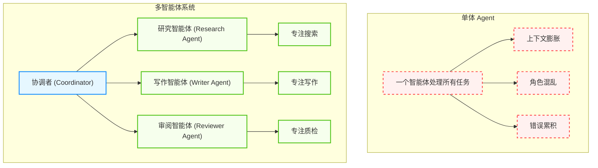
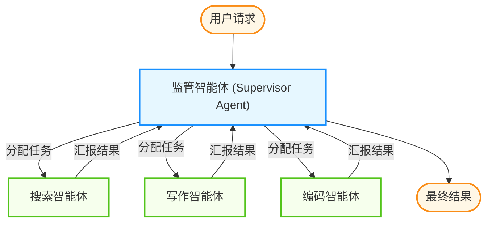

## 5.1 协作架构：层级、扁平与动态

### 5.1.1 为什么需要多智能体

正如一个人无法同时精通产品设计、后端架构、前端绘图和法律合规一样，指望单个智能体完成所有复杂任务是不现实的。**单体智能体** 面临以下瓶颈：

1. **上下文限制**：所有角色的指令都塞进一个系统提示词 (System Prompt)，会导致逻辑混乱，注意力分散
2. **幻觉风险**：缺乏检查机制，自己产生的错误自己信以为真
3. **能力专业化**：不同的任务需要不同的工具和提示词策略
4. **Token 经济性**：单一智能体处理复杂任务时，上下文膨胀导致 Token 成本激增

**多智能体系统** 通过 **分工** 和 **协作** 解决这些问题，实现“1+1>2”的涌现效果。


```mermaid
graph TD
    %% Agentic Design System
    classDef agent fill:#e6f7ff,stroke:#1890ff,stroke-width:2px;
    classDef error fill:#fff1f0,stroke:#ff4d4f,stroke-width:2px,stroke-dasharray: 5 5;
    classDef tool fill:#f6ffed,stroke:#52c41a,stroke-width:2px;

    subgraph mono["单体 Agent"]
        A["一个智能体处理所有任务"]
        A --> B["上下文膨胀"]
        A --> C["角色混乱"]
        A --> D["错误累积"]
    end

    subgraph multi["多智能体系统"]
        E["协调者 (Coordinator)"] --> F["研究智能体 (Research Agent)"]
        E --> G["写作智能体 (Writer Agent)"]
        E --> H["审阅智能体 (Reviewer Agent)"]
        F --> I["专注搜索"]
        G --> J["专注写作"]
        H --> K["专注质检"]
    end

    class A error;
    class B,C,D error;
    class E agent;
    class F,G,H tool;
    class I,J,K tool;
```

图 5-1：单体智能体与多智能体系统对比

### 5.1.2 角色定义与身份构建

每个智能体是一个独立的实体，拥有完整的“身份档案”：

| 属性 | 说明 | 示例 |
|------|------|------|
| **Role** | 职位定义 | “首席架构师” |
| **Goal** | 具体的 KPI | “设计可扩展的微服务架构” |
| **Backstory** | 背景故事 | “你长期从事大型系统开发，崇尚简洁可维护的代码风格” |
| **Tools** | 专属工具权限 | HR 智能体可读工资单，Coding 智能体不可 |
| **Constraints** | 行为边界 | “不得讨论竞争对手产品” |

背景故事的设计尤为重要——它能显著影响 LLM 的输出风格。一个“资深律师”背景的智能体会比“实习生”输出更谨慎、更规范的文本。

### 5.1.3 主流协作拓扑

#### 顺序式架构

这是最简单的流水线模式，类似于传统的瀑布开发模型。

```bash
User → Product Manager → Tech Lead → Developer → Tester → Result
```

**工作机制**：
- 上一个智能体的 Output 直接成为下一个智能体的 Input
- 每个智能体完成其专属任务后，将结果传递给下游
- 整个流程是线性的、确定性的

**适用场景**：
- SOP 非常明确的任务
- 如“写一篇文章并翻译成三种语言”
- 静态工作流，步骤固定

**局限性**：
- 这是一个开环系统
- 如果源头（PM）的需求理解错了，后面全错
- 缺乏反馈修正机制

#### 层级式架构

引入一个 **监督者** 角色来动态分派任务。


```mermaid
graph TD
    %% Agentic Design System
    classDef user fill:#fff7e6,stroke:#fa8c16,stroke-width:2px;
    classDef agent fill:#e6f7ff,stroke:#1890ff,stroke-width:2px;
    classDef tool fill:#f6ffed,stroke:#52c41a,stroke-width:2px;

    User(["用户请求"]) --> Supervisor["监管智能体 (Supervisor Agent)"]
    Supervisor -->|"分配任务"| Search["搜索智能体"]
    Supervisor -->|"分配任务"| Write["写作智能体"]
    Supervisor -->|"分配任务"| Code["编码智能体"]
    Search -->|"汇报结果"| Supervisor
    Write -->|"汇报结果"| Supervisor
    Code -->|"汇报结果"| Supervisor
    Supervisor --> Result(["最终结果"])

    class User,Result user;
    class Supervisor agent;
    class Search,Write,Code tool;
```

图 5-2：层级式监督者架构

**核心角色**：
- **监管者 (Supervisor)**：大脑角色，不干具体的活。分析用户需求，决定任务路由
- **执行者 (Worker)**：执行者角色，只负责执行 Supervisor 分配的具体指令

**路由决策示例**：
```json
{
  "thought": "用户需要查询最新股价并生成分析报告",
  "next_agent": "FinanceSearchAgent",
  "args": {"ticker": "AAPL", "period": "1Y"}
}
```

**适用场景**：
- 复杂的、非线性的任务
- 需要根据中间结果动态调整下一步
- 任务优先级和资源分配需要集中控制

#### 联合协作式架构

类似于头脑风暴会议的模式，多个智能体在共享空间中自由交流。**工作机制**：
- **广播通信**：智能体 A 发言，其他所有智能体都能接收
- **轮次控制**：需要 Controller 决定发言顺序（如“CEO 发言后必须是 CTO”）
- **共识达成**：通过多轮讨论形成最终决策

**优势与风险**：
- ✅ 利用群体智慧涌现出意想不到的创意
- ✅ 模拟真实团队协作动态
- ❌ 容易跑题或陷入死循环争论
- ❌ Token 消耗较高

#### 混合智能体架构

这是一种前沿的 **模型级协作（MoA）**：一种常见思路是“多提议 + 再聚合”。

- **提议层**：多个模型/策略并行生成候选解（不同视角、不同温度或不同工具集）。
- **聚合层**：由一个聚合器对候选解做对比、去噪、融合，输出最终答案。

这种结构的价值主要在于提升稳健性与覆盖面，但会带来更高的成本与编排复杂度。

### 5.1.4 两种最常见的工程协作模式

虽然协作拓扑很多，但在真实工程里最常见、也最值得先掌握的是两种：

#### Orchestrator-Subagent

这是当前最主流的多智能体工程模式。

- **Orchestrator**：负责理解总目标、拆解任务、分派子任务、汇总结果
- **Subagent**：只处理自己负责的子问题，不直接接管全局流程

它的优势在于：

1. 全局目标不容易漂移
2. 可以按角色做专业化分工
3. 更容易做权限控制、验收和回放

它的代价也很明确：

1. Orchestrator 容易成为瓶颈
2. 所有子任务都要经过中心节点，通信开销较高
3. 如果 Orchestrator 拆解得不好，下游再优秀也会偏题

#### 生产级案例：Anthropic Research 系统

Anthropic 在构建 Research 功能时采用了 LeadResearcher-Subagent 模式，这是 Orchestrator-Subagent 架构在复杂、开放式任务中的成熟实现范例 (《如何构建多智能体研究系统》，2025年6月)。

**架构设计**：
- **LeadResearcher**：作为编排者，负责：
  - 理解用户查询并制定研究策略
  - 将复杂查询分解为具体的子研究任务
  - 并行创建 3-10 个专门化子智能体
  - 综合子智能体返回的发现并汇总成最终答案
  - 必要时创建追加的子智能体以补充信息缺口

- **Subagent**（多个）：每个独立处理一个细分问题，例如：
  - 搜索特定领域的信息
  - 比对不同来源
  - 验证事实

**性能与成本权衡**：
- 性能提升：在复杂查询（如"列出标普 500 科技公司的所有董事会成员"）上，多智能体系统相比单一 Claude Opus 智能体性能提升 **90.2%**
- Token 成本：多智能体系统的 Token 消耗约为单轮对话的 **15 倍**，需要任务价值足够高才能合理化这种成本
- 适用范围：该架构特别适合宽度优先查询（并行探索多个方向），以及信息量超过单一上下文窗口的任务

**关键工程实践**：
1. **明确的任务分派**：Lead Agent 给每个 Subagent 详细指定目标、输出格式和工具使用指引，避免子智能体重复劳动
2. **思维链与交错思考**：Subagent 使用扩展思维和交错思考模式来评估搜索质量，自适应调整查询策略
3. **专门化角色**：除了研究子智能体，系统还配备了 **CitationAgent** 来独立处理文档解析与引文生成，确保每项声明都能追溯到源文献

#### Peer-to-Peer

这是更“去中心化”的协作方式。智能体之间处于相对平等的关系，通过协商、辩论、投票或相互审查来达成结论。

它适合：

- 需要多视角碰撞的任务
- 需要互相纠错的任务
- 更强调探索性而非确定性流程的任务

但它的工程难点也更大：

- 发言顺序和仲裁机制更难设计
- 更容易出现重复讨论和责任不清
- 观测、调试、计费都比层级式更复杂

经验上，如果你的任务属于“必须交付结果、必须可控回放、必须可审计”，优先从 **Orchestrator-Subagent** 开始；只有在确实需要多方博弈时，再引入 Peer-to-Peer 元素。

### 5.1.5 实战案例：长期自主编码

在长周期的自主编码任务里，系统常见的挑战包括：并发冲突、任务选择偏好（只挑简单的做）、上下文漂移、以及质量与速度的权衡。

一个常见的演进路径是从“扁平协作（人人平等、靠共享状态协同）”走向“分层协作（规划/执行/评审分工）”：

- **扁平模式的风险**：需要复杂的锁/协同协议；一旦异常退出或忘记释放资源，吞吐量会显著下降；同时容易出现“困难任务无人负责”。
- **分层模式的优势**：规划者只做拆解与分派，执行者专注交付，评审者负责验收与回退；执行者之间尽量隔离，从结构上降低协调成本。

> 设计要点：如果系统出现”空转”（看似忙但无交付），优先收紧角色职责与交付接口，而不是继续堆叠协调机制。


在多智能体系统中，单纯增加 Agent 数量并不必然带来能力的线性提升，反而容易引入以下系统级失败节点：

1. **协同饥饿 (Coordination Starvation)**：多个 Agent 都在等待对方的前置输出，或因为共享资源竞争导致全局死锁。
2. **目标漂移 (Goal Drift)**：在多轮接力传导中，最初的用户意图被逐层稀释或扭曲，最终交付物虽“质量高”但完全偏题。
3. **无限回文 (Infinite Ping-Pong)**：审查者 Agent 与执行者 Agent 因为 Prompt 判定标准不一致（或缺乏仲裁机制），陷入“修改-打回-修改”的死循环。
4. **责任推诿 (Buck Passing)**：由于边界定义不清，Agent 错误判断某项模糊任务是“下游的职责”而直接跳过执行。

**防范措施**：清晰的角色定义和标准化的 SOP 流程是防止这些失败模式的关键。详见 [5.2 角色分工与 SOP 流程编排](5.2_roles_sop.md)，其中通过精心设计角色职责边界、输入输出接口和终止条件，可以有效降低这些系统级风险。

### 5.1.6 架构选型决策矩阵

| 架构类型 | 复杂度 | 延迟 | 成本 | 适用场景 |
|----------|--------|------|------|----------|
| 顺序式 | 低 | 低 | 低 | 固定流程、SOP 任务 |
| 层级式 | 中 | 中 | 中 | 动态路由、复杂决策 |
| 联合协作式 | 高 | 高 | 高 | 创意生成、头脑风暴 |
| 混合架构 | 中 | 中 | 中 | 质量优先、模型集成 |

### 5.1.7 本节小结

架构即政治。在设计智能体系统时，实际上是在设计一个人类组织的电子映射。选择 **顺序式** 还是 **层级式**，取决于你的业务流程是更像工厂流水线（追求效率），还是像咨询公司项目组（追求灵活）。

核心原则：

1. **专业化分工**：让每个智能体专注于其擅长的领域
2. **明确边界**：定义清晰的输入输出接口和责任范围
3. **容错机制**：设计失败处理和回退策略
4. **可观测性**：确保每个智能体的行为可追踪、可审计

---

## 5.1.8 案例研究：Claude Code 的协调器模式

### 从单一编码智能体到编排系统

Claude Code 在独立编码场景中采用了一种革新的模式：**协调器模式（Coordinator Mode）**。它将传统的"单个大智能体处理所有任务"的思路，转变为"一个协调器（Coordinator）+ 多个工作者（Workers）"的分布式系统。这一转变打破了单体智能体的上下文、幻觉和专业化瓶颈。

### 七大工作者类型

协调器能够启动以下七种类型的工作者，各自负责不同粒度的任务：

| 代码 | 类型 | 说明 | 用例 |
|------|------|------|------|
| `b` | `local_bash` | 本地 Shell 执行 | 文件操作、编译、部署脚本 |
| `a` | `local_agent` | 本地子智能体 | 代码分析、重构、优化 |
| `r` | `remote_agent` | 远程智能体 | 调用云端 API 或其他集群智能体 |
| `t` | `in_process_teammate` | 进程内协作智能体 | 同进程内共享状态的紧耦合任务 |
| `w` | `local_workflow` | 本地工作流 | DAG 式任务编排 |
| `m` | `monitor_mcp` | MCP 监控器 | 监听工具连接、调试 MCP 问题 |
| `d` | `dream` | 后台记忆整合 | 定期触发内存整合与优化（见 3.7） |

协调器根据任务特征动态选择合适的工作者，而不是一股脑地扔给单个智能体。

### 四阶段工作流

协调器的核心工作流遵循一个经过验证的四阶段模式，充分利用并行性提升效率：

```text
研究(Research)    →  综合(Synthesis)  →  实施(Implementation)  →  验证(Verification)
   [并行]             [串行]                 [并行]                [并行]
```

#### 第 1 阶段：研究（Research）【并行】

协调器创建多个独立的 `local_agent` 工作者，并行探索问题空间：

- **静态分析工作者**：使用 `grep`/`ast parser` 扫描代码库结构
- **依赖分析工作者**：识别模块间的耦合关系
- **性能分析工作者**：收集函数调用频次、内存占用等指标
- **规范检查工作者**：验证代码风格、类型安全、安全漏洞

各工作者并行执行，充分利用 I/O 等待时间，大幅缩短总体分析周期。

#### 第 2 阶段：综合（Synthesis）【串行】

这是最关键的环节：**多个工作者的发现往往相互矛盾或重复**。

例如：
- 性能工作者报告"函数 A 调用频率最高"
- 静态分析工作者发现"函数 A 中存在未优化的循环"
- 依赖工作者指出"函数 A 被 10 个模块调用，改动风险高"

这三个观察都是真的，但优化策略各不相同。综合阶段由协调器（或指定的 `synthesis_agent`）将这些发现统一到一个连贯的执行计划中：

```text
↓ 研究发现（可能矛盾）
┌─────────────────────────┐
│ 发现 1：高调用频率       │
│ 发现 2：循环未优化       │
│ 发现 3：改动风险高       │
└─────────────────────────┘
        ↓ 综合
┌─────────────────────────┐
│  决策：优化循环，但      │
│  只改动内部实现，不改    │
│  函数签名，降低风险      │
└─────────────────────────┘
```

**为什么必须串行**？因为综合需要做出抉择（trade-off），并且抉择往往需要人类价值判断。并行处理可能导致各工作者各自为政，最终交付物东一榔头西一棒子。

#### 第 3 阶段：实施（Implementation）【并行】

基于综合的决策，协调器再次创建多个 `local_agent` 工作者，并行实施代码变更：

- **优化工作者**：改进循环逻辑
- **测试生成工作者**：为优化后的代码生成单元测试
- **文档更新工作者**：同步更新相关文档和注释

由于各工作者操作的是不同的文件/函数，并行性安全且高效。

#### 第 4 阶段：验证（Verification）【并行】

协调器触发多个验证任务：

- **单元测试工作者**：运行 `pytest`/`jest` 等测试框架
- **集成测试工作者**：验证跨模块的交互
- **性能回归工作者**：比对优化前后的性能指标
- **代码审查工作者**：使用 Linter 和自定义规则检查代码质量

所有验证可并行执行。只有都通过，才标记为"任务完成"。任何验证失败，协调器进入反馈循环，将失败报告发送回相关工作者进行修复。

### 系统提示词的核心哲学

Claude Code 的系统提示词中有一句核心设计原则：

> **"Parallelism is your superpower"**（并行是你的超能力）

这不仅是一句鼓励，而是架构的基石。协调器在每个可以并行的阶段都会主动创建工作者，而不是依次执行。这种主动的并行化策略能将总体耗时从 O(n) 缩减至 O(log n)（理想情况下）。

### Agent Swarms 与可扩展编排

Claude Code 在复杂任务场景中支持可扩展的智能体编排能力，用于启用 **Agent Swarms**（智能体群）模式。

在 Swarms 模式下：
- 不是创建 7～10 个工作者，而是可以动态创建更多细粒度的专用智能体
- 每个智能体可以自主决定是否创建下一级子智能体（形成树状编排）
- 使用更激进的并行策略，适合超大型项目或极限优化场景

但 Swarms 模式的成本更高（Token 消耗、调度开销），因此应在明确需要时谨慎启用，通常仅在超大任务中才打开。

### 跨工作者持久状态：共享临时目录

为了支持工作者间的知识传递，Claude Code 在系统中维护一个**共享临时目录**（shared scratch directory）：

```text
./.claude_workspace/
├── research_findings.md    # 研究阶段的发现汇总
├── synthesis_plan.md       # 综合阶段的决策
├── implementation_log.md   # 实施过程中的关键事件
└── verification_results.md # 验证结果和回归报告
```

每个工作者在执行完成后，都会将关键发现写入相应的文件。下一阶段的工作者启动前，会先读取这些文件，确保信息的连续性。这比通过大模型的上下文传递信息更高效、更稳定。

### 与传统多智能体架构的对比

| 维度 | Orchestrator-Subagent<br/>（通用模式） | Claude Code<br/>协调器模式 |
|------|------|------|
| 工作者数量 | 3～5 个 | 7～10 个（Swarms 可达 50+） |
| 阶段划分 | 任意 | 四阶段标准（Research → Synthesis → Implementation → Verification） |
| 并行策略 | 按需并行 | 主动并行，仅 Synthesis 串行 |
| 工作者交互 | 通过协调器消息 | 共享临时目录 + 消息 |
| 扩展性 | 中等 | 高（支持树状编排） |
| 调试复杂度 | 中 | 高（并行性带来新的不确定性） |

### 协调器的失败模式与防范

虽然协调器模式在理想场景中威力强大，但在现实中也容易陷入以下陷阱：

1. **同步点过多**：如果 Synthesis 阶段过长，反而变成全系统瓶颈
2. **工作者重复劳动**：如果 Research 阶段的工作者角色定义不清，可能都在做同一件事
3. **共享目录污染**：多个工作者同时写入共享目录，导致文件竞争和数据不一致
4. **验证瘫痪**：Verification 工作者过多，导致测试运行时间反而增加

**防范方法**：
- 明确定义每个工作者的职责范围与输出格式
- 使用文件锁（flock）或版本控制确保共享目录安全
- 限制 Verification 工作者数量，采用优先级队列
- 定期审视系统提示词，移除已经过时的工作者定义

---

**下一节**: [5.2 角色分工与 SOP 流程编排](5.2_roles_sop.md)
