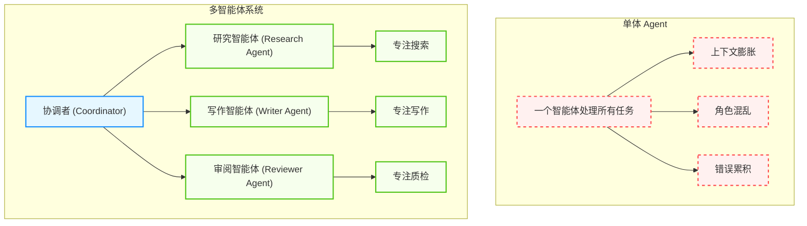

## 5.1 协作架构：层级、扁平与动态

### 5.1.1 为什么需要多智能体

正如一个人无法同时精通产品设计、后端架构、前端绘图和法律合规一样，指望单个智能体完成所有复杂任务是不现实的。**单体智能体** 面临以下瓶颈：

1. **上下文限制**：所有角色的指令都塞进一个系统提示词 (System Prompt)，会导致逻辑混乱，注意力分散
2. **幻觉风险**：缺乏检查机制，自己产生的错误自己信以为真
3. **能力专业化**：不同的任务需要不同的工具和提示词策略
4. **Token 经济性**：单一智能体处理复杂任务时，上下文膨胀导致 Token 成本激增

**多智能体系统** 通过 **分工** 和 **协作** 解决这些问题，实现“1+1>2”的涌现效果。


```mermaid
graph TD
    %% Agentic Design System
    classDef agent fill:#e6f7ff,stroke:#1890ff,stroke-width:2px;
    classDef error fill:#fff1f0,stroke:#ff4d4f,stroke-width:2px,stroke-dasharray: 5 5;
    classDef tool fill:#f6ffed,stroke:#52c41a,stroke-width:2px;

    subgraph mono["单体 Agent"]
        A["一个智能体处理所有任务"]
        A --> B["上下文膨胀"]
        A --> C["角色混乱"]
        A --> D["错误累积"]
    end

    subgraph multi["多智能体系统"]
        E["协调者 (Coordinator)"] --> F["研究智能体 (Research Agent)"]
        E --> G["写作智能体 (Writer Agent)"]
        E --> H["审阅智能体 (Reviewer Agent)"]
        F --> I["专注搜索"]
        G --> J["专注写作"]
        H --> K["专注质检"]
    end

    class A error;
    class B,C,D error;
    class E agent;
    class F,G,H tool;
    class I,J,K tool;
```

图 5-1：单体智能体与多智能体系统对比

### 5.1.2 角色定义与身份构建

每个智能体是一个独立的实体，拥有完整的“身份档案”：

| 属性 | 说明 | 示例 |
|------|------|------|
| **Role** | 职位定义 | “首席架构师” |
| **Goal** | 具体的 KPI | “设计可扩展的微服务架构” |
| **Backstory** | 背景故事 | “你长期从事大型系统开发，崇尚简洁可维护的代码风格” |
| **Tools** | 专属工具权限 | HR 智能体可读工资单，Coding 智能体不可 |
| **Constraints** | 行为边界 | “不得讨论竞争对手产品” |

背景故事的设计尤为重要——它能显著影响 LLM 的输出风格。一个“资深律师”背景的智能体会比“实习生”输出更谨慎、更规范的文本。

### 5.1.3 主流协作拓扑

#### 顺序式架构

这是最简单的流水线模式，类似于传统的瀑布开发模型。

```bash
User → Product Manager → Tech Lead → Developer → Tester → Result
```

**工作机制**：
- 上一个智能体的 Output 直接成为下一个智能体的 Input
- 每个智能体完成其专属任务后，将结果传递给下游
- 整个流程是线性的、确定性的

**适用场景**：
- SOP 非常明确的任务
- 如“写一篇文章并翻译成三种语言”
- 静态工作流，步骤固定

**局限性**：
- 这是一个开环系统
- 如果源头（PM）的需求理解错了，后面全错
- 缺乏反馈修正机制

#### 层级式架构

引入一个 **监督者** 角色来动态分派任务。


```mermaid
graph TD
    %% Agentic Design System
    classDef user fill:#fff7e6,stroke:#fa8c16,stroke-width:2px;
    classDef agent fill:#e6f7ff,stroke:#1890ff,stroke-width:2px;
    classDef tool fill:#f6ffed,stroke:#52c41a,stroke-width:2px;

    User(["用户请求"]) --> Supervisor["监管智能体 (Supervisor Agent)"]
    Supervisor -->|"分配任务"| Search["搜索智能体"]
    Supervisor -->|"分配任务"| Write["写作智能体"]
    Supervisor -->|"分配任务"| Code["编码智能体"]
    Search -->|"汇报结果"| Supervisor
    Write -->|"汇报结果"| Supervisor
    Code -->|"汇报结果"| Supervisor
    Supervisor --> Result(["最终结果"])

    class User,Result user;
    class Supervisor agent;
    class Search,Write,Code tool;
```

图 5-2：层级式监督者架构

**核心角色**：
- **监管者 (Supervisor)**：大脑角色，不干具体的活。分析用户需求，决定任务路由
- **执行者 (Worker)**：执行者角色，只负责执行 Supervisor 分配的具体指令

**路由决策示例**：
```json
{
  "thought": "用户需要查询最新股价并生成分析报告",
  "next_agent": "FinanceSearchAgent",
  "args": {"ticker": "AAPL", "period": "1Y"}
}
```

**适用场景**：
- 复杂的、非线性的任务
- 需要根据中间结果动态调整下一步
- 任务优先级和资源分配需要集中控制

#### 联合协作式架构

类似于头脑风暴会议的模式，多个智能体在共享空间中自由交流。**工作机制**：
- **广播通信**：智能体 A 发言，其他所有智能体都能接收
- **轮次控制**：需要 Controller 决定发言顺序（如“CEO 发言后必须是 CTO”）
- **共识达成**：通过多轮讨论形成最终决策

**优势与风险**：
- ✅ 利用群体智慧涌现出意想不到的创意
- ✅ 模拟真实团队协作动态
- ❌ 容易跑题或陷入死循环争论
- ❌ Token 消耗较高

#### 混合智能体架构

这是一种前沿的 **模型级协作（MoA）**：一种常见思路是“多提议 + 再聚合”。

- **提议层**：多个模型/策略并行生成候选解（不同视角、不同温度或不同工具集）。
- **聚合层**：由一个聚合器对候选解做对比、去噪、融合，输出最终答案。

这种结构的价值主要在于提升稳健性与覆盖面，但会带来更高的成本与编排复杂度。

### 5.1.4 两种最常见的工程协作模式

虽然协作拓扑很多，但在真实工程里最常见、也最值得先掌握的是两种：

#### Orchestrator-Subagent

这是当前最主流的多智能体工程模式。

- **Orchestrator**：负责理解总目标、拆解任务、分派子任务、汇总结果
- **Subagent**：只处理自己负责的子问题，不直接接管全局流程

它的优势在于：

1. 全局目标不容易漂移
2. 可以按角色做专业化分工
3. 更容易做权限控制、验收和回放

它的代价也很明确：

1. Orchestrator 容易成为瓶颈
2. 所有子任务都要经过中心节点，通信开销较高
3. 如果 Orchestrator 拆解得不好，下游再优秀也会偏题

#### 生产级案例：Anthropic Research 系统

Anthropic 在 2025 年 6 月 13 日公开的工程文章《How we built our multi-agent research system》中，介绍了其 Research 功能采用的 LeadResearcher-Subagent 模式。这是 Orchestrator-Subagent 架构在开放式研究任务中的一个公开案例。

**架构设计**：
- **LeadResearcher**：负责理解用户查询、制定研究策略、拆解子任务、综合发现，并在存在信息缺口时继续追加研究。
- **Subagent**（多个）：各自独立执行网页搜索、阅读结果、评估证据质量，再把发现返回给 LeadResearcher。
- **并行粒度**：Anthropic 公开写到，LeadResearcher 会先并行拉起 **3-5 个** subagents；配图里只画了两个，但原文明确说明数量并不固定。

**性能与成本权衡**：
- **性能提升**：在 Anthropic 的内部 research eval 中，多智能体 Research 系统相对单智能体 Claude Opus 4 提升 **90.2%**。这是该案例的内部评测结果，不应当外推成行业通用基准。
- **Token 成本**：Anthropic 同时披露，其数据里普通 agent 流程大约消耗 chat interaction 的 **4 倍** token，而 multi-agent research 大约是 **15 倍**。这说明性能收益来自更高的“推理预算”，而不是免费提升。
- **适用范围**：该架构特别适合宽度优先查询，以及信息量明显超出单一上下文窗口的任务。

**关键工程实践**：
1. **明确任务边界**：LeadResearcher 给每个 subagent 指定清晰目标，减少重复搜索和无效重叠。
2. **并行搜索 + 中心综合**：并行扩展信息覆盖面，再由中心节点统一做取舍和汇总。
3. **结果不够就继续扩展**：LeadResearcher 会根据返回结果决定是否继续增补子任务，而不是一次性固定完整流程。

#### Peer-to-Peer

这是更“去中心化”的协作方式。智能体之间处于相对平等的关系，通过协商、辩论、投票或相互审查来达成结论。

它适合：

- 需要多视角碰撞的任务
- 需要互相纠错的任务
- 更强调探索性而非确定性流程的任务

但它的工程难点也更大：

- 发言顺序和仲裁机制更难设计
- 更容易出现重复讨论和责任不清
- 观测、调试、计费都比层级式更复杂

经验上，如果你的任务属于“必须交付结果、必须可控回放、必须可审计”，优先从 **Orchestrator-Subagent** 开始；只有在确实需要多方博弈时，再引入 Peer-to-Peer 元素。

### 5.1.5 实战案例：长期自主编码

在长周期的自主编码任务里，系统常见的挑战包括：并发冲突、任务选择偏好（只挑简单的做）、上下文漂移、以及质量与速度的权衡。

一个常见的演进路径是从“扁平协作（人人平等、靠共享状态协同）”走向“分层协作（规划/执行/评审分工）”：

- **扁平模式的风险**：需要复杂的锁/协同协议；一旦异常退出或忘记释放资源，吞吐量会显著下降；同时容易出现“困难任务无人负责”。
- **分层模式的优势**：规划者只做拆解与分派，执行者专注交付，评审者负责验收与回退；执行者之间尽量隔离，从结构上降低协调成本。

> 设计要点：如果系统出现”空转”（看似忙但无交付），优先收紧角色职责与交付接口，而不是继续堆叠协调机制。


在多智能体系统中，单纯增加 Agent 数量并不必然带来能力的线性提升，反而容易引入以下系统级失败节点：

1. **协同饥饿 (Coordination Starvation)**：多个 Agent 都在等待对方的前置输出，或因为共享资源竞争导致全局死锁。
2. **目标漂移 (Goal Drift)**：在多轮接力传导中，最初的用户意图被逐层稀释或扭曲，最终交付物虽“质量高”但完全偏题。
3. **无限回文 (Infinite Ping-Pong)**：审查者 Agent 与执行者 Agent 因为 Prompt 判定标准不一致（或缺乏仲裁机制），陷入“修改-打回-修改”的死循环。
4. **责任推诿 (Buck Passing)**：由于边界定义不清，Agent 错误判断某项模糊任务是“下游的职责”而直接跳过执行。

**防范措施**：清晰的角色定义和标准化的 SOP 流程是防止这些失败模式的关键。详见 [5.2 角色分工与 SOP 流程编排](5.2_roles_sop.md)，其中通过精心设计角色职责边界、输入输出接口和终止条件，可以有效降低这些系统级风险。

### 5.1.6 架构选型决策矩阵

| 架构类型 | 复杂度 | 延迟 | 成本 | 适用场景 |
|----------|--------|------|------|----------|
| 顺序式 | 低 | 低 | 低 | 固定流程、SOP 任务 |
| 层级式 | 中 | 中 | 中 | 动态路由、复杂决策 |
| 联合协作式 | 高 | 高 | 高 | 创意生成、头脑风暴 |
| 混合架构 | 中 | 中 | 中 | 质量优先、模型集成 |

### 5.1.7 案例补充：编码场景中的协调器模式

编码任务同样常见“中心协调器 + 并行子任务”的协作方式：先把代码库分析、改动实施、验证检查拆成相对独立的子问题，再由上层节点做计划收敛与结果验收。

这里更稳妥的做法是抽象模式，而不是把某个具体产品的内部 worker 名册、swarm 上限或共享目录实现细节写成通用事实。对于公开资料不足的系统，应该只保留以下可迁移的工程原则：

1. **研究/分析阶段适合并行展开**：依赖扫描、风险识别、测试缺口分析往往可以分头进行。
2. **综合/决策阶段通常要收口**：当多个子任务结论互相冲突时，需要由协调器或人类做取舍。
3. **实施与验证可以再并行展开**：只要文件边界和验收接口清楚，编码与验证任务就能重新分片并行。
4. **可观测性比“多几个 agent”更重要**：没有清晰日志、回放和责任边界时，智能体数量越多，调试越困难。

### 5.1.8 本节小结

架构即政治。在设计智能体系统时，实际上是在设计一个人类组织的电子映射。选择 **顺序式** 还是 **层级式**，取决于你的业务流程是更像工厂流水线（追求效率），还是像咨询公司项目组（追求灵活）。

核心原则：

1. **专业化分工**：让每个智能体专注于其擅长的领域
2. **明确边界**：定义清晰的输入输出接口和责任范围
3. **容错机制**：设计失败处理和回退策略
4. **数字口径要回到具体案例**：性能提升、token 成本和并行规模都应绑定具体评测与公开来源，而不是写成放之四海而皆准的定律
5. **可观测性**：确保每个智能体的行为可追踪、可审计

---

**下一节**: [5.2 角色分工与 SOP 流程编排](5.2_roles_sop.md)
