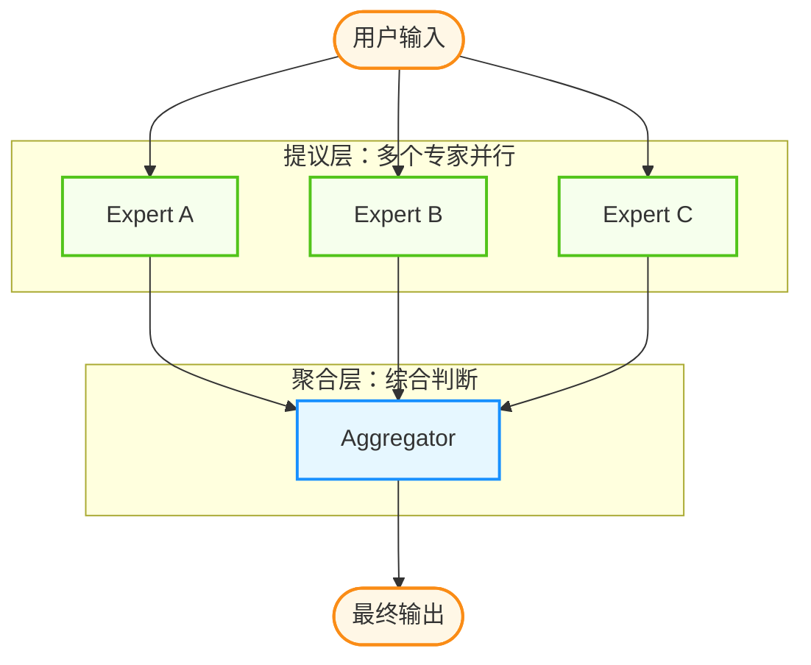

## 5.3 动态组队与自适应编排

静态的团队配置适合处理模式固定的任务，但现实世界的问题往往复杂多变。本节探讨如何让智能体根据任务需求动态组队，实现自适应的任务编排。

### 5.3.1 为什么需要动态组队

本节将依次介绍“静态编排的局限”与“动态编排的优势”等内容。

#### 静态编排的局限

传统的多智能体系统通常采用静态配置：

```python
# 静态团队配置

team = [
    ResearchAgent(),
    WriterAgent(), 
    EditorAgent()
]
```

这种方式的问题在于：

1. **资源浪费**：简单任务也要启动完整团队
2. **灵活性差**：无法应对未知类型的任务
3. **扩展困难**：添加新能力需要修改配置

#### 动态编排的优势

动态组队让系统能够根据任务特征“按需组建”团队：

```python
def assemble_team(task: Task) -> List[Agent]:
    required_skills = analyze_task_requirements(task)
    available_agents = get_agent_pool()
    return match_agents_to_skills(required_skills, available_agents)
```

### 5.3.2 任务分析与技能匹配

本节将依次介绍“任务需求分析”与“技能标签与映射”等内容。

#### 任务需求分析

第一步是理解任务需要哪些能力。这可以通过 LLM 的自然语言理解能力实现：

```python
async def analyze_task_requirements(task: str) -> List[str]:
    prompt = f"""
    分析以下任务需要哪些技能：
    任务：{task}
    
    请列出完成此任务所需的技能，每行一个：
    """
    response = await llm.generate(prompt)
    return parse_skills(response)
```

**示例分析**：

| 任务 | 识别出的技能需求 |
|------|------------------|
| “写一篇关于 AI 的技术博客” | 搜索、写作、技术理解 |
| “分析销售数据并生成报告” | 数据分析、可视化、报告撰写 |
| “用 Python 实现排序算法” | 编程、代码测试 |

#### 技能标签与映射

为了让“需求 → 团队”的匹配更稳定，建议先建立一套轻量的技能标签体系，把模糊的自然语言需求映射到有限集合的标签（例如“检索”“写作”“数据分析”“测试”“安全审查”）。这样可以：

- 降低不同任务描述导致的漂移，让匹配更可复现
- 便于统计哪些技能最常用，从而优化智能体池与成本
- 让权限与工具分配可以按标签做治理，而不是靠临时判断

### 5.3.3 智能体能力注册

每个智能体需要声明自己具备的能力：

```python
class AgentCapability:
    def __init__(
        self,
        name: str,
        skills: List[str],
        expertise_level: float,  # 0-1 的专业度评分
        cost_per_task: float     # 每任务成本估算
    ):
        self.name = name
        self.skills = skills
        self.expertise_level = expertise_level
        self.cost_per_task = cost_per_task

# 智能体能力注册表

AGENT_REGISTRY = {
    "researcher": AgentCapability(
        name="资深研究员",
        skills=["搜索", "信息整合", "文献分析"],
        expertise_level=0.9,
        cost_per_task=0.05
    ),
    "coder": AgentCapability(
        name="Python 专家",
        skills=["编程", "代码测试", "代码审查"],
        expertise_level=0.85,
        cost_per_task=0.08
    ),
    # ...

}
```

### 5.3.4 智能匹配算法

基于任务需求和智能体能力进行最优匹配：

```python
def match_agents_to_task(
    required_skills: List[str],
    agent_registry: Dict[str, AgentCapability],
    optimization_goal: str = "quality"  # quality | cost | speed
) -> List[str]:
    
    candidates = []
    for agent_id, capability in agent_registry.items():
        # 计算技能覆盖度

        coverage = len(set(required_skills) & set(capability.skills))
        coverage_ratio = coverage / len(required_skills)
        
        if coverage_ratio > 0.3:  # 至少覆盖 30% 技能
            candidates.append({
                "agent_id": agent_id,
                "coverage": coverage_ratio,
                "expertise": capability.expertise_level,
                "cost": capability.cost_per_task
            })
    
    # 根据优化目标排序

    if optimization_goal == "quality":
        candidates.sort(key=lambda x: x["expertise"], reverse=True)
    elif optimization_goal == "cost":
        candidates.sort(key=lambda x: x["cost"])
        
    return select_optimal_team(candidates, required_skills)
```

### 5.3.5 自适应编排策略

本节将依次介绍“基于规则的编排”与“基于反馈的自适应调整”等内容。

#### 基于规则的编排

最简单的方式是预定义规则：

```python
ORCHESTRATION_RULES = {
    "contains_code": ["coder", "reviewer"],
    "requires_research": ["researcher"],
    "needs_writing": ["writer", "editor"],
    "involves_data": ["analyst", "visualizer"]
}

def rule_based_orchestration(task: str) -> List[str]:
    selected_agents = []
    keywords = extract_keywords(task)
    
    for pattern, agents in ORCHESTRATION_RULES.items():
        if matches_pattern(keywords, pattern):
            selected_agents.extend(agents)
            
    return list(set(selected_agents))
```

#### 基于反馈的自适应调整

规则编排适合冷启动，但长期运行后更建议引入反馈信号进行自适应调整，例如把“成功率、平均步数、超时率、人工介入率”作为指标，周期性更新规则权重或路由阈值。常见做法包括：

- **失败驱动回退**：某类任务连续失败时，自动升级到更强角色或加入审查节点
- **成本驱动降级**：在低风险场景切换到低成本成员或减少并行提议数
- **风控阈值**：当检测到异常调用或越权倾向时，强制进入人工审批

### 5.3.6 基于 LLM 的智能编排

更灵活的方式是让 LLM 来决定团队组成：

```python
async def llm_based_orchestration(
    task: str, 
    available_agents: List[AgentCapability]
) -> List[str]:
    
    agent_descriptions = "\n".join([
        f"- {a.name}: 擅长 {', '.join(a.skills)}"
        for a in available_agents
    ])
    
    prompt = f"""
    任务：{task}
    
    可用团队成员：
    {agent_descriptions}
    
    请选择完成此任务所需的最小团队配置。
    考虑因素：任务复杂度、成员专长、协作效率
    
    返回格式：
    团队成员：[成员1, 成员2, ...]
    理由：...
    """
    
    response = await llm.generate(prompt)
    return parse_team_selection(response)
```

### 5.3.7 混合智能体架构（MoA 思路）

一种常见的前沿编排思路是“多提议 + 再聚合”（Mixture of Agents 的思想）：

- **提议层**：多个模型/策略并行生成候选解（不同视角、不同温度、不同工具权限）。
- **聚合层**：由一个聚合器对候选解做对比、去噪、融合，输出最终答案。



图 5-3：混合智能体（MoA）架构

**关键权衡**：这种结构通常能提升覆盖面与稳健性，但会增加成本与编排复杂度，且需要谨慎处理信息一致性与“以讹传讹”。

### 5.3.8 小结

动态组队和自适应编排让多智能体系统具备了应对未知和复杂任务的能力。核心要点：

- **任务分析**：理解任务需要哪些能力
- **能力注册**：每个智能体声明自己的技能和专长
- **智能匹配**：根据需求选择最优团队配置
- **自适应策略**：规则 + LLM 混合编排

下一节将探讨人机协作模式，了解何时应该让人类介入智能体的决策过程。

---

**下一节**: [5.4 人机协作](5.4_hitl.md)
