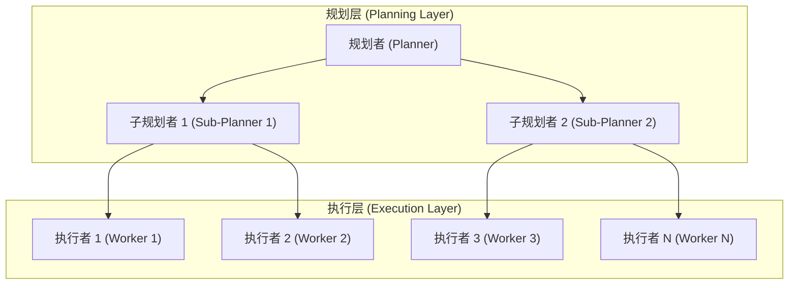

## 5.3 动态组队与自适应编排

静态的团队配置适合处理模式固定的任务，但现实世界的问题往往复杂多变。本节探讨如何让智能体根据任务需求动态组队，实现自适应的任务编排。

#### 为什么需要动态组队

### 5.3.1 静态编排的局限

传统的多智能体系统通常采用静态配置：

```python
# 静态团队配置
team = [
    ResearchAgent(),
    WriterAgent(), 
    EditorAgent()
]
```

这种方式的问题在于：

1. **资源浪费**：简单任务也要启动完整团队
2. **灵活性差**：无法应对未知类型的任务
3. **扩展困难**：添加新能力需要修改配置

#### 动态编排的优势

动态组队让系统能够根据任务特征"按需组建"团队：

```python
def assemble_team(task: Task) -> List[Agent]:
    required_skills = analyze_task_requirements(task)
    available_agents = get_agent_pool()
    return match_agents_to_skills(required_skills, available_agents)
```

### 5.3.2 任务分析与技能匹配

### 5.3.3 任务需求分析

第一步是理解任务需要哪些能力。这可以通过 LLM 的自然语言理解能力实现：

```python
async def analyze_task_requirements(task: str) -> List[str]:
    prompt = f"""
    分析以下任务需要哪些技能：
    任务：{task}
    
    请列出完成此任务所需的技能，每行一个：
    """
    response = await llm.generate(prompt)
    return parse_skills(response)
```

**示例分析**：

| 任务 | 识别出的技能需求 |
|------|------------------|
| "写一篇关于 AI 的技术博客" | 搜索、写作、技术理解 |
| "分析销售数据并生成报告" | 数据分析、可视化、报告撰写 |
| "用 Python 实现排序算法" | 编程、代码测试 |

### 5.3.4 智能体能力注册

每个智能体需要声明自己具备的能力：

```python
class AgentCapability:
    def __init__(
        self,
        name: str,
        skills: List[str],
        expertise_level: float,  # 0-1 的专业度评分
        cost_per_task: float     # 每任务成本估算
    ):
        self.name = name
        self.skills = skills
        self.expertise_level = expertise_level
        self.cost_per_task = cost_per_task

# 智能体能力注册表
AGENT_REGISTRY = {
    "researcher": AgentCapability(
        name="资深研究员",
        skills=["搜索", "信息整合", "文献分析"],
        expertise_level=0.9,
        cost_per_task=0.05
    ),
    "coder": AgentCapability(
        name="Python 专家",
        skills=["编程", "代码测试", "代码审查"],
        expertise_level=0.85,
        cost_per_task=0.08
    ),
    # ...
}
```

### 5.3.5 智能匹配算法

基于任务需求和智能体能力进行最优匹配：

```python
def match_agents_to_task(
    required_skills: List[str],
    agent_registry: Dict[str, AgentCapability],
    optimization_goal: str = "quality"  # quality | cost | speed
) -> List[str]:
    
    candidates = []
    for agent_id, capability in agent_registry.items():
        # 计算技能覆盖度
        coverage = len(set(required_skills) & set(capability.skills))
        coverage_ratio = coverage / len(required_skills)
        
        if coverage_ratio > 0.3:  # 至少覆盖 30% 技能
            candidates.append({
                "agent_id": agent_id,
                "coverage": coverage_ratio,
                "expertise": capability.expertise_level,
                "cost": capability.cost_per_task
            })
    
    # 根据优化目标排序
    if optimization_goal == "quality":
        candidates.sort(key=lambda x: x["expertise"], reverse=True)
    elif optimization_goal == "cost":
        candidates.sort(key=lambda x: x["cost"])
        
    return select_optimal_team(candidates, required_skills)
```

### 5.3.6 自适应编排策略

### 5.3.7 基于规则的编排

最简单的方式是预定义规则：

```python
ORCHESTRATION_RULES = {
    "contains_code": ["coder", "reviewer"],
    "requires_research": ["researcher"],
    "needs_writing": ["writer", "editor"],
    "involves_data": ["analyst", "visualizer"]
}

def rule_based_orchestration(task: str) -> List[str]:
    selected_agents = []
    keywords = extract_keywords(task)
    
    for pattern, agents in ORCHESTRATION_RULES.items():
        if matches_pattern(keywords, pattern):
            selected_agents.extend(agents)
            
    return list(set(selected_agents))
```

### 5.3.8 基于 LLM 的智能编排

更灵活的方式是让 LLM 来决定团队组成：

```python
async def llm_based_orchestration(
    task: str, 
    available_agents: List[AgentCapability]
) -> List[str]:
    
    agent_descriptions = "\n".join([
        f"- {a.name}: 擅长 {', '.join(a.skills)}"
        for a in available_agents
    ])
    
    prompt = f"""
    任务：{task}
    
    可用团队成员：
    {agent_descriptions}
    
    请选择完成此任务所需的最小团队配置。
    考虑因素：任务复杂度、成员专长、协作效率
    
    返回格式：
    团队成员：[成员1, 成员2, ...]
    理由：...
    """
    
    response = await llm.generate(prompt)
    return parse_team_selection(response)
```

### 5.3.9 混合智能体 (MoA) 架构

[Together AI](https://www.together.ai/blog/together-moa) 提出的 MoA 架构是动态编排的前沿实践：

```
Layer 1: 多个专家模型并行处理
┌─────────┐  ┌─────────┐  ┌─────────┐
│ Llama-3 │  │  Qwen   │  │ Mistral │
└────┬────┘  └────┬────┘  └────┬────┘
     │            │            │
     └────────────┼────────────┘
                  ↓
Layer 2: 聚合模型综合判断
            ┌─────────┐
            │ GPT-4   │
            │ 聚合器 (Aggregator) │
            └─────────┘
                  │
                  ↓
            最终输出
```

**关键优势**：

1. **多视角**：不同模型从不同角度分析问题
2. **互补性**：各模型的优势相互补充
3. **鲁棒性**：单个模型的错误可被其他模型纠正

```python
class MixtureOfAgentsOrchestrator:
    def __init__(self):
        self.layer1_models = ["llama-3-70b", "qwen-72b", "mistral-large"]
        self.aggregator = "gpt-4"
        
    async def process(self, query: str) -> str:
        # Layer 1: 并行获取多个响应
        responses = await asyncio.gather(*[
            call_model(model, query) 
            for model in self.layer1_models
        ])
        
        # Layer 2: 聚合综合
        aggregation_prompt = f"""
        问题：{query}
        
        以下是不同专家的回答：
        专家1：{responses[0]}
        专家2：{responses[1]}
        专家3：{responses[2]}
        
        请综合以上观点，给出最准确、最全面的回答。
        """
        
        return await call_model(self.aggregator, aggregation_prompt)
```

### 5.3.10 实战案例：Cursor 长期自主编码

Cursor 团队在 2026 年初分享了运行数周、协调数百个智能体、生成百万行代码的实战经验。这是目前公开的最大规模多智能体协作案例之一。

#### 从扁平到分层的演进

**阶段一：平等协调（失败）**

最初尝试让所有智能体地位平等，通过共享文件自协调：

```
智能体 1 → 检查共享状态 → 认领任务 → 更新状态
智能体 2 → 检查共享状态 → 认领任务 → 更新状态
...
问题：锁竞争、遗忘释放锁、智能体趋向保守
```

结果：20 个智能体的实际吞吐量降至 2-3 个的水平。

**阶段二：Planner-Worker 分层**

引入明确的角色分工：



- **规划者 (Planner)**：大脑角色，探索代码库、创建任务、可递归生成子 Planner
- **执行者 (Worker)**：专注于单一任务，完成后提交变更
- **裁判 (Judge)**：每个周期结束时判断是否继续

#### 真实项目数据

| 项目 | 运行时间 | 代码量 | 提交数 |
|------|---------|-------|--------|
| 从零构建浏览器 | ~1周 | 1M+ LoC | - |
| Solid→React 迁移 | 3周+ | +266K/-193K | - |
| Java LSP | 进行中 | 550K LoC | 7.4K |
| Windows 7 模拟器 | 进行中 | 1.2M LoC | 14.6K |
| Excel 实现 | 进行中 | 1.6M LoC | 12K |

> **关键发现**：尽管代码库规模庞大，新智能体仍能理解并做出有意义的贡献。数百个 Worker 可以并行工作，在同一分支上提交，冲突极少。

#### 模型选择经验

不同模型适合不同角色：

| 模型 | 适合角色 | 原因 |
|------|---------|------|
| GPT-5.2 | Planner | 更好的长期自主工作：遵循指令、保持专注、精确实现 |
| GPT-5.1-codex | Worker | 专门针对编码任务训练 |
| Opus 4.5 | 短任务 | 倾向于尽早停止、走捷径 |

> "模型选择对极长时间运行的任务很重要。GPT-5.2 在扩展自主工作方面明显更好。" — Cursor 团队

#### 简化优于复杂

最重要的改进来自**移除**而非添加：

- 初始设计：有整合者 (Integrator) 角色负责质量控制和冲突解决
- 发现问题：Integrator 成为瓶颈
- 解决方案：移除 Integrator，Worker 自行处理冲突

> \"许多改进来自于简化，来自于移除不必要的技巧，以及对模型多一点的信任。\" — Cursor 团队

**核心洞察**：

1. 提示词比架构更重要——让智能体协调良好、避免病态行为、长期保持专注需要大量实验
2. 正确的结构量在中间——太少会冲突和漂移，太多会脆弱
3. 定期从头开始对抗漂移和隧道视野

### 5.3.11 小结

动态组队和自适应编排让多智能体系统具备了应对未知和复杂任务的能力。核心要点：

- **任务分析**：理解任务需要哪些能力
- **能力注册**：每个智能体声明自己的技能和专长
- **智能匹配**：根据需求选择最优团队配置
- **自适应策略**：规则 + LLM 混合编排

下一节我们将探讨人机协作模式，了解何时应该让人类介入智能体的决策过程。

---

**下一节**: [人机协作 (Human-in-the-Loop)](5.4_hitl.md)