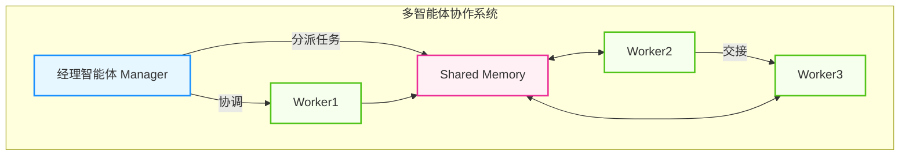

# 第五章：多智能体协作模式

俗话说："三个臭皮匠，顶个诸葛亮"。单个智能体的能力受限于模型智商和上下文窗口，而多智能体系统 (Multi-Agent Systems, MAS) 通过专业分工和协作，能够涌现出处理复杂系统的能力。本章将带你进入"AI 团队"的世界，探索不同的协作架构和组织模式。

## 章节导读

- **[5.1 协作架构：层级 vs 扁平 vs 动态](5.1_architectures.md)**
  - 就像公司有组织架构，MAS 也有不同的组织模式：**顺序式**（流水线）、**层级式**（经理指挥员工）和 **网状**（自由讨论）。本章将解析 MetaGPT 和 ChatDev 中的协作范式。

- **[5.2 角色分工与 SOP 流程编排](5.2_roles_sop.md)**
  - 每个智能体 (Agent) 都有自己的"人设"——角色定义 (Role)、目标 (Goal)、背景故事 (Backstory)。学习如何设计标准作业程序 (SOP) 来协调多个智能体的工作流程。

- **[5.3 动态组队与自适应编排](5.3_dynamic_teaming.md)**
  - 静态的团队配置无法应对复杂多变的任务。探讨如何让智能体根据任务需求动态组队，实现自适应的任务编排。

- **[5.4 人机协作 (Human-in-the-Loop)](5.4_hitl.md)**
  - 完全自主的智能体 (Agent) 并不总是最佳选择。学习如何在关键节点引入人类监督，实现人机协作的最佳平衡。

- **[本章小结](summary.md)**

## 核心概念预览

具体示例如下：

图 5-0：多智能体协作系统示意图 (Multi-Agent Collaboration System Diagram)

下一章将探讨智能体之间如何进行有效的通信，以及如何模拟真实的社会行为。

---

**下一节**: [5.1 Architectures](5.1_architectures.md)
