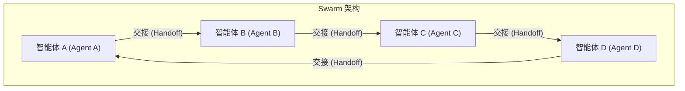
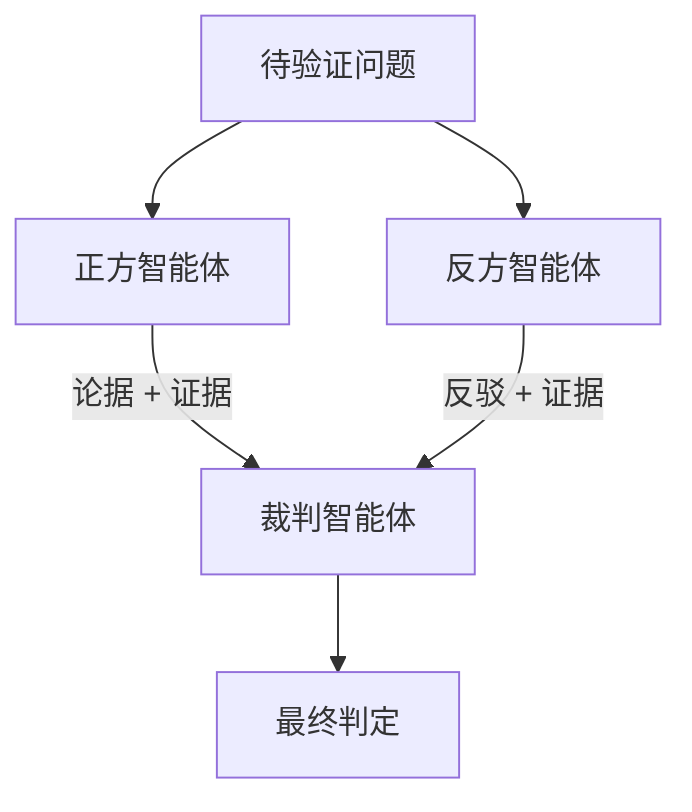

## 6.3 博弈论视角下的冲突解决

### 6.3.1 Swarm Intelligence：量变引起质变

当智能体的数量从几个增加到几百个、几千个时，我们不再关注"个体"的角色，而是关注"群体"涌现出的智能。这被称为 **群体智能（Swarm Intelligence）**。

#### 自然界的启示

自然界中的蚂蚁单体智商极低，但蚁群能建造复杂的巢穴、找到最短路径、协调数百万个体的行动。这种现象揭示了一个深刻的原理：**简单规则 + 大规模并行 = 复杂智能行为**。

鸟群飞行 (Flocking) 遵循三条简单规则：

1. **分离**：避免与邻近个体碰撞
2. **对齐**：朝向与邻近个体的平均方向飞行
3. **聚合**：保持在群体中心附近

这三条规则足以产生令人惊叹的群体飞行模式。

#### OpenAI Swarm 架构

**Swarm 架构**将这种去中心化原则应用于智能体系统：



**核心原则**：
- **无中心控制**：没有一个"总指挥"告诉每一个智能体每一步做什么
- **局部交互**：每个智能体只遵循简单的局部规则（任务交接，Handoffs），例如"如果我处理不了这个问题，就把它交给销售智能体 (Sales Agent)"
- **自组织**：通过简单的传递链，系统自动演化出解决复杂问题的路径
- **容错性强**：单个智能体失败不会导致整体崩溃

**适用场景**：
- 大规模客服中心（分流智能体 (Triage Agent) → 技术支持 (Tech Support) → 退款团队 (Refund Team)）
- 大规模数据清洗和处理
- 分布式信息采集

---

### 6.3.2 智能体博弈论

并非所有智能体都是队友。在许多商业和模拟场景中，智能体之间存在**利益冲突**。这时我们需要引入博弈论来设计激励机制和协调策略。

#### 合作博弈

**定义**：所有智能体共享同一个 **全局奖励（Global Reward）**。

**核心挑战——信用分配问题**：
- 团队赢了，是因为智能体 A 干得好，还是智能体 B 干得好？
- 如何避免"搭便车"现象？
- 如何激励每个智能体贡献最大努力？

**解决方案**：
- **夏普利值（Shapley Value）**：一种公平分配贡献的数学方法
- **个体贡献追踪**：记录每个智能体的决策和结果
- **对抗性评估**：移除某个智能体后观察团队表现变化

#### 非合作博弈

**定义**：每个智能体自私地最大化自己的 **局部奖励（Local Reward）**。

**典型场景**：

| 场景 | 智能体 A 目标 | 智能体 B 目标 | 均衡结果 |
|------|-------------|-------------|----------|
| 自动谈判 | 压低价格 | 抬高价格 | 纳什均衡价格 |
| 资源竞争 | 获取更多计算资源 | 获取更多计算资源 | 资源分配均衡 |
| 广告竞价 | 最低价获得展示 | 最低价获得展示 | 第二价格拍卖 |

**应用：自动谈判系统**

```python
class NegotiationAgent:
    def __init__(self, min_acceptable: float, max_offer: float):
        self.min_acceptable = min_acceptable
        self.max_offer = max_offer
        self.history = []
    
    def make_offer(self, round: int, opponent_last: float = None) -> float:
        """基于历史和对手行为生成报价"""
        if round == 0:
            return self.max_offer * 0.7  # 首轮报价
        
        # 根据对手让步幅度调整策略
        concession_rate = self._estimate_opponent_strategy(opponent_last)
        my_concession = self._calculate_concession(round, concession_rate)
        
        return max(self.min_acceptable, self.max_offer - my_concession)
```

#### 对抗攻击与红队测试

**红队测试（Red Teaming）** 是一种利用博弈对抗提升系统安全性的方法：
- **蓝方智能体（Blue Agent）**：负责防御系统，检测和阻止恶意输入
- **红方智能体（Red Agent）**：负责尝试注入恶意 Prompt、绕过安全机制

两个智能体在对抗中**共同进化**——Red Agent 发现的漏洞帮助 Blue Agent 增强防御。

---

### 6.3.3 辩论机制

为了减少 LLM 的幻觉问题，我们可以设计"真理越辩越明"的多智能体辩论机制。

#### 辩论架构



**工作流程**：
1. **正方智能体**：提出论点（如"这篇论文的结论是 X"）
2. **反方智能体**：质疑和反驳（如"第三段实际上是在引用谬误"）
3. **裁判智能体**：听取双方论据，判定谁更可信

**优势**：
研究表明，让两个智能体辩论比直接问一个智能体得到的答案准确率更高，因为 LLM 善于"挑刺"——找出对方论述中的逻辑漏洞和事实错误。

#### 实践示例

```python
def debate_verify(question: str, max_rounds: int = 3) -> dict:
    """通过辩论验证问题答案"""
    pro_agent = Agent(role="正方", goal="论证答案正确性")
    con_agent = Agent(role="反方", goal="找出论证漏洞")
    judge_agent = Agent(role="裁判", goal="公正判定")
    
    pro_argument = pro_agent.argue(question)
    
    for round in range(max_rounds):
        con_rebuttal = con_agent.rebut(pro_argument)
        pro_defense = pro_agent.defend(con_rebuttal)
        pro_argument = pro_defense
    
    verdict = judge_agent.decide(pro_argument, con_rebuttal)
    return verdict
```

---

### 6.3.4 纳什均衡与机制设计

在多智能体系统中，**机制设计**是确保系统稳定运行的关键。

#### 激励相容原则

设计智能体激励时，应确保每个智能体 **诚实行动是其最优策略**。如果智能体通过欺骗可以获得更高收益，系统将变得不稳定。

**设计原则**：

1. **个体理性**：参与博弈对每个智能体都有利
2. **激励相容**：诚实报告私人信息是最优策略
3. **预算平衡**：系统不需要外部补贴

#### 拍卖机制示例

在智能体竞争资源的场景中，**第二价格拍卖 (Vickrey Auction)** 是激励相容的：
- 每个智能体报出愿意支付的价格
- 最高出价者获胜
- 支付价格 = 第二高出价

这种机制下，诚实报价是每个智能体的占优策略。

### 6.3.5 本节小结

从模仿蚂蚁的 Swarm，到模仿律师的 Debate，多智能体系统正在突破"工具"的范畴，成为模拟和理解复杂世界的新手段。

关键要点：

1. **Swarm 架构**：简单规则产生复杂行为，适合大规模分布式任务
2. **博弈论框架**：理解和设计智能体之间的竞争与合作
3. **辩论机制**：通过对抗提升答案质量和可靠性
4. **机制设计**：确保系统激励与期望行为一致

通过博弈论设计智能体的激励机制，将是未来 AI 经济学的重要课题。

---

**下一节**: [涌现行为与集体智慧](6.4_emergence.md)