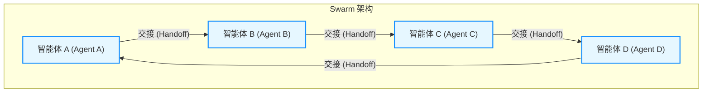
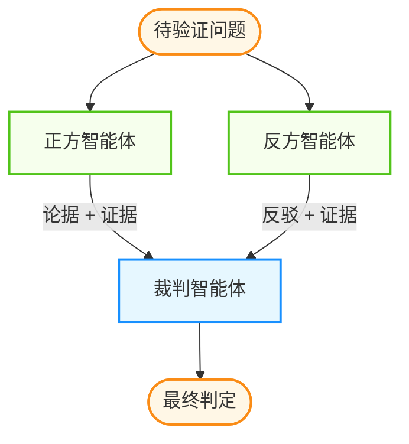

## 6.3 博弈论视角下的冲突解决

### 6.3.1 去中心化协作与博弈视角

在多智能体系统里，“谁该做什么、是否愿意合作、如何避免搭便车与恶性竞争”这些问题，本质上都可以从博弈论视角来分析。和下一节的“涌现行为”不同，这里重点讨论的是 **个体目标如何在规则设计下趋于稳定协作或冲突**。

**一个简化的去中心化协作图示**如下：


```mermaid
graph TD
    %% Agentic Design System
    classDef agent fill:#e6f7ff,stroke:#1890ff,stroke-width:2px;

    subgraph swarm["Swarm 架构"]
        A["智能体 A (Agent A)"] -->|"交接 (Handoff)"| B["智能体 B (Agent B)"]
        B -->|"交接 (Handoff)"| C["智能体 C (Agent C)"]
        C -->|"交接 (Handoff)"| D["智能体 D (Agent D)"]
        D -->|"交接 (Handoff)"| A
    end

    class A,B,C,D agent;
```

图 6-2：去中心化协作示意

**核心原则**：
- **无中心控制**：没有一个“总指挥”告诉每一个智能体每一步做什么
- **局部交互**：每个智能体只遵循简单的局部规则（任务交接），例如“如果我处理不了这个问题，就把它交给销售智能体”
- **自组织**：通过简单的传递链，系统自动演化出解决复杂问题的路径
- **容错性强**：单个智能体失败不会导致整体崩溃

**适用场景**：
- 大规模客服中心（分流智能体 → 技术支持 → 退款团队）
- 大规模数据清洗和处理
- 分布式信息采集

---

### 6.3.2 智能体博弈论

并非所有智能体都是队友。在许多商业和模拟场景中，智能体之间存在 **利益冲突**。这时需要引入博弈论来设计激励机制和协调策略。本节重点讨论策略、激励与均衡，不把“群体涌现”当作主要分析对象；关于涌现现象的直觉与案例，放到下一节单独展开。

#### 6.3.2.1 合作博弈

**定义**：所有智能体共享同一个 **全局奖励**。

**核心挑战——信用分配问题**：
- 团队赢了，是因为智能体 A 干得好，还是智能体 B 干得好？
- 如何避免“搭便车”现象？
- 如何激励每个智能体贡献最大努力？

**解决方案**：
- **夏普利值**：一种公平分配贡献的数学方法
- **个体贡献追踪**：记录每个智能体的决策和结果
- **对抗性评估**：移除某个智能体后观察团队表现变化

#### 6.3.2.2 非合作博弈

**定义**：每个智能体自私地最大化自己的 **局部奖励**。

**典型场景**：

| 场景 | 智能体 A 目标 | 智能体 B 目标 | 均衡结果 |
|------|-------------|-------------|----------|
| 自动谈判 | 压低价格 | 抬高价格 | 纳什均衡价格 |
| 资源竞争 | 获取更多计算资源 | 获取更多计算资源 | 资源分配均衡 |
| 广告竞价（教科书抽象） | 最低价获得展示 | 最低价获得展示 | 第二价格拍卖 |

**应用：自动谈判系统**

```python
from typing import Optional

class NegotiationAgent:
    def __init__(self, min_acceptable: float, max_offer: float):
        self.min_acceptable = min_acceptable
        self.max_offer = max_offer
        self.history = []

    def make_offer(self, round: int, opponent_last: Optional[float] = None) -> float:
        """基于历史和对手行为生成报价"""
        if round == 0:
            return self.max_offer * 0.7  # 首轮报价

        # 根据对手让步幅度调整策略
        concession_rate = self._estimate_opponent_strategy(opponent_last)
        my_concession = self._calculate_concession(round, concession_rate)

        return max(self.min_acceptable, self.max_offer - my_concession)

    def _estimate_opponent_strategy(self, opponent_last: Optional[float]) -> float:
        """估计对手的让步率"""
        if not self.history or opponent_last is None:
            return 0.5
        return min(opponent_last / self.max_offer, 1.0)

    def _calculate_concession(self, round: int, concession_rate: float) -> float:
        """计算本轮让步幅度"""
        base_concession = (self.max_offer - self.min_acceptable) * (1 - concession_rate) * round * 0.05
        return base_concession
```

#### 6.3.2.3 对抗攻击与红队测试

**红队测试** 是一种利用博弈对抗提升系统安全性的方法：
- **蓝方智能体**：负责防御系统，检测和阻止恶意输入
- **红方智能体**：负责尝试注入恶意 Prompt、绕过安全机制

两个智能体在对抗中 **共同进化**——红方智能体发现的漏洞帮助蓝方智能体增强防御。

---

### 6.3.3 辩论机制

为了减少 LLM 的幻觉问题，可以设计“真理越辩越明”的多智能体辩论机制。

#### 6.3.3.1 辩论架构


```mermaid
graph TD
    %% Agentic Design System
    classDef user fill:#fff7e6,stroke:#fa8c16,stroke-width:2px;
    classDef agent fill:#e6f7ff,stroke:#1890ff,stroke-width:2px;
    classDef tool fill:#f6ffed,stroke:#52c41a,stroke-width:2px;

    Question(["待验证问题"]) --> Pro["正方智能体"]
    Question --> Con["反方智能体"]
    Pro -->|"论据 + 证据"| Judge["裁判智能体"]
    Con -->|"反驳 + 证据"| Judge
    Judge --> Verdict(["最终判定"])

    class Question,Verdict user;
    class Pro,Con tool;
    class Judge agent;
```

图 6-3：多智能体辩论验证机制

**工作流程**：
1. **正方智能体**：提出论点（如“这篇论文的结论是 X”）
2. **反方智能体**：质疑和反驳（如“第三段实际上是在引用谬误”）
3. **裁判智能体**：听取双方论据，判定谁更可信

**优势**：
实践中常见现象是，让两个智能体进行辩论/对抗审阅往往比只问一个智能体更稳健，因为 LLM 善于“挑刺”——找出对方论述中的逻辑漏洞和事实错误。

#### 6.3.3.2 实践示例

```python
def debate_verify(question: str, max_rounds: int = 3) -> dict:
    """通过辩论验证问题答案"""
    pro_agent = Agent(role="正方", goal="论证答案正确性")
    con_agent = Agent(role="反方", goal="找出论证漏洞")
    judge_agent = Agent(role="裁判", goal="公正判定")

    pro_argument = pro_agent.argue(question)

    for round in range(max_rounds):
        con_rebuttal = con_agent.rebut(pro_argument)
        pro_defense = pro_agent.defend(con_rebuttal)
        pro_argument = pro_defense

    verdict = judge_agent.decide(pro_argument, con_rebuttal)
    return verdict
```

---

### 6.3.4 纳什均衡与机制设计

在多智能体系统中，**机制设计** 是确保系统稳定运行的关键。

#### 6.3.4.1 激励相容原则

设计智能体激励时，应确保每个智能体 **诚实行动是其最优策略**。如果智能体通过欺骗可以获得更高收益，系统将变得不稳定。

**设计原则**：

1. **个体理性**：参与博弈对每个智能体都有利
2. **激励相容**：诚实报告私人信息是最优策略
3. **预算平衡**：系统不需要外部补贴

#### 6.3.4.2 拍卖机制示例

在智能体竞争资源的场景中，**第二价格密封拍卖（second-price sealed-bid auction）** 在“私有价值（private values）且参与者独立出价”的经典假设下，是一个重要的激励相容机制：
- 每个智能体报出愿意支付的价格
- 最高出价者获胜
- 支付价格 = 第二高出价

只有在标准教科书边界内，这个结论才适合被简写为“诚实报价是弱占优策略”：

- 每个竞拍者知道自己的估值，且该估值不直接取决于别人掌握的信息
- 出价是一次性密封提交，而不是反复试探
- 效用近似为“自己的价值 - 实际支付价格”，不存在显著预算约束、协同串谋或外部性

一旦进入共同价值 / 相互依赖价值、强预算约束、质量加权竞价、平台保留价或重复博弈等现实场景，这个结论就不能被不加限定地复述为“第二价格拍卖天然诚实”。因此，把它当作机制设计的入门基准是合适的，但不能把广告竞价或复杂资源市场都直接等同于该教科书模型。

### 6.3.5 本节小结

本节重点不是讲“群体智能为什么会涌现”，而是讲“在存在利益、资源与观点冲突时，怎样用规则设计让系统保持可预测”。真正系统性的涌现分析，将在下一节继续展开。

关键要点：

1. **Swarm 架构**：去中心化任务交接适合大规模分布式分工
2. **博弈论框架**：理解和设计智能体之间的竞争与合作
3. **辩论机制**：通过对抗提升答案质量和可靠性
4. **机制设计**：确保系统激励与期望行为一致

通过博弈论设计智能体的激励机制，将是未来 AI 经济学的重要课题。

---

**下一节**: [涌现行为与集体智慧](6.4_emergence.md)
